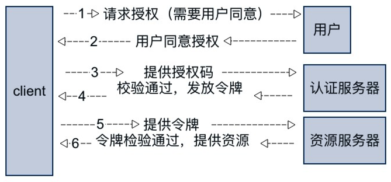

# 为什么需要oauth2？
理解oauth2需要先知道它的应用场景。举个常见的应用场景：

app一般都有微信登录的功能，通过微信登录后app就能拿到微信用户的基本信息，如昵称、头像等等（无法拿到手机号码），那app是通过什么样的方式拿到的，微信登录的过程又是怎么样的。

假设我们自己做这样的功能，最简单的做法就是让用户输入微信的用户名和密码去登录微信，然后拿到这些信息。  
但是这么做是很不安全的，首先你的密码会暴露给app，不怀好意的app便可以记录这个密码。另外通过这种方式登录了微信，app就能肆意获取自己想要的信息，导致微信账户的安全受到威胁。

因此我们需要一种方式，让第三方应用，即我们的app能够通过某种方式安全的获取信息，而且这个方式是受控制，也即权限是受控制的，这便是oauth2的作用。

## auth2的流程
既然我们不能让用户直接通过输入用户名和密码的方式来授权，应该怎么做呢。oauth2的流程如下：
1. 客户端需要用户授权时，会告知用户此时需要您的授权了，例如用户点击了微信登录
2. 用户同意给客户端授权，例如用户同意进行微信登录
3. 客户端使用2中获得的授权，向认证服务器申请令牌，例如app通过这个授权向微信认证服务器申请令牌
4. 认证服务器对客户端进行授权校验，确认无误后，发放令牌，例如微信认证服务器校验app的信息无误后发放令牌
5. 客户端使用该令牌去资源服务器获取资源，例如app通过这个token去微信的资源服务器获取用户的信息
6. 资源服务器校验令牌无误后，返回资源给客户端，例如微信资源服务器返回用户信息给app

oauth这里涉及到几个主体：
1. Third-party application，也可说是客户端，它可以使我们常见的app、web应用、pc应用或者也可是服务端
2. HTTP service，即服务提供商，例如上述的微信
3. Resource Owner，资源拥有者，就是我们的用户
4. User Agent，一般就是浏览器
5. Authorization server，认证服务器，就是服务提供商的认证服务器，例如上述的微信认证服务器
6. Resource server，资源管理器，就是服务提供商的资源管理器，例如上述微信提供用户信息的用户资源管理器

上述流程图片来描述的话就是：


那怎么样给客户端授权码就很重要了。

## 四种授权模式
首先我们需要知道的是，oauth2的所有过程采用的通信方式都是Http，也即oauth2是基于http进行通信的。

### 授权码模式（authorization code）
1. 需要用户授权的时候，将用户导向服务提供商的认证服务器，并且提供跳转URI给认证服务器，这个URI一般是客户端的后台服务器的一个接口
2. 用户自行选择是否同意授权
3. 如果用户同意授权，则认证服务器会生成一个授权码，并且跳转到之前客户端提供的URI上
4. 客户端收到授权码后，将该授权码和之前提供的跳转URI提供给认证服务器，这一步用户无感知。
5. 认证服务器校验授权码和URI，通过后生成令牌，通过跳转回客户端指定URI，并且发放令牌，也可能会多返回一个刷新令牌

我们来看看具体的请求流程：
```
假设认证服务器的地址是： https://server.example.com/oauth/authorize
认证服务器申请令牌的地址是： https://server.example.com/oauth/token

客户端提供的跳转URI是： https://client.example.com/cb
```
第一步中，首先我们需要通过GET的方式跳转到认证服务器上，并带上如下参数：
  * response_type：授权类型，我们采用授权码模式，所以为code，必填项
  * client_id：客户端的唯一标志，必填项
  * redirect_uri：重定向URI，必填项
  * scope：权限申请范围，可选项
  * state：客户端当前状态，可以为任何值，认证服务器会原封不动返回，可选项
因此我们的调用的地址为： https://server.example.com/oauth/authorize?response_type=code&client_id=5abcd&redirect_uri=http://www.client.com/cb

第二步，这时便到了服务提供方那边去了，如果用户在服务提供方也没有登录，会让用户先登录，如让用户使用用户名密码登录。但是这里由于是在服务提供方那边，所以是安全的。

用户最后如果不同意授权，也会跳转回刚才指定的URI。

第三步，如果同意授权，认证服务器会生成授权码，并用302跳转回刚才指定的URI，并带上这个授权码，https://client.example.com/cb?code=aoqisx333

第四步，客户端向认证服务器申请令牌，并带上如下参数：
  * grant_type：授权模式，此处为authorization_code，必填项
  * code：授权码，必填项
  * redirect_uri：重定向URI，必须与之前提供的一致，必填项
  * client_id：客户端唯一标志，必填项
  客户端通过post调用的地址为：https://server.example.com/oauth/token?code=aoqisx333&grant_type=authorization_code&redirect_uri=https://client.example.com/cb&client_id=5abcd

第五步，认证服务器校验通过后，返回如下字段：
  * access_token：访问令牌，必选项
  * token_type：令牌类型，大小写不敏感，可以是bearer或者mac类型，必填项
  * expires_in：过期时间，单位为秒，可选项，如果没指定，需要通过其他方式指定
  * refresh_token：刷新令牌，用来获取下一次的访问令牌，可选项
  * scope，权限范围，如果与客户端申请的范围一致，此项可省略

例如之前的post调用返回:
```json
{
    "access_token": "a8ae6a78-289d-4594-a421-9b56aa8f7213",
    "token_type": "bearer",
    "expires_in": 1999,
    "refresh_token": "ce3dd10e-ec60-4399-9076-ee2140b04a61",
    "scope": "read write trust"
}
```

至此已经完整了获取令牌的过程，通过access_token获取相应的资源。

另外我们可以通过refresh_token来重新更新access_token，例如访问如下的地址：  
https://server.example.com/oauth/token?grant_type=refresh_token&refresh_token=ce3dd10e-ec60-4399-9076-ee2140b04a61&client_id=5abcd&client_secret=abcdefg

返回的结果和之前一样的：  
```json
{
    "access_token": "436423b4-fc22-4f41-8186-d8706ae9396f",
    "token_type": "bearer",
    "expires_in": 1999,
    "refresh_token": "ce3dd10e-ec60-4399-9076-ee2140b04a61",
    "scope": "read write trust"
}
```

### 简化模式（implicit grant type）
1. 客户端将用户导向认证服务器
2. 用户选择是否授权给客户端
3. 如果用户通过授权，认证服务器跳转到客户端指定的URI，并在URI的HASH部分包含访问令牌
4. 客户端通过脚本获取访问令牌

这种模式很简单，前面两个步骤都是一样的，但是第三步骤中，认证服务器通过客户端提供的URI直接跳转回了指定地址，并且提供了访问令牌，而不是授权码。这样客户端直接拿到了令牌。
```
HTTP/1.1 302 Found
Location: https://client.example.com/cb#access_token=2YotnFZFEjr1zCsicMWpAA
          &state=xyz&token_type=example&expires_in=3600
```

由上面的返回结果可以看到，令牌和其他信息都是在URL地址的Hash部分中，需要通过js脚本来解析这部分信息。

一般来说这里的客户端会是浏览器，不支持refresh_token，一旦需要重新获取令牌，会要求重新完成认证过程。

### 密码模式（Resource Owner Password Credentials Grant）
其实这种模式就是用户提供用户名和密码给客户端，客户端去认证服务器获取令牌。

这种模式一般使用在内部系统，或者客户端和服务提供商是一个主体的，两者是可以互相信任的才会使用这种模式

### 客户端模式（Client Credentials Grant）
由客户端自己向服务提供商进行认证，用户属于客户端用户体系里的，和服务提供商没有关系。流程如下：
1. 客户端向认证服务器进行身份认证。
2. 认证服务器校验身份成功后，返回访问令牌给客户端。
