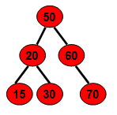

# 二叉查找树（BST Binary Search Tree）
二叉查找树或者是一棵空树，或者是具有下列性质的二叉树：
1. 若左子树不空，则左子树上所有结点的值均小于或等于它的根结点的值；
1. 若右子树不空，则右子树上所有结点的值均大于或等于它的根结点的值；
1. 左、右子树也分别为二叉查找树；



## 递归版本
```javascript
function createTree(key, value, left, right) {
  return {key, value, left, right, size: 1}
}

function search(tree, key) {
  if (tree == null) {
    return null
  }

  if (tree.key < key) {
    return search(tree.right, key) 
  } else if(tree.key > key) {
    return search(tree.left, key) 
  } else return tree.value
}

function put(tree, key, value) {
  if (tree == null) {
    return createTree(key, value)
  }

  if (tree.key > key) {
    tree.left = put(tree.left, key, value)
  } else if (tree.key < key) {
    tree.right = put(tree.right, key, value)
  } else tree.value = value

  tree.size = size(tree.left) + size(tree.right) + 1

  return tree
}

function size(tree) {
  if (tree == null) {
    return 0
  }
  return tree.size
}
```

## 非递归版本
```javascript
function createTree(key, value, left, right) {
  return {key, value, left, right, size: 1}
}

function search(tree, key) {
  let node = tree
  while(node != null) {
    if (node.key > key) {
      node = node.left
    } else if (node.key < key) {
      node = node.right
    } else return node.value
  }

  return null
}

function put(tree, key, value) {
  let currNode = tree
  let parentNode = null
  const node = createTree(key, value)

  while(true) {
    parentNode = currNode
    if (parentNode.key > key) {
      currNode = currNode.left
      if (currNode == null) {
        parentNode.left = node
        break
      }
    } else if (parentNode.key < key) {
      currNode = currNode.right
      if (currNode == null) {
        parentNode.right = node
        break
      }
    } else {
      parentNode.value = value
      break
    }
  }
  
  return tree
}
```

## 一些结论
二叉查找树的性能和其树的形状有关，理想情况下，二叉树完全平衡，从根节点到最底层叶子节点只有lgN个节点。在最差的情况下，根节点到最底层叶子节点会有N个节点。在一般情况下，树的形状和最好的情况接近。


1. 在由N个随机键构造的二叉查找树中，查找命中平均所需的的比较次数为~2lgN
2. 在由N个随机键构造的二叉查找树中插入操作和查找未命中平均所需的比较次数为~2lgN

在最坏的情况下仍然会有N的时间复杂度，原因在于插入和删除元素的时候，树没有保持平衡。

改善的方式就是采用更加完善的树结构，例如2-3查找树，红黑树。