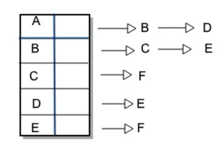

# 图
## 基本概念
图是一种非线性结构


其中图的元素称之为**顶点**。  
顶点与顶点的可以建立关系，即用上面的线建立连接，称之为**边**。  
每个顶点会有多条边和其他顶点连接，这个边的个数叫做**度**   

有时候边是有方向的，例如社交关系图谱中，A关注了B，但是B不一定有关注A，因此A到B的边是由`A--->B`。拥有方向的图称之为**有向图**，没有方向的称之为**无向图**


有向图中，也有度的概念，但是分为入度(in-degree)和出度(out-degree)。
1. 入度，有多少条边指向这个顶点
2. 出度，这个顶点有多少条边指向其他顶点

有时候，我们的每条边都有自己的大小，称之为**权重**，例如A地到B地是5分钟，但是C地道B地却是10分钟，B有两条边都指向它，但是它们的权重是不一样的。


图的类别中有两种类型：
1. 稀疏图，即顶点很多，但是每个顶点边不多。
2. 稠密图，即顶点很多，而且只有少数的顶点没有边。

## 图的存储方法
### 邻接矩阵（Adjacency Matrix）
邻接矩阵的意思，就是采用二维数组的方式来存储图的顶点。

如果是无向图，如果顶点i和顶点j有边连接，则将数组的a[i][j]和a[j][i]都置为1。
```
1 --- 3
|     |
|     |
2 --- 4
```
则：a[1][2]、a[1][3]、a[2][1]、a[2][4]、a[3][1]、a[3][4]、a[4][3]、a[4][2]均为1    
用矩阵来表示的话如下：
```
      |- 0 1 1 0 -|
adj = |  1 0 0 1  |
      |  1 0 0 1  |
      |- 0 1 1 0 -|
```

如果是有向图的话，如果边是由i指向j，则a[i][j]置为1。
```
1 ---> 3
∧      |
|      |
|      ∨
2 ---> 4
```
则a[1][3]、a[2][1]、a[2][4]、a[3][4]均为1    
用矩阵表示的话如下：
```
      |- 0 0 1 0 -|
adj = |  1 0 0 1  |
      |  0 0 0 1  |
      |- 0 0 0 0 -|
```

如果有向图是由权重的话，则用对应的权重值代替1
```
    2
 1 ---> 3
 ∧      |
4|      |3
 |      ∨
 2 ---> 4
    5
```
则a[1][3]=3，a[2][1]=4，a[2][4]=5，a[3][4]=3   
用矩阵表示的话如下：
```
      |- 0 0 3 0 -|
adj = |  4 0 0 5  |
      |  0 0 0 3  |
      |- 0 0 0 0 -|
```

#### 优缺点
通过邻接矩阵基于数组实现，存储简单，使用方便，效率高。另外采用邻接矩阵可以很方便计算，例如计算最短路径，采用矩阵的运算就能方便的做计算。

而矩阵的缺点也很明显，就是占用空间大。例如一个5个顶点的图，不管每个顶点有没有边，都需要一个25大小的数组。

例如无向图，a[i][j]和a[j][i]都需要存储对应的值，但是其实我们只需要存储一个就够了。换句话说，我们只需要存储矩阵对角线的上半部分或者下半部分即可。

### 邻接表（Adjacency list）
采用链表的方式来存储图的顶点。

每个顶点都对应一条链表，链表中存储的是与该顶点相连的其他顶点。

对于有向图，链表存储的就是指向顶点指向的其他顶点


对应的邻接表为：



对于无向图，链表中存储的是跟这个顶点有相关联的顶点。

#### 优缺点
和邻接矩阵相反，邻接表的优点就是空间占用低，只需要对有边的顶点放进链表中。

但是缺点就是查询效率低，例如要查找A是否有到D的边，就得遍历A的链表去查询。

但是为了提高查找效率，我们可以采用其他数据结构来代替链表，如平衡二叉查找树，也可以用跳表或者散列表。

