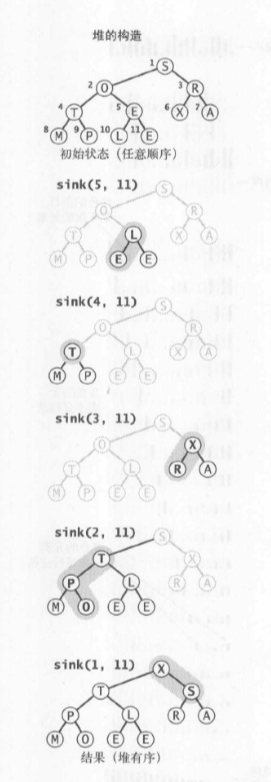

# 堆的算法
在算法中，堆是一种数据结构，它是一颗二叉树，如下图所示：  


我们常说的堆一般指的是二叉堆，即用二叉树来构建的一种数据结构。  
当一颗二叉树的每个节点都大于等于它的两个子节点时，它被称为堆有序  
能够用堆有序的完全二叉树排序的元素就是二叉堆

会采用数组来存放元素，其中，树的每一层都会被填满，除了最后一层，最后一层会从一个节点的左子树开始填。堆采用数组的方式来存储，如`[16, 14, 10, 8, 7, 9, 3, 2, 4, 1]`。给定数组A，其树的根为A[1]，给定某个节点的下标为i，则左儿子和右儿子的下边可以简单的被计算出来:
1. left：i * 2
2. right：(i * 2) + 1
3. parent：i / 2，向下取整

观察上面的计算公式，我们知道在计算机里，可以通过左移和右移来计算与2的乘法和除法，因此也有了如下公式：
1. left：i的二进制左移1位
1. right：i的二进制左移1位并在低位中+1
1. parent：i的二进制右移1位得到i/2

**高度为h的堆中，最多和最好的元素个数？**  
最多元素的情况就是左右子节点全部存在，每一层都会基于上一层的节点个数*2：  
1 + 1 * 2 + 1 * 2 * 2 + ... + 1 * 2^(h) = 1 + 2 + 2^2 + ... + 2^h = 2^(h+1) - 1

最少元素的情况就是最后一层一直一个节点，可以退化成求(h-1)高度的最大元素个数+1，即为2^h

**含N个元素的堆的高度为多少？**  
高度为logN，其中log为以2为底

**高度为h，至多有多少个节点？**  
至多有n/(2^(h+1))，向下取整

二叉堆包含两种：最大堆和最小堆。
1. 最大堆：A[parent(i)] >= A[i]
2. 最小堆：A[parent(i)] <= A[i]

## 堆算法之上浮
当堆中的某个元素发生变化，导致比父元素大时，需要重新调整堆，这时可以采用上浮的方式，逐次判断父节点和变化元素的大小，并且进行交换
```go
func swim(data []int) {
	i := len(data) - 1
	for i > 1 && data[i/2] < data[i] {
		data[i/2], data[i] = data[i], data[i/2]
		i = i / 2
	}
}
```

## 堆算法之下沉
当堆中的某个元素发生变化，导致比子元素小时，需要重新调整堆，这时可以采用下沉的方式，和自己的两个子节点中较大者进行交换
```go
func sink(data []int, n, index int) {
	for {
		maxIndex := index
		if index*2 <= n && data[index] < data[index*2] {
			maxIndex = index * 2
		}
		if index*2+1 <= n && data[maxIndex] < data[index*2+1] {
			maxIndex = index*2 + 1
		}

		if maxIndex == index {
			break
		}

		data[maxIndex], data[index] = data[index], data[maxIndex]
		index = maxIndex
	}
}
```

## 分析
当需要插入新元素时，可以将元素加到数组的末尾，然后将这个元素上浮到合适的位置。

当需要删除最大元素时，从顶端删去最大的元素，将数组的最后一个元素放到顶端，然后不断下沉即可

一个包含n个节点的完全二叉树，树的高度不会超过*logn*，不管是插入还是删除节点，都是一个堆化的过程，它们会沿着树的路径不断（不论从下到上，还是从上到下）对比和交换，这个对比和交换的次数最大值就是树的高度，而一颗完全二叉树的高度为logn，因此O(logn)。

# 堆排序
堆排序简单来说，就是利用堆的性质来进行排序。

堆排序是一种就地排序，在任何时候数组中只有常数个元素存储在输入数组之外。  
运行时间：O(nlogn)

我们知道堆的高度为O(logN)，下沉时间顶多为O(logN)，即O(h)，h为堆的高度

将一个无序的数组序列进行堆排序，有两个步骤：
1. 将数组构建成一个满足二叉堆性质的数组，即建堆
2. 对这个二叉堆进行排序，即排序

如果是递增排序，可以采用建立最大堆的方式；如果是递减排序，可以采用建立最小堆的方式。

这里我们做的是递增排序，也即最大堆的方式

另外我们构建的数组中，数据会从下标为1处开始存储，这样方便我们计算父子节点。

## 建堆
建堆是指将数组中的数据最终变成符合堆的特性的顺序，一般采用自底向上的方式来建堆，即从后往前处理数组的数据，不断通过下沉的方式调整数据，建堆的运行时间为O(N)
```go
func buildHeap(data []int) {
	length := len(data)
	for i := length / 2; i >= 1; i-- {
		sink(data, i)
	}
}
```



这种方式建堆会从n/2开始，而n/2+1到n都是叶子节点，也就相当于我们直接忽略最后一层，从倒数第二层开始建堆。

每个节点堆化中比较和交换的次数和高度成正比。

```
S1 = 1 * h + 2 * (h-1) + 2^2 * (h-2) + ... + 2^k * (h - k) + ... + 2^(h-1) * 1

# 将等式两边都乘以2，得到
S2 =         2 * h    +  2^2 *(h-1) + ... + 2^k * (h - k + 1)... + 2^(h-1) * 2 + 2^(h) * 1

S = S2 - S1 = h + 2 + 2^2 + 2^3 + ... + 2^k + ... + 2^h-1 + 2^h
  = h + (2^h - 2) + 2^h
  = 2^(h+1) + h - 2

h = logn
S = 2^(logn+1) + logn - 2
  = O(n)
```

由此可知，堆化的时间复杂度为O(n)

## 排序
堆化之后的数据，堆顶已经是最大的元素了，这时我们按照如下流程进行元素调整，最终让有元素有序。

排序过程：
1. 将第一个元素和堆的最后一个元素交换，将最后一个元素放到堆顶，必然会引起堆结构被破坏，此时通过下沉方式调整堆结构。
2. 取出此时的堆顶元素，和倒数第二个元素交换，再次调整。这方式有点像在删除元素
3. 不断重复，知道再无元素可以取。此时会构建出一个递增排序的新堆。

简单来说，堆排序是由构建初始堆+交换堆顶元素和末尾元素并重建堆两部分组成。

```go
func sort(data []int) {
	// 堆化
	buildHeap(data)

	length := len(data)
	k := length
	for k > 1 {
		data[1], data[k] = data[k], data[1]
		k--
		sink(data, k, 1)
	}
}
```
运行时间：
构建初始堆+堆元素交换 = O(N) + O(swap)  
堆元素交换运行时间=log(N-1) + log(N-2) + ... + log(1) = O(NlogN)

因此运行时间为 = O(N) + O(NlogN) = O(NlogN)

## 结论
一个堆的高度为 logN，因此在堆中插入元素和删除最大元素的复杂度都为 logN。

对于堆排序，由于要对 N 个节点进行下沉操作，因此复杂度为 NlogN。

堆排序时一种原地排序，没有利用额外的空间。

我们知道快速排序的时间复杂度也是O(NlogN)，但是在实际使用中，会偏向于使用快速排序，而不是堆排序，这是因为：
1. 堆排序对数据的访问方式不是很友好，没法充分利用CPU缓存。例如我们建堆的过程中，数据都是跳着访问的，如1，2，4，8，但是快排的话，访问都是局部的顺序访问。
2. 对于同样的数据，在排序的过程中，堆排序的数据交换次数要多于快速排序。在建堆的过程中，会打乱数据的有序性，可能会导致本来已经有序的数据，建堆后就变得无序了。

堆的应用有哪些呢？

当你想从一个很大的数据集中，取出最大的n个元素，这时用堆就很合适了

如果想要对一个10亿的大规模数据选出最大的N个，应该怎么做？  
是否需要对10亿个数据进行排序，然后取前十个呢？  
这很不现实，其实我们采用优先级队列可以避免这种做法。  
只需要创建一个能存储N个元素的队列即可，然后不断将元素入队，当大于N个元素的时候，就删除最小的元素。最终队列会被填满，此时的N个元素即为最大的N个元素