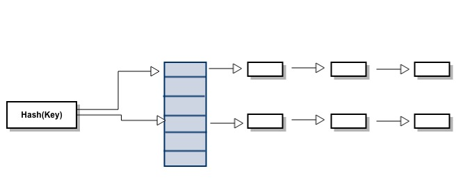

# 散列表
散列表我们经常使用，如js里的Map，Java里的HashMap，还有redis里的HashMap，甚至redis的SortSet也是有借助散列表来实现。

由此可见，散列表的作用是多么广泛。

存储在散列表的元素具有key和value，通过散列函数（Hash 函数）将key转化为另一个值（散列值）作为散列表的key，将value存储在这个key对应的空间下。

### 使用数组实现的散列表
可以使用数组实现一个散列表。将元素的key通过散列函数映射为数组的下标，将元素的值存储在下标中。
```javascript
const names = new Array()
const userId = 101
const userName = 'Jack'

const index = hashFn(userId)
names[index] = userName
```

这里的hashFn将userId转化为数组的下标。当我们需要查找一个元素的时候，通过这个散列函数获取到下标后，就能快速的找到元素。
```javascript
const userId = 101
const index = hashFn(userId)
const userName = names[index]
```

我们知道数组下标查找元素的时间复杂度是O(1)，因此理想情况下散列表查找元素的时间复杂度也是O(1)。

但是上述例子我们也能看出两个问题：
1. 散列函数怎么写。
2. 散列函数的性能问题。

首先散列函数必须让产生的值尽可能的散开，尽可能少的产生重复的值，造成散列冲突，例如两个userId通过散列函数后产生的index是一样的，而遇到这种情况应该怎么处理。

另外就是散列函数必须轻量，不能因为散列函数影响了性能，即使散列表有O(1)的查询性能，也有可能因为散列函数被大幅度拉高。

两个相同的key经过散列函数后，产生的散列值是一定相同的。但是两个不同的key经过散列函数后，却不一定不相同。随着数组中元素的不断被填充，冲突会越来越多，因此如何解决冲突也是评判一个散列表性能的重要因素。

### 散列冲突解决
##### 线性探测
最简单的方式就是线性探测，就是在我们经过散列函数后，发现该位置已经有元素了，那么就不断往后查找，直到找到一个空闲的位置将其插入。

同理在查找元素的时候，通过散列函数转化后，如果该位置下没有元素，那么就是的确没有元素；如果有元素，那么不能马上确定这就是我们要的元素，我们还得对比里面的值是不是我们指定的值，如果不是就得不断往后遍历查找。

由此可见，恶劣情况下，我们可能需要遍历后续的整个散列表，散列表的查找性能会退化成时间复杂度为O(N)。

采用这种方案的散列表，数据量需要比较小。例如java中的ThreadLocalMap就是用了这种散列表。

当数组中的空闲位置越来越少的时候，这种情况会越来越严重，因此我们需要在数组中空闲位置少到一定程度后对数组进行扩容。由此有了如下公式
```
散列表的装载因子 = 散列表中元素的个数 / 散列表的长度
```
装载因子（load factor）越大时，说明散列表中元素的个数的越大，说明冲突会越来越严重。

也有了如下变体：
```
散列表的装载因子 * 散列表的长度 = 散列表中元素的个数
```
当装载因子固定的情况下，我们通过扩大散列表长度，调整散列表中因为存在的元素个数，当超过这个元素个数，就继续扩大长度。

例如java的HashMap的装载因子默认是0.75，如果我们散列表的长度是20，那么当散列表中的元素个数超过0.75 * 20 = 15个时就应该扩容了，一般是成倍扩展，如增大到40，此时散列表中元素个数的最大值便变为了0.75 * 40 = 30个了。

##### 链表法
这是一种使用的比较普遍的方法。如图所示：



在遇到相同的hash key后，会在该位置下形成一条链表。

当插入的时候，计算出hash key后，在该位置下做链表的插入即可，这个时间复杂度是O(1)。  
当查找和删除的时候，这个时间复杂度就和链表的长度有关了，它们都需要在链表中查找到对应的元素。

这种方案，由于需要存储指针，消耗的内存大小会更大一些。

虽然在查找和删除的时候会有链表的遍历过程，但是这个比我们上面用线性探测的方式好很多，它减少了遍历的元素的个数。  
而且我们可以在链表长度到一定大小的时候将链表变成二叉树、红黑树或者跳表等更高效的查找数据结构，这样查找链表的操作就会由O(N)转化为O(logN)。

例如java中的HashMap，默认下最大装载因子为0.75，当元素超过0.75*capacity时就会开始扩容，扩容为2倍原来的大小。  
HashMap底层采用链表法来解决冲突，如果链表过长（默认为8），会引入红黑树，如果个数少于8个时，会将红黑树转化为链表，毕竟维护一颗红黑树也需要一定的性能损耗。

### 扩容策略
当散列表中数据越来越多时，装载因子会越来越大，冲突也会越来越多，此时我们需要给数组扩容，让它有更多的空闲空间。

但是重新申请一个容量更大的数组后，需要将旧的数组中的元素迁移到新的数组中，而且迁移过程中需要不断重新计算哈希值。

常见的情况就是，当我们插入一个元素后，装载因子刚好达到扩容的阈值，于是便开始扩容，如果数据量很大，扩容的时间就会很长，导致我们的插入数据消耗的时间被拉长，本来一个O(1)的性能，变得难以接受。

因此，在数据量非常大的时候就不适合这种一次性扩容方案了，我们可以分批完成扩容。当插入数据而启动扩容时，可以将老的散列表中的其中一个数据迁移到新的散列表中，这样每次只迁移一个，这样也让我们的插入操作变得非常快了。

查询的话，需要现在新的散列表中查找，如果没找到再去老的散列表中查找，效率也就非常高。

### 总结
总结一下，如果我们自己设计一个散列表，需要具备的特性：
1. 拥有快速的查询、增加和删除的性能
2. 内存占用合理，不能占用过多的内存空间
3. 性能稳定，在极端情况下，性能也不能退化到无法接受的情况

由此，我们需要：
1. 设计一个合理的散列函数
2. 合理设置装载因子的阈值，并且有合理的扩容策略
3. 合理的散列冲突解决方案

看看golang是怎么使用散列表的
```go
user := make(map[string]string, 10)
user["u1"] = "Jack"
user["u2"] = "Jack"
```
golang的使用散列表非常简洁，通过make和map就能定义一个散列表，那它底层是怎么实现的呢？

golang采用的是HashMap来实现散列表，具体源码在`runtime/hashmap.go`下

详细细节描述可以参考 [解剖Go语言map底层实现](https://blog.csdn.net/i6448038/article/details/82057424) 


### 思考题
#### word文档中单词拼写检错功能实现
我们常用的英文单词也就几十万，假设为20万，单词的平均长度为10个字母，那么一个单词占用10个字节，20万个单词约占用2M，简直微不足道的内存空间，直接使用散列表即可实现这个功能。
```javascript
const map = new Map()
map.set('hello', 1)
map.set('word', 1)

if (map.get('hello')) {
  console.log('hello is exist')
} else console.log('hello is not exist')

```
如果在散列表中单词不存在，说明我们拼写错误。

#### 两个字符串数组，每个数组大约有10万条字符串，快速找出两个数组中相同的元素。
将大的那个数组塞入一个散列表中，然后遍历另外一个数组，去散列表中查找是否存在，遍历的时间复杂度是O(N)，查找的时间复杂度是O(1)，因此整个过程只需要O(N)的时间。
```javascript
const arr1 = [1,2,3,4,5]
const arr2 = [2,3,6]

const map = new Map()
for(let i = 0; i < arr1.length; i++) {
  map.set(arr1[i], 1)
}

const sameElements = []
for(let i = 0; i < arr2.length; i++) {
  if (map.get(arr2[i])) {
    sameElements.push(arr2[i])
  }
}
```

#### 有10万条URL访问日志，如何按照访问次数给URL排序
将URL作为key，访问次数为value存入散列表，遇到相同的URL，访问次数就加1，不断记录这个URL最大访问次数。

最终会有一个散列表，和一个每个URL的访问次数组成的数组，然后用排序算法进行排序即可
```javascript
const urls = []
const map = new Map()
for(let i = 0; i < urls.length; i++) {
  let accessCount = map.get(urls[i])
  if (accessCount) {
    map.set(urls[i], urls[i]++)
  } else {
    map.set(urls[i], 1)
  }
}

// sort with hash table
```
