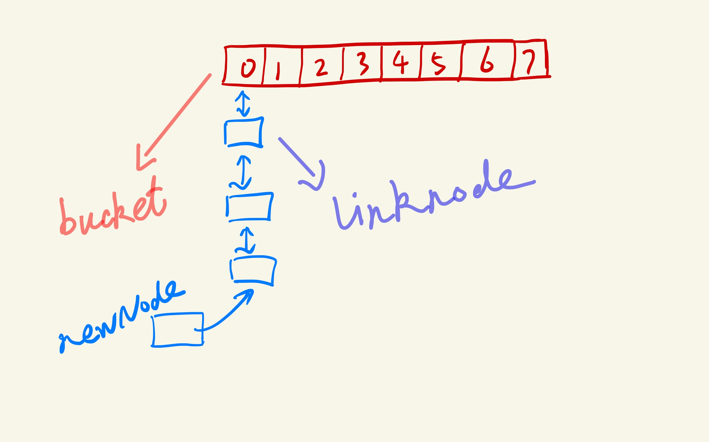
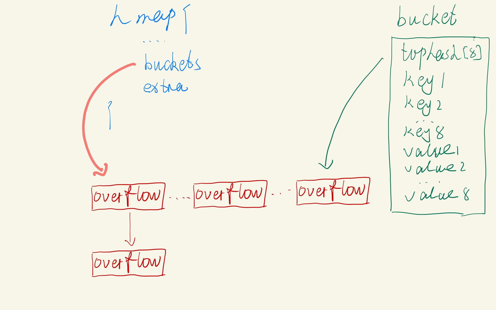

# Golang中的Map
## 基本操作
Map在Golang中的使用很简单

```go
personSalary := make(map[string]int)
personSalary["Jack"] = 10000
salary := personSalary["Jack"]
```

需要注意的是，Map的零值是nil，使用的时候必须采用make初始化
```go
var personSalary map[string]int
if personSalary == nil {
  personSalary = make(map[string]int)
}
```

获取一个map中的一个元素的时候，如果元素不存在，则会获取其相应的零值。
```go
salary := personSalary["Tim"] // 0
```

如果想知道这个元素是否在Map中，在可以如下使用
```go
salary,ok := personSalary["Tim"]
if !ok {
  fmt.Println("Tim is not exist on Map")
}
```

删除一个元素也很简单
```go
delete(personSalary, "Jack")
```

需要注意的是Map也是一种引用类型，因此将其赋值给其他变量的时候，如果修改了其中一个，也会导致另外一个也被修改
```go
personSalary := make(map[string]int)
personSalary["Jack"] = 10000
fmt.Println(personSalary["Jack"]) // 10000

newPersonSalary := personSalary
newPersonSalary["Jack"] = 20000

fmt.Println(personSalary["Jack"]) // 20000
```

两个Map之间也不能判等，Map只能和nil进行判等操作
```go
personSalary := make(map[string]int)
personSalary["Jack"] = 10000

newPersonSalary := personSalary

// 这里永远都不相等
if personSalary == newPersonSalary {
  fmt.Println("personSalary is equal with newPersonSalary")
}
```

## Map键的类型
Golang中Map的键的类型不可以是引用类型，即不能是函数类型、map类型和切片Slice类型。

Map中的键必须是可以支持判等操作的，而引用类型的值并不支持判等操作，因此不可以将其作为Map的键。

需要注意的是，接口类型是可以作为Map的键的，但是需要注意接口的实际动态类型也不能是引用类型中的其中一个。
```go
var badMap2 = map[interface{}]int{
	"1":   1,
	[]int{2}: 2, // 这里会引发 panic。
	3:    3,
}
```
注意这里第二个键的类型是切片slice类型，因此会引发panic，但是编译是能通过的。

同样的道理，如果Map的键类型如果是数组类型，那么数组类型的值也不能是引用类型。例如`[1][]string`也是不允许的。

## Golang中Map的实现原理简述
Map或者说是HashMap的实现方式都是，HashTable+链表来解决，例如先对Key进行哈希后，会对应到某个哈希节点上，每个节点都会挂一个链表，主要是为了解决哈希冲突，即不同的Key的哈希值是相同的。查找到哈希节点后，将数据添加到链表中。同样的道理，查找的时候，也是哈希到对应的节点，然后对链表进行遍历查找。而为了提高查找效率，有些语言会将链表转化为红黑树（例如Java和C++）。



而golang的实现原理也和这个差不多，我们用简单的方式模拟Golang实现上述过程。

### 简单模拟实现Map
首先Map最外层是一个结构体，Golang中采用数组的结构来存储每个每个节点，即哈希槽。
```go
//HashMap木桶(数组)的个数
const BucketCount  = 8

type HashMap struct {
  Buckets [BucketCount]*LinkNode
}

func CreateHashMap() *HashMap {
  m := &HashMap{}

  //为每个元素添加一个链表对象
  for i := 0; i < BucketCount ; i++  {
      m.Buckets[i] = CreateLink()
  }

  return m
}
```
buckets就是我们所说的哈希槽，这里定义了每个map中包含8个哈希槽，每个哈希槽是一个链表结构。每次往map中添加数据的时候，就要将key进行hash，最终对应到这个8个哈希槽中的其中一个（最简单的例如对8取余）。

接下来需要定义链表结构
```go
type KV struct {
  Key   string
  Value string
}

type LinkNode struct {
  Data KV
  Next *LinkNode
}

//创建只有头结点的链表
func CreateLink() *LinkNode {
  //头结点数据为空 是为了标识这个链表还没有存储键值对
  var linkNode = &LinkNode{KV{"",""}, nil}

  return linkNode
}

//尾插法添加节点,返回链表总长度
func (link *LinkNode) AddNode(data KV) int {
  var count = 0
  //找到当前链表尾节点
  currNode := link
  for {
    count += 1
    if currNode.Next == nil {
      break
    }else {
      currNode = currNode.Next
    }
  }

  var newNode = &LinkNode{data, nil}
  currNode.Next = newNode

  return count+1
}
```
链表的数据结构里，包含一个KV的数据结构，用于存储我们的数据，还有一个指向下一个指向下一个节点的指针。每次添加数据都是添加到链表的尾部。

基本的HashMap就是这样，当然还需要有哈希函数的实现，一个优秀的哈希函数要考虑到很多细节，尤其对性能的要求，这里不是我们的重点。

具体哈希函数的性能比较可参考：[http://aras-p.info/blog/2016/08/09/More-Hash-Function-Tests/](http://aras-p.info/blog/2016/08/09/More-Hash-Function-Tests/)

接下来我们看看如何在一个map中添加数据。

```go
func (m *HashMap)Add(key string, value string) {
  //1.将key散列成0-BucketCount的整数作为Map的数组下标
  var mapIndex = HashCode(key)

  //2.获取对应数组头结点
  var link = m.Buckets[mapIndex]

  //3.在此链表添加结点
  if link.Data.Key == "" && link.NextNode == nil {
      //如果当前链表只有一个节点，说明之前未有值插入  修改第一个节点的值 即未发生哈希碰撞
      link.Data.Key = key
      link.Data.Value = value
  }else {
      //发生哈希碰撞
      index := link.AddNode(KV{key, value})
  }
}
```
对于从map中查找就不实现了，也比较简单，也是先计算hashCode，再从遍历链表从而取出数据。

### Golang中的实现
首先golang中对函数算法是根据硬件选择的，如果cpu支持aes，那么使用aes hash，否则使用memhash，memhash是参考xxhash、cityhash实现的，性能非常好。

golang中，在把hash值映射到buckte时，golang会把bucket的数量规整为2的次幂，而有m=2^b，则n%m=n&(m-1)，用位运算规避mod的昂贵代价。

```go
// 最外层的map结构
type hmap struct {
  count     int     // 元素数量
  flags     uint8   // 状态标志 
  B         uint8   // 可以最多容纳 6.5 * 2 ^ B 个元素，6.5为装载因子
  noverflow uint16  // 溢出的个数
  hash0     uint32  // 哈希种子
  buckets    unsafe.Pointer // 桶的地址
  oldbuckets unsafe.Pointer // 旧桶的地址，用于扩容
  nevacuate  uintptr        // 搬迁进度，小于nevacuate的已经搬迁

  extra *mapextra // 其他字段
}

type mapextra struct {
  overflow    *[]*bmap
  oldoverflow *[]*bmap // 用于扩容
  nextOverflow *bmap
}

type bmap struct {
  // 每个元素hash值的高8位，如果tophash[0] < minTopHash，表示这个桶的搬迁状态
  tophash [bucketCnt]uint8
  // 接下来是8个key、8个value，但是我们不能直接看到；为了优化对齐，go采用了key放在一起，value放在一起的存储方式，
  // 再接下来是hash冲突发生时，下一个溢出桶的地址
}
```
可见，go中的map就是由三个部分组成：
1. hmap，它是map的最外层结构，包括了map的各种信息，如大小，哈希槽（buckets）
2. mapextra，它用于记录map的一些额外信息
3. bmap，代表bucket，每一个bucket最多放8个kv，最后由一个overflow字段指向下一个bmap，注意key、value、overflow字段都不显示定义，而是通过maptype计算偏移获取的。

整体结构如下：


简单来说，每个bmap就是一个哈希槽，它可以放8个kv，当遇到哈希冲突的时候，如果bmap里元素的个数小于8时，直接以key1key2value1value2的方式存放。这样减少对象数量，减轻管理内存的负担，利于gc。  
 
如果插入时，bmap中key超过8，那么就会申请一个新的bmap挂在这个bmap的后面形成链表，优先用预分配的overflow bucket，如果预分配的用完了，那么就malloc一个挂上去。

hash值的高8位存储在bucket中的tophash字段，每个桶最多放8个kv对，所以tophash类型是数组[8]uint8。通过这种方式，不用比较整串哈希值。

#### 关于map的扩容
当元素个数/bucket个数大于等于6.5时，就会进行扩容，把bucket数量扩成原本的两倍，当hash表扩容之后，需要将那些老数据迁移到新哈希槽上。当然数据搬迁不是一次性完成的，而是逐步的完成（在insert和remove时进行搬移），这样就分摊了扩容的耗时。这是典型的COWS模式。

同时为了避免有个bucket一直访问不到导致扩容无法完成，还会进行一个顺序扩容，每次因为写操作搬迁对应bucket后，还会按顺序搬迁未搬迁的bucket，所以最差情况下n次写操作，就保证搬迁完大小为n的map。
