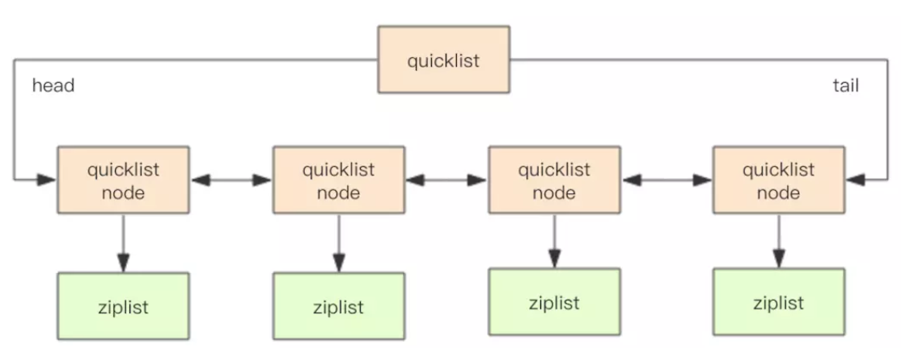
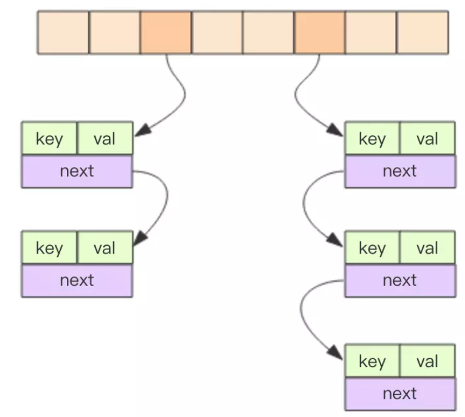
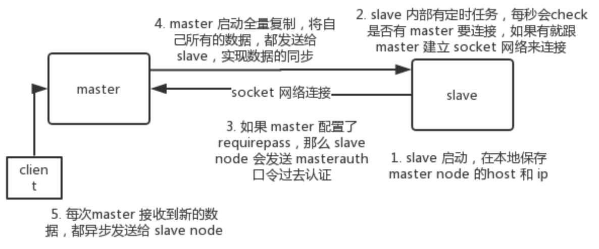
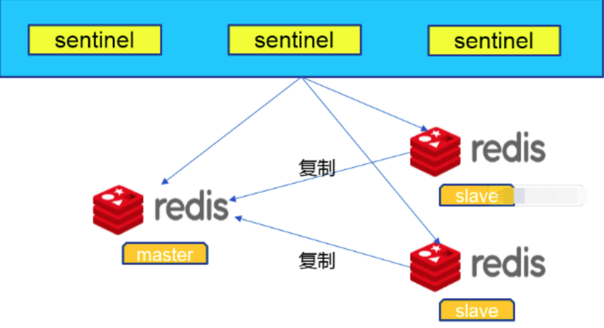
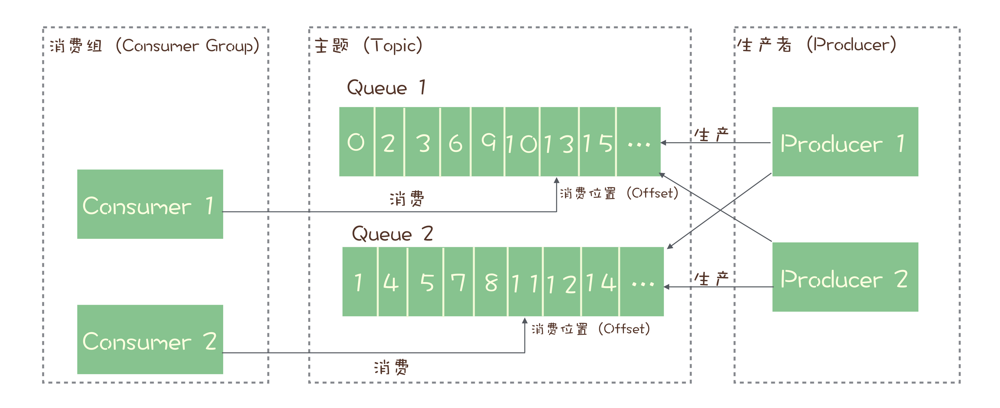
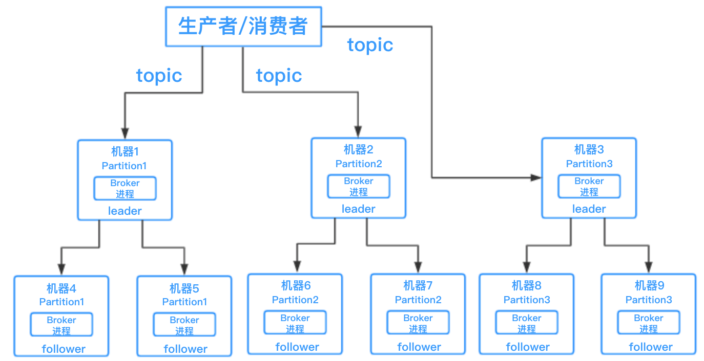
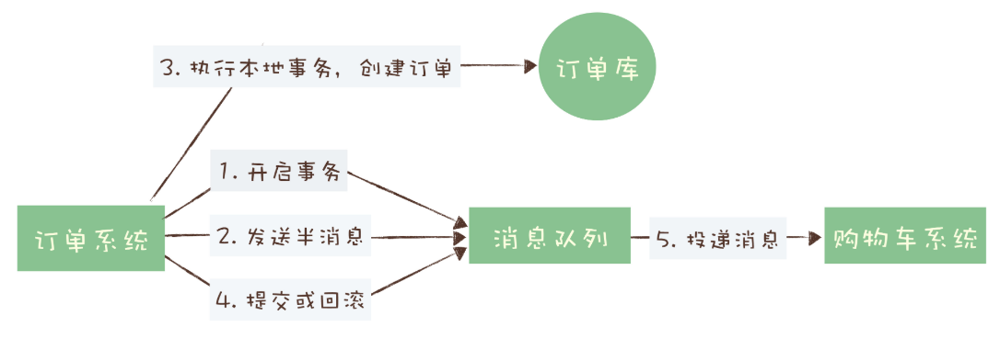
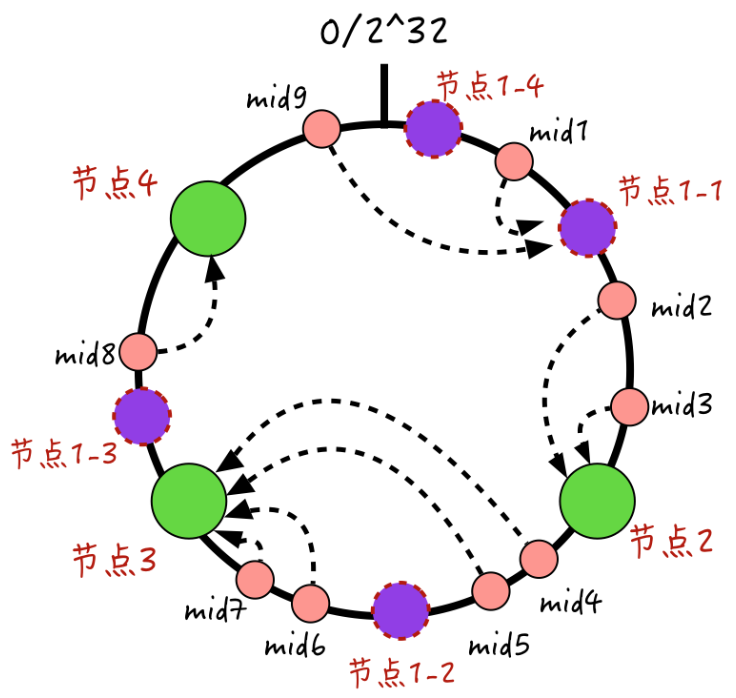
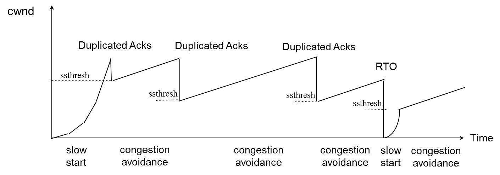

- [Database](#database)
  - [Mysql](#mysql)
    - [知道事务的四大特性么？它们分别是如何实现的？](#%e7%9f%a5%e9%81%93%e4%ba%8b%e5%8a%a1%e7%9a%84%e5%9b%9b%e5%a4%a7%e7%89%b9%e6%80%a7%e4%b9%88%e5%ae%83%e4%bb%ac%e5%88%86%e5%88%ab%e6%98%af%e5%a6%82%e4%bd%95%e5%ae%9e%e7%8e%b0%e7%9a%84)
    - [MySQL 的存储引擎有哪些？为什么选 InnoDB?](#mysql-%e7%9a%84%e5%ad%98%e5%82%a8%e5%bc%95%e6%93%8e%e6%9c%89%e5%93%aa%e4%ba%9b%e4%b8%ba%e4%bb%80%e4%b9%88%e9%80%89-innodb)
    - [为什么mysql列属性建议使用NOT NULL？](#%e4%b8%ba%e4%bb%80%e4%b9%88mysql%e5%88%97%e5%b1%9e%e6%80%a7%e5%bb%ba%e8%ae%ae%e4%bd%bf%e7%94%a8not-null)
    - [为什么`SELECT * FROM table WHERE field = null`不能匹配空的字段？](#%e4%b8%ba%e4%bb%80%e4%b9%88select--from-table-where-field--null%e4%b8%8d%e8%83%bd%e5%8c%b9%e9%85%8d%e7%a9%ba%e7%9a%84%e5%ad%97%e6%ae%b5)
    - [Mysql中drop、delete与truncate有什么区别?](#mysql%e4%b8%addropdelete%e4%b8%8etruncate%e6%9c%89%e4%bb%80%e4%b9%88%e5%8c%ba%e5%88%ab)
    - [知道redo log和bin log的作用么？它们是如何实现持久化数据的？](#%e7%9f%a5%e9%81%93redo-log%e5%92%8cbin-log%e7%9a%84%e4%bd%9c%e7%94%a8%e4%b9%88%e5%ae%83%e4%bb%ac%e6%98%af%e5%a6%82%e4%bd%95%e5%ae%9e%e7%8e%b0%e6%8c%81%e4%b9%85%e5%8c%96%e6%95%b0%e6%8d%ae%e7%9a%84)
    - [知道mysql的索引算法么？为什么mysql要用b+树而不是b树或者其他树？](#%e7%9f%a5%e9%81%93mysql%e7%9a%84%e7%b4%a2%e5%bc%95%e7%ae%97%e6%b3%95%e4%b9%88%e4%b8%ba%e4%bb%80%e4%b9%88mysql%e8%a6%81%e7%94%a8b%e6%a0%91%e8%80%8c%e4%b8%8d%e6%98%afb%e6%a0%91%e6%88%96%e8%80%85%e5%85%b6%e4%bb%96%e6%a0%91)
    - [MySQL 的聚簇索引和非聚簇索引有什么区别?](#mysql-%e7%9a%84%e8%81%9a%e7%b0%87%e7%b4%a2%e5%bc%95%e5%92%8c%e9%9d%9e%e8%81%9a%e7%b0%87%e7%b4%a2%e5%bc%95%e6%9c%89%e4%bb%80%e4%b9%88%e5%8c%ba%e5%88%ab)
    - [聊聊事务的隔离级别。你们生产用的什么事务隔离级别，为什么？](#%e8%81%8a%e8%81%8a%e4%ba%8b%e5%8a%a1%e7%9a%84%e9%9a%94%e7%a6%bb%e7%ba%a7%e5%88%ab%e4%bd%a0%e4%bb%ac%e7%94%9f%e4%ba%a7%e7%94%a8%e7%9a%84%e4%bb%80%e4%b9%88%e4%ba%8b%e5%8a%a1%e9%9a%94%e7%a6%bb%e7%ba%a7%e5%88%ab%e4%b8%ba%e4%bb%80%e4%b9%88)
    - [了解MVCC么？](#%e4%ba%86%e8%a7%a3mvcc%e4%b9%88)
    - [做DDL操作时，例如加索引，有没有可能造成数据库阻塞，即使数据库只有一条数据。](#%e5%81%9addl%e6%93%8d%e4%bd%9c%e6%97%b6%e4%be%8b%e5%a6%82%e5%8a%a0%e7%b4%a2%e5%bc%95%e6%9c%89%e6%b2%a1%e6%9c%89%e5%8f%af%e8%83%bd%e9%80%a0%e6%88%90%e6%95%b0%e6%8d%ae%e5%ba%93%e9%98%bb%e5%a1%9e%e5%8d%b3%e4%bd%bf%e6%95%b0%e6%8d%ae%e5%ba%93%e5%8f%aa%e6%9c%89%e4%b8%80%e6%9d%a1%e6%95%b0%e6%8d%ae)
    - [死锁，如何避免死锁？](#%e6%ad%bb%e9%94%81%e5%a6%82%e4%bd%95%e9%81%bf%e5%85%8d%e6%ad%bb%e9%94%81)
    - [数据库乐观锁的实现](#%e6%95%b0%e6%8d%ae%e5%ba%93%e4%b9%90%e8%a7%82%e9%94%81%e7%9a%84%e5%ae%9e%e7%8e%b0)
    - [大分页查询如何优化？](#%e5%a4%a7%e5%88%86%e9%a1%b5%e6%9f%a5%e8%af%a2%e5%a6%82%e4%bd%95%e4%bc%98%e5%8c%96)
    - [说说数据库是如何实现主从复制的？](#%e8%af%b4%e8%af%b4%e6%95%b0%e6%8d%ae%e5%ba%93%e6%98%af%e5%a6%82%e4%bd%95%e5%ae%9e%e7%8e%b0%e4%b8%bb%e4%bb%8e%e5%a4%8d%e5%88%b6%e7%9a%84)
    - [Mysql主从切换后如何保证数据的一致性？](#mysql%e4%b8%bb%e4%bb%8e%e5%88%87%e6%8d%a2%e5%90%8e%e5%a6%82%e4%bd%95%e4%bf%9d%e8%af%81%e6%95%b0%e6%8d%ae%e7%9a%84%e4%b8%80%e8%87%b4%e6%80%a7)
    - [读写分离引发的数据不一致，如何解决？](#%e8%af%bb%e5%86%99%e5%88%86%e7%a6%bb%e5%bc%95%e5%8f%91%e7%9a%84%e6%95%b0%e6%8d%ae%e4%b8%8d%e4%b8%80%e8%87%b4%e5%a6%82%e4%bd%95%e8%a7%a3%e5%86%b3)
    - [分库分表后怎么保证主键仍然是递增的?](#%e5%88%86%e5%ba%93%e5%88%86%e8%a1%a8%e5%90%8e%e6%80%8e%e4%b9%88%e4%bf%9d%e8%af%81%e4%b8%bb%e9%94%ae%e4%bb%8d%e7%84%b6%e6%98%af%e9%80%92%e5%a2%9e%e7%9a%84)
    - [分库分表策略有哪些](#%e5%88%86%e5%ba%93%e5%88%86%e8%a1%a8%e7%ad%96%e7%95%a5%e6%9c%89%e5%93%aa%e4%ba%9b)
    - [分库分表后怎么查询分页?](#%e5%88%86%e5%ba%93%e5%88%86%e8%a1%a8%e5%90%8e%e6%80%8e%e4%b9%88%e6%9f%a5%e8%af%a2%e5%88%86%e9%a1%b5)
    - [分库分表后如何部署上线？](#%e5%88%86%e5%ba%93%e5%88%86%e8%a1%a8%e5%90%8e%e5%a6%82%e4%bd%95%e9%83%a8%e7%bd%b2%e4%b8%8a%e7%ba%bf)
    - [分库分表后后续如何进行扩容和缩容？](#%e5%88%86%e5%ba%93%e5%88%86%e8%a1%a8%e5%90%8e%e5%90%8e%e7%bb%ad%e5%a6%82%e4%bd%95%e8%bf%9b%e8%a1%8c%e6%89%a9%e5%ae%b9%e5%92%8c%e7%bc%a9%e5%ae%b9)
    - [表主键自增id用完了怎么办？如果没有创建主键会怎么样？](#%e8%a1%a8%e4%b8%bb%e9%94%ae%e8%87%aa%e5%a2%9eid%e7%94%a8%e5%ae%8c%e4%ba%86%e6%80%8e%e4%b9%88%e5%8a%9e%e5%a6%82%e6%9e%9c%e6%b2%a1%e6%9c%89%e5%88%9b%e5%bb%ba%e4%b8%bb%e9%94%ae%e4%bc%9a%e6%80%8e%e4%b9%88%e6%a0%b7)
  - [Redis](#redis)
    - [Redis 有什么优点?](#redis-%e6%9c%89%e4%bb%80%e4%b9%88%e4%bc%98%e7%82%b9)
    - [redis的底层数据结构了解多少](#redis%e7%9a%84%e5%ba%95%e5%b1%82%e6%95%b0%e6%8d%ae%e7%bb%93%e6%9e%84%e4%ba%86%e8%a7%a3%e5%a4%9a%e5%b0%91)
    - [redis有哪些数据结构，分别使用在什么场景？](#redis%e6%9c%89%e5%93%aa%e4%ba%9b%e6%95%b0%e6%8d%ae%e7%bb%93%e6%9e%84%e5%88%86%e5%88%ab%e4%bd%bf%e7%94%a8%e5%9c%a8%e4%bb%80%e4%b9%88%e5%9c%ba%e6%99%af)
    - [知道动态字符串sds的优缺点么？](#%e7%9f%a5%e9%81%93%e5%8a%a8%e6%80%81%e5%ad%97%e7%ac%a6%e4%b8%b2sds%e7%9a%84%e4%bc%98%e7%bc%ba%e7%82%b9%e4%b9%88)
    - [redis中hashmap是如何扩容的？](#redis%e4%b8%adhashmap%e6%98%af%e5%a6%82%e4%bd%95%e6%89%a9%e5%ae%b9%e7%9a%84)
    - [知道hyperloglog么？](#%e7%9f%a5%e9%81%93hyperloglog%e4%b9%88)
    - [知道bloomfilter么？](#%e7%9f%a5%e9%81%93bloomfilter%e4%b9%88)
    - [redis 内存淘汰机制](#redis-%e5%86%85%e5%ad%98%e6%b7%98%e6%b1%b0%e6%9c%ba%e5%88%b6)
    - [redis的LRU算法和LFU算法](#redis%e7%9a%84lru%e7%ae%97%e6%b3%95%e5%92%8clfu%e7%ae%97%e6%b3%95)
    - [redis是如何清理过期key的？](#redis%e6%98%af%e5%a6%82%e4%bd%95%e6%b8%85%e7%90%86%e8%bf%87%e6%9c%9fkey%e7%9a%84)
    - [过期key同时大批量过期会怎么样？](#%e8%bf%87%e6%9c%9fkey%e5%90%8c%e6%97%b6%e5%a4%a7%e6%89%b9%e9%87%8f%e8%bf%87%e6%9c%9f%e4%bc%9a%e6%80%8e%e4%b9%88%e6%a0%b7)
    - [什么是缓存穿透和缓存雪崩？何如避免？](#%e4%bb%80%e4%b9%88%e6%98%af%e7%bc%93%e5%ad%98%e7%a9%bf%e9%80%8f%e5%92%8c%e7%bc%93%e5%ad%98%e9%9b%aa%e5%b4%a9%e4%bd%95%e5%a6%82%e9%81%bf%e5%85%8d)
    - [知道什么是热key么？会导致什么问题？如何避免和解决？](#%e7%9f%a5%e9%81%93%e4%bb%80%e4%b9%88%e6%98%af%e7%83%adkey%e4%b9%88%e4%bc%9a%e5%af%bc%e8%87%b4%e4%bb%80%e4%b9%88%e9%97%ae%e9%a2%98%e5%a6%82%e4%bd%95%e9%81%bf%e5%85%8d%e5%92%8c%e8%a7%a3%e5%86%b3)
    - [热点key如何重建？](#%e7%83%ad%e7%82%b9key%e5%a6%82%e4%bd%95%e9%87%8d%e5%bb%ba)
    - [当缓存需要更新的时候，你觉得应该怎么做才合理？](#%e5%bd%93%e7%bc%93%e5%ad%98%e9%9c%80%e8%a6%81%e6%9b%b4%e6%96%b0%e7%9a%84%e6%97%b6%e5%80%99%e4%bd%a0%e8%a7%89%e5%be%97%e5%ba%94%e8%af%a5%e6%80%8e%e4%b9%88%e5%81%9a%e6%89%8d%e5%90%88%e7%90%86)
    - [redis分布式锁](#redis%e5%88%86%e5%b8%83%e5%bc%8f%e9%94%81)
    - [Redis分布式锁有哪些缺陷？](#redis%e5%88%86%e5%b8%83%e5%bc%8f%e9%94%81%e6%9c%89%e5%93%aa%e4%ba%9b%e7%bc%ba%e9%99%b7)
    - [Redis里面有1亿个key，其中有10w个key是以某个固定的已知的前缀开头的，如何将它们全部找出来？](#redis%e9%87%8c%e9%9d%a2%e6%9c%891%e4%ba%bf%e4%b8%aakey%e5%85%b6%e4%b8%ad%e6%9c%8910w%e4%b8%aakey%e6%98%af%e4%bb%a5%e6%9f%90%e4%b8%aa%e5%9b%ba%e5%ae%9a%e7%9a%84%e5%b7%b2%e7%9f%a5%e7%9a%84%e5%89%8d%e7%bc%80%e5%bc%80%e5%a4%b4%e7%9a%84%e5%a6%82%e4%bd%95%e5%b0%86%e5%ae%83%e4%bb%ac%e5%85%a8%e9%83%a8%e6%89%be%e5%87%ba%e6%9d%a5)
    - [Redis 单线程如何处理那么多的并发客户端连接？](#redis-%e5%8d%95%e7%ba%bf%e7%a8%8b%e5%a6%82%e4%bd%95%e5%a4%84%e7%90%86%e9%82%a3%e4%b9%88%e5%a4%9a%e7%9a%84%e5%b9%b6%e5%8f%91%e5%ae%a2%e6%88%b7%e7%ab%af%e8%bf%9e%e6%8e%a5)
    - [redis如何实现持久化？](#redis%e5%a6%82%e4%bd%95%e5%ae%9e%e7%8e%b0%e6%8c%81%e4%b9%85%e5%8c%96)
    - [在公司如何做redis的备份和恢复策略？](#%e5%9c%a8%e5%85%ac%e5%8f%b8%e5%a6%82%e4%bd%95%e5%81%9aredis%e7%9a%84%e5%a4%87%e4%bb%bd%e5%92%8c%e6%81%a2%e5%a4%8d%e7%ad%96%e7%95%a5)
    - [既然有持久化技术，为什么redis不能做专门的数据库存储？](#%e6%97%a2%e7%84%b6%e6%9c%89%e6%8c%81%e4%b9%85%e5%8c%96%e6%8a%80%e6%9c%af%e4%b8%ba%e4%bb%80%e4%b9%88redis%e4%b8%8d%e8%83%bd%e5%81%9a%e4%b8%93%e9%97%a8%e7%9a%84%e6%95%b0%e6%8d%ae%e5%ba%93%e5%ad%98%e5%82%a8)
    - [如何保证 redis 的高并发？](#%e5%a6%82%e4%bd%95%e4%bf%9d%e8%af%81-redis-%e7%9a%84%e9%ab%98%e5%b9%b6%e5%8f%91)
    - [如何保证redis的高可用？](#%e5%a6%82%e4%bd%95%e4%bf%9d%e8%af%81redis%e7%9a%84%e9%ab%98%e5%8f%af%e7%94%a8)
    - [主从同步可能出现的问题？](#%e4%b8%bb%e4%bb%8e%e5%90%8c%e6%ad%a5%e5%8f%af%e8%83%bd%e5%87%ba%e7%8e%b0%e7%9a%84%e9%97%ae%e9%a2%98)
    - [redis 集群模式的工作原理能说一下么？](#redis-%e9%9b%86%e7%be%a4%e6%a8%a1%e5%bc%8f%e7%9a%84%e5%b7%a5%e4%bd%9c%e5%8e%9f%e7%90%86%e8%83%bd%e8%af%b4%e4%b8%80%e4%b8%8b%e4%b9%88)
    - [redis主从切换时一致性如何保证？](#redis%e4%b8%bb%e4%bb%8e%e5%88%87%e6%8d%a2%e6%97%b6%e4%b8%80%e8%87%b4%e6%80%a7%e5%a6%82%e4%bd%95%e4%bf%9d%e8%af%81)
    - [Redis如何使用事务？有什么缺点？](#redis%e5%a6%82%e4%bd%95%e4%bd%bf%e7%94%a8%e4%ba%8b%e5%8a%a1%e6%9c%89%e4%bb%80%e4%b9%88%e7%bc%ba%e7%82%b9)
    - [为什么 Redis 的事务不能支持回滚？](#%e4%b8%ba%e4%bb%80%e4%b9%88-redis-%e7%9a%84%e4%ba%8b%e5%8a%a1%e4%b8%8d%e8%83%bd%e6%94%af%e6%8c%81%e5%9b%9e%e6%bb%9a)
- [消息队列](#%e6%b6%88%e6%81%af%e9%98%9f%e5%88%97)
  - [为什么使用消息队列？采用了哪种消息队列？](#%e4%b8%ba%e4%bb%80%e4%b9%88%e4%bd%bf%e7%94%a8%e6%b6%88%e6%81%af%e9%98%9f%e5%88%97%e9%87%87%e7%94%a8%e4%ba%86%e5%93%aa%e7%a7%8d%e6%b6%88%e6%81%af%e9%98%9f%e5%88%97)
  - [有了解过Kafka么？](#%e6%9c%89%e4%ba%86%e8%a7%a3%e8%bf%87kafka%e4%b9%88)
  - [如何保证高可用？](#%e5%a6%82%e4%bd%95%e4%bf%9d%e8%af%81%e9%ab%98%e5%8f%af%e7%94%a8)
  - [如何确保消息不会丢失？](#%e5%a6%82%e4%bd%95%e7%a1%ae%e4%bf%9d%e6%b6%88%e6%81%af%e4%b8%8d%e4%bc%9a%e4%b8%a2%e5%a4%b1)
  - [如何处理重复的消息？](#%e5%a6%82%e4%bd%95%e5%a4%84%e7%90%86%e9%87%8d%e5%a4%8d%e7%9a%84%e6%b6%88%e6%81%af)
  - [如何保证消息的严格顺序？](#%e5%a6%82%e4%bd%95%e4%bf%9d%e8%af%81%e6%b6%88%e6%81%af%e7%9a%84%e4%b8%a5%e6%a0%bc%e9%a1%ba%e5%ba%8f)
  - [消息队列满了以后该怎么处理？有几百万消息持续积压几小时，说说怎么解决?](#%e6%b6%88%e6%81%af%e9%98%9f%e5%88%97%e6%bb%a1%e4%ba%86%e4%bb%a5%e5%90%8e%e8%af%a5%e6%80%8e%e4%b9%88%e5%a4%84%e7%90%86%e6%9c%89%e5%87%a0%e7%99%be%e4%b8%87%e6%b6%88%e6%81%af%e6%8c%81%e7%bb%ad%e7%a7%af%e5%8e%8b%e5%87%a0%e5%b0%8f%e6%97%b6%e8%af%b4%e8%af%b4%e6%80%8e%e4%b9%88%e8%a7%a3%e5%86%b3)
  - [如何实现分布式事务？](#%e5%a6%82%e4%bd%95%e5%ae%9e%e7%8e%b0%e5%88%86%e5%b8%83%e5%bc%8f%e4%ba%8b%e5%8a%a1)
  - [rabbitmq如何提高消费者的消费能力？](#rabbitmq%e5%a6%82%e4%bd%95%e6%8f%90%e9%ab%98%e6%b6%88%e8%b4%b9%e8%80%85%e7%9a%84%e6%b6%88%e8%b4%b9%e8%83%bd%e5%8a%9b)
  - [为什么Kafka的读写（I/O）性能这么好？](#%e4%b8%ba%e4%bb%80%e4%b9%88kafka%e7%9a%84%e8%af%bb%e5%86%99io%e6%80%a7%e8%83%bd%e8%bf%99%e4%b9%88%e5%a5%bd)
  - [如果让你写一个消息队列，该如何进行架构设计？说一下你的思路。](#%e5%a6%82%e6%9e%9c%e8%ae%a9%e4%bd%a0%e5%86%99%e4%b8%80%e4%b8%aa%e6%b6%88%e6%81%af%e9%98%9f%e5%88%97%e8%af%a5%e5%a6%82%e4%bd%95%e8%bf%9b%e8%a1%8c%e6%9e%b6%e6%9e%84%e8%ae%be%e8%ae%a1%e8%af%b4%e4%b8%80%e4%b8%8b%e4%bd%a0%e7%9a%84%e6%80%9d%e8%b7%af)
- [数据结构和算法](#%e6%95%b0%e6%8d%ae%e7%bb%93%e6%9e%84%e5%92%8c%e7%ae%97%e6%b3%95)
  - [单链表和双链表的区别和应用场景？](#%e5%8d%95%e9%93%be%e8%a1%a8%e5%92%8c%e5%8f%8c%e9%93%be%e8%a1%a8%e7%9a%84%e5%8c%ba%e5%88%ab%e5%92%8c%e5%ba%94%e7%94%a8%e5%9c%ba%e6%99%af)
  - [解决hash冲突的方法有哪些？](#%e8%a7%a3%e5%86%b3hash%e5%86%b2%e7%aa%81%e7%9a%84%e6%96%b9%e6%b3%95%e6%9c%89%e5%93%aa%e4%ba%9b)
  - [二叉树的遍历](#%e4%ba%8c%e5%8f%89%e6%a0%91%e7%9a%84%e9%81%8d%e5%8e%86)
  - [有了二叉查找树、平衡树，为什么还要红黑树？](#%e6%9c%89%e4%ba%86%e4%ba%8c%e5%8f%89%e6%9f%a5%e6%89%be%e6%a0%91%e5%b9%b3%e8%a1%a1%e6%a0%91%e4%b8%ba%e4%bb%80%e4%b9%88%e8%bf%98%e8%a6%81%e7%ba%a2%e9%bb%91%e6%a0%91)
  - [输入一个单链表，输出此链表中的倒数第k个节点](#%e8%be%93%e5%85%a5%e4%b8%80%e4%b8%aa%e5%8d%95%e9%93%be%e8%a1%a8%e8%be%93%e5%87%ba%e6%ad%a4%e9%93%be%e8%a1%a8%e4%b8%ad%e7%9a%84%e5%80%92%e6%95%b0%e7%ac%ack%e4%b8%aa%e8%8a%82%e7%82%b9)
  - [判断链表是否有环，并且判断环的入口](#%e5%88%a4%e6%96%ad%e9%93%be%e8%a1%a8%e6%98%af%e5%90%a6%e6%9c%89%e7%8e%af%e5%b9%b6%e4%b8%94%e5%88%a4%e6%96%ad%e7%8e%af%e7%9a%84%e5%85%a5%e5%8f%a3)
  - [从无限的字符流中, 随机选出 10 个字符](#%e4%bb%8e%e6%97%a0%e9%99%90%e7%9a%84%e5%ad%97%e7%ac%a6%e6%b5%81%e4%b8%ad-%e9%9a%8f%e6%9c%ba%e9%80%89%e5%87%ba-10-%e4%b8%aa%e5%ad%97%e7%ac%a6)
  - [M*N 横向纵向均递增的矩阵找指定数](#mn-%e6%a8%aa%e5%90%91%e7%ba%b5%e5%90%91%e5%9d%87%e9%80%92%e5%a2%9e%e7%9a%84%e7%9f%a9%e9%98%b5%e6%89%be%e6%8c%87%e5%ae%9a%e6%95%b0)
  - [爬虫在抓取网页的时候，如何判断网址是否抓取过？假设你要爬取的10亿甚至更多的网页。](#%e7%88%ac%e8%99%ab%e5%9c%a8%e6%8a%93%e5%8f%96%e7%bd%91%e9%a1%b5%e7%9a%84%e6%97%b6%e5%80%99%e5%a6%82%e4%bd%95%e5%88%a4%e6%96%ad%e7%bd%91%e5%9d%80%e6%98%af%e5%90%a6%e6%8a%93%e5%8f%96%e8%bf%87%e5%81%87%e8%ae%be%e4%bd%a0%e8%a6%81%e7%88%ac%e5%8f%96%e7%9a%8410%e4%ba%bf%e7%94%9a%e8%87%b3%e6%9b%b4%e5%a4%9a%e7%9a%84%e7%bd%91%e9%a1%b5)
  - [了解一致性 hash 算法吗？](#%e4%ba%86%e8%a7%a3%e4%b8%80%e8%87%b4%e6%80%a7-hash-%e7%ae%97%e6%b3%95%e5%90%97)
  - [一致性hash算法有哪些缺点，如何解决？](#%e4%b8%80%e8%87%b4%e6%80%a7hash%e7%ae%97%e6%b3%95%e6%9c%89%e5%93%aa%e4%ba%9b%e7%bc%ba%e7%82%b9%e5%a6%82%e4%bd%95%e8%a7%a3%e5%86%b3)
- [操作系统](#%e6%93%8d%e4%bd%9c%e7%b3%bb%e7%bb%9f)
  - [聊聊进程、线程和协程](#%e8%81%8a%e8%81%8a%e8%bf%9b%e7%a8%8b%e7%ba%bf%e7%a8%8b%e5%92%8c%e5%8d%8f%e7%a8%8b)
  - [进程间协同的方式](#%e8%bf%9b%e7%a8%8b%e9%97%b4%e5%8d%8f%e5%90%8c%e7%9a%84%e6%96%b9%e5%bc%8f)
- [网络](#%e7%bd%91%e7%bb%9c)
  - [网络基础](#%e7%bd%91%e7%bb%9c%e5%9f%ba%e7%a1%80)
    - [一个请求的过程（或者说从浏览器地址栏输入www.baidu.com回车后发生的所有过程）](#%e4%b8%80%e4%b8%aa%e8%af%b7%e6%b1%82%e7%9a%84%e8%bf%87%e7%a8%8b%e6%88%96%e8%80%85%e8%af%b4%e4%bb%8e%e6%b5%8f%e8%a7%88%e5%99%a8%e5%9c%b0%e5%9d%80%e6%a0%8f%e8%be%93%e5%85%a5wwwbaiducom%e5%9b%9e%e8%bd%a6%e5%90%8e%e5%8f%91%e7%94%9f%e7%9a%84%e6%89%80%e6%9c%89%e8%bf%87%e7%a8%8b)
    - [http请求包含哪些数据结构？](#http%e8%af%b7%e6%b1%82%e5%8c%85%e5%90%ab%e5%93%aa%e4%ba%9b%e6%95%b0%e6%8d%ae%e7%bb%93%e6%9e%84)
    - [什么是http的长连接和短连接？如何配置使用长连接](#%e4%bb%80%e4%b9%88%e6%98%afhttp%e7%9a%84%e9%95%bf%e8%bf%9e%e6%8e%a5%e5%92%8c%e7%9f%ad%e8%bf%9e%e6%8e%a5%e5%a6%82%e4%bd%95%e9%85%8d%e7%bd%ae%e4%bd%bf%e7%94%a8%e9%95%bf%e8%bf%9e%e6%8e%a5)
    - [HTTP/1.0和HTTP/1.1的主要差别有哪些？](#http10%e5%92%8chttp11%e7%9a%84%e4%b8%bb%e8%a6%81%e5%b7%ae%e5%88%ab%e6%9c%89%e5%93%aa%e4%ba%9b)
    - [TCP和UDP在应用层有哪些协议？](#tcp%e5%92%8cudp%e5%9c%a8%e5%ba%94%e7%94%a8%e5%b1%82%e6%9c%89%e5%93%aa%e4%ba%9b%e5%8d%8f%e8%ae%ae)
    - [一个TCP连接可以对应几个HTTP请求？](#%e4%b8%80%e4%b8%aatcp%e8%bf%9e%e6%8e%a5%e5%8f%af%e4%bb%a5%e5%af%b9%e5%ba%94%e5%87%a0%e4%b8%aahttp%e8%af%b7%e6%b1%82)
    - [一个TCP连接中多个HTTP请求可以一起发送么？](#%e4%b8%80%e4%b8%aatcp%e8%bf%9e%e6%8e%a5%e4%b8%ad%e5%a4%9a%e4%b8%aahttp%e8%af%b7%e6%b1%82%e5%8f%af%e4%bb%a5%e4%b8%80%e8%b5%b7%e5%8f%91%e9%80%81%e4%b9%88)
    - [https的建立过程](#https%e7%9a%84%e5%bb%ba%e7%ab%8b%e8%bf%87%e7%a8%8b)
    - [charles抓https包的原理](#charles%e6%8a%93https%e5%8c%85%e7%9a%84%e5%8e%9f%e7%90%86)
    - [聊聊cookie和seesion](#%e8%81%8a%e8%81%8acookie%e5%92%8cseesion)
    - [Secure和HttpOnly的作用](#secure%e5%92%8chttponly%e7%9a%84%e4%bd%9c%e7%94%a8)
    - [tcp如何保证可靠传输的？](#tcp%e5%a6%82%e4%bd%95%e4%bf%9d%e8%af%81%e5%8f%af%e9%9d%a0%e4%bc%a0%e8%be%93%e7%9a%84)
    - [TCP的keep-alive的作用？它和http的keep-alive有什么差别](#tcp%e7%9a%84keep-alive%e7%9a%84%e4%bd%9c%e7%94%a8%e5%ae%83%e5%92%8chttp%e7%9a%84keep-alive%e6%9c%89%e4%bb%80%e4%b9%88%e5%b7%ae%e5%88%ab)
    - [谈谈tcp的三次握手和四次挥手。为什么建立连接需要三次，而不是两次，四次可以么？](#%e8%b0%88%e8%b0%88tcp%e7%9a%84%e4%b8%89%e6%ac%a1%e6%8f%a1%e6%89%8b%e5%92%8c%e5%9b%9b%e6%ac%a1%e6%8c%a5%e6%89%8b%e4%b8%ba%e4%bb%80%e4%b9%88%e5%bb%ba%e7%ab%8b%e8%bf%9e%e6%8e%a5%e9%9c%80%e8%a6%81%e4%b8%89%e6%ac%a1%e8%80%8c%e4%b8%8d%e6%98%af%e4%b8%a4%e6%ac%a1%e5%9b%9b%e6%ac%a1%e5%8f%af%e4%bb%a5%e4%b9%88)
    - [tcp有哪些状态，相应状态的含义。](#tcp%e6%9c%89%e5%93%aa%e4%ba%9b%e7%8a%b6%e6%80%81%e7%9b%b8%e5%ba%94%e7%8a%b6%e6%80%81%e7%9a%84%e5%90%ab%e4%b9%89)
    - [三次握手时，如果服务端没有收到最后的ack包，客户端可以开始发数据么？](#%e4%b8%89%e6%ac%a1%e6%8f%a1%e6%89%8b%e6%97%b6%e5%a6%82%e6%9e%9c%e6%9c%8d%e5%8a%a1%e7%ab%af%e6%b2%a1%e6%9c%89%e6%94%b6%e5%88%b0%e6%9c%80%e5%90%8e%e7%9a%84ack%e5%8c%85%e5%ae%a2%e6%88%b7%e7%ab%af%e5%8f%af%e4%bb%a5%e5%bc%80%e5%a7%8b%e5%8f%91%e6%95%b0%e6%8d%ae%e4%b9%88)
    - [知道SYN洪攻击么？](#%e7%9f%a5%e9%81%93syn%e6%b4%aa%e6%94%bb%e5%87%bb%e4%b9%88)
    - [为什么接收方在FIN包后不能一次性发送ACK和FIN包给发送方，就像建立连接时一次性发送SYN和ACK包一样。](#%e4%b8%ba%e4%bb%80%e4%b9%88%e6%8e%a5%e6%94%b6%e6%96%b9%e5%9c%a8fin%e5%8c%85%e5%90%8e%e4%b8%8d%e8%83%bd%e4%b8%80%e6%ac%a1%e6%80%a7%e5%8f%91%e9%80%81ack%e5%92%8cfin%e5%8c%85%e7%bb%99%e5%8f%91%e9%80%81%e6%96%b9%e5%b0%b1%e5%83%8f%e5%bb%ba%e7%ab%8b%e8%bf%9e%e6%8e%a5%e6%97%b6%e4%b8%80%e6%ac%a1%e6%80%a7%e5%8f%91%e9%80%81syn%e5%92%8cack%e5%8c%85%e4%b8%80%e6%a0%b7)
    - [如果大量出现CLOSE_WAIT状态，说明什么？](#%e5%a6%82%e6%9e%9c%e5%a4%a7%e9%87%8f%e5%87%ba%e7%8e%b0closewait%e7%8a%b6%e6%80%81%e8%af%b4%e6%98%8e%e4%bb%80%e4%b9%88)
    - [如果被断开的一方在收到FIN包后就跑路或者回复完ACK就跑路了，会怎么样？](#%e5%a6%82%e6%9e%9c%e8%a2%ab%e6%96%ad%e5%bc%80%e7%9a%84%e4%b8%80%e6%96%b9%e5%9c%a8%e6%94%b6%e5%88%b0fin%e5%8c%85%e5%90%8e%e5%b0%b1%e8%b7%91%e8%b7%af%e6%88%96%e8%80%85%e5%9b%9e%e5%a4%8d%e5%ae%8cack%e5%b0%b1%e8%b7%91%e8%b7%af%e4%ba%86%e4%bc%9a%e6%80%8e%e4%b9%88%e6%a0%b7)
    - [如果出现大量的LAST_ACK状态，说明什么原因？](#%e5%a6%82%e6%9e%9c%e5%87%ba%e7%8e%b0%e5%a4%a7%e9%87%8f%e7%9a%84lastack%e7%8a%b6%e6%80%81%e8%af%b4%e6%98%8e%e4%bb%80%e4%b9%88%e5%8e%9f%e5%9b%a0)
    - [断开连接时，TIME_WAIT的作用是什么？](#%e6%96%ad%e5%bc%80%e8%bf%9e%e6%8e%a5%e6%97%b6timewait%e7%9a%84%e4%bd%9c%e7%94%a8%e6%98%af%e4%bb%80%e4%b9%88)
    - [出现大量TIME_WAIT的原因是什么，会造成什么问题，如何解决？](#%e5%87%ba%e7%8e%b0%e5%a4%a7%e9%87%8ftimewait%e7%9a%84%e5%8e%9f%e5%9b%a0%e6%98%af%e4%bb%80%e4%b9%88%e4%bc%9a%e9%80%a0%e6%88%90%e4%bb%80%e4%b9%88%e9%97%ae%e9%a2%98%e5%a6%82%e4%bd%95%e8%a7%a3%e5%86%b3)
    - [TCP两端建立了连接后，如果一端拔掉网线或者拔掉电源，那么另一端能够收到通知吗？](#tcp%e4%b8%a4%e7%ab%af%e5%bb%ba%e7%ab%8b%e4%ba%86%e8%bf%9e%e6%8e%a5%e5%90%8e%e5%a6%82%e6%9e%9c%e4%b8%80%e7%ab%af%e6%8b%94%e6%8e%89%e7%bd%91%e7%ba%bf%e6%88%96%e8%80%85%e6%8b%94%e6%8e%89%e7%94%b5%e6%ba%90%e9%82%a3%e4%b9%88%e5%8f%a6%e4%b8%80%e7%ab%af%e8%83%bd%e5%a4%9f%e6%94%b6%e5%88%b0%e9%80%9a%e7%9f%a5%e5%90%97)
    - [DNS的查找过程](#dns%e7%9a%84%e6%9f%a5%e6%89%be%e8%bf%87%e7%a8%8b)
    - [DNS使用的是TCP协议还是UDP协议？](#dns%e4%bd%bf%e7%94%a8%e7%9a%84%e6%98%aftcp%e5%8d%8f%e8%ae%ae%e8%bf%98%e6%98%afudp%e5%8d%8f%e8%ae%ae)
    - [CDN原理](#cdn%e5%8e%9f%e7%90%86)
    - [流量控制和拥塞控制](#%e6%b5%81%e9%87%8f%e6%8e%a7%e5%88%b6%e5%92%8c%e6%8b%a5%e5%a1%9e%e6%8e%a7%e5%88%b6)
    - [如果要采用udp设计一个可靠的协议，要怎么做？](#%e5%a6%82%e6%9e%9c%e8%a6%81%e9%87%87%e7%94%a8udp%e8%ae%be%e8%ae%a1%e4%b8%80%e4%b8%aa%e5%8f%af%e9%9d%a0%e7%9a%84%e5%8d%8f%e8%ae%ae%e8%a6%81%e6%80%8e%e4%b9%88%e5%81%9a)
    - [301和302有什么区别](#301%e5%92%8c302%e6%9c%89%e4%bb%80%e4%b9%88%e5%8c%ba%e5%88%ab)
    - [put和patch的差别](#put%e5%92%8cpatch%e7%9a%84%e5%b7%ae%e5%88%ab)
    - [缓存头有哪些，如何使用？](#%e7%bc%93%e5%ad%98%e5%a4%b4%e6%9c%89%e5%93%aa%e4%ba%9b%e5%a6%82%e4%bd%95%e4%bd%bf%e7%94%a8)
    - [为什么要进行URI编码？哪些字符需要编码？如何进行URI编码？](#%e4%b8%ba%e4%bb%80%e4%b9%88%e8%a6%81%e8%bf%9b%e8%a1%8curi%e7%bc%96%e7%a0%81%e5%93%aa%e4%ba%9b%e5%ad%97%e7%ac%a6%e9%9c%80%e8%a6%81%e7%bc%96%e7%a0%81%e5%a6%82%e4%bd%95%e8%bf%9b%e8%a1%8curi%e7%bc%96%e7%a0%81)
  - [网络编程](#%e7%bd%91%e7%bb%9c%e7%bc%96%e7%a8%8b)
    - [一段数据从应用程序发送端到应用程序接收端，经历了多少次拷贝？](#%e4%b8%80%e6%ae%b5%e6%95%b0%e6%8d%ae%e4%bb%8e%e5%ba%94%e7%94%a8%e7%a8%8b%e5%ba%8f%e5%8f%91%e9%80%81%e7%ab%af%e5%88%b0%e5%ba%94%e7%94%a8%e7%a8%8b%e5%ba%8f%e6%8e%a5%e6%94%b6%e7%ab%af%e7%bb%8f%e5%8e%86%e4%ba%86%e5%a4%9a%e5%b0%91%e6%ac%a1%e6%8b%b7%e8%b4%9d)
    - [Tcp连接断开的操作中，close和shutdown的区别？](#tcp%e8%bf%9e%e6%8e%a5%e6%96%ad%e5%bc%80%e7%9a%84%e6%93%8d%e4%bd%9c%e4%b8%adclose%e5%92%8cshutdown%e7%9a%84%e5%8c%ba%e5%88%ab)
    - [网络编程中，增大缓冲区是否可以提高程序吞吐率？](#%e7%bd%91%e7%bb%9c%e7%bc%96%e7%a8%8b%e4%b8%ad%e5%a2%9e%e5%a4%a7%e7%bc%93%e5%86%b2%e5%8c%ba%e6%98%af%e5%90%a6%e5%8f%af%e4%bb%a5%e6%8f%90%e9%ab%98%e7%a8%8b%e5%ba%8f%e5%90%9e%e5%90%90%e7%8e%87)
    - [UDP如何实现连接异常通知？（或者说udp中connect函数的作用？）](#udp%e5%a6%82%e4%bd%95%e5%ae%9e%e7%8e%b0%e8%bf%9e%e6%8e%a5%e5%bc%82%e5%b8%b8%e9%80%9a%e7%9f%a5%e6%88%96%e8%80%85%e8%af%b4udp%e4%b8%adconnect%e5%87%bd%e6%95%b0%e7%9a%84%e4%bd%9c%e7%94%a8)
    - [聊聊阻塞I/O和非阻塞I/O](#%e8%81%8a%e8%81%8a%e9%98%bb%e5%a1%9eio%e5%92%8c%e9%9d%9e%e9%98%bb%e5%a1%9eio)
    - [聊聊select、poll、epoll的分别](#%e8%81%8a%e8%81%8aselectpollepoll%e7%9a%84%e5%88%86%e5%88%ab)
    - [知道epoll有两种工作模式么？](#%e7%9f%a5%e9%81%93epoll%e6%9c%89%e4%b8%a4%e7%a7%8d%e5%b7%a5%e4%bd%9c%e6%a8%a1%e5%bc%8f%e4%b9%88)
    - [网络中断时，需要如何正确处理异常？](#%e7%bd%91%e7%bb%9c%e4%b8%ad%e6%96%ad%e6%97%b6%e9%9c%80%e8%a6%81%e5%a6%82%e4%bd%95%e6%ad%a3%e7%a1%ae%e5%a4%84%e7%90%86%e5%bc%82%e5%b8%b8)
  - [网络安全](#%e7%bd%91%e7%bb%9c%e5%ae%89%e5%85%a8)
    - [解决跨域的方式](#%e8%a7%a3%e5%86%b3%e8%b7%a8%e5%9f%9f%e7%9a%84%e6%96%b9%e5%bc%8f)
    - [理解xss](#%e7%90%86%e8%a7%a3xss)
    - [理解csrf](#%e7%90%86%e8%a7%a3csrf)
    - [SYN Flood攻击](#syn-flood%e6%94%bb%e5%87%bb)
- [系统设计](#%e7%b3%bb%e7%bb%9f%e8%ae%be%e8%ae%a1)
  - [微服务](#%e5%be%ae%e6%9c%8d%e5%8a%a1)
    - [谈谈服务雪崩、降级、熔断](#%e8%b0%88%e8%b0%88%e6%9c%8d%e5%8a%a1%e9%9b%aa%e5%b4%a9%e9%99%8d%e7%ba%a7%e7%86%94%e6%96%ad)
    - [服务的部署方式有哪些，如何做到不停机部署？](#%e6%9c%8d%e5%8a%a1%e7%9a%84%e9%83%a8%e7%bd%b2%e6%96%b9%e5%bc%8f%e6%9c%89%e5%93%aa%e4%ba%9b%e5%a6%82%e4%bd%95%e5%81%9a%e5%88%b0%e4%b8%8d%e5%81%9c%e6%9c%ba%e9%83%a8%e7%bd%b2)
    - [聊聊微服务体系架构](#%e8%81%8a%e8%81%8a%e5%be%ae%e6%9c%8d%e5%8a%a1%e4%bd%93%e7%b3%bb%e6%9e%b6%e6%9e%84)
  - [分布式](#%e5%88%86%e5%b8%83%e5%bc%8f)
    - [CAP](#cap)
    - [我现在要做一个限流功能, 怎么做?](#%e6%88%91%e7%8e%b0%e5%9c%a8%e8%a6%81%e5%81%9a%e4%b8%80%e4%b8%aa%e9%99%90%e6%b5%81%e5%8a%9f%e8%83%bd-%e6%80%8e%e4%b9%88%e5%81%9a)
    - [分布式锁设置超时后，有没可能在没有释放的情况下, 被人抢走锁。有的话，怎么解决？](#%e5%88%86%e5%b8%83%e5%bc%8f%e9%94%81%e8%ae%be%e7%bd%ae%e8%b6%85%e6%97%b6%e5%90%8e%e6%9c%89%e6%b2%a1%e5%8f%af%e8%83%bd%e5%9c%a8%e6%b2%a1%e6%9c%89%e9%87%8a%e6%94%be%e7%9a%84%e6%83%85%e5%86%b5%e4%b8%8b-%e8%a2%ab%e4%ba%ba%e6%8a%a2%e8%b5%b0%e9%94%81%e6%9c%89%e7%9a%84%e8%af%9d%e6%80%8e%e4%b9%88%e8%a7%a3%e5%86%b3)
    - [如何保障分布式数据库/分布式事务的一致性？分布式系统中的共识算法了解么？](#%e5%a6%82%e4%bd%95%e4%bf%9d%e9%9a%9c%e5%88%86%e5%b8%83%e5%bc%8f%e6%95%b0%e6%8d%ae%e5%ba%93%e5%88%86%e5%b8%83%e5%bc%8f%e4%ba%8b%e5%8a%a1%e7%9a%84%e4%b8%80%e8%87%b4%e6%80%a7%e5%88%86%e5%b8%83%e5%bc%8f%e7%b3%bb%e7%bb%9f%e4%b8%ad%e7%9a%84%e5%85%b1%e8%af%86%e7%ae%97%e6%b3%95%e4%ba%86%e8%a7%a3%e4%b9%88)
    - [分布式事务了解么？你们是如何解决分布式事务问题的？](#%e5%88%86%e5%b8%83%e5%bc%8f%e4%ba%8b%e5%8a%a1%e4%ba%86%e8%a7%a3%e4%b9%88%e4%bd%a0%e4%bb%ac%e6%98%af%e5%a6%82%e4%bd%95%e8%a7%a3%e5%86%b3%e5%88%86%e5%b8%83%e5%bc%8f%e4%ba%8b%e5%8a%a1%e9%97%ae%e9%a2%98%e7%9a%84)
    - [知道zookeeper么？有哪些应用场景？](#%e7%9f%a5%e9%81%93zookeeper%e4%b9%88%e6%9c%89%e5%93%aa%e4%ba%9b%e5%ba%94%e7%94%a8%e5%9c%ba%e6%99%af)
  - [并发编程](#%e5%b9%b6%e5%8f%91%e7%bc%96%e7%a8%8b)
    - [COW](#cow)
    - [一个并发高的系统，创建多少线程合适？](#%e4%b8%80%e4%b8%aa%e5%b9%b6%e5%8f%91%e9%ab%98%e7%9a%84%e7%b3%bb%e7%bb%9f%e5%88%9b%e5%bb%ba%e5%a4%9a%e5%b0%91%e7%ba%bf%e7%a8%8b%e5%90%88%e9%80%82)
    - [死锁的产生，如何避免死锁](#%e6%ad%bb%e9%94%81%e7%9a%84%e4%ba%a7%e7%94%9f%e5%a6%82%e4%bd%95%e9%81%bf%e5%85%8d%e6%ad%bb%e9%94%81)
  - [设计](#%e8%ae%be%e8%ae%a1)
    - [如何设计一个短链接服务](#%e5%a6%82%e4%bd%95%e8%ae%be%e8%ae%a1%e4%b8%80%e4%b8%aa%e7%9f%ad%e9%93%be%e6%8e%a5%e6%9c%8d%e5%8a%a1)
    - [如何设计一个秒杀系统？](#%e5%a6%82%e4%bd%95%e8%ae%be%e8%ae%a1%e4%b8%80%e4%b8%aa%e7%a7%92%e6%9d%80%e7%b3%bb%e7%bb%9f)
    - [聊聊负载均衡架构](#%e8%81%8a%e8%81%8a%e8%b4%9f%e8%bd%bd%e5%9d%87%e8%a1%a1%e6%9e%b6%e6%9e%84)
    - [微信扫码登录的原理](#%e5%be%ae%e4%bf%a1%e6%89%ab%e7%a0%81%e7%99%bb%e5%bd%95%e7%9a%84%e5%8e%9f%e7%90%86)
- [语言](#%e8%af%ad%e8%a8%80)
  - [Golang](#golang)
    - [make和new的区别](#make%e5%92%8cnew%e7%9a%84%e5%8c%ba%e5%88%ab)
    - [golang中的参数传递是深复制还是浅复制？](#golang%e4%b8%ad%e7%9a%84%e5%8f%82%e6%95%b0%e4%bc%a0%e9%80%92%e6%98%af%e6%b7%b1%e5%a4%8d%e5%88%b6%e8%bf%98%e6%98%af%e6%b5%85%e5%a4%8d%e5%88%b6)
    - [结构体可以比较么？](#%e7%bb%93%e6%9e%84%e4%bd%93%e5%8f%af%e4%bb%a5%e6%af%94%e8%be%83%e4%b9%88)
    - [Slice的底层原理是什么？](#slice%e7%9a%84%e5%ba%95%e5%b1%82%e5%8e%9f%e7%90%86%e6%98%af%e4%bb%80%e4%b9%88)
    - [有没有可能多个slice切片引用同一个底层数组，有的话，需要注意什么？](#%e6%9c%89%e6%b2%a1%e6%9c%89%e5%8f%af%e8%83%bd%e5%a4%9a%e4%b8%aaslice%e5%88%87%e7%89%87%e5%bc%95%e7%94%a8%e5%90%8c%e4%b8%80%e4%b8%aa%e5%ba%95%e5%b1%82%e6%95%b0%e7%bb%84%e6%9c%89%e7%9a%84%e8%af%9d%e9%9c%80%e8%a6%81%e6%b3%a8%e6%84%8f%e4%bb%80%e4%b9%88)
    - [golang的map是如何实现的，以及如何实现扩容的？](#golang%e7%9a%84map%e6%98%af%e5%a6%82%e4%bd%95%e5%ae%9e%e7%8e%b0%e7%9a%84%e4%bb%a5%e5%8f%8a%e5%a6%82%e4%bd%95%e5%ae%9e%e7%8e%b0%e6%89%a9%e5%ae%b9%e7%9a%84)
    - [说说channel的实现原理？](#%e8%af%b4%e8%af%b4channel%e7%9a%84%e5%ae%9e%e7%8e%b0%e5%8e%9f%e7%90%86)
    - [关于golang for-range 的坑](#%e5%85%b3%e4%ba%8egolang-for-range-%e7%9a%84%e5%9d%91)
    - [goroutine 是怎么调度的？](#goroutine-%e6%98%af%e6%80%8e%e4%b9%88%e8%b0%83%e5%ba%a6%e7%9a%84)
    - [说说golang的gc算法](#%e8%af%b4%e8%af%b4golang%e7%9a%84gc%e7%ae%97%e6%b3%95)
    - [了解golang的逃逸分析么？有什么作用？](#%e4%ba%86%e8%a7%a3golang%e7%9a%84%e9%80%83%e9%80%b8%e5%88%86%e6%9e%90%e4%b9%88%e6%9c%89%e4%bb%80%e4%b9%88%e4%bd%9c%e7%94%a8)
    - [go什么情况下会发生内存泄漏？](#go%e4%bb%80%e4%b9%88%e6%83%85%e5%86%b5%e4%b8%8b%e4%bc%9a%e5%8f%91%e7%94%9f%e5%86%85%e5%ad%98%e6%b3%84%e6%bc%8f)
    - [怎么实现协程完美退出？](#%e6%80%8e%e4%b9%88%e5%ae%9e%e7%8e%b0%e5%8d%8f%e7%a8%8b%e5%ae%8c%e7%be%8e%e9%80%80%e5%87%ba)
  - [node.js](#nodejs)
    - [阻塞和非阻塞的区别和优缺点。同步和异步的区别和优缺点](#%e9%98%bb%e5%a1%9e%e5%92%8c%e9%9d%9e%e9%98%bb%e5%a1%9e%e7%9a%84%e5%8c%ba%e5%88%ab%e5%92%8c%e4%bc%98%e7%bc%ba%e7%82%b9%e5%90%8c%e6%ad%a5%e5%92%8c%e5%bc%82%e6%ad%a5%e7%9a%84%e5%8c%ba%e5%88%ab%e5%92%8c%e4%bc%98%e7%bc%ba%e7%82%b9)
    - [异步IO模型和事件循环机制](#%e5%bc%82%e6%ad%a5io%e6%a8%a1%e5%9e%8b%e5%92%8c%e4%ba%8b%e4%bb%b6%e5%be%aa%e7%8e%af%e6%9c%ba%e5%88%b6)
    - [为什么要有microtask和macrotask?](#%e4%b8%ba%e4%bb%80%e4%b9%88%e8%a6%81%e6%9c%89microtask%e5%92%8cmacrotask)
    - [如何实现一个异步的reduce?](#%e5%a6%82%e4%bd%95%e5%ae%9e%e7%8e%b0%e4%b8%80%e4%b8%aa%e5%bc%82%e6%ad%a5%e7%9a%84reduce)
    - [V8内存控制和垃圾回收机制](#v8%e5%86%85%e5%ad%98%e6%8e%a7%e5%88%b6%e5%92%8c%e5%9e%83%e5%9c%be%e5%9b%9e%e6%94%b6%e6%9c%ba%e5%88%b6)
    - [内存泄漏](#%e5%86%85%e5%ad%98%e6%b3%84%e6%bc%8f)
    - [javascript原型链和如何实现继承](#javascript%e5%8e%9f%e5%9e%8b%e9%93%be%e5%92%8c%e5%a6%82%e4%bd%95%e5%ae%9e%e7%8e%b0%e7%bb%a7%e6%89%bf)
  - [参考资料](#%e5%8f%82%e8%80%83%e8%b5%84%e6%96%99)

# Database

## Mysql
### 知道事务的四大特性么？它们分别是如何实现的？

事务的四大特性分别是：ACID，即原子性（Atomicity）、一致性（Consistency）、隔离性（Isolation）、持久性（Durability）

* 原子性，事务是一个不可分割的工作单位，事务中的操作要么全部成功，要么全部失败，不能存在中间状态。MySQL通过undo log来实现事务的原子性，即事务失败后，通过undo log可以回滚到之前的状态。
* 一致性，事务执行前后，数据必须处于一种合法的状态，该状态是语义上的而不是语法上的。数据库通过原子性、隔离性和持久性来保证一致性，另外还需要应用层面上来保证，即由代码上来保证数据是否有效。
* 隔离性，不同事务并发执行时，相互之间应该是相互隔离、互不影响的。MySQL利用锁和MVCC机制来实现隔离性。
* 持久性，事务一旦提交，它对数据库的更改就是永久性的，即使发生故障后也不能影响数据的状态。MySQL server层通过bin log实现数据的持久化，而在Innodb引擎上结合redo log，可以保证数据库即使宕机重启，也不会丢失数据。

### MySQL 的存储引擎有哪些？为什么选 InnoDB?

Memory、MyISAM、InnoDB。  
选择InnoDB:
1. 支持事务
2. 具有聚集索引
3. 除了表锁外，还具有更细力度的锁行级锁。
4. 通过MVCC支持不同的隔离级别。
5. 更完善的奔溃恢复，借助redo log和bin log，能实现更细粒度的数据恢复，基本能够恢复任意时刻的数据。

### 为什么mysql列属性建议使用NOT NULL？

1. NULL的列会比NOT NULL的列多占空间，因为需要多使用一个额外的字节来判断该列是否为NULL的标志。
2. 在一些查询语句中会出现一些怪异的行为，例如`null == null` 和 `null <> null`的结果都是一样的，同样的操作符还有not in、!=、count、concat等。

### 为什么`SELECT * FROM table WHERE field = null`不能匹配空的字段？

因为索引上不存储null值，所以即使filed为null，也查询不到该数据。需要使用is null，即

```sql
SELECT * FROM table WHERE field IS NULL;
```

### Mysql中drop、delete与truncate有什么区别?

drop：直接删除表，包括表结构和表数据，删除后可以将表和索引占用的空间全部释放。

delete：

1. 用于删除表数据，删除操作会被记录到undo log，便于回滚操作。
2. 即使删除数据，也不会释放数据占用的空间（其实是索引占用的空间），需要通过重建索引才能释放。
3. 删除的过程会激活与表相关的触发器。
4. 执行对象可以是表和视图。

truncate：

1. 用于删除全部表数据，且操作不会被记录到undo log，也就是说不能回滚。
2. 删除的过程不会激活与表相关的触发器，执行速度快。
3. 执行对象只能是表。
4. 自增id恢复到1。
5. 对于由外键约束引用的表，不能使用truncate。

### 知道redo log和bin log的作用么？它们是如何实现持久化数据的？

关于redo log：  
如果mysql每次写操作都要将数据写入磁盘的话，由于写磁盘是个IO操作，而且是随机写，性能非常低，因此mysql为了提高写操作（增删改）的性能，采用了WAL技术，即Write-Ahead Logging，就是先写日志再写磁盘。将某个写操作，如update某条数据，如果该数据在内存上，就直接更新内存，然后将该操作写入日志文件，写日志成功则可以返回成功了。等到数据库空闲的时候，再将日志中的记录刷回磁盘。这个日志文件就是redo log，该文件是Innodb引擎独有的日志文件。

虽然写日志也是写文件，但是写redo log采用的是顺序写，即将文件按顺序从头写到尾，写完之后会覆盖前面的日志从头开始写，如此往复。一般来说，redo log文件会有好几个，所有文件写完后又会回到开头开始写。一旦需要覆盖原来的日志，就需要将日志内容刷回磁盘。

关于binlog：  
binlog文件是mysql数据库server层面的日志文件，用来做数据归档的，例如做数据迁移、数据库宕机时数据恢复、误删数据时的数据恢复等，这些都可以使用binlog日志来恢复数据。binlog会记录执行语句的原始逻辑，而且采用的是追加写，即在顺序写的基础上，写完文件后，开启新的文件继续写。

数据库的写操作会伴随两个日志文件的写入操作，为了保证两个日志文件的逻辑一致，mysql采用了两阶段提交。


通过这个中间状态（prepare状态），即使在写binlog的时候出现异常（如数据库宕机），恢复后便可以直接丢弃prepare状态的数据，保持和binlog日志一致。

### 知道mysql的索引算法么？为什么mysql要用b+树而不是b树或者其他树？

1. 首先索引大部分情况下空间占用比较大，因此不可能将索引都存放在内存中，而是将索引存放在磁盘中，而存储在磁盘中，就会有IO读取的性能开销，因此算法必须根据这一点来进行设计。
2. 基于第一点，像线性数组这种数据结构就不适用于数据库的索引，如果为了将数据查询出来，将整一个数组读取到内存会导致内存占用过大，这显然不行。普通的二叉查找树一方面容易退化成线性链表，另一方面单个节点只存储一个数据，这在磁盘检索是效率很低的。而像红黑树这类平衡树虽然查询效率也很高，理由也是类似的。它们都是针对内存上查找算法。而B树和B+树，每个节点是以数据页为单位，每个数据页可以存储多个数据，在内存中对单个数据页中的数据进行比较，是非常高效的。
3. 因此一般来说，文件系统和数据库这类型的索引设计都是基于B树来设计的，而mysql采用了B+树来设计索引，而B+树就是从B树演变而来，数据不需要一次性装入内存，可以只装入部分被查询到的节点数据。
4. 同B树一样，B+树也是一颗m叉树，通过多叉树能够降低树的高度，这种方式减少了对磁盘的IO操作，性能更高，当然m也不能太过大，避免退化成线性结构；
5. B树的一个缺陷就是它的非叶子节点也都是用来存储数据，导致能够存储的指针数量较少，导致需要更多的节点来存储指针，也势必带来树的高度增加，这在磁盘查找上也不利。
6. 对于B+树，非叶子节点不存储数据，只存储索引值和指向下一个非叶子或者叶子节点的指针。聚集索引下，数据库中每一行数据都会存在在叶子节点中，而且每一个叶子节点会通过一个双向指针连接起来，便于前后遍历，通过这种方式，在需要范围查找的时候，就不需要像B树一样做中序遍历与跨层访问了。对于非聚集索引，叶子节点会存储索引值和主键id。


### MySQL 的聚簇索引和非聚簇索引有什么区别?
1. 聚集索引中数据行的物理存储顺序和列的逻辑顺序是相同的，这个列一般是主键列，一张表里只能有一个聚集索引。
2. 聚簇索引的叶子节点是数据节点，即叶子节点除了存储索引值外还存储所有其他列的数据，这称为索引组织表。
3. 非聚集索引中列的逻辑顺序和数据行实际的存储顺序是不同的，一张表里可以有多个非聚集索引。
4. 非聚簇索引叶子节点除了存储索引值外，还存储一个指向对应数据块的指针，在mysql中该指针就是主键id，因此如果要查询的数据不在非聚集索引中的话，就得通过这个id做回表查询，即回到主键索引根据id查询。

### 聊聊事务的隔离级别。你们生产用的什么事务隔离级别，为什么？

当数据库上有多个事务同时执行的时候，就会出现脏读（dirty read）、不可重复读（non-repeatable read）和幻读（phantom read）的问题，隔离级别就是来解决这些问题的。

隔离级别：
* 读未提交（read uncommitted），一个事务还没提交时，它做的变更就能被其他事务看到。
* 读提交（read committed），一个事务只有在提交后，它做的变更才能被其他事务看到。
* 可重复读（repeatable read），一个事务在执行过程中看到的数据，总是跟事务开始时看到的数据是一致的。
* 串行化（serializable），对同一行记录，读会加读锁，写会加写锁，当出现读写锁冲突的时候，后访问的事务需要等待前一个事务执行完成才能继续执行。

隔离级别越高，系统的效率就越低。我们一般使用可重复读，主要还是为了保持事务过程中数据的读取的一致性。尤其是在做一些统计数据的时候，希望别人的修改暂时对自己是不可见的。

### 了解MVCC么？

mysql的InnoDB引擎通过MVCC（Multi-Version Concurrency Control，多版本并发控制）实现隔离级别中的读提交和可重复读。

MVCC为表中的每一行数据都会定义一个隐藏字段，即行的版本字段，每次对该行进行更新的时候，都会新增一个版本，即row trx_id设置为事务id。为事务id是InnoDB中在事务启动的时候会为每个事务创建一个事务id，即transaction_id，它是严格递增的。

每次更新数据，都会产生一个回滚日志（undo log），而不同版本之间，会通过指针将不同的回滚日志串联起来，这样不同事务去查询的时候，便可以通过回滚日志去查找到自己能看到的数据。

接下来就是快照（snapshot），如果是RR级别的，会根据事务启动的方式，生成快照视图，如果是RC级别的，则是每次执行语句都会生成快照视图，这个视图叫一致性视图，它包含：

* 快照生成瞬间未提交事务集合
* 集合中的最小事务id，即min_tx_id
* 系统里已经创建的最大事务id+1，即max_tx_id

这个一致性视图和回滚日志，组成了MVCC。通过将数据行每个版本的tx_id和一致性视图比较，便能知道该行可不可见。

* 如果tx_id < min_tx_id，说明事务已提交，是可见的
* 如果tx_id > max_tx_id，说明事务是将来创建的，不可见
* 如果min_tx_id < tx_id < max_tx_id，有两种情况：
  1. tx_id如果还没提交，此时tx_id在事务集合中，不可见
  2. tx_id已经提交，此时tx_id不在事务集合中，可见

需要注意的是，如果是执行更新语句，或者是查询语句加锁，都是当前读，即不管MVCC的逻辑，读取的都是最新数据。

### 做DDL操作时，例如加索引，有没有可能造成数据库阻塞，即使数据库只有一条数据。

是有可能的。

表在做增删改查（DML）的时候，会给表加MDL读锁（元数据读锁）。但是在修改表结构（DDL）的时候，会加MDL写锁，这时会有：
1. 其他线程还持有MDL读锁，DDL线程阻塞
2. DDL线程成功持有MDL写锁，其他线程如果想要DML和DDL都会阻塞

所以当我们要给表加索引时，如果有其他线程已经在读数据，而且MDL读锁还没释放，那么这个加索引的操作就会被阻塞。  
这时如果还有新的线程来查询数据，就得获得MDL读锁，而由于MDL写锁被阻塞，导致查询线程也被阻塞，同时也导致后续所有对该表的查询全部都阻塞

当并发读数据的时候，这种情况会更加明显，虽然看起来数据库只有一条数据，但是请求就是慢。

对于数据量大的表，做DDL操作带来的影响更加大，整个表处于不可读不可写的状态。

解决方式：
1. 避免长事务，让DDL操作与机会执行
2. 给DDL操作设置超时时间，超时后就断开释放锁，然后进行重试，不要一直持有MDL写锁

### 死锁，如何避免死锁？
例如当A要更新a1行持有行锁，这时B要更新a2行也持有它的行锁。  
接下来A也要更新a2行，会被阻塞，要等待B释放a2的行锁。  
此时，如果B也要更新a1行，会被阻塞，要等待A释放a1的行锁。  
这样A在等待B，而B也在等待A，造成了死锁。

死锁避免：
1. mysql有阻塞的超时时间，默认是50s，超时后线程会退出。但是让一个操作等到几十秒显示不理想，虽然这个值可以修改，但是如何设置一个合理的值都比较难判断。
2. mysql具有死锁检测，当检测到死锁后会主动回滚导致死锁的事务。这个功能默认是开启的，但是它会给数据库增加额外负担。因为它在检测的时候，需要查看它所依赖的线程有没被其他线程锁住，如果有1000个并发线程在同时更新，每个线程都得轮询1000次，总共100万这个级别，导致大量的在消耗CPU，事务执行非常慢。
3. 在服务端做好并发控制，也可以将需要更新大量的行的事务，拆分成多个更新语句，减少锁的范围。

### 数据库乐观锁的实现

乐观锁假设认为数据一般情况下不会造成冲突，所以只会在数据进行提交更新的时候，才会正式对数据的冲突与否进行检测，如果发现冲突了，则返回用户错误的信息，让用户决定如何去做。

实现乐观锁一般来说就是多个字段，例如版本号后者时间戳，然后更新的时候对比一下该值即可：  

```sql
> select name,salary,version from user where id=1;

> update user set salary=salary+1000, version=${version}+1 
where id=1 and version=${version};
```

### 大分页查询如何优化？

1. 加缓存，减少对数据库的查询，将分页作为Key存储在缓存中。而一般来说，用户也很少会访问到很靠后的页码，可以只将部分数据缓存到redis中，总页码也可以缓存。也可以限制用户能够访问的页码。

2. 优化sql，利用覆盖索引，减少回表。

   ```
   SELECT * FROM t WHERE filed='a' ORDER BY id DESC LIMIT 25000,10;
   # 优化成
   SELECT * FROM t a, (
   	SELECT id FROM t WHERE filed='a' ORDER BY id DESC LIMIT 25000,10
   )  b 
   WHERE a.id=b.id;
   ```

3. 获取复合条件的记录的最大 id和最小id(默认id是主键)，根据id 大于最小值或者小于最大值 进行遍历。

   ```
   SELECT MAX(id) max_id, MIN(id) min_id FROM t WHERE filed='a';
   SELECT xx FROM t WHERE id > min_id LIMIT 100
   SELECT xx FROM t WHERE id < max_id LIMIT 100
   ```

### 说说数据库是如何实现主从复制的？

1. 主库会有一条开启一个新的线程dump_thread，然后主库和从库间会建立一条长连接，将binlog发给从库。
2. 从库会开启两个线程
   1. io thead，负责与主库交互，接收主库发送过来的binlog，接收到binlog后会写到本地，作为中转日志（relay log）
   2. sql thread，定时监听中转日志是否有变更，然后读取中转日志，解析之后开始执行日志中语句。

### Mysql主从切换后如何保证数据的一致性？

根据CAP定理，在出现分区容忍性的时候，必须要在可用性和一致性上做一个让步选择一个，选择可用性的同时就得放弃数据的一致性，选择一致性就得丧失可用性。

mysql根据一致性的强弱，提供了不同的主从复制方式：

* 异步复制，就是事务提交后，不等待从库任何返回结果，直接返回客户端成功，这是最弱的一致性。
* 半同步复制，事务提交后，如果收到一定数量的从库返回成功后，才告知客户端成功，通过配置这个从库的成功应答数量可以提高一致性的强度，但是会增加主库的等待事件，对一致性强度非常高的场景，这种方式性能会很差。
* 组复制技术（MYSQL Group Replication，MGR），该复制技术基于Paxos协议实现的，在MySQL 5.7.17中被引。简单来说，数据库的事务涉及到读写的时候，需要经过大部分从节点同意，一般是大于 N/2 + 1，只有带大部分节点都同意后才可以提交事务。而对于只读事务，则不需要经过组内节点的同意。组复制分为两种模式：
  1. 单主模式，即只有一个主节点，当主节点挂了后，从所有从节点中选举出一个作为主节点
  2. 多主模式，即所有节点都是主节点，只要保证有大部分节点没挂，就能保证数据库可用

### 读写分离引发的数据不一致，如何解决？

读写分离：读从库，写主库。但是由于主备和主从延迟是不能100%避免的，所以可能会导致主库写数据后，导致读从库的时候数据还没同步过来，读到旧的数据。

解决方案：

1. 强制走主库。对于数据一致性要求高的请求，可以让其读主库，例如商家发布商品后想立马确认是否发布成功。
2. 对主库进行分库，减少主库的并发量，让主从延时减少。
3. 查询的时候，可以先休眠，例如`select sleep(1)`。页面可以做个缓和的查询，例如将成功发布的商品直接先显示在页面上，等用户自己真正去查询的时候已经过了一段时间了。但是可能1s或者一段时间后还是不一致。
4. 通过MySQL主备/主从复制的日志来判断是否同步完成，再进行查询，这种方式最精确。
   * 判断主备延迟时间seconds_behind_master是否等于0，如果不等于就等这个值变为0
   * 对比位点，其中Master_Log_File和Read_Master_Log_Pos代表读到的主库的最新位点，这两个值完全相同。Relay_Master_Log_File和Exec_Master_Log_Pos代表备库执行的最新位点，这两个值完全相同。
   * 通过GTID集合确保主备无延迟，Auto_Position=1说明使用了GTID协议，然后判断备库收到的所有日志的GTID集合（Retrieved_Gtid_Set）和备库所有已经执行完成的GTID集合（Executed_Gtid_Set）相同。

### 分库分表后怎么保证主键仍然是递增的?

* 借用第三方应用如memcache、redis的id自增器，这时redis也必须是支持高并发和高可用的。
* 单独建一张只包含id一个字段的表，每次自增该字段作为数据记录的id。这种方案在数据量大，并发量小的情况比较适用。
* 使用一些分布式id生成算法，例如snowflake算法，它可以让每个节点在每毫秒可以产生 4096 个 ID，足够支撑很大的并发量了。

### 分库分表策略有哪些
通常来说，分为垂直切分和水平切分。

垂直切分：简单来说就是根据业务的不同，将一张表的很多字段，拆分到另一张表或者另一个库。  
水平切分：随着表的数据越来越多，需要根据一定的规则（例如根据id大小）将数据拆分到其他表或者其他库中。

垂直切分比较简单没什么好说，主要还是水平切分会有不同的拆分策略。

1. hash取模方案，对id取模，根据结果存储在对应的库中。缺陷就是扩容的时候，数据迁移会很麻烦，虽然可以采用一致性哈希来减少数据迁移的规模，但还是比较麻烦。
2. range范围方案，把一定范围内的订单，存放到一个表中。虽然解决了扩容时数据迁移的问题，但是有可能某个热点范围的数据都集中在某个分区表上，导致其访问量较大。

为了解决hash和range的问题，这篇文章《[分库分表这样玩，可以永不迁移数据、避免热点](https://mp.weixin.qq.com/s/3oaX2Xml1ZxTTLK3T5JCAw)》提供了一个方法可以综合hash和range的优势，提供了一个更好的分库分表的策略。

### 分库分表后怎么查询分页?

假设sql：`select * from t order by time offset x limit y;`

最简单的方式，分别从各个表或库中提取x+y的数据量进行排序提取。  
例如对n个库执行`select * from t order by time offset 0 limit x+y;`语句，则可以得到n*(x+y)条数据，然后内存中根据time排序，最后取偏移量x后的y条记录。这种方式对页码不断增大的情况会不友好，例如我查询到10000页，每页30条，就会导致每个库都要查询10030条数据。但是一般来说也不会有用户查到这么多页码，如果是一些攻击的话，我们可以采用缓存的方式来避免这些恶意查询。

第二种方式，对业务进行折中处理，不允许跳页查询。先根据一般的方式查询到第一页的数据，能得到一个maxTime，查询后续页码的时候sql修改为`select * from t order by time where time > $maxTime limit y;`

第三种方式，如果业务允许模糊查询数据，而且我们的数据足够随机，sql可以采用这种`select * from t order by time offset x/n limit y/n;`，然后查询每个数据库。

### 分库分表后如何部署上线？

最简单的方案，挂个公告，说半夜停机升级，然后半夜把服务停了，这样也不会有新增数据，然后开始用之前写好的导数据程序，进行数据迁移，程序将导出的数据发送到数据库中间件，中间件通过事先配置好的分区策略写入不同的库和表。一般这种中间件有mycat，sharding-jdbc。

更好的方式应该是双写部署法，即对原先的数据库不停机，然后最终能将新旧数据都迁移到新库。方法如下：

1. 程序代码中，写数据库的逻辑修改为双写，写数据的时候，即要写旧库也要写新库，另外写操作还要发送一条消息到MQ，暂时不消费MQ中的消息，一般来说写操作消息体量也不会太大，MQ还能承受。
2. 获取旧库的最大主键id，即max(id)。
3. 线上部署迁移程序，将旧库中主键id小于等于max(id)的数据全部迁移通过数据库中间件迁移到新库，迁移完成后即可将该程序下线。
4. MQ消费程序开始消费数据，将数据写入到数据库中间件导入新库。
5. 做新老数据的一致性验证，然后去除程序代码中的双写功能，即对db的读写切换到新库。

### 分库分表后后续如何进行扩容和缩容？

数据库分库分表，说明原先的数据体量和并发量已经很大。单库单表的时候可能单表数据在几千万左右，但是一旦分库分表，那么所有库和表可能有几亿数据体量，此时如果因为数据库又撑不住了，则需要继续进行扩容，其扩容方案会更加的复杂。

我们可以在第一次分库分表的时候，就考虑这种情形。这篇文章的思路可以借鉴下：[如何设计可以动态扩容缩容的分库分表方案？](https://github.com/doocs/advanced-java/blob/master/docs/high-concurrency/database-shard-dynamic-expand.md)

即一开始就往大了设计，如分配32个库，32张表，共1024张表。如果单库写入并发量在1000-15000，那么32个库便可以支撑32000-48000的写入并发量，如果前面再加上一个MQ削峰，写入并发量可能能到8到10万。

从数据量来看，如果一张表500万数据，1024张表就有50多亿的数据量。也就是说我们设计的这套方案，可以容纳50亿体量的数据，应该足够公司用好几年了。

具体实施，可以一个mysql服务器（安装在一台机器上的mysql服务器）可以建立16个库，这样总共有2台机器，每台机器负责16张表，单表500万数据，也就是一台机器需要存储8千万数据，假设一条数据1KB，也就是差不多80GB容量的磁盘。

如果此时单台mysql服务器负载过大，只需要做库迁移，例如可以修改为一个mysql服务器8个库，需要4台机器，在原先2台机器中各导出8个库的数据，分别放在新的两台mysql服务器上，每台机器磁盘容量缩减为40GB。每次库容机器都是倍数增加，如2台、4台、8台到16台，甚至最后可以一个mysql服务器1个库1张表，共32台机器，一台机器也就4GB容量。

每次扩容只需要DBA进行数据库的迁移，这个迁移方式可以借助工具，比起自己写程序来导更加简单而且出错率更低。

### 表主键自增id用完了怎么办？如果没有创建主键会怎么样？

当自增id到达上限，此时继续增加的话，还是会得到最大值，此时尝试插入数据，会报主键冲突错误。为避免这种情况，可以选择类型更大的主键，如big int。

如果创建表的时候没有创建主键，Innodb会自动创建一个不可见的长度为6个字节的row_id，而Innodb还维护了一个全局id，每次没有主键的表，每插入一行记录，都会将该全局id作为要插入数据的row_id，然后全局id在自增1。

该全局row_id在代码实现上使用的是bigint unsigned类型，但实际上只给row_id留了6字节，这种设计就会存在一个问题：如果全局row_id一直涨，一直涨，直到2的48幂次-1时，这个时候再+1，row_id的低48位都为0，结果在插入新一行数据时，拿到的row_id就为0，存在主键冲突的可能性。为了避免这种情况，应该给每张表一个主键。

## Redis

### Redis 有什么优点?
1. 单线程，没有多进程和多线程间的切换开销。
2. 不会涉及到竞争和锁，性能得到提升
3. 基于内存涉及，在内存中进行数据的操作，性能比磁盘操作上几个量级。
4. 采用IO多路复用来提高IO的效率。

### redis的底层数据结构了解多少
最上层统一的头部
```c
struct RedisObject {
    int4 type; // 4bits，记录不同数据类型
    int4 encoding; // 4bits，同一类型下的不同存储形式
    int24 lru; // 24bits，记录对象的LRU信息
    int32 refcount; // 4bytes，对象的引用计数，计数为零，对象就被销毁，内存被回收
    void *ptr; // 8bytes（64 bit system），指向对象内容的具体存储位置
}
```
可见一个对象头需要占用16字节的存储空间
```
redis> set codehole abcd
Ok
redis> debug object codehole
Value at:0x7fb47d434e10 refcount:1 encoding:embstr serializedlength:5 lru:10076033 lru_seconds_idle:8
```

字符串：  
采用动态字符串实现，数据结构为SDS（Simple Dynamic String），通过预先分配一定容量，可以减少内存的频繁分配。
```c
stuct SDS<T> {
    T capacity // 数组容量，即所分配的数组长度
    T len // 数组长度，即字符串实际的长度
    byte flags // 特殊标志位
    byte[] content // 存储字符串内容，数组大小为capacity，字符串数组最终以\0结尾
}
```
可见该结构下，无需遍历字符串即可获取到字符串长度（len）。定义容量的目的是为了在采用append的时候避免重新分配空间，直接在数组后面追加即可，但是超过容量大小时，还是得重新分配。刚创建字符串时容量和长度是一样的（capacity==len），因为我们大部分情况下并不会使用append来修改字符串。

根据字符串的长度，采用了不同的方式存储字符串：
1. embstr，在字符串长度小于44字节时，使用这种格式存储。优点就是它只需要分配一次空间，redisObject和sds是连续的。缺点就是长度增加导致需要重新分配内存时，整个redisObject和sds都要重新分配。
   
2. raw，字符串长度大于44字节时，使用这种格式。优点就是在重新分配内存的时候只需要分配sds的。缺点就是在初次创建的时候需要分配两次内存空间，分别要为redisObject和sds分配空间。
   

列表：
1. 在元素较少的时候（默认是512，redis.conf可配置），内部采用的是压缩列表（ziplist），通过分配一块连续的内存，将所有元素紧挨着一起存储。也因此导致了在扩容的时候，可能需要重新分配内存，将旧的内容拷贝到新的内存地址，在元素很多时就会损耗性能，所以ziplist不合适存储大型字符串。
    ```c
    stuct ziplist<T> {
        int32 zlbyts; // 整个压缩列表占用字节数
        int32 zltail_offset; // 最后一个元素距离列表起始位置的偏移量，用于快速定位最后一个节点，实现双向遍历。
        int16 zllength; // 元素个数
        T[]   entries; // 元素内容列表，挨个挨个紧凑存储
        int8  zlend;  // 标志压缩列表的结束，值恒为 0xFF
    }

    struct entry {
        // 前一个 entry 的字节长度 当长度小于254字节，用1个字节存储；否则，用5个字节存储
        // 当压缩列表倒着遍历时，通过这个字段可以快速定位下一个元素的位置
        int<var> prevlen; 
        int<var> encoding; // 元素类型编码
        optional byte[] content; // 元素内容
    }
    ```
    
2. 在元素较多的时候，为了能够快速插入和删除，采用了链表（lintedlist）的方式实现。每个节点都需要存储前一个和后一个节点的地址，每一个指针需要占据8个字节（64位机器）。
    ```c
    struct listNode<T> {
        listNode* prev;
        listNode* next;
        T value;
    }
    struct list {
        listNode *head;
        listNode *tail;
        long length;
    }
    ```
    
3. 由于链表中每个节点中占据的空间较大（16个字节的指针空间），因此在后续的版本中（3.2），无论元素多少，列表的实现都被改为了快速列表（quicklist）。将linkedlist按段切分，每一段使用ziplist来紧凑存储，多个ziplist之间使用双向指针串起来。而且还可以对ziplist使用LZF算法进行了压缩存储。
    ```c
    struct ziplist_compressed {
        int32 size;
        byte[] compressed_data;
    }
    struct quicklistNode {
        quicklistNode* prev;
        quicklistNode* next;
        ziplist* zl; // 指向压缩列表 每个ziplist长度为8k，超出后就需要新起一个ziplist，该配置由list-max-ziplist-size决定。
        int32 size; // ziplist 的字节总数
        int16 count; // ziplist 中的元素数量
        int2 encoding; // 存储形式 2bit，原生字节数组还是 LZF 压缩存储。
        ...
    }
    struct quicklist {
        quicklistNode* head;
        quicklistNode* tail;
        long count; // 元素总数
        int nodes; // ziplist 节点的个数
        int compressDepth; // LZF 算法压缩深度。默认为0，即不压缩。通过list-compress-depth配置。
        ...
    }
    ```
    

hash哈希：
1. 在元素个数小于512个（set-max-intset-entries配置）并且每个元素长度小于64字节，采用ziplist实现
    ```
    hset profile name "tome"
    hset profile age 25
    hset profile career "Programmer"
    ```
    
2. 其他情况下采用hashtable实现。

字典中包含2个hashtable，通常其中一个是有值的，在扩容的时候需要分配新的hashtable，然后渐进式搬迁，一个hashtable用于存储旧值，一个用于存储新值。搬迁结束后，旧的hashtable会被删除。 
  
```c
struct dict {
    ...
    dictht ht[2];
}

struct dictht {
    dictEntry** table; // 二维
    long size; // 第一维数组的长度
    long used; // hash表中的元素个数
    ...
}

struct dictEntry {
    void* key;
    void* val;
    dictEntry* next; // 链接下一个entry
}
```
字典基于二维结构设计，其中第一维是数组，第二维是链表。数组中存储的是第二维链表中第一个元素的指针。  


Set集合：
1. 当set集合容纳的元素都是整数并且元素较少的时候，内部采用intset来存储集合元素，它是一种紧凑的数组结构，同时支持16位、32位和64位整数
    ```c
    struct intset<T> {
        int32 encoding; // 决定整数位宽是16位、32位还是64位
        int32 length;  // 元素个数
        int<T> contents; // 整数数组，可以是16为、32位和64位
    }
    ```
    
2. 当set集合存储的不是整数时，采用了字典结构（hashtable）进行存储，只是里面的value都是NULL，其他特性和字典一模一样。

SortedSet：
1. 采用dict字典存储value和score值的映射关系
2. 元素数量小于128，元素长度都小于64字节，使用ziplist实现
    
3. 采用跳跃表skiplist来作为存储score的数据结构。并且在skiplist的forward指针上增加了一个span属性，用于表示从前一个节点沿着当前层的forward指针跳到当前这个节点中间会跳过多少节点。
    ```c
    struct zset {
        dict *dict;
        zskiplist *zsl;
    }
    struct zslforward {
        zslnode* item;
        long span;  // 跨度
    }
    struct zslnode {
        String value;
        double score;
        zslforward*[] forwards;  // 多层连接指针
        zslnode* backward;  // 回溯指针
    }
    struct zskiplist {
        zslnode* header; // 跳跃列表头指针
        int maxLevel; // 跳跃列表当前的最高层
        map<string, zslnode*> ht; // hash 结构的所有键值对
    }
    ```
      

### redis有哪些数据结构，分别使用在什么场景？
字符串（string）、列表（list）、哈希（hash）、集合（sets）、有序集合（sorted sets）

bitmaps、地理空间（geo）、发布订阅（Pub/Sub）

hyperloglog、bloomfilter

### 知道动态字符串sds的优缺点么？
优点：
1. sds结构会直接存储字符串长度，不需要遍历字符串就能得到长度。
2. 由于申请字符串空间的时候，会通过capacity多申请一些冗余空间，因此在执行append的时候，如果字符串长度不大，可以直接在原数组上直接进行，不需要重新分配空间。
3. 可以根据当前字符串的大小，定义len和capacity的字段大小，对内存使用得到优化
4. 根据字符串的长短采用embstr和raw结构来存储，提高性能。

缺点：
1. 基于优点的第二点，如果append的字符串很大，就需要重新分配空间，并且做字符串复制迁移，这个开销非常大。

### redis中hashmap是如何扩容的？
字典的扩容条件：    
当元素个数和容量（第一维数组的长度）达到1:1，则开始扩容（如果正在执行bgsave、bgaof则不执行，如果达到1:5则强制执行）

关于字典的缩容：   
当hash表因为元素的逐渐删除变得越来越稀疏时，Redis会对hash表进行缩容来减少hash表的第一维数组空间占用。缩容的条件是元素个数低于数组长度的 10%。缩容不会考虑Redis是否正在做bgsave。

在redis中，扩展或收缩哈希表需要将ht[0]里面的所有键值对rehash到ht[1]里面，但是，这个rehash动作并不是一次性、集中式地完成的，而是分多次、渐进式地完成的。为了避免rehash对服务器性能造成影响，服务器不是一次性将ht[0] 里面的所有键值对全部rehash到ht[1]，而是分多次、渐进式地将ht[0]里面的键值对慢慢地rehash到ht[1]。

rehash流程：
1. 为ht[1] 分配空间，让字典同时持有ht[0] 和ht[1] 两个哈希表。
1. 在字典中维持一个索引计数器变量rehashidx，并将它的值设置为0，表示rehash工作正式开始。
1. 在rehash进行期间，每次对字典执行添加、删除、查找或者更新操作时，程序除了执行指定的操作以外，还会顺带将ht[0]哈希表在rehashidx索引上的所有键值对rehash到ht[1]，当rehash工作完成之后，rehashidx+1。
1. 随着字典操作的不断执行，最终在某个时间点上，ht[0]的所有键值对都会被rehash至ht[1]，这时程序将rehashidx属性的值设为-1，表示rehash操作已完成。

rehash过程中新增、查询、修改、删除操作如何定向：
* 新增：新增的元素直接追加到ht[1]
* 查询、删除、修改：先查询ht[0]，若不存在则到ht[1]查询

由于在rehash时是同时在操作两个ht，所以会使得redis内存使用量瞬间突增。

### 知道hyperloglog么？
hyperloglog提供了一个集合，可以往集合里添加数据，然后统计集合中元素的个数，和sets有点像，但是hyperloglog是有误差的集合，标准误差是0.81%。数据较少的时候，基本上没误差，但是数据量大的时候，就会有误差。Redis中实现的HyperLogLog，只需要12K内存就能统计2^64个数据。

对于数据量较少的集合直接用sets即可，但是对于数据量数千万数亿的集合，而且对准确率要求不是很严格的，hyperloglog就很合适，例如计算一些日活、网站访问量等。

```bash
$ pfadd codehole user1
(integer) 1

$ pfadd codehole user2
(integer) 1

$ pfcount codehole
(integer) 2
```

### 知道bloomfilter么？
布隆过滤器可用于判断元素是否存在，虽然使用集合或者哈希也能做到，但是在数据量非常大时，例如上千万上亿时，集合和哈希的内存占用会非常高。但是采用布隆过滤器可以使用较小的空间来达到这种目的，但是有一定的误差。

布隆过滤器说存在的值，可能并不存在；说不存在的值，就一定是不存在。

要使用布隆过滤器，redis需要4.0以上，通过添加布隆过滤器插件使用
```bash
redis> bf.add codehole user1
(integer) 1

$ bf.add codehole user2
(integer) 1

$ bf.exists codehole user1
(integer) 1
```

采用`bf.reserve`可以修改误判率，误判率越低，占用的空间越大。
```bash
# key error_rate initial_size
redis> bf.reserve codehole 0.001 5000
```

### redis 内存淘汰机制

当redis内存超出物理内存限制，机器会开始使用虚拟内存，也就是挪用磁盘的存储空间，会导致内存和磁盘频繁交换，导致redis性能急剧下降。为了避免这种情况发生，redis提供了一个最大内存（maxmemory）的配置，当达到这个最大值，则会开始根据选择的策略清理key。

* noeviction，默认策略，不清除key，当客户端发送写操作（set,lpush等）直接返回错误，读取和删除操作则允许。这种方式可以保证数据不丢失，但是无法写操作可能会让线上的操作无继续进行。
* volatile-lru，根据LRU策略，删除设置了过期时间的key，即优先删除最少被使用的并设置了过期时间的key。
* allkeys-lru，根据LRU策略，删除所有key，即优先删除最少被使用的任意key
* volatile-random，在设置了过期时间的key中随机选择删除。
* allkeys-random，在所有key中随机选择一个删除。
* volatile-ttl，在设置了过期时间的key中选择剩余时间最小的key进行删除。
* volatile-lfu，是redis4.0新增的淘汰策略，根据LFU策略，删除设置了过期时间的key，即优先删除访问频次最少的并设置了过期时间的key。
* allkeys-lfu，是redis4.0新增的淘汰策略，根据LFU策略，删除所有key，即优先删除访问频次最少的任意Key。

如果redis只是被用来做缓存，那么最好使用`allkey-xx`的策略，这样任何key都能被清除。如果你还使用了redis的持久化功能，那么就应该使用`volatile-xx`的策略，这样没有设置过期时间的key就不会被清除了。

### redis的LRU算法和LFU算法

传统的LRU（Latest Recently Used）算法需要一个链表，链表中的数据按照一定顺序排列，被访问到的数据会被移动到队首，每次清理数据的时候，就会清理队尾的数据，因为队尾的数据就是比较少被访问的数据。

但是redis并没有采用这种方式来实现它的LRU功能，而是实现了一个近似的LRU算法，它为每个key增加了一个额外的24bit的字段，用于记录最后一次被访问到的时间。

一旦客户端放了写操作，redis发现内存占用已经达到maxmemeory，就会开始进行缓存淘汰，如果淘汰策略是LRU的，那么会随机挑选出5（默认值，通过maxmemory-samples配置）个Key，选择这5个key中最旧的一个key进行删除，如果还是超出maxmemory，那么就继续采样删除直到内存低于maxmemory。

采样数据越大，近似LRU算法就会越接近严格的LRU算法。redis3.0后改善了它的近似LRU算法，引入一个淘汰池（pool），其实就是个数组（大小为16），按照空闲时间排序，第一次执行LRU算法时，由于池子为空，于是5个Key都会被加入池中，下一次执行LRU算法，如果池子不满，并且key的空闲时间大于池里最小的那个时，就加入池中，当池子满了，就会从池中挑选空闲时间最大的那个删除。

在redis4.0中，引入一个新的淘汰策略，即LFU（Latest Frequently Used），核心思想就是根据Key最近被访问的频率进行淘汰，访问频数最少的key优先淘汰。LRU算法有一个缺点，就是某个key如果很久没被访问，突然被访问了一次，那么就会被认为是热key了，也不会被淘汰，而有些key将来可能被访问的就被淘汰了。

### redis是如何清理过期key的？

redis会将设置了过期的key都放入到一个独立的字典中管理，有如下两种方式删除key：

1. 定时遍历字典，删除过期的key。redis默认每秒进行10次过期扫描，过期扫描不会扫描所有的Key，而是通过如下策略：
   1. 从过期字典中随机选择20key
   2. 删除这20个key中已经过期的key
   3. 如果删除的key超过1/4，那就重复步骤1
   4. 为了避免循环过度，导致卡死，算法增加了遍历的上限时间，默认不会超过25ms。
2. 惰性删除，即当客户端访问到这个key，检查这个key的过期时间，如果过期则将其删除

需要注意的是，从库是不会定期清理过期key的，而是借由在主库中，在AOF文件里写入一条del命令，同步到所有从库中，从库再执行该命令来达到删除过期key的目的。这样就会有主从数据不一致的情况发生。

### 过期key同时大批量过期会怎么样？

根据redis扫描过期key的策略，如果有大批量的Key同时过期，会导致扫描在不断的循环进行，直到过期字典中的key变得稀疏才会停止。这个过程会导致线上读写请求出现明显的卡顿现象。而造成这种卡顿现象的另一种原因是内存管理器需要频繁的回收内存页，这也会产生一定的CPU消耗。  

客户端的请求过来，如果刚好遇到正在扫描过期key字典，这个请求等待至少25ms，如果客户端的超时请求设置较短（例如10ms），就会出现大量的超时关闭连接的情况，业务端出现很多异常。而且从redis的slow log中是无法看到这个异常的，因为慢查询指的是逻辑处理过慢，并不包含等待时间。  

所在在设置过期的时候，最后给过期时间再加一个随机值，避免大量key同时过期。

### 什么是缓存穿透和缓存雪崩？何如避免？

缓存穿透：  
查询的时候，先查询缓存，如果缓存不存在则向存储层或者业务层请求数据。如果客户端发起的查询都是不存在的数据（可能遭受恶意攻击了），那么会频繁的去数据库或业务层发起请求，查询的结果由于数据不存在也不会存储到缓存中，长时间如此最终击垮数据库。

缓存穿透解决方案：   

1. 数据库查询的数据不存在时，往redis中写一个空数据，并且设置过期时间。这样在缓存失效前，每次都是从缓存中取到空数据。
2. 利用布隆过滤器，事先将数据库中所有数据哈希到一个布隆过滤器中，当有客户端请求不存在的数据时，通过布隆过滤器可以拦截掉这部分请求，布隆过滤器说不存在的必然是不存在的数据，那么也不需要再去查询数据库了。这种方式比较适用于数据比较固定的情况。

缓存雪崩：  
当redis被当做缓存来使用时，如果redis宕机，这时请求则会来到存储层或者业务处理层。如果此时并发量巨大，那么就可能导致服务端压力急剧上升，恶劣的情况下还会有级联效应，各个依赖的服务都受影响，导致服务端逐个奔溃，这就是缓存雪崩。

缓存雪崩解决方案：  

1. 避免redis单点，采用sentinel或者cluster的集群方案，让redis支撑更高的并发和高可用
2. 通过本地机器进行缓存，在遇到大流量时，本地机器一般数量都会比较庞大，这时可以利用本地机器来挡掉部分请求。
3. 遇到大流量时，做好限流，例如可在网关或者负载均衡处做限流，或者在数据库前做限流。
4. 为服务做好熔断和降级。通过熔断防止流量过载的打到服务上，防止更大的奔溃；而通过降级关停一些等级较低的服务，调配资源，等访问量下降后再恢复。
5. 用户界面上，可以显示一些比较柔和的提示，例如提示做一些加载动画，让用户进行等待。

### 知道什么是热key么？会导致什么问题？如何避免和解决？

所谓的热key就是被大量请求访问的key，即使几十万甚至上千万的请求都在访问redis中的同一个key。由于服务器无法承受这么大请求，导致redis宕机，最终请求都压到数据库，数据库也因此承受不住，导致服务不可用。

解决热key，必须要先知道哪些key是热key，一般有如下方案：    

1. 业务上可以确定的热key，例如某商场对某件商品做促销，那可以确定该商品就是热key。
2. 客户端在操作redis前添加数据统计功能，这种方案会对客户端代码有一定侵入性。
3. 在redis前加一层proxy，通过proxy来监控redis中的key，但是并不是所有的redis集群架构都支持proxy。
4. 用redis自带的命令来监控key：
   1. monitor命令，该命令可以实时抓取客户单发送的命令，可以编写代码来分析这些命令，进而得出哪些是热key。但是该命令在高并发下，会有内存暴涨的隐患，降低了redis的性能。
   2. hotkeys参数，redis4.0.3提供了redis-cli热点key发现功能，但是该参数在执行的时候，如果key比较多，执行起来比较慢。
5. redis客户端使用TCP协议和服务端交互，由于redis采用的协议是RESP，因此需要自己根据协议规则去分析数据，有一定开发量，而且有丢包可能。

解决热key的方案：

1. 参考计算机的二级缓存，在redis层前面再加一层缓存层，例如可以加4个缓存层，这些缓存层的容量比较小，而且遵循LRU策略，使得缓存层中的数据尽量是热点数据。查询的时候先查询缓存层，查询不到则去查询redis，将结果回种到缓存层，最终热点数据覆盖每一个缓存层。架构为：缓存层+redis层。
2. 有时即使多一层缓存层也不够对抗客户端的巨量请求，此时我们可以再借助应用层机器的本地缓存来应对，因为当请求量特别大的情况下，应用服务器数量也不会太少（例如几十台），将热点数据再缓存在本地缓存上，由于应用服务器多，能够更进一步的分担一些请求。架构为：本地缓存+缓存层+redis层。

  以上两种方案，无论是缓存层还是本地缓存，都会有数据不一致的情况，修改后的数据要更新到缓存层和本地缓存，这个并不容易，一般来说可以选择折中的方案：本地缓存采用短过期时间（例如5秒过期）。

### 热点key如何重建？

热点key的并发访问量非常大，有些热点key的数据重建会比较复杂和耗时，如果热点key过期，那么会有大量的请求过来进行热点key的重建，这很有可能会拖垮服务端。

其实重建工作只需要交给其中一个请求来做即可，其他请求可以阻塞等待或者返回空数据下次再请求。

有几种解决方案：

1. 可以通过redis的分布式锁，获得锁的请求负责重建缓存，其他获取不到锁的请求可以阻塞等待，等到缓存重建成功返回缓存数据。如果缓存重建时间较久，会导致阻塞时间较长甚至超时，可以重试几次调用，最后放弃。
2. 可以在缓存即将过期的时候，延长缓存的过期时间，同时进行缓存的构建。这样其他请求还是获取到旧数据，等到缓存构建成功再更新缓存。一般的做法是在缓存的数据中多添加一个时间字段time，这个字段的时间比过期时间还要早一些，这样获取到缓存数据的时候，再判断一下time字段，发现过期了就可以延长时间了。
3. 也可以不设置Key的过期时间，通过在value中设置过期时间来实现，当value的过期时间一到，先返回旧值，在通过开辟一个新的线程来进行缓存构建，这个过程也是需要分布式锁来配合的。

### 当缓存需要更新的时候，你觉得应该怎么做才合理？

缓存更新策略：

1. 开启数据库事务，
2. 更新数据库，成功则继续。
3. 删除缓存，如果失败，可以重试，重试超过指定次数，回滚数据库，避免数据库数据和缓存数据不一致。

理论上还是会出现并发竞态问题，例如一个是读操作，但是没有命中缓存，然后就到数据库中取数据，此时来了一个写操作，写完数据库后，让缓存失效，然后，之前的那个读操作再把老的数据放进去，所以，会造成脏数据。但是这种情况发生的概率太小了，读操作的同时还有一个写操作并发发生，还要让读操作比写操作晚，毕竟写操作还要加锁，这不大可能会发生。

一般来说有两种优化方式：

1. 采用MQ异步更新，这种方式可以不删除缓存，在更新完数据库后，可以发送一个消息到消息队列（如rabbitmq），通过一个独立的mq客户端监听和消费这个消息，收到数据更新的消息后，去更新缓存。这种方案，有几种缺点：
   1. 业务代码上需要耦合MQ的发送逻辑，增加了代码的复杂度
   2. 性能比较差，一个更新操作，要先发送到MQ，然后从MQ发送给消费者，客户端消费数据后才缓存数据。
   3. 数据更新的消息发送时服务器宕机了，导致数据没发送到MQ，更新丢失了导致缓存数据不一致。
   4. 有时候可能是对几张表的更新，而且必须是有序的，这时需要MQ能够支持有序的消息消费。
2. 通过监听并且分析数据库的bin log，一旦有更新操作，则更新缓存，有一个开源项目 [canal](https://github.com/alibaba/canal)可以方便的追踪bin log。因为数据库的备份和主从同步也是依赖binlog，因此这种方案也比较成熟和可靠，而且代码不需要关心binlog的订阅，代码也精简了。缺点也比较明显：
   1. 需要订阅binlog，然后处理日志，有一定复杂度和开发量
   2. 性能较差，要逐条消费binlog日志，如果消费不及时，可能会导致发送阻塞
   3. 一般来说都是订阅从库的binlog，会有一定的数据不一致

### redis分布式锁

简单来说，分布式锁就是在执行一个操作前，先加上锁，操作执行结束后再释放锁。当有其他请求也要操作它时，就得先抢锁，如果抢不到就只能等待或者放弃。

实现上一般是：
1. 先看是否已经加锁，如果加了，则放弃或者等待
2. 如果没有加锁，则上锁。
3. 为了避免异常（如机器宕机）导致锁没有得到释放，需要给锁加上超时时间，超时后释放锁
4. 以上过程都需要是原子的
```
> set myKey abc1234 ex 5 nx
```

### Redis分布式锁有哪些缺陷？
**第一个缺陷：**

例如Client A加锁后，业务逻辑执行时间过长导致超时，此时锁就会被redis释放。此时有另一个Client B也去申请锁，成功申请到锁后也开始业务逻辑处理更新了资源，且很快处理成功。这时Client A也处理完成了，更新了资源，导致了Client B的更新被覆盖了。 

要避免更新错资源的错误，锁服务需要增加一个版本号，写数据的时候要带上自己的版本号，只有版本号匹配才可以允许更新。也就是乐观锁的机制。因此一般来说，使用redis分布式锁不要用于长任务。

**第二个缺陷：**

如果使用不当，会导致释放锁的时候释放了不是自己的锁。例如Client A加锁后，业务逻辑执行时间过长导致超时。另一个Client B获得到了锁，此时Client A业务执行完成，于是将锁释放掉了，可是此时的锁并不是自己的，而是Client B的，这样导致另一个Client C得到了锁，Client B和Client C同时拥有锁。

为了避免前一个线程释放锁时，释放错了，可以在value上设置一个随机数。在释放锁的时候判断该随机是否一致，一致的情况下才删除

```
# delifequals
if redis.call("get",KEYS[1]) == ARGV[1] then
    return redis.call("del",KEYS[1])
else
    return 0
end
```

**第三个缺陷：**

在集群下，例如sentinel集群下是不安全的。  

例如一个线程在主节点上申请了一把锁，但是突然主节点挂了，而且该锁也还没同步给从节点。此时从节点升级为主节点，之后另外一个线程也来请求锁，由于此时主节点没有锁，所以能够加锁成功。

于是便有了redlock来解决这种情况。  

在使用redlock时，需要提供多个redis实例，这些实例都是主节点（一般不会有从节点）且相互独立。加锁的时候，会向这些实例发送set(key, value, nx=true, ex)的指令，只要过半的节点set成功，则认为加锁成功。释放锁时，需要向所有节点发送del指令。

例如js的[redlock库](https://github.com/mike-marcacci/node-redlock)  
```javascript
var client1 = require('redis').createClient(6379, 'redis1.example.com');
var client2 = require('redis').createClient(6379, 'redis2.example.com');
var client3 = require('redis').createClient(6379, 'redis3.example.com');
var Redlock = require('redlock');

var redlock = new Redlock(
	// you should have one client for each independent redis node
	// or cluster
	[client1, client2, client3],
	{
		// the expected clock drift; for more details
		// see http://redis.io/topics/distlock
		driftFactor: 0.01, // time in ms

		// the max number of times Redlock will attempt
		// to lock a resource before erroring
		retryCount:  10,

		// the time in ms between attempts
		retryDelay:  200, // time in ms

		// the max time in ms randomly added to retries
		// to improve performance under high contention
		// see https://www.awsarchitectureblog.com/2015/03/backoff.html
		retryJitter:  200 // time in ms
	}
);
```

### Redis里面有1亿个key，其中有10w个key是以某个固定的已知的前缀开头的，如何将它们全部找出来？

数据量非常大的情况下，不能使用 `keys xx*` 的操作，keys是通过遍历方式来判断key，时间复杂度为O(n)，在数据非常大时，该操作耗时会非常久，而redis是单线程的，其他命令都会被堵塞住，导致redis不可用。

这时应该使用scan命令，该命令也可以模糊查询，而且只会返回部分数据，还会返回一个游标，借助该游标反复遍历数据即可得到对应的数据。

### Redis 单线程如何处理那么多的并发客户端连接？
虽然redis是单线程，但是它基于异步非阻塞IO，让线程在进行IO操作的时候，不会被阻塞。其他请求都可以进行多路复用，复用同一个线程来处理任务。

### redis如何实现持久化？
1. RDB快照，会不断记录某一瞬间的数据，最终生成数据文件保存在磁盘中，是一种全量备份。这种数据文件非常适合做冷备。

   1. 通常是使用bgsave的方式进行快照备份，即redis会fork一个子进程，让子进程来负责RDB持久化，对redis主进程的影响会非常小。但是如果在数据量非常大的时候，fork会比较耗时，如果CPU性能不够，会造成卡顿，建议在数据量非常大的时候，不要在一台机器上部署多个redis。

   2. 通过快照的方式恢复数据的速度会非常快。

   3. 一般来说，生成快照的时间会设置成5分钟甚至更长的时间，那也就是说在这5分钟内宕机的话，这5分钟的数据有可能会丢失。

   4. 为了提高机器复制的效率，linux机器在fork子进程的时候会采用COW（Copy On Write，即写时复制）技术，这是一种推迟甚至免除复制的技术。内核此时并不复制整个进程地址空间，而是让父进程和子进程共享同一个拷贝。只有在需要写入的时候，数据才会被复制，从而使各个进程拥有各自的拷贝。也就是说，资源的复制只有在需要写入的时候才进行，在此之前，只是以只读方式共享。通过这种技术，使得子进程的数据不会变化，可以不断的进行持久化，因为数据不会变化，因此才有了快照的说法。

   5. ```c++
      // 在开始的两个语句后，str1和str2存放数据的地址是一样的
      string str1 = "hello world";  
      string str2 = str1;  
      // 在修改内容后，str1的地址发生了变化，而str2的地址还是原来的,这就是C++中的COW技术的应用;
      str1[1]='q';  
      str2[1]='w';  
      ```

2. AOF日志，是一种增量备份。每次写日志都是把对redis的写操作写入日志，数据恢复的时候，只需要按顺序回放日志里的操作即可。

   1. 随着时间的推移，AOF日志会越来越大，如果实力宕机重启，重放整个AOF日志会非常耗时，导致redis不可用，因此需要对AOF日志进行瘦身。
   2. 通过AOF重写，可对日志进行瘦身，例如可以合并一些指令，如连续的set，可以取最后一次set写入日志。redis本身根据配置的信息（如AOF日志多大的时候）会自动进行日志重写，我们也可以定时执行bgrewriteaof指令来进行重写，它会开辟一个子进程，如果此时有RDB快照正在执行，会先暂停重写，如果有其他子进程在重写日志，则会报错。
   3. 一般来说，操作系统为了提高写文件的效率，并不是将数据直接写入到文件中，而是写入到一个缓存中，再由系统刷回磁盘，这个操作为fsync操作。我们也可以配置告诉系统不写入缓存而是直接fsync到磁盘，但是fsync是个磁盘IO操作，会很慢，如果采用这种方式，redis的性能会得不到保证。
   4. 配置aof策略，always（立马同步到磁盘中），everysec（缓冲区的数据会每秒同步到硬盘），no（由操作系统来决定何时写入硬盘）。

通常来说，我们做备份的时候会在从备份节点上进行，备份节点没有请求的压力，系统资源也比较充沛。如果一旦出现网络分区，会导致数据不一致，此时如果主库还宕机了，就会导致数据丢失，因此要做好监控，可以再增加一个备份节点，减少网络分区的概率。

另外还会同时开启两种持久化机制，一旦AOF日志损坏无法恢复时，还可以借由快照文件快速恢复。

在redis4.0时，有了一种新的持久话方式，混合持久化。持久化文件中包含RDB文件和AOF日志，当进行持久化的时候，将那一瞬间的数据写入该文件中，并在持久化结束后，将这段时间的操作，作为AOF日志写入同一个日志中。这样在进行数据恢复的时候，先通过RDB快照恢复，再通过AOF日志进行增量恢复。

### 在公司如何做redis的备份和恢复策略？

备份策略：

1. 无论是主从节点，都需要做数据备份。如果只在从节点做备份，一旦主节点挂了，重启后由于本地没有备份文件，导致缓存是空的，然后会将空的快照发送给从节点，导致从节点数据被清空。即使有哨兵或者集群能够主动将从节点切换为主节点，万一主节点宕机后重启的速度比较快，哨兵还来不及切换就发现主节点恢复了，也会导致从节点数据被清空。
2. 根据业务量进行rdb快照备份，例如在redis配置文件中配置5分钟里有1000条写记录则进行rdb备份，此时最大情况可能丢失5分钟的数据。
3. 开启aof日志备份功能，并配置aof策略是每秒fsync到磁盘。这样即使丢失了rdb的5分钟备份，也可以通过aof日志回写记录恢复数据。这种情况下，如果机器宕机，有可能丢失1秒的数据。另外还要配置aof重写策略，当aof文件增长到一定程度就要进行aof重写。
4. 配置好rdb和aof后，就要定时将备份文件拷贝一份到其他机器的磁盘或者文件系统上，避免redis所在机器磁盘损坏，导致备份文件无法找回。例如可以每小时做一次文件备份，同时删除48小时前的备份文件。每天做一次文件备份，同时删除1个月前的备份文件。

数据恢复：

1. 一般情况下，无论是redis进程挂了，还是机器宕机了，只要aof日志文件没有损坏，重启redis后，都可以基于aof日志进行数据恢复。
2. 如果aof日志文件损坏了，尝试使用redis提供的修复工具修复`redis-check-aof fix`，如果能够修复，则还是使用aof日志文件恢复数据。
3. 如果aof日志文件无法修复，则使用rdb文件恢复，但是可能会丢失近段时间的数据，丢失情况根据rdb的备份策略决定。
4. 如果aof和rdb文件都损坏，只能去将在其他磁盘或者文件系统的备份文件拿来备份了，这时会丢失更多的数据，但总比没有数据好。

### 既然有持久化技术，为什么redis不能做专门的数据库存储？

1. 首先redis是基于内存的数据库，内存的空间比起磁盘的空间小很多量级，从这一点已经不适合做持久化数据库。
2. redis的持久化技术无论是RDB快照还是AOF日志，为了性能在保存频率上做了牺牲，那必然会有丢失数据的可能，这样不适合做持久化数据库。
3. redis的查询功能还并不是很丰富，数据库需要支持的查询会比较复杂，如条件查询。
4. 事务上，redis的事务非常简单，甚至不能说是事务，这一点也令它不适合做持久化数据库。

### 如何保证 redis 的高并发？

为了让redis支持高并发，我们会使用一主多从，主节点用于写入操作，单机可以支持几万QPS，从节点用于查询操作，每秒10万QPS不成问题。

1. 主从模式下，主节点负责写入数据，并将数据同步到从节点，从节点负责读操作。
2. 开启主从复制后，主节点也要做持久化，不然万一主节点宕机，又没有开启持久化，一旦重启数据是空的，复制到从节点后导致从节点数据也被清空。从节点也要做持久化，万一主节点本地的快照和日志文件都丢失了，还可以从从节点获取快照和日志进行恢复。
3. 主从复制原理：
   1. 启动一个从节点时，会发送一个PSYNC给主节点
   2. 如果从节点是初次接入主节点，则会触发一次全量复制，主节点会通过一个后台进程生成一个RDB快照文件，然后还会将之后收到的所有新的命令都缓存在内存中。RDB快照文件生成完成后会被发送到从节点，从节点接收到后会先写入本地磁盘，再从磁盘中加载到内存，如果传输时间超过60秒（可配置，repl-timeout），从节点则认为传输失败。之后master节点还会将缓存中的写命令发送给从节点，从节点会同步这些数据，内存缓冲区持续消耗超过 64MB，或者一次性超过 256MB（可配置，client-output-buffer-limit），那么停止复制，复制失败。
   3. 主节点在内存中会维护一个backlog，里面会记录和从节点的复制偏移量replica offset，同时主节点还会有一个master run id，唯一标志主节点，这些信息会同步到从节点，主节点和从节点如果因为网络原因断开了连接，会自动重连，然后通过replica offset和master run id告知主节点从offset位置开始继续复制，如果没有找到对应的offset，则会再次重新复制。
   4. 可以通过配置repl-diskless-sync yes，让从节点收到RDB快照文件后无需落盘，而是加载到缓存读取。
   5. 需要注意的是，从节点在收到快照后会清空自己的数据。

主从复制流程：



### 如何保证redis的高可用？

如果想让redis支持高可用，即使有节点宕机，也不会导致redis不可用，可以使用redis的sentinel（哨兵）机制，如果请求量是海量的，那么还可以使用redis支持的cluster集群功能。

sentinel系统可以监视一个或者多个redis master服务，以及这些master节点的所有slave节点；当某个master节点下线时，自动将该master下的某个从节点升级为master服务替代已下线的master节点继续处理请求。一般建议sentinel采取奇数台，防止某一台sentinel无法连接到master导致误切换。哨兵之间通过gossip协议进行通信。



Sentinel可以实现redis的高可用：

1. 集群监控，监控主节点和从节点工作是否正常
2. 消息通知，当发现有从节点发生故障，则哨兵会将信息发送给管理员
3. 故障转移，如果主节点挂了，会自动转移到从节点
4. 配置中心，如果故障转移发生了，会通知从节点更新主节点信息

多组sentinel实例组成一个sentinel集群，每组sentinel负责一组或者多组主从（一主多从）集群，每组sentinel也会有多个sentinel实例（一般配置奇数个）。通过这种方式构成了整个redis集群，从而达到高可用的状态。

[redis哨兵模式](https://www.cnblogs.com/kevingrace/p/9004460.html)    	

[Redis 哨兵集群实现高可用](https://github.com/doocs/advanced-java/blob/master/docs/high-concurrency/redis-sentinel.md)

### 主从同步可能出现的问题？

1. 主节点突然挂了，数据可能还没同步到从节点，此时如果发生主从切换，从节点升级为主节点，原来的主节点会降级为从节点，主动去同步新的主节点的数据，原先的那部分数据就只能丢失了。
2. 在增量同步的过程中，redis会将写指令记录在本地内存的buffer中，然后再异步的将buffer中的指令同步到从节点，从节点会一边执行同步指令，一边向主节点反馈同步偏移量，报告自己同步的情况。但是这个buffer的容量是有限的，如果主从同步缓慢，如网络异常时，一旦buffer被写满，就会重头开始写，如果前面的内容还没被同步到从节点，这部分数据就被覆盖，从而丢失了。当网络恢复时，已经有部分内容被覆盖掉了无法增量同步，于是redis会再次采取快照全量同步。此时buffer写操作还在继续进行，如果快照同步时间过长，buffer又再次被写满，导致内容又被覆盖，于是又发起快中同步，由此进入了死循环。

### redis 集群模式的工作原理能说一下么？
Redis集群没有使用一致性hash,而是引入了哈希槽的概念，Redis集群有16384个哈希槽，每个key通过CRC16校验后对16384取模来决定放置哪个槽，集群的每个节点负责一部分hash槽。

假设有5个节点，此时16384个槽的分配如下：
* 0-3276属于node1
* 3577-6553属于node2
* 6554-9830属于node3
* 9831-13107属于node4
* 13108-16383属于node5

此时，当要请求一个key时，会将该key进行CRC16，然后对结果与16384取模，然后发送给集群的任何一个节点，每个节点都会共享其他节点的槽信息，如果接收的节点和模结果一致则处理请求，否则返回给客户端正确节点的信息，让客户端重新定位到正确的节点。

当需要扩容的时候，则需要从各个节点中将部分槽迁移到新的节点上，对应的数据也会被迁移过去。  

redis cluster模式下，每个redis需要开放两个端口，其中一个用于和其他节点进行通信，用来进行故障检测、配置更新、故障转移授权。节点之间通过gossip协议进行数据通信，每个节点都会拥有其他节点的信息，一旦有节点发生信息变更，也会通知其他所有节点更新信息。

### redis主从切换时一致性如何保证？

redis的主从同步是异步的，也就是说redis保证的是数据的最终一致性。这也就导致主从复制的时候，如果主节点网络异常了，可能主从就不一致了，但是此时主节点是可用的，即满足了可用性和分区容忍性（AP）。等到网络恢复了，同步恢复后，数据又能重新保持一致了。

如果在主从切换的时候，主从节点的数据是不一致的，当从节点升级为主节点时就会丢失部分数据。而redis提供了两个命令来减少数据的丢失数量：

```
min-slaves-to-write 1
min-slaves-max-lag 10
```

* 第一个参数表示主节点必须至少有一个从节点在进行正常复制，否则就停止对外写服务，丧失可用性。
* 第二个参数，它的单位是秒，表示如果 10s 没有收到从节点的反馈，就意味着从节点同步不正常，要么网络断开了，要么一直没有给反馈。

### Redis如何使用事务？有什么缺点？

redis为了提供更好的性能，只提供了基础的事务功能。在redis中使用事务需要用到如下几个指令：watch、multi、exec、discard、unwatch。

multi用于开启一个事务，之后就会将待执行的命令添加到队列，一旦执行exec，则会将队列中的命令按照添加进去的顺序逐个执行，如果想要放弃该事务可以执行discard。

watch是用来监听某个key，它需要在multi之前执行，在后续的命令中如果有修改这个key的命令，那么一旦其他客户端修改了该key，那么本客户端在执行exec的时候就会报错，这就是redis的CAS（Compare And Swap）功能的实现。

```shell
redis> watch salary
ok
redis> get salary
"10000"
redis> multi
ok
redis> set salary 15000 (另一个客户端修改了该key)
QUEUED
redis> exec
(nil)
```

需要注意的是，事务中的命令并不具备原子性，所谓原子性就需要所有命令要么全部成功，要么全部失败，不能说有一部分成功了有一部分失败了。但是redis的事务过程中，如果有命令失败了，成功执行了的命令是不会被回滚的。

```sh
redis> multi
ok
redis> set test a
QUEUED
redis> lpush test b
QUEUED
redis> set hello world
redis> exec
1) OK
2) (error) WRONGTYPE Operation against a key holding the wrong kind of value
3) OK
redis> get test
"a"
redis> get hello
"world"
```

### 为什么 Redis 的事务不能支持回滚？
1. 首先redis执行失败，一般都是命令的使用方式错误，例如对一个字符串做了incr操作。而这些错误应该在开发阶段就应该能够发现，一般不会出现在生产环境。
2. 首先redis和大部分数据库（如mysql）不一样，redis是先执行指令再写日志，只有指令执行成功了才会写日志。如果要支持回滚，那么事务过程中，成功的指令写了日志，失败的又没有写日志，那么就得标明哪些指令需要回滚，这样在日志传到备库时才能进行恢复。而这些都增加了redis事务执行的复杂性。
3. 正因为在回滚上做了妥协，才提供了更好的性能。

# 消息队列

## 为什么使用消息队列？采用了哪种消息队列？

使用消息队列，主要原因有：

1. 解耦，我们有些业务场景需要计算或者合并一些数据，并提供给其他业务部门使用，如果使用原始的http调用的方式，每来一个业务部门就得多调一个接口，那么就要频繁的上下线部署服务，为了解除这种耦合，所以采用了消息队列的方式。
2. 异步，我们有些业务场景是客户端发起了更新某个静态资源的请求，资源更新后，会缓存起来等待下一次更新，同时还需要通知到每个客户端刷新本地的该资源，最后一个通知的操作其实是和请求没有关系的，为了避免同步造成的请求超时，所以采用了消息队列。
3. 削峰。

使用了rabbitmq，主要原因是它在社区上非常成熟，也比较活跃，我们目前的业务规模也比较适合rabbitmq。


对于rabbitmq，生产者会将消息发送给exchange，对于生产者来说，它都不知道有哪些队列。exchange收到消息后会根据配置策略推送给和该exchange绑定的队列。

exchange的策略类型有：

* direct，将消息发送给指定的routing key，精确匹配
* topic，将消息发送给指定的routing key，支持模糊匹配
* headers
* fanout，将消息发送给所有和exchange绑定的队列

## 有了解过Kafka么？

虽然实际工作中没有用到，但是最好对一些常见的消息队列有一个基本的认识，更别说Kafka是业界消息队列的典范。



Kafka和Rabbitmq不同，它采用的模型是发布/订阅模型，生产者负责将消息发送给主题（topic），主题下会包含多个队列（queue），在Kafka中队列叫分区（partition），生产者的消息可以发送给主题的任意队列，也可以发送给指定的队列。

在消费层面，定义了消费者组（Consumer Group）的概念，消费者组下面会有多个消费者（Consumer），每个消费者组都可以消费同一个主题下的消息，不同消费者组间消费进度互不影响，一条消息被消费者组1消费过，也可以被消费者组2消费。

对于同一个消费者组下的消费者，它们彼此都是竞争者，一个主题下的队列不会同时分配给同一个消费者组下的不同队列，如图Consumer1消费分区1（队列1），Consumer2消费分区2（队列2）。如果还有Consumer3，它会空闲。如果有分区3（队列3），则会被分配给Consumer1和Consumer2其中一个，也就是说一个消费者可以消费多个分区。

Kafka通过这种模型，可以保证队列的消息被消费的时候是有序的，但是主题层面是无序的。

## 如何保证高可用？

每种MQ都有自己的高可用方案。

对于rabbitmq来说，有如下两种集群方案：

* 普通模式：默认模式，以两个节点（rabbit01、rabbit02）为例来进行说明。对于Queue来说，消息实体只存在于其中一个节点rabbit01（或者rabbit02），rabbit01和rabbit02两个节点仅有相同的元数据，即队列的结构。当消息进入rabbit01节点的Queue后，consumer从rabbit02节点消费时，RabbitMQ会临时在rabbit01、rabbit02间进行消息传输，把A中的消息实体取出并经过B发送给consumer。所以consumer应尽量连接每一个节点，从中取消息。即对于同一个逻辑队列，要在多个节点建立物理Queue。否则无论consumer连rabbit01或rabbit02，出口总在rabbit01，会产生瓶颈。当rabbit01节点故障后，rabbit02节点无法取到rabbit01节点中还未消费的消息实体。如果做了消息持久化，那么得等rabbit01节点恢复，然后才可被消费；如果没有持久化的话，就会产生消息丢失的现象。
* 镜像模式：这种模式，才是所谓的RabbitMQ的高可用模式。跟普通集群模式不一样的是，在镜像集群模式下，你创建的 queue，无论元数据还是 queue 里的消息都会存在于多个实例上，就是说，每个 RabbitMQ 节点都有这个 queue 的一个完整镜像，包含 queue 的全部数据的意思。然后每次你写消息到 queue 的时候，都会自动把消息同步到多个实例的 queue 上。这种模式，即使你机器宕机了，其他机器一样拥有你的数据。

镜像模式下当主节点退出时：

* 如果是正常退出（rabbitmqctl stop）：
  	1. 当集群中存在已同步节点时，集群将选择一个从节点提升为主节点
   2. 当集群中没有已同步节点时，集群将不可用（DOWN状态），待主节点重启后，服务恢复（确保了未同步数据的可靠性）
* 如果是不正常退出（crash、kill、机器宕机），集群提升最老的slave（消息队列最长）为新master，原master未同步数据将丢失（原master异常退出后，数据处于未知状态，该处理确保了可用性），生产者会重发消息，对于消费者来说，可能就会收到重复的数据，需要做幂等兼容。

rabbitmq无论是哪种集群方案，都有其弊端，不能算真正的分布式消息队列，真正的分布式，应该是每个节点都负责一部分数据，而且数据还不能丢失。

[超详细RabbitMQ消息队列集群配置](https://blog.51cto.com/13777111/2300898)    
[RabbitMQ集群搭建](https://blog.51cto.com/11134648/2155934)

对于Kafka来说，它就是纯天然支持分布式的，其模型如下：



如图是单个topic的分布式结构图，一个topic的不同分区分布在不同的机器上，每个机器负责一个分区，也就是一个机器节点只需要负责一部分数据。这些机器同时会有自己的副本机器节点，leader节点会将数据都同步到副本上。

当leader节点挂了，集群会从副本中选举一个出来升级为leader，新的数据都写到这个新的leader上，这就是Kafka的高可用性。

当生产者写数据的时候，数据会写在leader上，leader会将数据落盘，follower会自己主动来leader上拉取新数据。当leader收到足够多的follower发来的ack后，就会返回生产者写成功。这个足够多就是所谓的ISR（In Sync Replica，保持数据同步的副本）节点数量。

当消费者读数据的时候，也是去leader上读取，但是只有当数据已经被所有follower都同步成功且返回ack的时候，这个消息才会被消费者消费到。

之所都从leader上读写数据，主要还是为了一致性考虑，减少系统的复杂度。Kafka采用的是zookeeper来对所有节点进行监控，一旦发现有主节点挂了，就会从从节点中选举出新的主节点。

## 如何确保消息不会丢失？

首先在生产者方面，发送消息的时候可以增加确认机制，只有收到服务端的接收确认后才能算消息发送成功，否则需要定时重发。

在服务端方面，只要不宕机，一般消息不会丢失。但是如果发生断电宕机，消息则会丢失，这种情况可以通过每次接收到消息后，将消息落地在磁盘上，只有在成功落地了，才回复接收确认给生产者。如果是集群的话，也可以将消息发送到2个以上的其他节点上，再回复生产者接收确认。

对于消费者，在获取到消息后并处理完业务逻辑后，要回复一个确认消息给服务端，服务端接收到确认后，才能将该消息删除。否则消费者继续拉取消息时还是会拉取到同一条消息。

对于监控方面，需要在消息丢失的时候做到监控，知道消息丢失的情况，可以给消息加上序号，在消费者收到消息后，检查序号是不是连续的，如果上次收到的序号是n，这次收到的如果不是n+1，那么就代表有消息丢失了。   
大部分MQ都提供拦截器的功能，可在生产者发出消息后，通过拦截器给消息加上序号，消费者获取到消息前，通过拦截器判断序号是不是正确的，不正确则需要做记录，这样监控就能知道消息丢失的情况。

## 如何处理重复的消息？
消息队列一般会提供3种质量保障级别：
1. 至多一次（At most once），消息至多会被收到一次，因此有可能会有消息丢失
2. 至少一次（At least once）， 消息至少会收到一次，因此有可能会有消息重复，大多数MQ都是默认这个级别
3. 仅有一次（Exactly once），消息只会收到一次，不允许消息丢失也不允许消息重复

级别越高，性能越低。

即使消息队列支持了仅有一次的保障等级，在消费端还是要做幂等，毕竟消费者虽然回复了ack给mq，万一失败了（broker挂了），mq重新发送了消息过来，如果没做幂等，则有可能导致数据重复。所以无论mq是否支持处理重复消息，消费端都要进行幂等处理。

消费者幂等处理方案：

1. 借助数据库唯一性约束来实现幂等。例如给某个（或某两个）字段加上唯一性约束，如果表因该约束导致无法插入数据，则放弃业务处理。
2. 借助redis的setnx来实现幂等。
3. 通过乐观锁实现幂等。例如给表加上版本字段，每次更新前先判读数据库中的版本号和消息中的版本号是否一致，不一致说明已经被更新了，停止操作。

## 如何保证消息的严格顺序？
如果想保证消息的严格顺序，则只能采用单个队列+单个生产者+单个消费者，这样才能保证全局严格有序。

但很多时候我们并不需要全局严格有序，只需要部分有序即可，例如让同一个用户的消息都是有序的。我们可以根据用户id，采用一致性哈希的方式计算出队列编号，然后发送到该队列即可，这样同一个用户的消息就会都发送到同一个队列，这样消费的消息也保证了有序性。

对于rabbitmq来说，由于生产者的消息是发给exchange，再由exchange根据自身类型和路由（routing key）转发给与自己绑定的队列。rabbitmq如果想实现顺序接收，首先type需要设置为direct，然后routing key是根据用户id哈希而来，最后队列和该exchange与routine key绑定，这样队列里针对用户的消息就是有序的了。

对于kafka，生产者可以指定topic中的队列，即可以将消息发送到topic的某个队列上，因此可以根据用户id进行hash，最终定位到某个队列，这样可以保证某个某个用户的消息一定是发送某个队列的，队列上的消息按顺序消费。

## 消息队列满了以后该怎么处理？有几百万消息持续积压几小时，说说怎么解决?

消费队列被塞满，也说明了消费端消费能力不足，或者消费端出现问题了没有及时消费消息导致大量消息积压。最终的后果就是消息积压太多将磁盘撑满。如果消息还是设置了过期时间，还会可能导致消息长时间没有被消费最终被清理掉，导致大量消息丢失。

如果是消费者的问题，如果是Kafka这样的消息队列：

1. 需要判断是不是消费端的bug导致的消费能力不足，安排人员紧急修复，确保消费速度恢复正常。
2. 如果是消费端的消费能力跟不上生产者消息的生产速度，此时必须紧急扩容，增加消费者数据量，同时增加队列数量，且队列的数量和消费者数量必须一致。切记不能只通过扩容消费者的方式，即使消费者增加了，队列没增加，也不能解决积压问题。
3. 如果增加消费者数量也无法解决问题，那么可以选择服务降级，关闭一些不重要的业务，减少生产者发送消息的数量，最低限度让系统能够正常运转，为重要的业务服务。

如果是积压导致消息过期被清理：     
这种只能想方法补数据了。

## 如何实现分布式事务？



1. 业务系统上首先开启一个消息事务，然后系统给消息服务器发送一个半消息，半消息同样拥有完整的消息内容，但是消息服务器收到后，在事务提交前，对于消费者来说，这个消息是不可见的。
2. 业务系统执行本地事务，如提交订单数据到数据库，根据本地事务的执行结果选择是否回滚数据库，如果本地事务执行成功，则执行消息事务的提交，之后消费者就能看到消息了。
3. 如果消息事务提交失败了，对于Kafka来说，会直接抛出异常，让用户自行处理，一般可以尝试重复提交事务。如果超出重试次数，可以选择删除之前数据库事务提交的数据。

对于Kafka来说，为了解决事务问题，它引入了事务协调者的角色，并且采用两阶段锁来实现事务。事务协调者是broker的一部分，同样是通过选举的方式保证可用性。Kafka事务的处理流程如下：

1. 生产者给协调者发送一个开启事务的消息，协调者会在日志中记录该事务id。
2. 生产者先把要发送的普通消息发送给事务协调者，告知其消息属于哪个主题哪个分区，协调者会将其记录在日志中。
3. 生产者和往常一样将消息发送给broker，消息会保存在消息对应的分区中，Kafka会向消费者过滤这部分消息。
4. 生产者提交事务（或者回滚事务），协调者开始进行事务的两阶段提交：
   1. 协调者将事务的状态修改为**预提交**，并写入事务日志。到这步，事务实际上已经成功了，无论之后是否能够正常进行。
   2. 协调者在事务相关的分区中，都写一条“事务结束”的特殊消息，消费者收到这条消息，就可以放行之前过滤的未提交的消息。
5. 协调者写入最后一条事务完成的日志，标志事务结束。

## rabbitmq如何提高消费者的消费能力？

在rabbitmq中，可以采用多个消费者并行消费同一个队列，而正常情况下，队列会将数据按照轮训的方式（Round-robin）分配给每一个消费者，即消息队列会保证每个消费者指定时间内消费到的消息数量是相同的。

但是有些时候，不是每个消费者的消费能力都是相同的，有些服务器性能好一些，有些服务器性能差一些，如果使用round-robin算法的话，会导致有些处理速度比较慢的服务器会积累大量的未处理消息，而性能较好的机器处理速度很快，一直处于空闲状态。

rabbitmq根据这种情况，提供了prefetch功能。即让消费者告知消息队列，等到它处理完数据并且回复ack后再发送数据过来。rabbitmq在推送消息时候，会先从队列所绑定的所有消费者进行遍历，逐个判断哪些队列的**未ack**的数量超过prefetch数，超过的遍历下一个，当挑选到合适的消费者后，中断后续的遍历。

```go
err = ch.Qos(
  1,     // prefetch count
  0,     // prefetch size
  false, // global
)
```

开启这个功能，消费者客户端必须开启手动ack，因为默认下，rabbitmq队列发送消息后，不管是否收到ack都会发送下一条消息。

```go
q, err := ch.QueueDeclare(
    "task_queue", // name
    true,         // durable
    false,        // delete when unused
    false,        // exclusive
    false,        // no-wait
    nil,          // arguments
)
msgs, err := ch.Consume(
    q.Name, // queue
    "",     // consumer
    false,  // auto-ack
    false,  // exclusive
    false,  // no-local
    false,  // no-wait
    nil,    // args
)
go func() {
    for d := range msgs {
        log.Printf("Received a message: %s", d.Body)
        dot_count := bytes.Count(d.Body, []byte("."))
        t := time.Duration(dot_count)
        time.Sleep(t * time.Second)
        log.Printf("Done")
        d.Ack(false)
    }
}()
```

这样当有性能好的机器，处理速度快回复ack也快，就能一直处理新的消息，而那些性能差的处理速度慢的回复ack慢的机器，可以少处理点消息。

## 为什么Kafka的读写（I/O）性能这么好？

Kafka的高性能设计中有如下几个技术点：

* 使用批处理的方式来提高系统的吞吐能力。
  	1. 对于生产者来说，发送消息的时候，不是一条条发送的，而是攒到一批后批量发送出去的，并不存在发送单条消息的方法。
   2. 在服务端broker上来说，消息也是一批一批被处理的，无论是写磁盘还是从磁盘读取出来，消息都不会被解开。
   3. 对于消费者来说，消息是一批一批被拉取到的，在客户端才会被解开处理。
* 基于磁盘文件高性能顺序读写的特性来设计存储结构。Kafka利用了操作系统顺序读写特性，只需要寻址一次，就可以连续的读写下去，通过这种方式来顺序读写log日志，日志写满了就创建新的日志继续按顺序写。
* 利用操作系统的PageCache来缓存数据，减少IO并提升读性能。PageCache是操作系统为了提高IO性能所提供的一项技术，操作系统在内存中给磁盘上的文件建立缓存，在调用系统的API读写文件的时候，都不会去真正操作磁盘上的文件，操作的都是这个缓存。
  1. 操作完这个缓存后，操作系统并不会立马删除这个缓存，而是尽可能的保留它，除非系统内存不够用，才会通过一些LRU算法淘汰一些缓存。
  2. 在写完数据后，依据LRU策略，这个数据短时间内不会被清楚，所以这个时候读取的话可以立马命中缓存，减少了去磁盘上读取的损耗。
  3. 由于消息队列中，生产者在往PageCache写完数据后，一般来说就会被立马消费掉，即快速被读取出，因此这个时候命中PageCache缓存的概率是非常高的，进而保证了读写到高效。
* 使用零拷贝技术（Zero Copy）加速消费流程。按照通常的流程，服务端消费数据的流程需要经过2到3个步骤，第一，从文件复制数据到PageCache中，如果命中Cache，这一步可以省略；第二，从PageCache复制到应用程序内存中；第三，从应用程序内存复制到Socket的发送缓冲区中。利用零拷贝技术，可以将第二和第三步合并，将数据从PageCache直接复制到Socket发送缓冲区，这样我们只需要1到2步就可以发送数据给消费者。

## 如果让你写一个消息队列，该如何进行架构设计？说一下你的思路。

这类问题感觉其实就是在问题如何设计一个支持高并发、高可用的系统，可以围绕着这个来讲。

1. 首先这个消息队列的读写性能要好，这点可以参考Kafka，利用磁盘文件的顺序写，还有PageCache机制提高IO性能，还可以利用零拷贝技术加速消费流程。
2. 读写性能满足了，还要能够支持高并发，在需要的时候可以随时进行扩容增加吞吐量。将一个topic下的所有队列分散在各个机器上，每个机器负责存储部分消息，不用集中在一台机器上。扩容的时候，可以通过新增机器和新增队列的方式，存储更多的数据，提供更高的吞吐量。
3. 高并发满足了，万一机器挂了怎么办，数据是不是就丢失了，因此要让消息队列消息能够持久化，并且能够支持高可用。一般就是主从复制，生产者发送消息过来后，主节点消息写入磁盘后，也要复制一份发送给从节点，至于是需要所有从节点都成功写入再回复生产者成功，还是只需要部分节点成功就可以回复，就看系统实际要求。那主节点如果挂了，要有一定机制从合适的从节点中重新选举出一个主节点，这需要一套合适的共识算法。

# 数据结构和算法

## 单链表和双链表的区别和应用场景？

单链表每个节点只有一个指针，指向下一个节点

双链表每个节点有两个指针，其中一个指向上一个节点，另外一个指向下一个节点。

基于单向链表可以实现LRU算法

基于双向链表可以实现跳表

## 解决hash冲突的方法有哪些？

1. 线性探测法。如果要插入的位置发生冲突，即已经存在元素，则继续向后遍历，遍历到结尾时回到开头继续遍历，直到遇到空闲的位置插入。查询的时候则需要判断该位置的值是否和查询的值相等，不相等则继续数组遍历，遍历到结尾则回到开头继续遍历，直到遇到第一个空闲位置还没找到，则说明元素不在散列表中。对于删除操作，不能将该元素直接删除，否则查询的时候便会出问题，应该是将待删除的位置加个删除标志。
2. 链表法，在哈希表的每个节点都挂一条链表，相同哈希值的元素都逐个的追加到链表中。查询元素的时候，计算出哈希节点后，便遍历链表进行查询。

## 二叉树的遍历

* 先序遍历：先打印本节点，再打印左子树，再打印右子树
* 中序遍历：先打印左子树，再打印本节点，再打印右子树
* 后序遍历：先打印左子树，再打印右子树，再打印本节点

## 有了二叉查找树、平衡树，为什么还要红黑树？

二叉查找树（Binary Search Tree，即BST）的形态很不稳定，只有在完全二叉树形态下的二叉查找树查询、增加、修改和删除的时间复杂度才是$O(log_2N)$，在极坏情况下，二叉查找树会退化成链表，其查询的时间复杂度会退化为$O(N)$，即使一开始是一颗二叉树，也可能因为频繁的增删改而最终退化成链表。而我们需要的二叉查找树应该是无论何时查询、增加、修改和删除其时间复杂度都是$O(log_2N)$。

为了解决二叉查找树被退化成链表的情况，于是便衍生出了平衡二叉树（AVL），它除了二叉查找树的特点外，还要求每个节点的左子树和右子树的高度差至多等于1。这样避免了节点偏向一边最终变成链表的情况，查询时间也优化为$O(log_2N)$。

但是平衡二叉树为了保持每个节点的左右子树的高度差至多等于1这个特点，每次增删改节点几乎都要进行节点调整，这在增删改很频繁的场景中，性能便大打折扣。为了解决这个问题，便衍生出了红黑树。红黑树有如下特点：

1. 具有二叉查找树的特点。
2. 根节点是黑色的；
3. 每个叶子节点都是黑色的空节点（NIL），也就是说，叶子节点不存数据。
4. 任何相邻的节点都不能同时为红色，也就是说，红色节点是被黑色节点隔开的。
5. 每个节点，从该节点到达其可达的叶子节点的所有路径，都包含相同数目的黑色节点。

红黑树的这种结构，使其查询的时间复杂度是$O(N)$，而且即使进行增删改，只要不会破坏红黑树的规则，就不需要进行节点的调整。因此凡是要用到频繁的插入、删除、查找数据的场景，都可以使用红黑树。

## 输入一个单链表，输出此链表中的倒数第k个节点

采用双指针法，时间复杂度为O(N):

1. 定义两个指针p1和p2，一开始都指向头结点；
2. 将p1前进k个节点，此时p1和p2距离k个节点；
3. p1和p2同时前进，且一直保持k个节点的距离，直到p1到达末尾，此时p2元素所在的节点就是倒数第k个节点。

## 判断链表是否有环，并且判断环的入口

通过快慢指针：

1. 定义两个指针slow和fast，一开始都处于链表头结点
2. slow指针每次前进一个节点，fast指针每次前进两个节点
3. 如果出现slow指针和fast指针相遇，且二者不为空，说明有环

## 从无限的字符流中, 随机选出 10 个字符

[蓄水池采样算法](https://github.com/aylei/interview)

## M*N 横向纵向均递增的矩阵找指定数
[search-a-2d-matrix-ii](https://leetcode.com/problems/search-a-2d-matrix-ii/)

## 爬虫在抓取网页的时候，如何判断网址是否抓取过？假设你要爬取的10亿甚至更多的网页。
使用布隆过滤器，布隆过滤器会对url进行多次hash，最终存储在位图中。通过布隆过滤器如果查找结果不存在，则就是真的不存在，爬虫可以进行爬取。如果查找结果存在，爬虫可以不爬取，但是实际结果可能是不存在。这种误差，在数据量有10亿的情况可以忽略，多爬一些和少爬一些并没有什么影响。

## 了解一致性 hash 算法吗？

把整个缓存空间划分成2的32次方个区域，所有区域组成一个环形的存储结构。同时有一个哈希函数能够将输入值转化为2^32中的其中一个值。缓存节点也就是这些区域中的其中一个，例如某4台机器，根据机器ip，通过哈希函数转化之后对应了区域中的其中4个位置。当有一个缓存过来的时候，通过缓存信息中的id，经过哈希函数转化后，按照顺时针旋转，找到离它最近的某个缓存节点。


当我们新增缓存节点，例如节点5的时候，就不需要大量迁移缓存数据了，按照图中的，mid1还是属于节点1，而mid9需要迁移到节点5，其他节点的缓存数据都保持不变。同理删除节点或者节点机器宕机也只需要迁移部分数据。

## 一致性hash算法有哪些缺点，如何解决？

当缓存节点比较少的时候，有可能会出现各个节点数据不均衡的情况，即发生数据倾斜。这样某些节点机器的负载就会比较高，达不到负载均衡的效果。为了解决这种因为物理节点不足导致的数据倾斜的现象，我们可以引入虚拟节点的方式，来认为的创造一些缓存节点，以此让数据分布的更加均衡。



如图所示，可以为节点1创建4个虚拟节点，1-1、1-2、1-3、1-4，分别分布在环形结构的各个区域中。没有引入虚拟节点前mid4、mid5、mid6、mid7都是属于节点3的数据。引入虚拟节点之后，mi4和mid5便属于节点1-2，进而数据会被落到节点1上，而mid6和mid7还是属于节点3。

# 操作系统

## 聊聊进程、线程和协程
[多任务：进程、线程与协程](https://time.geekbang.org/column/article/96324)

## 进程间协同的方式
首先是锁和信号量，它们都能对共享的资源进行限制。

接下来是文件系统，例如文件、文件锁、管道（匿名管道和命名管道）、共享内存。它们让不同进程间可以互相共享资源。

最后常用的还有网络（Socket），例如通过Unix域来实现进程间的协同通信。

# 网络
## 网络基础
### 一个请求的过程（或者说从浏览器地址栏输入www.baidu.com回车后发生的所有过程）
1. 首先浏览器会检查输入是否满足url的规范，满足后，检查是否带有协议和端口，没有的话采用默认协议http，端口采用80，而浏览器请求方法一般是GET；
2. 接着浏览器会将域名发送给DNS服务器，DNS服务器会根据浏览器所在区域返回一个离用户最近的机器的IP；
3. 浏览器所在机器收到IP后，会将域名和IP地址缓存在本地/etc/host文件，下次再访问就不需要进行DNS查询了；
4. 接下来浏览器收到IP，开始建立TCP连接，即tcp建立连接的三次握手：
5. TCP连接建立完成后，浏览器开始根据HTTP协议构建请求数据：
    * 根据请求方法（GET方法）、URL（http://www.baidu.com）、版本（1.1还是2.0）封装请求行
    * 浏览器会根据一些默认的请求头部封装请求头
    * 最后会封装实体，一般来说GET请求不会有实体数据
6. 最后经过各个协议层封装数据后，从网卡发送出去，到达目标机器。
7. 目标机器一般是部署了负载均衡器的服务器，一般会对资源进行缓存，优化性能。于是负载均衡器查看缓存是否失效：
    * 如果失效了，则根据端口号，交由对应的应用进程处理，处理结束后返回http响应数据，即对应的页面：
        * 根据版本（1.1还是2.0）、状态码（200）和短语（ok）封装状态行
        * 根据一些响应头分装响应首部
        * 响应数据封装在实体部分
    * 如果缓存没有失效，则直接封装http响应数据，并在响应头中返回过期时间，状态码返回304
8. 浏览器收到响应后：
    * 根据返回的缓存策略，将文件缓存在本地，下一次时根据过期时间判断是否直接使用本地缓存，而不需要再发起请求
    * 开始渲染页面，最终展示出来。

### http请求包含哪些数据结构？
请求结构：  


响应结构：  


### 什么是http的长连接和短连接？如何配置使用长连接
短连接：请求结束后，连接就断开  
长连接：请求结束后，连接不断开，后续的请求复用这条连接。

服务端可以配置 keep-alive 开启长连接。  
例如nginx默认是开启keep-alive的，还可以配置长连接最多支持的请求数和超时时间。

此时http的响应头中会有
```
Connection: keepalive;
```

### HTTP/1.0和HTTP/1.1的主要差别有哪些？
1. 在HTTP/1.1中，将请求头**Connection**的默认值修改为**keep-alive**
2. 新增更多的缓存头来处理缓存，在**HTTP1.0**中主要使用header里的**If-Modified-Since,Expires**来做为缓存判断的标准，HTTP1.1则引入了更多的缓存控制策略例如**Entity tag，If-Unmodified-Since, If-Match, If-None-Match**等更多可供选择的缓存头来控制缓存策略。
3. 带宽优化及网络连接的使用，在HTTP/1.1中，引入了请求头range，通过它可以只请求资源的一部分，返回206（partital content）状态码，进而支持断点续传，是的带宽得到优化。
4. 引入更多的错误状态码。在HTTP1.1中新增了24个错误状态响应码，如409（Conflict）表示请求的资源与资源的当前状态发生冲突；410（Gone）表示服务器上的某个资源被永久性的删除。

### TCP和UDP在应用层有哪些协议？

基于TCP的应用层协议：HTTP、HTTPS、SMTP、POP3、FTP、Telnet

基于UDP的应用层协议：DHCP、NFS

基于TCP和UDP的应用层协议：DNS、ECHO

### 一个TCP连接可以对应几个HTTP请求？

在 HTTP/1.0 中，一个服务器在发送完一个HTTP响应后，会断开TCP链接。

后来在HTTP/1.1中将`Connection:keepalive`写入了标准，并且默认就是打开的状态，即发送完http响应后，不要关闭tcp连接，这样之后的http请求还可以复用这个连接，不用重复建立tcp连接。

因此现有的服务器基本上都是http/1.1的，也即支持一个tcp连接对应多个Http请求。

### 一个TCP连接中多个HTTP请求可以一起发送么？
在HTTP/1.1中，规定了Pipelining来达到多个http请求使用一个tcp连接一起发送，但是这个功能在浏览器中默认是关闭的。若干个请求排队串行化单线程处理，后面的请求等待前面请求的返回才能获得执行机会，一旦有某请求超时等，后续请求只能被阻塞

在HTTP/2.0中，采用了Multiplexing多路复用的方式，来支持在同一个tcp连接中并行发送多个HTTP请求。即使某个请求的耗时严重也不会影响到其他请求

在 HTTP/2 中，有了二进制分帧之后，HTTP /2 不再依赖 TCP 链接去实现多流并行了，在 HTTP/2中：

同域名下所有通信都在单个连接上完成。
单个连接可以承载任意数量的双向数据流。
数据流以消息的形式发送，而消息又由一个或多个帧组成，多个帧之间可以乱序发送，因为根据帧首部的流标识可以重新组装。
这一特性，使性能有了极大提升：

同个域名只需要占用一个 TCP 连接，消除了因多个 TCP 连接而带来的延时和内存消耗。
单个连接上可以并行交错的请求和响应，之间互不干扰。
在HTTP/2中，每个请求都可以带一个31bit的优先值，0表示最高优先级， 数值越大优先级越低。有了这个优先值，客户端和服务器就可以在处理不同的流时采取不同的策略，以最优的方式发送流、消息和帧。

### https的建立过程
1. 首先客户端先和服务端建立连接，即tcp三次握手后建立建立。
2. 客户端通过tcp连接向服务端发送明文信息，里面包括客户端可以使用的ssl信息，如tls版本、支持的加密算法、支持的压缩算法等，还会有一个客户端产生的随机数。
3. 服务端收到信息后，会回复一个明文信息，里面包括服务端接受的ssl信息，如选择的tls版本、采用的加密算法和压缩算法，另外还会有一个服务端产生的随机数。
4. 服务端会向客户端发送CA证书，证书里面会包括证书的颁发者、服务端的域名、证书有效期，最重要的还有一个服务端的公钥。
5. 客户端收到CA证书后，则会在自己内置的CA仓库中取出证书的公钥来验证证书，就像浏览器，它自身就包含了一些合法的CA机构仓库。一旦证书验证通过，就会从证书中取出服务端的公钥。
6. 客户端再生成一个随机数，使用证书中取出来的服务端的公钥进行加密，发送给服务端。
7. 服务端采用与公钥匹配的私钥对数据进行解密，取出客户端最后生成的这个随机数，这样客户端和服务端都各自拥有了三个随机数。
8. 客户单和服务端使用这三个随机数根据对称加密算法生成一个密钥。
9. 双方协商使用这个密钥进行数据交互，协商通过后，后续的所有数据发送都会采用该密钥来加密，数据的接收都会采用该密钥了解密。

### charles抓https包的原理
charles作为中间人简单获取客户端和服务端的信息是无法解密的，因此charles作为中间人，会伪造成服务端，对于服务端来说charles就是客户端。客户端数据发送给charles，charles转发给真正的服务端。

首先作为中间人的charles需要提供一个CA证书给客户端，客户端安装在本地，并且选择信任它，这是charles拦截数据的前提。

接下来设置客户端代理，使用charles作为代理工具，之后就像往常一样对服务端发起https连接：
1. charles拦截到客户端要求建立https的请求，于是伪装成客户端，将请求发送给服务端
2. 服务端发送自己的CA证书给客户端（此时客户端就是charles）
3. charles收到服务端的CA证书后，取出里面的公钥，然后自己生成一个CA证书，将用自己的公钥放置到自己CA证书里。
4. 客户端收到服务端（此时服务端实际上是charles）的CA证书（charles生成的CA证书），不做校验，直接选择信任该证书，取出里面的公钥，再生成一个随机数，经过公钥加密后发送给服务端（此处是charles）。
5. charles收到数据后，用自己的私钥进行解密，再采用服务端的公钥进行加密，发送给服务端，最终客户端、charles和真正的服务端都根据随机数协商出了一个对称加密使用的密钥。
6. 客户端和服务端就采用这个密钥进行通信，而且charles也拥有密钥，能够对数据进行解密。

这里，由于需要实现在客户端安装charles的CA证书，后续的所有流程才能走下去，由此可见，我们在网络上不要随意信任CA证书。

### 聊聊cookie和seesion
http是无状态的协议，也就是意味着每个请求都是相互独立、互不影响的，为了让客户端能够服务端建立联系，可以使用cookie和session。

cookie是服务器向浏览器返回的信息，它会被保存在浏览器，下次请求的时候会被再次带上服务器，服务器通过浏览器带上来的cookie便能知道是哪个浏览器，这就是会话管理。

服务端返回cookie，通过响应头`Set-Cookie`，而浏览器发送cookie，通过请求头`Cookie`
```
# 服务器响应
HTTP/1.1 200 OK
Content-Type: text/html
Set-Cookie: hello=world
Set-Cookie: foo=bar

[page content]

# 浏览器请求
GET /index.html HTTP/1.1
Host: www.example.com
Cookie: hello=world; foo=bar
```
cookie会分为两种：
1. 会话期Cookie：浏览器关闭之后它会被自动删除，也就是说它仅在会话期内有效。
2. 持久性Cookie：指定一个特定的过期时间（Expires）或有效期（max-age）之后就成为了持久性的 Cookie。
```
Set-Cookie: id=a3fWa; Expires=Wed, 21 Oct 2015 07:28:00 GMT;
```

一般来说，我们不会将敏感的信息通过cookie的方式传给浏览器，这样也不安全，存储在服务器端会更加安全，这就是session。session可以存储在文件、内存或者数据库中，一般我们会存储在redis中。

### Secure和HttpOnly的作用
为了让cookie更加安全，服务端在返回cookie的时候一般会设置secure和httponly。
```
HTTP/1.1 200 OK
Content-Type: text/html
Set-Cookie: hello=world; Secure; HttpOnly;

[page content]
```
* Secure，只允许cookie通过https的方式发给服务器，如果采用http协议，cookie无法发送给服务器。例如登录的时候采用的是https，浏览器获取到cookie后，采用http访问其他页面，由于cookie无法发送到服务器，因此会被提示没有登录。
* HttpOnly，可以让浏览器的javascript获取不到cookie，即无法通过`Document.cookie`获取cookie，一定程度上避免XSS攻击。

### tcp如何保证可靠传输的？
1. 应用数据被分割成TCP认为最适合发送的数据块。
2. TCP给发送的每一个包进行编号，接收方对数据包进行排序，把有序数据传送给应用层。
3. **校验和**： TCP将保持它首部和数据的检验和。这是一个端到端的检验和，目的是检测数据在传输过程中的任何变化。如果收到段的检验和有差错，TCP将丢弃这个报文段和不确认收到此报文段。
TCP的接收端会丢弃重复的数据。
1. **流量控制**： TCP连接的每一方都有固定大小的缓冲空间，TCP的接收端只允许发送端发送接收端缓冲区能接纳的数据。当接收方来不及处理发送方的数据，能提示发送方降低发送的速率，防止包丢失。TCP使用的流量控制协议是可变大小的滑动窗口协议。 （TCP利用滑动窗口实现流量控制）
1. **拥塞控制**： 当网络拥塞时，减少数据的发送。
1. **ARQ协议**： 也是为了实现可靠传输的，它的基本原理就是每发完一个分组就停止发送，等待对方确认。在收到确认后再发下一个分组。
1. **超时重传**： 当 TCP发出一个段后，它启动一个定时器，等待目的端确认收到这个报文段。如果不能及时收到一个确认，将重发这个报文段。

### TCP的keep-alive的作用？它和http的keep-alive有什么差别
tcp的keep-alive是用来试探对方连接是否还活着，通过定时发送一些探测包，如果对方连接还有效，那么就会回复探测包。   
如果对方已经关闭连接，会收到RST包，本方就可以关闭连接，系统回收资源。

而http的keep-alive则主要是用来复用tcp的连接，让多个请求复用一个连接发送，不需要重复建立连接，优化请求的性能。

### 谈谈tcp的三次握手和四次挥手。为什么建立连接需要三次，而不是两次，四次可以么？

三次握手：

1. 客户端像服务端发送SYN包，要求建立连接，此时客户端处于SYN_SENT状态
2. 服务端收到SYN包后，回复ACK+SYN包，此时服务端处于SYN_RCVD状态
3. 客户端收到ACK+SYN包后，回复ACK包，此时客户端处于ESTABLISHED状态，服务端收到后，也处于ESTABLISHED状态。

如果采用两次握手，客户端发出的SYN包可能因为网络问题，无法及时到达服务端，此时客户端由于没有收到服务端的ACK包超时后发起第二次请求，如果第二次SYN包正常达到，并且服务端回复的ACK包也收到，如果此时便建立连接，之前第一次延迟的SYN包顺利到达服务端，服务端认为该包的格式都正常于是也回复ACK包，并且建立连接，而客户端则认为连接已经建立便丢弃了该包，两者状态不一致。所以服务端需要通过最后一次ACK确认才可以建立连接。

由于网络是不可靠的，那么最后一个ACK包，也可能丢失，所以客户端也可以要求服务端回复ACK的ACK以确认是否收到，但是这样一直确认也不无法保证对方真正收到了。基于此，三次握手已经足够了。

### tcp有哪些状态，相应状态的含义。
建立连接   
1. 客户端：CLOSED --> SYN_SENT --> ESTABLISHED
2. 服务端：LISTEN --> SYN_RCVD --> ESTABLISHED

断开连接（客户端主动断开）
1. 客户端：ESTABLISHED --> FIN_WAIT_1 --> FIN_WAIT_2 --> TIME_WAIT --> CLOSED
2. 服务端：ESTABLISHED --> CLOSE_WAIT --> LASK_ACK --> CLOSED

### 三次握手时，如果服务端没有收到最后的ack包，客户端可以开始发数据么？
一般来说，如果服务端没有收到客户端发送的ack，会每隔一段时间重新发送SYN+ACK包，这个重试的次数由系统参数**net.ipv4.tcp_synack_retries**决定，默认大概是5次左右，每次时间为3秒、6秒、12秒，如果最后一直都没收到，则会认为连接失效，关闭连接回收资源。如果此时（服务端连接已经关闭）客户端还发送数据过去（因为客户端在发送ACK的时候已经是ESTABLISHED状态了），会被返回一个RST的包，这是客户端也就知道服务端关闭连接了。

但是正常情况下，客户端在回复最后的ACK之后，自己的状态已经是ESTABLISHED了，即将发送的数据也会立马发送出去，这个数据里也会包含这个ACK，因此三次握手最后的ACK最终能不能到达服务端，其实已经无所谓，只要数据到达了，服务端也能通过数据里的这个ACK，进而和客户端建立连接。  
即使客户端在三次握手发完最后的ACK后，没有立马发送数据，我们也可以开启keepalive或者应用层心跳包的机制来实现服务端探活。

### 知道SYN洪攻击么？
就是利用tcp三次握手的时候，攻击方发起tcp连接，收到服务端的SYN+ACK包后，则不回复ACK包，继续发起新的连接。通过这种方式，服务端会大量的连接处于SYN_RECV状态，最终将队列撑满，而正常的连接因为队列满了只能被丢弃，服务端处于无法提供服务状态。

首先可以看攻击者的ip是否固定，固定则用防火墙封ip。

一般攻击者ip是不固定的，可以限制SYN的并发数或者限制连接数
```
# 限制SYN并发数为1秒1次
$ iptables -A INPUT -p tcp --syn -m limit --limit 1/s -j ACCEPT

# 限制单个IP在60秒新建立的连接数为10
$ iptables -I INPUT -p tcp --dport 80 --syn -m recent --name SYN_FLOOD --update --seconds 60 --hitcount 10 -j REJECT
```

如果是分布式多台机器同时发动攻击的，我们可以做一些tcp的优化，例如增大队列大小
```
sysctl -w net.ipv4.tcp_max_syn_backlog=1024
```
将syn+ack的重试次数减小
```
$ sysctl -w net.ipv4.tcp_synack_retries=1
```

另外，也可以开启TCP SYN Cookies也可以进行防御SYN Flood攻击。  
SYN Cookies基于连接信息（源端口、目标端口、源地址、目标地址）以及一个加密种子（如系统启动时间），计算出一个哈希值，这个哈希值称为cookie。  
在客户端发送完3次握手的最后一次ACK后，服务器会再次计算这个哈希值，看看是否和上次返回的SYN+ACK匹配，然后才会进入TCP的连接状态。通过它，就不需要用队列来维护连接状态了，所以也就不会受那个参数的限制。开启cookie，就会让tcp_max_syn_backlog失效。
```
$ sysctl -w net.ipv4.tcp_syncookies=1
```

### 为什么接收方在FIN包后不能一次性发送ACK和FIN包给发送方，就像建立连接时一次性发送SYN和ACK包一样。
因为TCP连接是双工通信的，连接的双方都具备收数据和发数据的能力。当客户端发送FIN后，只是说明了客户端不再发数据了，但是客户端可能还在收数据，也就是服务端还在发数据，因此不能立马发送FIN包。

服务端先发送一个ACK包给客户端，等到自己已经没有数据要发送了再发送FIN包过去。

### 如果大量出现CLOSE_WAIT状态，说明什么？
被断开的一方，接收到对方的FIN包后，回复ACK并进入CLOSE_WAIT状态。等到自己没有数据要发送时，就会发送FIN包，并且进入LAST_ACK状态，而如果一直处于该状态，说明自己一直没有发送FIN包给主动断开方，很可能是程序有bug了，导致数据还在一直发送给对方。

### 如果被断开的一方在收到FIN包后就跑路或者回复完ACK就跑路了，会怎么样？
主动断开的一方在发送完FIN包后进入FIN_WAIT_1状态，收到被断开方的ACK包后就进入FIN_WAIT_2状态。协议上并没有规定，如果主动断开的一方一直卡在FIN_WAIT状态怎么办，但是linux系统有做一些处理，可以调整系统参数**tcp_fin_timeout**，设置一个超时时间，超时后主动将该连接置为断开状态。
```
net.ipv4.tcp_fin_timeout = 60   // 保持在fin_wait_2状态的时间
```

### 如果出现大量的LAST_ACK状态，说明什么原因？
1. 说明有大量的客户端在主动断开连接。
1. 说明自己一直到等待对方最后的ACK包，大量的LAST_ACK也说明很多ACK包都还没过来，是不是网络出现了什么问题。

### 断开连接时，TIME_WAIT的作用是什么？
以客户端主动断开服务端为例子，客户端主动断开连接的过程中，在收到服务端发送过来的FIN包后，会回复该FIN包的ACK包，并且进入TIME_WAIT状态，经过2MSL时间后，客户端才会进入CLOSED状态，服务端在收到ACK包后，也会进入CLOSED状态。

客户端在发送FIN包的ACK包后，不能马上进入CLOSED状态，其原因如下：
1. 首先是避免客户端最后的ACK因为网络的原因不能及时的到达服务端，此时服务端会重试继续发送FIN包过去，如果之前客户端发送了ACK包后就立即进入CLOSED状态了，此时再次接收到服务端的FIN包，会回复服务端RST包，此时服务端收到该RST包后便会认为是出错了将其报告给高层处理，虽然不会有数据丢失，到时却让tcp协议处于一种不可靠的情况。所以为了避免这种情况，让客户端延缓一些进入CLOSED状态，让ACK包有时间到达服务端，这个等待的时间是2MSL（Maximum Segment Lifetime，报文最大生存时间）。
2. 另外一个原因是，如果立马进入CLOSED状态，如果客户端又立马与服务端建立连接，此时并不能保证新连接的端口和之前旧连接的端口是不一样的（虽然概率很小）。如果端口是一样的，同时旧连接上还有一些数据滞留在网络中，且最终到达了客户端，此时会被新连接接收，旧连接和新连接的数据包混淆了，这是不允许的，也导致了tcp协议不可靠的发生。因此发送ACK后，等待2MSL的时间，该时间后之前滞留在网络上的包基本已经消失。

### 出现大量TIME_WAIT的原因是什么，会造成什么问题，如何解决？
出现大量的TIME_WAIT状态的连接，说明了本机有大量的连接在主动的断开与对方的连接。

如果出现大量的TIME_WAIT，说明自己有大量的连接断开，而TIME_WATI状态下的连接是不会被系统回收的，而每次新建连接都会占用一个端口，旧的端口没法被回收，新的端口在不断建立，一方面会占用系统内存，另一方面会耗尽系统所有的端口，最终无法发起连接。

一般来说，服务端如果是提供tcp服务的一方，是不会主动断开连接的。而如果是通过连接某个tcp服务，进而对外提供服务（例如连接数据库、MQ等），此时如果出现大量的TIME_WAIT可能会导致无法对外提供服务。

解决的方式有：
1. 减少系统允许的TIME_WAIT数量，通过调整参数`net.ipv4.tcp_max_tw_buckets`，默认值为18000，当TIME_WAIT数量超过这个时，系统会将连接都重置，但是这种方法过于暴力，不推荐使用。
2. 配置`net.ipv4.tcp_tw_reuse=1`，让新的连接可以复用旧连接。这是内核态的配置，主要用在连接的发起方（C/S模型中的客户端），TIME_WAIT状态超过1秒后，新的连接便可以复用处于TIME_WAIT的这个旧连接。另外，如果想配置该参数，还需要打开对TCP时间戳的支持，即`net.ipv4.tcp_timestamp=1`。

对于服务端来说，有时我们会快速重启服务，此时如果之前的连接还处于TIME_WAIT状态，重启会失败，且报端口被占用的错误。这是因为之前的连接还没被释放，端口因此还被系统占用中。  
为了解决这种情况，服务端程序可以在绑定（bind）端口之前，配置`SO_REUSEADDR`，这样服务器能在最短的时间内复用同一个端口启动。tcp是采用四元组（源ip，目标ip，源端口，目标端口）来确定一个连接，由于客户端一般情况下，会采用不同的端口来连接，因此便不会有新旧连接的冲突，即使客户端采用了相同的端口，新连接的序列号也会比TIME_WAIT连接的序列号大，可以区分出新旧连接，另外如果开启了tcp_timestamp新连接的时间戳也会比旧连接的时间戳大，也可以区分出新旧连接。  
另外，配置了`SO_REUSEADDR`后，如果机器有多个地址，还可以在多个地址下，使用同一个端口启动。  
可见，`SO_REUSEADDR`是用户态的配置，只能对TIME_WAIT状态的连接有效，其他状态下，如果重用端口，依旧会有端口被占用的错误。这个配置一般也是用在提供连接服务的一方。

### TCP两端建立了连接后，如果一端拔掉网线或者拔掉电源，那么另一端能够收到通知吗？
不能。tcp是一种面向连接的协议，这里的连接并不是实际的电路连接，而是一种虚拟的连接，tcp两端连接的建立是需要通过发送数据确认的，也就是常说的三次握手和四次挥手。通过这种方式，两端都会保存双方的状态。这种双方的状态，我们用连接来俗称。但是实际上数据在网络上传输的，并没有连接，只有路由设备在负责将数据从一方发送到另一方。

想要断开这条虚拟连接，需要有一方发送断开连接的信息，双方经过确认后修改彼此的状态，才是正常的断开。仅仅将网络断开或者拔掉电源，另一方是无法感知对方是否断开连接的，即在自己这里还是维持着对方还在线的状态。

通常，我们会通过心跳的方式来解决这种情况，即定时的往对方发送数据包，如果网络断开了或者对方突然异常下线了，立即就能感知得到。

心跳分为两种：
1. tcp层自己实现的心跳机制
2. 应用层自行实现心跳

通常来说我们会自己去实现心跳的机制，但是要确保心跳包足够小。

### DNS的查找过程
假设查询www.163.com

1. 先查找**本地缓存**，一般是**/etc/host**文件，是否有域名对应的ip，有则使用该ip访问。没有则继续；
2. 向**本地域名服务器（本地DNS）**发起DNS请求，它也会去查询自己的缓存是否记录过，有则返回。没有则继续；
3. 本地DNS向**根域名服务器**发起请求，根域名服务器发现是以.com结尾的域名，则返回.com域名的**顶级域名服务器**地址，让本地DNS去查询顶级域名服务器。
4. 本地DNS收到回复后，向.com**顶级域名服务器**发起请求。顶级域名服务器将163.com对应的**权威域名服务器**返回给本地DNS。
5. 本地DNS收到回复后，向163.com的**权威域名服务器**发起请求，权威域名服务器将www.163.com的ip返回给本地DNS
6. 本地DNS收到ip后，将ip缓存起来，然后返回给客户端。

[讲讲DNS的原理](https://zhuanlan.zhihu.com/p/79350395?hmsr=toutiao.io&utm_medium=toutiao.io&utm_source=toutiao.io)

### DNS使用的是TCP协议还是UDP协议？
[DNS使用的是TCP协议还是UDP协议](https://benbenxiongyuan.iteye.com/blog/1088085)

### CDN原理
[CDN的实现原理](https://www.cnblogs.com/rayray/p/3553696.html)

### 流量控制和拥塞控制
采用滑动窗口进行流量控制，接收端每次回复数据的时候都会携带窗口大小给发送端，通过调整窗口的大小来控制发送端是否能发送数据。


对于发送端来说，窗口的大小包含两部分：1.发送了，但是未确认；2.未发送，可发送   
接收端根据应用层数据处理情况动态调整窗口大小，通过不断向右移动发送端窗口，来决定哪些数据可以发送。如果窗口变小，则窗口左侧会继续向右移动，但是此时新的位置可以容纳新的数据，如果窗口变为0，则发送端则无法再发送数据过来。这之后发送方会定时发送窗口探测数据包，询问接收端窗口是否有变化。

拥塞控制是调整网络，避免网络被塞满。同一个网络通道下，会有多个设备在进行通信，如果没有进行流量控制，网络就会非常拥堵。

拥塞控制主要有四个算法：
- 慢启动，即设备刚连接上来的时候，不能一下子发送大量的数据，一开始cwnd（Congestion Window，拥塞窗口）=1，即只能发送1个MSS（1460Byte）大小的数据。每收到一个ACK，cwnd就会加1，此时速度呈指数增长。
- 拥塞避免，当cwnd超过一个阈值ssthresh（65535Byte），就会触发拥塞避免算法，将指数级别的速度，将为线性增长。
   1. 收到1个ack时，cwnd = cwnd + 1/cwnd
   2. 当每过一个RTT时，cwnd = cwnd + 1
- 拥塞发生，即使cwnd的增长速度变为线性增长，但是终究会超过网络负荷，这时继续发包就会导致数据丢失，进而触发重传。拥塞发生后一般有两种方式来调整：
   1. 利用tcp超时重传机制，一般这种就是丢包严重，TCP认为网络很差了，此时将ssthresh修改为cwnd/2，再将cwnd=1，这样重新回到了慢启动，这种方式比较暴力，将一个高速的传输速度一下子停下来，会造成网络卡顿。
   2. 利用快速重传机制，当接收端接收了几个包后发现有中间包缺失，如收到了6，8，9包，此时可以发送3个6的ack包，发送端收到后，就不必等超时了，会立马重发。这种情况下，说明大部分包没有丢，TCP认为网络还没那么差，于是cwnd减半为cwnd/2，然后将ssthresh=cwnd，速度还是维持在一个比较高的水平，之后进入快速恢复算法。
- 快速恢复，在拥塞发生时经历了快速重传后，便会采取快速恢复，一旦中间包的三个ACK被收到，cwnd=ssthresh+3，呈线性增长，之后也会进入拥塞避免算法。

  



### 如果要采用udp设计一个可靠的协议，要怎么做？
可以参考quic协议（Quick UDP Internet Connections）来说。

1. 在使用https的时候，需要经过tcp三次握手和tls的三次握手，共6次握手，很繁杂，既然要采用udp协议，那么可以重新设计下握手流程，将tcp和tls的握手合并。
1. 因为UDP没有超时或者丢包后重传的机制，需要设计一套重传机制
1. 解决队头阻塞（Head-of-Line blocking）问题
1. 压缩算法

[HTTP的前世今生](https://coolshell.cn/articles/19840.html)

### 301和302有什么区别
1. 301是永久重定向，搜索引擎在抓取新的内容的同时也将旧的网址替换为了重定向之后的网址，也即会废弃旧的地址。
2. 302是临时重定向，搜索引擎会抓取新的内容而保留旧的地址

采用302跳转的网页可能会带来**网页劫持**的问题。  
网址A做302跳转到B，大部分情况下搜索引擎都能抓取目标网址，即网址B。如果是这种情况，就不会有网页劫持问题。  
但是并不是所有搜索引擎都是如此，例如谷歌。在目标网址B是个非常长的网址，又含有各种特殊符号时，谷歌会觉得这是个不利于记忆的网址，因此会选择抓取网址A。这样就有可能导致网页劫持了。   
例如一个攻击者，随便做了个网页A，然后302跳转到排名很高的网页B，然后搜索引擎记录的是网页A，然后B就一直在给A做贡献了，导致A在搜索结果中很靠前。

另外一个302的问题，302重定向很容易被搜索引擎误认为是利用多个域名指向同一网站，那么你的网站就会被封掉，罪名是“利用重复的内容来干扰Google搜索结果的网站排名”。

### put和patch的差别
[put 和 patch](https://github.com/zhengweikeng/blog/blob/master/posts/2018/interview/http.md)

### 缓存头有哪些，如何使用？
[浏览器缓存浅析](https://github.com/zhengweikeng/blog/blob/master/posts/2015/%E6%B5%8F%E8%A7%88%E5%99%A8%E7%BC%93%E5%AD%98%E6%B5%85%E6%9E%90.md)

### 为什么要进行URI编码？哪些字符需要编码？如何进行URI编码？
主要为了避免传输过程中的数据歧义。

以下字符需要进行URI编码：
* 不存在ASCII码范围内的字符
* ASCII码中不可显示的字符
* URI中规定的保留字符
    * gen-delims: “:”、“/”、“?”、“#”、“[”、“]”、“@”
    * sub-delims: “!”、“$”、“&”、“"”、”(“、”)“、”*“、”+“、”,“、”;“、”=“
* 不安全字符

一些非保留字符可以选择不编码：
* 字母：%41-%5A、%61-%7A
* 数字：%30-%39
* -: %2D，.: %2E， _: %5F
* ~: %7E 某些实现会将其认为是保留字符

URI编码方式：
1. 百分号编码方式，将字符根据ASCII码转化为16进制，然后在前面拼上%，例如%E5
2. 非ASCII码字符，先进行UTF8编码，再ASCII编码，然后转化为16进制，拼上%
3. 对URI合法的字符，编码与不编码一样。

## 网络编程
### 一段数据从应用程序发送端到应用程序接收端，经历了多少次拷贝？
用户缓冲区到内核缓冲区，内核到组成ip包，ip包到数据链路层。接收端相反顺序，因此总共6次

### Tcp连接断开的操作中，close和shutdown的区别？
Close只是将连接的引用计数减1，未必会关闭连接。引用计数为0时，会立即终止读和写入两个方向的数据传输。如果有一端执行了close，另一端对其继续写入数据，也会收到sigpipe事件。

Shutdown不受计数影响，会立即关闭连接，但是它可以关闭读或者写入方向中的一个或者全部

### 网络编程中，增大缓冲区是否可以提高程序吞吐率？
通过不断增大缓冲区是无法提高吞吐率的，数据写入缓冲区后，程序的写入操作就结束返回了，此时数据有可能还在缓冲区中，而什么时候由缓冲区发送出去则是由内核决定。内核缓冲区总是充满数据时会产生粘包问题，同时网络的传输大小MTU也会限制每次发送的大小，最后由于数据堵塞需要消耗大量内存资源，资源使用效率不高。

### UDP如何实现连接异常通知？（或者说udp中connect函数的作用？）
由于udp是无状态无连接的，如果目标服务器是不存在的（或者服务器宕机了），此时即使发送了数据过去，客户端不会像在tcp下一样会有错误提示，接收数据也是同样的道理。

为了实现类似tcp一样会有错误提示，网络编程中提供了一个connect的函数，调用该函数后，之后udp客户端再去接收（receive）服务端的数据时，就会报错了（如：connection refused）。该函数的作用其实就是将udp套接字和服务端的（端口+地址）绑定起来，此时操作系统内核收到网络错误时，便能通过服务端（端口+地址）找到对应的udp套接字，从而实现错误的反馈。

同样的道理，udp服务端也可以调用connect，此时服务端便和客户端一对一对应了，此时服务端便不能和其他客户端交互了，一般来说不会在服务端调用connect函数。

### 聊聊阻塞I/O和非阻塞I/O
对于阻塞I/O，当应用程序进行I/O操作时，程序会被挂起，等待内核完成操作，就好像程序被阻塞了一样，此时CPU时间已经被切换给其他应用程序。  
对于非阻塞I/O，当应用程序进行I/O操作时，内核会立即返回，不会把CPU时间切换给其他程序，应用程序可以继续做后续的事情。

对于read操作：

| 系统内核缓冲区状态    |   阻塞模式    |  非阻塞模式    
|  ---  |  ---  |  ---  
|   接收缓冲区有数据    | 立即返回      |   立即返回    
|   接收缓冲区无数据     |  一直等待数据到来     |  立即返回，带有EWOULDBLOCK或EAGAIN错误     

对于write操作：

| 系统内核缓冲区状态    |   阻塞模式    |  非阻塞模式     
|  ---  |  ---  |  ---  
|   发送缓冲区空闲    | 全部数据写入缓冲区才返回      |   能写入多少就写多少，立即返回    
|   发送缓冲区不空闲     |  等待发送缓冲区空闲     |  立即返回，带有EWOULDBLOCK或EAGAIN错误     

在网络编程中，一般来说我们会使用非阻塞I/O，同时结合I/O多路复用，如select、poll和epoll等，避免CPU空转，如非阻塞I/O下，read读不到数据会立即返回，我们需要不断循环直到有数据到来，但是结合多路复用，则可以减少循环的次数，让数据到来的时候及时通知进程或者线程，减少CPU空转。

在node.js下，甚至做到了非阻塞I/O+异步I/O，让I/O的性能得到更进一步的提升。

### 聊聊select、poll、epoll的分别
Select，通过select，可以通知内核挂起应用进程，当一个或多个I/O事件发生后，控制权返还给应用程序，由应用程序进行I/O事件的处理。它会将所有需要检测的套接字描述符全部收集起来，通过逐个轮训的方式来判断有哪些描述符有I/O事件发生。相比于传统的阻塞等待的方式，性能上有所提高，但是select的方式，最多只能监听1024个描述符，如果我们的服务器要应对百万连接，每个进程只能分配1024个描述符，那么则需要1k个进程才能实现百万连接，这个开销是十分巨大的。另外轮训遍历方式也比较低下。

Poll，和select类似，只是它没有描述符上限的限制。

Epoll，为套接字描述符向内核注册事件（如可读、可写等事件），一旦系统监控到相应的事件被触发，则会通知应用程序进行处理。另外epoll底层数据结构为红黑树，这样即使套接字描述符不断增加，其效率也不会下降得太严重。相比于select，epoll不需要轮训描述符来判断是否有相应时间触发，效率上也得到更大的提升，也不会有像select一样的描述符数量限制。  
epoll的api如下：
```c
// 创建epoll对象
int epoll_create(int size);
int epoll_create1(int flags);
        返回值: 若成功返回一个大于 0 的值，表示 epoll 实例；若返回 -1 表示出错

// 往epoll中添加描述符，并且注册想要监听的事件
int epoll_ctl(int epfd, int op, int fd, struct epoll_event *event);
        返回值: 若成功返回 0；若返回 -1 表示出错

// 等待epoll事件触发，调用后进程被挂起，等待内核I/O事件到来
int epoll_wait(int epfd, struct epoll_event *events, int maxevents, int timeout);
        返回值: 成功返回的是一个大于 0 的数，表示事件的个数；返回 0 表示的是超时时间到；若出错返回 -1.
```

[大名⿍⿍的select：看我如何同时感知多个I/O事件](https://time.geekbang.org/column/article/138948)  
[Linux利器：epoll的前世今生](https://time.geekbang.org/column/article/143245)  
[Linux下Socket编程—epoll的使用比你想象的简单](https://zhuanlan.zhihu.com/p/78510741)

### 知道epoll有两种工作模式么？
epoll的两种工作模式：
1. EPOLLET模式，或者说是ET模式，也即edge-triggered模式，称为边缘触发模式，在这个模式下，一旦有事件触发，在没有处理完这次事件前，是不会再次触发该事件的。也就是说一旦描述符变成就绪状态，epoll将不再关注这个描述符的任何状态信息(从epoll队列移除), 直到应用程序通过读写操作（非阻塞）触发EAGAIN状态，epoll认为这个描述符又变为空闲状态，那么epoll又重新关注这个描述符的状态变化(重新加入epoll队列)。 随着epoll_wait的返回，队列中的描述符是在减少的，所以在大并发的系统中，EPOLLET更有优势，但是对程序员的要求也更高。
2. EPOLLLT模式，或者说是LT模式，也即level-triggered模式，称为条件触发模式，在这个模式下，一旦有事件触发，如果没有处理完这次事件，那么epoll不会不断的触发该事件。程序编写上来说会比较简单，只需要处理从epoll_wait返回的描述符，这些描述符我们认为它们处于就绪状态，一定是可读或者可写的。

举个例子，假如对方发送了2k的数据，我们通过调用epoll_wait读取了1K数据：
- 如果是边缘模式下，则不会有剩余的1k数据的事件到来了，因为已经被epoll移出队列，epoll_wait会进入阻塞状态等待下一次新数据到来的事件过来。因此在程序编写方面，我们需要通过循环了不断读取（read），直到遇到EAGAIN，说明此次数据读取完成，再调用epoll_wait进入等待。另外我们的套接字描述符也需要修改为非阻塞I/O，不然数据读取完成后，循环里继续读取就会被阻塞住，之后的程序就无法继续实行了。
- 如果是条件模式下，epoll_wait还会继续检测到有剩余的1k数据的可读事件，我们可以继续读取这部分数据。但是该模式下也造成需要触发的事件次数增加，效率也就下降了。

### 网络中断时，需要如何正确处理异常？
当网络发生中断，导致其中一端程序奔溃，另一端连接需要合理处理这种异常。

第一种情况是，对端无FIN包过来。
1. 当本端发生网络中断，此时由于对端并没有FIN包过来，自己是无法感知到连接断开的。如果本端一直阻塞的调用read，则会被一直阻塞，除非给read设置一个超时时间。另外在read前，给对端发送了数据，由于无法感知连接断开，于是会不断重新发送，直到超过重试阈值，此时read会收到TIMEOUT的错误，继续写操作会有SIGPIPE错误。
2. 另一种是对端系统突然发生奔溃（如断电），网络也来不及发送FIN包出去，本端也只能依赖read和write的超时机制来判断对端是否关闭连接。如果对端奔溃后重启，本端重试发送的数据，由于对端系统中没有该tcp分组对应的连接数据，会收到对端发送过来RST错误，说明连接已经失效，程序可以对此进行处理。

第二种情况是，对端有发送FIN包，可能是对端正常close，也可能是程序奔溃，由系统内核代为发出FIN包
1. 如果本端收到FIN包后，后续也没有给对端发送数据，FIN包会作为EOF符号放入接收缓冲区，read的返回值会是0。通过判断该值便能知道对端断开了连接。
2. 如果本端收到FIN包后，继续给对端发送数据，此时对端会立即回复一个RST错误信息，但是如果本端机器是linux，read会收到的是一个EOF（即read返回值是0），而在macos上，read会收到RST错误。

## 网络安全
### 解决跨域的方式
[跨域的解决方式](https://github.com/zhengweikeng/blog/blob/master/posts/2018/%E5%AE%89%E5%85%A8/cors.md)

### 理解xss
[xss](https://github.com/zhengweikeng/blog/blob/master/posts/2018/%E5%AE%89%E5%85%A8/xss.md)

### 理解csrf
[csrf](https://github.com/zhengweikeng/blog/blob/master/posts/2018/%E5%AE%89%E5%85%A8/csrf.md)

### SYN Flood攻击
```
# 接收自网卡、但未被内核协议栈处理的报文队列长度
net.core.netdev_max_backlog

# syn_rcvd状态数的最大个数
net.ipv4.tcp_max_syn_backlog

# 超出处理能力时，对新来的SYN包直接回复RST，丢弃连接
net.ipv4.tcp_abort_on_overflow
```

# 系统设计
[系统设计入门](https://github.com/donnemartin/system-design-primer/blob/master/README-zh-Hans.md)

## 微服务
### 谈谈服务雪崩、降级、熔断
[谈谈服务雪崩、降级、熔断](https://zhuanlan.zhihu.com/p/59109569)

### 服务的部署方式有哪些，如何做到不停机部署？

[架构之道~现代发布模式](https://mp.weixin.qq.com/s/kQQQQqxAHVglfBVf2NGD4w)

### 聊聊微服务体系架构

## 分布式
### CAP
* C — Consistent，一致性
* A — Avaliablity，可用性
* P — Partition tolerance，分区容忍性

分布式系统的节点一般都是分布在不同机器上进行网络隔离，而有网络就会有网络断开的风险，网络断开的场景就叫”网络分区“。   
一旦出现网络分区，可用性就会搜到影响，例如主从同步节点网络断开，主节点无法将数据同步到从节点上，进而导致一致性受到影响，数据不一致。  

此时一般可以这么做：
1. 暂时停止节点的写入操作，借此维持节点间的一致性，直到网络恢复正常。
2. 允许暂时的数据不一致，这是节点的可用性可以得到保障。

简单来说，就是网络分区发生时，一致性和可用性无法两全。
1. 要么牺牲可用性，维持一致性。
2. 要么牺牲一致性，维持可用性，这种方式可以实现最终一致性。

### 我现在要做一个限流功能, 怎么做?
计数器算法，设定一个计数器，每次有请求的时候就将计数器值加1，并且要求计数器一定时间内数值不能超过阈值，例如1秒钟计数器的最大值为100。如果请求过来的时候，如果计数器已经大于100且距离第一个请求的时间还在1秒内，说明1秒内请求过多，排队或者丢弃该请求。如果请求过来的时候，如果计数器小于等于100且距离第一个请求的时间已经超过1秒，那么可以重置计数器回复为0。同理请求被处理结束后要减少计数器的值。一般来说会采用redis+lua的方式来实现计数器功能。


滑动窗口算法，为了解决计数器算法中存在的临界值问题，例如我们要求1分钟内只能处理100个请求，攻击用户可以在0分59秒的时候突然发起100个请求，到了1分0秒的时候再次发起100个请求，由于采用计数器算法导致这个200个请求被算法接受了，在1分钟内需要处理200个请求，主要原因就是我们的限流精度不够，滑动窗口算法就是为了解决这种问题。算法借鉴了tcp中的滑动窗口，规定窗口内只能处理n个请求，然后将时间划分成m等分，例如将1分钟划分成6份，每份10秒钟，每一份中独立维护计数器，每10秒钟窗口向前滑动1格，当请求是在0分35秒到来的时候，则0分30秒到0分39秒的计数器会加1。同样遇到之前的攻击，在0分59秒来了100个请求，会落在0分50秒到0分59秒之间的计数器上，当窗口向前移动到了1分0秒时，此时新的100个请求落在1分0秒到1分09秒的计数器上，但是此时窗口内的请求数量已经是200个，超过了指定阈值，于是触发了限流。计数器算法可以认为是滑动窗口算法的一个特例，只是它的单元格只有1个。窗口中单元格数量越多，限流精度就越细。

漏桶算法，模拟一个水桶，往桶里灌水，同时桶以一定速率流水，当灌水的速率大于流水的速率时，水桶最终会被灌满，如果继续灌水，超出的水将会溢出。这里的水桶相当于服务端，灌水相当于客户端的请求，灌水速率则是请求的速率，而流水则对应服务端对请求的处理，流水的速率则是处理请求的速率，当客户端请求的速率大于处理请求的速率时，请求将会累积，当超过一定阈值时，新的请求会被丢弃。

令牌桶算法，同样模拟了一个桶，以一定的速率往桶里放入令牌，如每秒放入10个令牌，桶里最多只能放置n个令牌，当有m个客户端请求过来时，需要消耗桶里m个令牌，如果桶里的令牌数小于m，则这m个请求排队等待或者被丢弃。当请求获取令牌的速率小于放入令牌的效率时，桶里的令牌会不断堆积，一旦有瞬时突发流量过来，桶里的令牌可以应付。

漏桶算法的速率是固定的，例如每秒处理100个请求，不管是平峰还是高峰，速率都是固定的，遇到流量高峰时，可以起到削峰的作用，平缓流量。  
而对于令牌桶算法，则可以更好的应对突发流量，同样是以每秒往桶里放入100个令牌，平峰下桶里的令牌的数量剩余较多，最终达到桶的最大数量，例如500个，当有突发流量来时，可以瞬时间从桶里获取500个令牌来处理请求。

### 分布式锁设置超时后，有没可能在没有释放的情况下, 被人抢走锁。有的话，怎么解决？
有可能，单次处理时间过长，导致超时，其他客户端可以抢到锁，此时如果之前超时的那个客户端处理完成了，就会去释放锁，可是此时的锁已经不属于这个超时的客户端了，导致释放错锁。

假设是redis的分布式锁，有两种方案：

1. 可以采用redis实现CAS方案，抢到锁后，Watch住该锁，然后在事务中释放锁，如果该锁被其他客户端（或线程）抢占，那么将导致自己的事务释放锁失败，可以避免释放错锁。
2. 可以换用zookeeper来实现分布式锁，抢到锁后，会生成一个临时目录，任务完成后主动删除该目录，或者执行任务的节点宕机也会使得该目录被删除，无论哪种方式，只要目录被删除就可以认为该锁已经被释放，可以被其他线程获取。由于没有超时的限制，可以避免因任务执行时间太长的问题。

### 如何保障分布式数据库/分布式事务的一致性？分布式系统中的共识算法了解么？

在分布式系统中一个很重要的特性就是一致性，要保证各个节点的数据是一致的。如果往两个主节点上写数据，就会导致数据不一致，因此一般来说是一主多从的方式，那如何选举出主节点，这就是选举算法要做的事情。从众多节点中选举出主节点负责数据的写入，一旦主节点挂了，也可以通过选举再次选举出主节点。这种解决各个节点一致性的算法叫做共识算法。

redis采用的共识算法是gossip算法、etcd采用的是raft算法、zookeeper采用的是paxos算法的衍生算法zab算法。

raft算法是一种强一致性算法，节点状态（Follower，Candidate，Leader）：

1. 初始状态时所有节点都是Follower状态。
2. 开始选主，所有节点从Follower转变为Candidate状态，并向其他节点发送选举请求。
3. 其他节点根据收到的选举请求，回复是否同意成为主，每一轮选举中，一个节点只能投出一张票。
4. 若发起选举节点的票数超过一半节点的数量，则转变为Leader状态，而且Leader节点的步进数加一，其他节点转化为Follower状态，而且Follwer和Leader会保持心跳，确认Leader是否还存活。
5. 当Leader任职到期，即发现其他节点发起新一轮选举，Leader状态转变为Candidate，进行新一轮选主。

关于raft算法，可以参考 [这篇文章](https://www.infoq.cn/article/coreos-analyse-etcd/)

除了一些共识算法外，还可以通过两阶段提交和三阶段提交来保证分布式事务的强一致性。

1. [分布式事务：All or nothing](https://time.geekbang.org/column/article/144970)  
2. [分布式事务之TCC服务设计和实现注意事项](https://www.cnblogs.com/Ryana/p/10475260.html)

### 分布式事务了解么？你们是如何解决分布式事务问题的？

分布式体系下，可能需要多个系统相互调用才能确认事务是否成功，是的事务的复杂性变得更高。

目前常用的分布式事务解决方案有如下几种

XA方案，也称为两阶段提交（Two-phase Commit，2PC）方案：

1. 有一个事务管理器（TC）负责来统筹事务，各个数据库即为事务执行者（Si）；

2. 事务要提交的时候，会先写本地日志，然后询问各个数据库是否都可以提交，此时数据库会处于prepare状态；

3. 各个数据库处于prepare状态后，开始执行本机事务，但不会commit，事务执行成功则返回yes，否则返回no，各个数据库也会把消息写入日志；

4. 事务控制器收到所有数据库的消息，并且都是yes时，就会给所有数据库发送commit消息，如果有一个数据库返回的是no，则给所有数据库发送abort消息，这些消息都是写日志；

5. 所有数据库收到commit后，提交本机事务；收到abort后回滚事务；

   

两阶段提交的性能很差，对高并发系统来说很不合适。而且现在微服务体系下，单个服务只会操作自己的数据库，不允许操作其他服务的数据库，如果要操作别人的数据库，只能通过接口的方式调用别人的服务。

TCC（Try，Confirm，Cancel）方案：

1. try阶段负责资源检查和预留。以跨行转账为例子，try阶段先冻结银行资金。
2. confirm阶段，执行真正的事务，调用转出银行扣款接口，调用转入银行的收款接口。
3. cancel阶段，如果任何一个服务出错，就需要进行出错处理。此处需要进行扣款的回滚。

这种方案，需要自己处理出错逻辑，业务代码上会比较复杂，而且难以维护。

可靠性最终一致性方案，选用一些支持事务的mq，如rocketMQ、Kafka：

1. 首先A系统开启一个数据库事务
2. 给mq发送一个半消息，该消息和正常消息一样，只是消费者无法消费到该消息，如果发送失败了则直接关闭事务。
3. A系统开始执行事务并提交事务，如果提交成功，则发送mq事务的提交消息。这里有两种情况发生
   1. mq事务提交消息发送成功，则继续后续操作。
   2. mq事务提交消息发送失败，如mq挂了，网络异常了等，mq会定时轮训处于半消息状态的消息，像rocketMQ的话可以调用一个指定的接口用于查询之前的本地事务是否已经提交，如果本地事务提交了，那么就将半消息提交。而像Kafka则会抛出一个异常让用户自行处理，一般来说我们可以重试几遍提交。
4. 接下来B系统就会收到A的提交消息，开始进行自己的事务操作，需要注意的是由于是采用mq，有可能会有重复的消息，因此需要保证B系统处理事务时的幂等性。

这种模式适合一些对一致性要求不高的业务。

### 知道zookeeper么？有哪些应用场景？

zookeeper常用语如下场景：

1. 分布式协调。例如A系统发送了个请求到mq，B系统消费mq中的消息，A 系统发送请求之后可以在 zookeeper 上对某个节点的值注册个监听器，一旦B系统处理完了就修改 zookeeper 那个节点的值，A系统立马就可以收到通知
2. 分布式锁。
3. 元数据/配置信息。可以将服务的注册信息保存在zookeeper中。
4. HA高可用。主备切换时，让备库通过zookeeper注册的节点感知主节点挂了，即使切换。

## 并发编程

### COW
[聊聊并发-Java中的Copy-On-Write容器](http://ifeve.com/java-copy-on-write/)  
[Copy-on-Write模式：不是延时策略的COW](https://time.geekbang.org/column/article/93154)

简单来说，就是有一个数组，在读操作的时候，读取的就是源数组。当需要有对数组的写操作时，就复制一份源数组，在新的数组上进行写操作，执行结束后再将数组指向新数组。这样读写是并行的，而且是并发安全的，旧数组不会受到影响。

但是这种方式在将数组的指向指到新数组前，就会使得旧数组暂时得不到新数据，即读写会出现短暂的不一致。  

因此COW适用于读多写少，并且能够容忍读写短暂不一致的情况。

### 一个并发高的系统，创建多少线程合适？
如果是CPU密集型，多线程的本质是提升多核CPU的利用率，所以对于一个4核的CPU，每一个核一个线程，理论上创建4个线程就足够了，再多线程也只是增加线程切换的成本。所以CPU密集型的计算场景，理论上“线程的数量=CPU核数”。不过在工程上，线程的数量一般会设置为“CPU核数+1”。这样的话，当线程因为偶尔的内存页失效或其他原因导致阻塞时，这个额外的线程可以顶上，从而保证CPU的利用率。

对于IO密集型，如果CPU计算和IO操作的耗时是1:1，那么2个线程是最合适的。如果是1:2，那么就应该是3个线程。   
因此IO密集型场景，如果是单核有：  
最佳线程数 = 1 + (I/O耗时 / CPU耗时)  
如果是多核：  
最佳线程数 = CPU核数 * (1 + (I/O耗时 / CPU耗时))  

[多线程，到底该设置多少个线程？](https://juejin.im/post/5cf35e195188252c023f9b72?utm_source=gold_browser_extension)

### 死锁的产生，如何避免死锁
一旦发生死锁，很多时候只能重启应用。

以下情况会发生死锁：
1. 互斥，共享资源 X 和 Y 只能被一个线程占用；
2. 占有且等待，线程 T1 已经取得共享资源 X，在等待共享资源 Y 的时候，不释放共享资源 X；
3. 不可抢占，其他线程不能强行抢占线程 T1 占有的资源；
4. 循环等待，线程 T1 等待线程 T2 占有的资源，线程 T2 等待线程 T1 占有的资源，就是循环等待。

只需要破坏其中一个即可避免死锁。第一个条件破坏不了，从其他条件入手。  
1. 破坏占有且等待，可以一次性获取所有资源，这样就不存在等待了。例如一次性获取X和Y资源，如果只能获取到其中一个就不算获得锁。
2. 破坏不可抢占，一旦申请不到资源，应该立即释放占用的资源，而不是一直占有。
3. 破坏循环等待，可以按照顺序申请资源来预防。

## 设计
### 如何设计一个短链接服务
[长链接 转短链接URL的设计思路](https://blog.csdn.net/qq_33530388/article/details/78066538)  
[实现一个短网址系统？](https://time.geekbang.org/column/article/80850)

### 如何设计一个秒杀系统？
[秒杀系统设计与实现](https://github.com/qiurunze123/miaosha)

### 聊聊负载均衡架构
[讲讲亿级PV的负载均衡架构](https://zhuanlan.zhihu.com/p/61847281)  
[lvs+nginx负载均衡](https://www.cnblogs.com/arjenlee/p/9262737.html)

### 微信扫码登录的原理

1. 以浏览器登录为例子，浏览器打开微信登录页面，会出现一个二维码，该二维码中包含一个叫uid的信息，每次刷新这个登录页面，uid都会不同。可以通过一个识别二维码的设备来扫码这个二维码（这样不会去打开它），能得到如下结果：

```
https://login.weixin.qq.com/l/Ibe_XwoI3g==
```

最后附带的信息就是uid，通过这个uid就能和之后登录的账户绑定。而且二维码的页面在加载出来的时候，也顺便把登录后需要的资源都一并加载进来了，这样成功登录后不用重新请求，用户信息的展示速度就会很快。

2. 另外在打开这个登录页面的时候，页面也会和服务器间建立一个长连接，通过这个长连接，一旦我们使用已经登录了账号的微信app扫描这个二维码（注意此时尚未在app点击确认登录），服务器会将用户的头像，通过那个长连接返回给浏览器显示出来。

实现浏览器长连接的方法有很多，ajax轮训、websocket和socket.io等，微信采用在服务端将连接阻塞住的方式来实现，即浏览器像微信服务端发起一个获取登录信息的http请求，微信服务端先将该请求阻塞住，等待我们app扫描，一旦扫描后，头像就从该阻塞的连接返回回去。当然，这个连接也不是一直阻塞住，每隔二十多秒，如果还没有app扫描，就会返回408状态码。

3. 扫描完成后，app会弹出需要我们确认的按钮，点击确认后，将uuid+账号信息发送到微信服务器，微信服务器收到之后根据uuid找到该浏览器端的访问请求页面并且给出了访问令牌Token，通过之前的长连接给到了浏览器，随后网页版微信登录成功，可以进行信息交互了。

# 语言

## Golang

### make和new的区别

make用于内建类型（只能用于创建map、slice 和channel）的内存分配。并且返回一个有初始值(非零)的T类型，而不是*T。

new用于各种类型的内存分配。new(T)分配了零值填充的T类型的内存空间，并且返回其地址，即一个T类型的值。用Go的术语说，它返回了一个指针，指向新分配的类型T的零值。

### golang中的参数传递是深复制还是浅复制？

golang中的复制时浅拷贝，如果拷贝的类型是引用类型，则会将其地址拷贝过去。如果拷贝的类型是值类型，那么还会拷贝一份原来的值，这样拷贝过去后便不会影响原来的值。

在go中，分为值类型和引用类型

1. 值类型除了基本数据类型（各种int和uint、各种float、string、complex、rune、byte、bool），还有数组、结构体、函数、方法、接口
2. 引用类型只有三种，分别是切片slice、字典map、管道channel。

那么函数传参的时候，会有如下几种情况：

1. 如果是值类型，会将实参的值拷贝作为函数的形参，因此在函数中对参数进行改变时，不会影响到原来的值。
2. 如果是引用类型在传参的时候，会将参数的内存地址拷贝一份传给函数，因此在函数中改变参数也会影响到实参。
3. 如果函数的参数是一个指针类型的话，那么指针变量传入的时候，会将参数的内存地址拷贝一份，传入函数，因此在函数中对参数的变化，也就影响到了实参了。

### 结构体可以比较么？

相同类型的结构体可以相互比较，比较的时候会逐个比较结构体中的值是否相同。

```go
type User struct {
		Name string
}
func main() {
    u1 := User{"a"}
    u2 := User{"a"}
	  u3 := User{"b"}
    fmt.Println(u1 == u2, u1 == u3) // true, false
}
```

### Slice的底层原理是什么？

切片的底层是一个数组，切片其实是对数组某个连续片段的引用。切片的长度说明能看到的这个数组多少个元素，而切片的容量则说明了能看到的数组的最大长度。在进行切片操作的时候，也只是这个数组的可见窗口的向右移动。

```go
var s1 = []int{1,2,3,4,5,6,7,8,9}
s2 := s1[3:6]
fmt.Println(len(s2), cap(s2)) // 3, 6
fmt.Println(s2) // 4,5,6
```

s1初始声明时，长度和容量都是9。经过切片操作赋值给s2后，s2只能看到[3,6)的元素，也就是[4,5,6]。因此s2长度为3。长度为此时能看到的数组的最大长度，也就是s1中[3,8]的元素，总共6个，因此s2的容量为6。

当切片无法容纳更多元素，则需要扩容，扩容的时候会生成一个新的底层数组，数组容量是一般是当前切片容量的2倍。然后将原数组的内容全部拷贝过去，并且产生了新的切片。正因为如此，就的切片和底层数组是不会受影响的。

而关于切片的append功能：

1. 在不需要扩容时，append只是返回了指向原底层数组的新切片
2. 在需要扩容时，append返回了指向新底层数组的新切片

### 有没有可能多个slice切片引用同一个底层数组，有的话，需要注意什么？

有可能。

```go
s1 := []int{1, 2, 3, 4, 5, 6, 7, 8, 9}
s2 := s1[3:6]
fmt.Println(len(s2), cap(s2)) // 3, 6
fmt.Println(s2)               // 4,5,6

s3 := s1[4:7]
fmt.Println(s3) // 5,6,7
s3[0] = 10
fmt.Println(s2) // 4,10,6
fmt.Println(s3) // 10,6,7

s1[5] = 11
fmt.Println(s2) // 4,10,11
fmt.Println(s3) // 10,11,7
```

代码中s1,s2,s3都是引用同一个底层数组，因此任何一个切片对底层数组的修改，都会导致其他切片受到影响。

因此平时在对切片操作的时候需要注意这种情况，尤其是作为参数传递的时候，切片是引用类型，在函数中对切片的修改，都会导致函数外的切片也受到影响。

### golang的map是如何实现的，以及如何实现扩容的？

golang中map的实现采用的是hashtable+链表的方式，即事先声明一个数组，而数组的每一项都是一个链表的数据结构。将key进行hash后得到一个整数下标，将对应的value放置在对应数组位置下的链表中。

map扩容的时候，会声明两个hashtable，做数据迁移，当然不是一下子迁移所有数据，而是只迁移访问到的数据到新的数组中。

### 说说channel的实现原理？

channel底层采用的是环形链表实现。

在给channel发送一个元素的时候，是在链表的尾部插入一个元素，接收元素的时候是在链表的头部移除一个元素，即先进先出，所以缓冲channel就是一个链表实现的队列。

具体的可以参考这篇文章，解释的挺清楚的： [Golang-Channel原理解析](https://blog.csdn.net/u010853261/article/details/85231944)

### 关于golang for-range 的坑

```go
package main

import "fmt"

func main() {
    slice := []int{0, 1, 2, 3}
    myMap := make(map[int]*int)

    for index, value := range slice {
        myMap[index] = &value
    }
    fmt.Println("=====new map=====")
    prtMap(myMap)
}

func prtMap(myMap map[int]*int) {
    for key, value := range myMap {
        fmt.Printf("map[%v]=%v\n", key, *value)
    }
}
```
此处会打印出：
```
=====new map=====
map[3]=3
map[0]=3
map[1]=3
map[2]=3
```
根本原因在于for-range会使用同一块内存去接收循环中的值。

修改range循环为如下：
```go
for index, value := range slice {
    num := value
    myMap[index] = &num
}
```
此时打印
```
=====new map=====
map[2]=2
map[3]=3
map[0]=0
map[1]=1
```

[go语言坑之for range](https://studygolang.com/articles/9701)

### goroutine 是怎么调度的？

**进程**  
cpu在切换程序的时候，如果不保存上一个程序的状态（也就是我们常说的context--上下文），直接切换下一个程序，就会丢失上一个程序的一系列状态，于是引入了进程这个概念，用以划分好程序运行时所需要的资源。因此进程就是一个程序运行时候的所需要的基本资源单位（也可以说是程序运行的一个实体）。

**线程**  
cpu切换多个进程的时候，会花费不少的时间，因为切换进程需要切换到内核态，而每次调度需要内核态都需要读取用户态的数据，进程一旦多起来，cpu调度会消耗一大堆资源，因此引入了线程的概念，线程本身几乎不占有资源，他们共享进程里的资源，内核调度起来不会那么像进程切换那么耗费资源。

**协程**  
协程拥有自己的寄存器上下文和栈。协程调度切换时，将寄存器上下文和栈保存到其他地方，在切回来的时候，恢复先前保存的寄存器上下文和栈。因此，协程能保留上一次调用时的状态（即所有局部状态的一个特定组合），每次过程重入时，就相当于进入上一次调用的状态，换种说法：进入上一次离开时所处逻辑流的位置。线程和进程的操作是由程序触发系统接口，最后的执行者是系统；协程的操作执行者则是用户自身程序，goroutine也是协程。

golang的调度器负责统筹调配go并发编程模型的三个要素：
* G（goroutine缩写），简单理解为待执行的并发任务
* P（processor缩写），用于将M和G连接起来
* M（machine缩写），指代的就是系统级线程


简单流程：
1. P维护的可运行G队列，依据先进先出获取一个G
2. P将G和M连接起来后，G得到执行
3. 当G发生了异步任务（如IO操作），此时P会将G和M分离，此时G独自等待异步任务的完成，将M提供给其他G使用
4. P继续从可运行队列中获取G，和之前被分离的M对接。
5. 当M不够用时，如之前被分离的G需要恢复执行了，调度器会向操作系统申请新的系统级线程。当M已无用时，调度器也会负责把它销毁掉。
6. 每次获取G的时候，也会先从存放空闲的G队列中获取。找不到空闲G时，就会去创建一个新的G，但是创建G的成本也是很低的，不会像创建进程或者线程一样需要通过操作系统来调用。

P的数量由`runtime.GOMAXPROCS()`来设置，一般设置成CPU的数量
```go
cpuNum := runtime.NumCPU()
runtime.GOMAXPROCS(cpuNum)
```

### 说说golang的gc算法

### 了解golang的逃逸分析么？有什么作用？

简单来说，就是go的编译器会在函数返回后，判断变量是否还会在外部被引用，如果还被引用则将其放在堆内存中，否则放在栈内存中。

栈内存会自动清洗清理，而堆不会，需要频繁的进行GC，而频繁的GC会造成较大的系统开销。通过逃逸分析，将那些不需要分配到堆上的变量都分配到栈上，一方面减轻了堆内存的分配，也减轻了GC的压力，提高程序的运行速度。

参考这篇文章： [Go变量逃逸分析](https://www.cnblogs.com/itbsl/p/10476674.html)

### go什么情况下会发生内存泄漏？

1. goroutine没有释放，在goroutine中分配的对象也就无法被释放，导致内存泄露。其本质就是goroutine中的channel被阻塞，导致无法继续向下运行，导致此goroutine关联的内存都无法释放，进一步造成内存泄露。
2. 全局变量挂住了本该被释放的对象，导致其无法释放

可以在代码中引入 `net/http/pprof`，浏览器中访问`ip:port/debug/pprof`

[实战Go内存泄露](https://studygolang.com/articles/20529)

### 怎么实现协程完美退出？

[Golang并发模型：并发协程的优雅退出](https://blog.csdn.net/m0_43499523/article/details/85850178)

## node.js
### 阻塞和非阻塞的区别和优缺点。同步和异步的区别和优缺点
[对异步非阻塞的理解](https://www.cnblogs.com/-900401/p/4015048.html)  
[深入了解几种IO模型（阻塞非阻塞，同步异步）](https://blog.csdn.net/zk3326312/article/details/79400805)

### 异步IO模型和事件循环机制
[node异步IO](https://github.com/zhengweikeng/blog/blob/master/posts/2018/js/4.异步.md)

### 为什么要有microtask和macrotask?
可能还是跟js一开始是浏览器搭载的语言有关。  
根据HTML Standard，在每个task运行完以后，UI都会重渲染，那么在 microtask中就完成数据更新，当前task结束就可以得到最新的UI了。反之如果新建一个task来做数据更新，那么渲染就会进行两次。

### 如何实现一个异步的reduce?
```javascript
async function asyncReduce(items=[], cb, result) {
  let i = 0;
  
  async function next(res, index) {
    res = await cb(res, items[index])
    if (index === items.length - 1) {
      return res
    }
    return await next(res, ++index)
  }
  
  return await next(result, i)
}

const items = [1,2,3,4,5]

asyncReduce(items, async (pre, item) => {
  await new Promise((r) => {
    setTimeout(() => {
      pre.push(item)
      r()
    }, 1000);  
  })
  return pre
}, [])
.then((result) => console.log(result))
```

### V8内存控制和垃圾回收机制
[V8 内存浅析](https://zhuanlan.zhihu.com/p/33816534)  
[V8 内存管理和垃圾回收机制总结](https://www.jianshu.com/p/455d0b9ef0a8)  
[node内存控制](https://www.jianshu.com/p/71a999baafbb)  

### 内存泄漏
[如何分析 Node.js 中的内存泄漏](https://zhuanlan.zhihu.com/p/25736931)

### javascript原型链和如何实现继承
[原型链和继承](https://github.com/zhengweikeng/blog/blob/master/posts/2018/js/6.%E5%8E%9F%E5%9E%8B.md)


## 参考资料
[互联网 Java 工程师进阶知识完全扫盲](https://github.com/doocs/advanced-java?utm_source=gold_browser_extension)  
[Java学习+面试指南](https://github.com/Snailclimb/JavaGuide?utm_source=gold_browser_extension)

