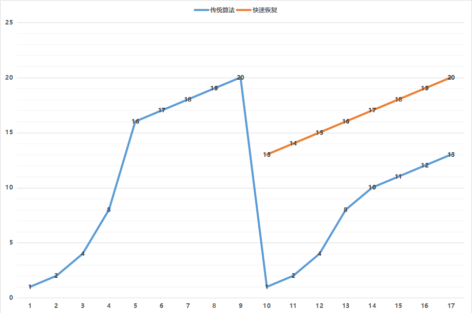
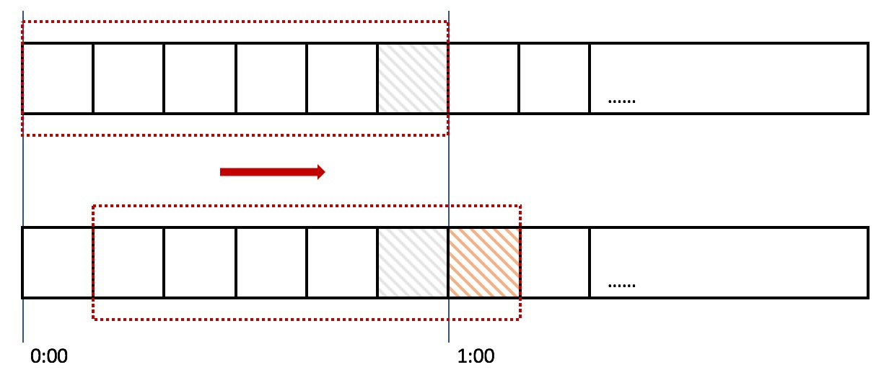
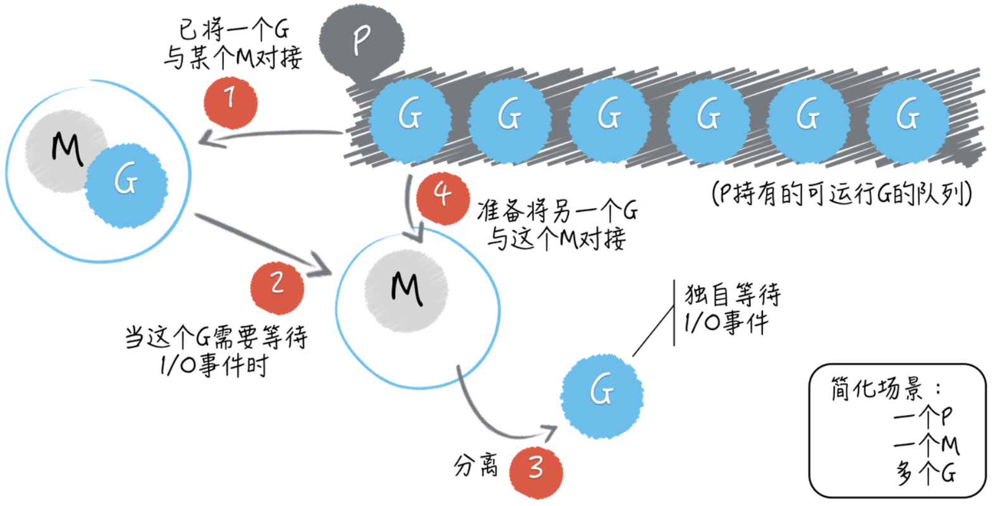

- [Database](#database)
  - [Mysql](#mysql)
    - [MySQL 的存储引擎有哪些?（InnoDB）为什么选 InnoDB?](#mysql-%e7%9a%84%e5%ad%98%e5%82%a8%e5%bc%95%e6%93%8e%e6%9c%89%e5%93%aa%e4%ba%9binnodb%e4%b8%ba%e4%bb%80%e4%b9%88%e9%80%89-innodb)
    - [知道mysql的索引算法么？](#%e7%9f%a5%e9%81%93mysql%e7%9a%84%e7%b4%a2%e5%bc%95%e7%ae%97%e6%b3%95%e4%b9%88)
    - [为什么mysql要用b+树而不是b树或者其他树？](#%e4%b8%ba%e4%bb%80%e4%b9%88mysql%e8%a6%81%e7%94%a8b%e6%a0%91%e8%80%8c%e4%b8%8d%e6%98%afb%e6%a0%91%e6%88%96%e8%80%85%e5%85%b6%e4%bb%96%e6%a0%91)
    - [MySQL 的聚簇索引和非聚簇索引有什么区别?](#mysql-%e7%9a%84%e8%81%9a%e7%b0%87%e7%b4%a2%e5%bc%95%e5%92%8c%e9%9d%9e%e8%81%9a%e7%b0%87%e7%b4%a2%e5%bc%95%e6%9c%89%e4%bb%80%e4%b9%88%e5%8c%ba%e5%88%ab)
    - [聊聊如何优化查询性能](#%e8%81%8a%e8%81%8a%e5%a6%82%e4%bd%95%e4%bc%98%e5%8c%96%e6%9f%a5%e8%af%a2%e6%80%a7%e8%83%bd)
    - [聊聊事务的隔离级别。你们生产用的什么事务隔离级别，为什么？](#%e8%81%8a%e8%81%8a%e4%ba%8b%e5%8a%a1%e7%9a%84%e9%9a%94%e7%a6%bb%e7%ba%a7%e5%88%ab%e4%bd%a0%e4%bb%ac%e7%94%9f%e4%ba%a7%e7%94%a8%e7%9a%84%e4%bb%80%e4%b9%88%e4%ba%8b%e5%8a%a1%e9%9a%94%e7%a6%bb%e7%ba%a7%e5%88%ab%e4%b8%ba%e4%bb%80%e4%b9%88)
    - [做DDL操作时，例如加索引，有没有可能造成数据库阻塞，即使数据库只有一条数据。](#%e5%81%9addl%e6%93%8d%e4%bd%9c%e6%97%b6%e4%be%8b%e5%a6%82%e5%8a%a0%e7%b4%a2%e5%bc%95%e6%9c%89%e6%b2%a1%e6%9c%89%e5%8f%af%e8%83%bd%e9%80%a0%e6%88%90%e6%95%b0%e6%8d%ae%e5%ba%93%e9%98%bb%e5%a1%9e%e5%8d%b3%e4%bd%bf%e6%95%b0%e6%8d%ae%e5%ba%93%e5%8f%aa%e6%9c%89%e4%b8%80%e6%9d%a1%e6%95%b0%e6%8d%ae)
    - [死锁，如何避免死锁？](#%e6%ad%bb%e9%94%81%e5%a6%82%e4%bd%95%e9%81%bf%e5%85%8d%e6%ad%bb%e9%94%81)
    - [一条语句的执行过程](#%e4%b8%80%e6%9d%a1%e8%af%ad%e5%8f%a5%e7%9a%84%e6%89%a7%e8%a1%8c%e8%bf%87%e7%a8%8b)
    - [主从复制的流程](#%e4%b8%bb%e4%bb%8e%e5%a4%8d%e5%88%b6%e7%9a%84%e6%b5%81%e7%a8%8b)
    - [如何保证数据库的主从一致性](#%e5%a6%82%e4%bd%95%e4%bf%9d%e8%af%81%e6%95%b0%e6%8d%ae%e5%ba%93%e7%9a%84%e4%b8%bb%e4%bb%8e%e4%b8%80%e8%87%b4%e6%80%a7)
    - [主备切换的策略](#%e4%b8%bb%e5%a4%87%e5%88%87%e6%8d%a2%e7%9a%84%e7%ad%96%e7%95%a5)
    - [分库分表后怎么保证主键仍然是递增的?](#%e5%88%86%e5%ba%93%e5%88%86%e8%a1%a8%e5%90%8e%e6%80%8e%e4%b9%88%e4%bf%9d%e8%af%81%e4%b8%bb%e9%94%ae%e4%bb%8d%e7%84%b6%e6%98%af%e9%80%92%e5%a2%9e%e7%9a%84)
    - [分库分表的数据源中假如存在主键冲突要怎么解决？](#%e5%88%86%e5%ba%93%e5%88%86%e8%a1%a8%e7%9a%84%e6%95%b0%e6%8d%ae%e6%ba%90%e4%b8%ad%e5%81%87%e5%a6%82%e5%ad%98%e5%9c%a8%e4%b8%bb%e9%94%ae%e5%86%b2%e7%aa%81%e8%a6%81%e6%80%8e%e4%b9%88%e8%a7%a3%e5%86%b3)
    - [数据库乐观锁的实现](#%e6%95%b0%e6%8d%ae%e5%ba%93%e4%b9%90%e8%a7%82%e9%94%81%e7%9a%84%e5%ae%9e%e7%8e%b0)
    - [更新语句的执行过程，以及可能出现的问题。](#%e6%9b%b4%e6%96%b0%e8%af%ad%e5%8f%a5%e7%9a%84%e6%89%a7%e8%a1%8c%e8%bf%87%e7%a8%8b%e4%bb%a5%e5%8f%8a%e5%8f%af%e8%83%bd%e5%87%ba%e7%8e%b0%e7%9a%84%e9%97%ae%e9%a2%98)
    - [读写分离引发的数据不一致，如何解决？](#%e8%af%bb%e5%86%99%e5%88%86%e7%a6%bb%e5%bc%95%e5%8f%91%e7%9a%84%e6%95%b0%e6%8d%ae%e4%b8%8d%e4%b8%80%e8%87%b4%e5%a6%82%e4%bd%95%e8%a7%a3%e5%86%b3)
    - [分库分表策略有哪些](#%e5%88%86%e5%ba%93%e5%88%86%e8%a1%a8%e7%ad%96%e7%95%a5%e6%9c%89%e5%93%aa%e4%ba%9b)
    - [分库分表后怎么查询分页?](#%e5%88%86%e5%ba%93%e5%88%86%e8%a1%a8%e5%90%8e%e6%80%8e%e4%b9%88%e6%9f%a5%e8%af%a2%e5%88%86%e9%a1%b5)
    - [分库分表后，唯一id怎么生成。](#%e5%88%86%e5%ba%93%e5%88%86%e8%a1%a8%e5%90%8e%e5%94%af%e4%b8%80id%e6%80%8e%e4%b9%88%e7%94%9f%e6%88%90)
    - [分库分表后如何部署上线](#%e5%88%86%e5%ba%93%e5%88%86%e8%a1%a8%e5%90%8e%e5%a6%82%e4%bd%95%e9%83%a8%e7%bd%b2%e4%b8%8a%e7%ba%bf)
    - [使用联合索引的好处](#%e4%bd%bf%e7%94%a8%e8%81%94%e5%90%88%e7%b4%a2%e5%bc%95%e7%9a%84%e5%a5%bd%e5%a4%84)
    - [删除主键索引会带来什么问题。](#%e5%88%a0%e9%99%a4%e4%b8%bb%e9%94%ae%e7%b4%a2%e5%bc%95%e4%bc%9a%e5%b8%a6%e6%9d%a5%e4%bb%80%e4%b9%88%e9%97%ae%e9%a2%98)
    - [为什么mysql列属性建议使用NOT NULL？](#%e4%b8%ba%e4%bb%80%e4%b9%88mysql%e5%88%97%e5%b1%9e%e6%80%a7%e5%bb%ba%e8%ae%ae%e4%bd%bf%e7%94%a8not-null)
    - [Mysql中drop、delete与truncate有什么区别?](#mysql%e4%b8%addropdelete%e4%b8%8etruncate%e6%9c%89%e4%bb%80%e4%b9%88%e5%8c%ba%e5%88%ab)
    - [了解MVCC么？](#%e4%ba%86%e8%a7%a3mvcc%e4%b9%88)
  - [Redis](#redis)
    - [Redis 有什么优点?](#redis-%e6%9c%89%e4%bb%80%e4%b9%88%e4%bc%98%e7%82%b9)
    - [redis的底层数据结构了解多少](#redis%e7%9a%84%e5%ba%95%e5%b1%82%e6%95%b0%e6%8d%ae%e7%bb%93%e6%9e%84%e4%ba%86%e8%a7%a3%e5%a4%9a%e5%b0%91)
    - [知道动态字符串sds的优缺点么？](#%e7%9f%a5%e9%81%93%e5%8a%a8%e6%80%81%e5%ad%97%e7%ac%a6%e4%b8%b2sds%e7%9a%84%e4%bc%98%e7%bc%ba%e7%82%b9%e4%b9%88)
    - [redis有哪些数据结构，分别使用在什么场景？](#redis%e6%9c%89%e5%93%aa%e4%ba%9b%e6%95%b0%e6%8d%ae%e7%bb%93%e6%9e%84%e5%88%86%e5%88%ab%e4%bd%bf%e7%94%a8%e5%9c%a8%e4%bb%80%e4%b9%88%e5%9c%ba%e6%99%af)
    - [redis 内存淘汰机制](#redis-%e5%86%85%e5%ad%98%e6%b7%98%e6%b1%b0%e6%9c%ba%e5%88%b6)
    - [redis是如何清理过期key的？](#redis%e6%98%af%e5%a6%82%e4%bd%95%e6%b8%85%e7%90%86%e8%bf%87%e6%9c%9fkey%e7%9a%84)
    - [过期key同时大批量过期会怎么样？](#%e8%bf%87%e6%9c%9fkey%e5%90%8c%e6%97%b6%e5%a4%a7%e6%89%b9%e9%87%8f%e8%bf%87%e6%9c%9f%e4%bc%9a%e6%80%8e%e4%b9%88%e6%a0%b7)
    - [什么是缓存穿透？如何避免？什么是缓存雪崩？何如避免？](#%e4%bb%80%e4%b9%88%e6%98%af%e7%bc%93%e5%ad%98%e7%a9%bf%e9%80%8f%e5%a6%82%e4%bd%95%e9%81%bf%e5%85%8d%e4%bb%80%e4%b9%88%e6%98%af%e7%bc%93%e5%ad%98%e9%9b%aa%e5%b4%a9%e4%bd%95%e5%a6%82%e9%81%bf%e5%85%8d)
    - [redis分布式锁](#redis%e5%88%86%e5%b8%83%e5%bc%8f%e9%94%81)
    - [简述Redis分布式锁的缺陷？](#%e7%ae%80%e8%bf%b0redis%e5%88%86%e5%b8%83%e5%bc%8f%e9%94%81%e7%9a%84%e7%bc%ba%e9%99%b7)
    - [Redis里面有1亿个key，其中有10w个key是以某个固定的已知的前缀开头的，如何将它们全部找出来？](#redis%e9%87%8c%e9%9d%a2%e6%9c%891%e4%ba%bf%e4%b8%aakey%e5%85%b6%e4%b8%ad%e6%9c%8910w%e4%b8%aakey%e6%98%af%e4%bb%a5%e6%9f%90%e4%b8%aa%e5%9b%ba%e5%ae%9a%e7%9a%84%e5%b7%b2%e7%9f%a5%e7%9a%84%e5%89%8d%e7%bc%80%e5%bc%80%e5%a4%b4%e7%9a%84%e5%a6%82%e4%bd%95%e5%b0%86%e5%ae%83%e4%bb%ac%e5%85%a8%e9%83%a8%e6%89%be%e5%87%ba%e6%9d%a5)
    - [Redis 单线程如何处理那么多的并发客户端连接？](#redis-%e5%8d%95%e7%ba%bf%e7%a8%8b%e5%a6%82%e4%bd%95%e5%a4%84%e7%90%86%e9%82%a3%e4%b9%88%e5%a4%9a%e7%9a%84%e5%b9%b6%e5%8f%91%e5%ae%a2%e6%88%b7%e7%ab%af%e8%bf%9e%e6%8e%a5)
    - [如何使用redis实现队列。又如何实现延时队列。](#%e5%a6%82%e4%bd%95%e4%bd%bf%e7%94%a8redis%e5%ae%9e%e7%8e%b0%e9%98%9f%e5%88%97%e5%8f%88%e5%a6%82%e4%bd%95%e5%ae%9e%e7%8e%b0%e5%bb%b6%e6%97%b6%e9%98%9f%e5%88%97)
    - [如何实现持久化](#%e5%a6%82%e4%bd%95%e5%ae%9e%e7%8e%b0%e6%8c%81%e4%b9%85%e5%8c%96)
    - [bgsave的原理](#bgsave%e7%9a%84%e5%8e%9f%e7%90%86)
    - [主从间的同步机制](#%e4%b8%bb%e4%bb%8e%e9%97%b4%e7%9a%84%e5%90%8c%e6%ad%a5%e6%9c%ba%e5%88%b6)
    - [主从同步可能出现的问题？](#%e4%b8%bb%e4%bb%8e%e5%90%8c%e6%ad%a5%e5%8f%af%e8%83%bd%e5%87%ba%e7%8e%b0%e7%9a%84%e9%97%ae%e9%a2%98)
    - [说说Redis哈希槽的概念？](#%e8%af%b4%e8%af%b4redis%e5%93%88%e5%b8%8c%e6%a7%bd%e7%9a%84%e6%a6%82%e5%bf%b5)
    - [如何实现一个高并发、高可用的redis。](#%e5%a6%82%e4%bd%95%e5%ae%9e%e7%8e%b0%e4%b8%80%e4%b8%aa%e9%ab%98%e5%b9%b6%e5%8f%91%e9%ab%98%e5%8f%af%e7%94%a8%e7%9a%84redis)
    - [Redis如何使用事务？有什么缺点？](#redis%e5%a6%82%e4%bd%95%e4%bd%bf%e7%94%a8%e4%ba%8b%e5%8a%a1%e6%9c%89%e4%bb%80%e4%b9%88%e7%bc%ba%e7%82%b9)
    - [为什么 Redis 的事务不能支持回滚？](#%e4%b8%ba%e4%bb%80%e4%b9%88-redis-%e7%9a%84%e4%ba%8b%e5%8a%a1%e4%b8%8d%e8%83%bd%e6%94%af%e6%8c%81%e5%9b%9e%e6%bb%9a)
    - [如何保证缓存与数据库的双写一致性？](#%e5%a6%82%e4%bd%95%e4%bf%9d%e8%af%81%e7%bc%93%e5%ad%98%e4%b8%8e%e6%95%b0%e6%8d%ae%e5%ba%93%e7%9a%84%e5%8f%8c%e5%86%99%e4%b8%80%e8%87%b4%e6%80%a7)
    - [如何使用redis进行CAS修改缓存的值](#%e5%a6%82%e4%bd%95%e4%bd%bf%e7%94%a8redis%e8%bf%9b%e8%a1%8ccas%e4%bf%ae%e6%94%b9%e7%bc%93%e5%ad%98%e7%9a%84%e5%80%bc)
    - [Redis如何做内存优化，如何回收进程？](#redis%e5%a6%82%e4%bd%95%e5%81%9a%e5%86%85%e5%ad%98%e4%bc%98%e5%8c%96%e5%a6%82%e4%bd%95%e5%9b%9e%e6%94%b6%e8%bf%9b%e7%a8%8b)
    - [Redis 常见的性能问题都有哪些？如何解决？](#redis-%e5%b8%b8%e8%a7%81%e7%9a%84%e6%80%a7%e8%83%bd%e9%97%ae%e9%a2%98%e9%83%bd%e6%9c%89%e5%93%aa%e4%ba%9b%e5%a6%82%e4%bd%95%e8%a7%a3%e5%86%b3)
    - [Redis如何实现限流？](#redis%e5%a6%82%e4%bd%95%e5%ae%9e%e7%8e%b0%e9%99%90%e6%b5%81)
    - [热key问题如何解决](#%e7%83%adkey%e9%97%ae%e9%a2%98%e5%a6%82%e4%bd%95%e8%a7%a3%e5%86%b3)
- [消息队列](#%e6%b6%88%e6%81%af%e9%98%9f%e5%88%97)
  - [如何确保消息不会丢失？](#%e5%a6%82%e4%bd%95%e7%a1%ae%e4%bf%9d%e6%b6%88%e6%81%af%e4%b8%8d%e4%bc%9a%e4%b8%a2%e5%a4%b1)
  - [如何处理重复的消息？](#%e5%a6%82%e4%bd%95%e5%a4%84%e7%90%86%e9%87%8d%e5%a4%8d%e7%9a%84%e6%b6%88%e6%81%af)
  - [如何保证消息的严格顺序？](#%e5%a6%82%e4%bd%95%e4%bf%9d%e8%af%81%e6%b6%88%e6%81%af%e7%9a%84%e4%b8%a5%e6%a0%bc%e9%a1%ba%e5%ba%8f)
- [数据结构和算法](#%e6%95%b0%e6%8d%ae%e7%bb%93%e6%9e%84%e5%92%8c%e7%ae%97%e6%b3%95)
  - [数据结构](#%e6%95%b0%e6%8d%ae%e7%bb%93%e6%9e%84)
    - [链表和数组的优缺点？](#%e9%93%be%e8%a1%a8%e5%92%8c%e6%95%b0%e7%bb%84%e7%9a%84%e4%bc%98%e7%bc%ba%e7%82%b9)
    - [解决hash冲突的方法有哪些？](#%e8%a7%a3%e5%86%b3hash%e5%86%b2%e7%aa%81%e7%9a%84%e6%96%b9%e6%b3%95%e6%9c%89%e5%93%aa%e4%ba%9b)
  - [算法](#%e7%ae%97%e6%b3%95)
    - [从无限的字符流中, 随机选出 10 个字符](#%e4%bb%8e%e6%97%a0%e9%99%90%e7%9a%84%e5%ad%97%e7%ac%a6%e6%b5%81%e4%b8%ad-%e9%9a%8f%e6%9c%ba%e9%80%89%e5%87%ba-10-%e4%b8%aa%e5%ad%97%e7%ac%a6)
    - [M*N 横向纵向均递增的矩阵找指定数](#mn-%e6%a8%aa%e5%90%91%e7%ba%b5%e5%90%91%e5%9d%87%e9%80%92%e5%a2%9e%e7%9a%84%e7%9f%a9%e9%98%b5%e6%89%be%e6%8c%87%e5%ae%9a%e6%95%b0)
    - [如何判断两个无环单链表有没有交叉点](#%e5%a6%82%e4%bd%95%e5%88%a4%e6%96%ad%e4%b8%a4%e4%b8%aa%e6%97%a0%e7%8e%af%e5%8d%95%e9%93%be%e8%a1%a8%e6%9c%89%e6%b2%a1%e6%9c%89%e4%ba%a4%e5%8f%89%e7%82%b9)
    - [如何判断两个有环单链表有没有交叉点](#%e5%a6%82%e4%bd%95%e5%88%a4%e6%96%ad%e4%b8%a4%e4%b8%aa%e6%9c%89%e7%8e%af%e5%8d%95%e9%93%be%e8%a1%a8%e6%9c%89%e6%b2%a1%e6%9c%89%e4%ba%a4%e5%8f%89%e7%82%b9)
    - [最短路算法](#%e6%9c%80%e7%9f%ad%e8%b7%af%e7%ae%97%e6%b3%95)
    - [有了二叉查找树、平衡树，为什么还要红黑树？](#%e6%9c%89%e4%ba%86%e4%ba%8c%e5%8f%89%e6%9f%a5%e6%89%be%e6%a0%91%e5%b9%b3%e8%a1%a1%e6%a0%91%e4%b8%ba%e4%bb%80%e4%b9%88%e8%bf%98%e8%a6%81%e7%ba%a2%e9%bb%91%e6%a0%91)
    - [爬虫在抓取网页的时候，如何判断网址是否抓取过？假设你要爬取的10亿甚至更多的网页。](#%e7%88%ac%e8%99%ab%e5%9c%a8%e6%8a%93%e5%8f%96%e7%bd%91%e9%a1%b5%e7%9a%84%e6%97%b6%e5%80%99%e5%a6%82%e4%bd%95%e5%88%a4%e6%96%ad%e7%bd%91%e5%9d%80%e6%98%af%e5%90%a6%e6%8a%93%e5%8f%96%e8%bf%87%e5%81%87%e8%ae%be%e4%bd%a0%e8%a6%81%e7%88%ac%e5%8f%96%e7%9a%8410%e4%ba%bf%e7%94%9a%e8%87%b3%e6%9b%b4%e5%a4%9a%e7%9a%84%e7%bd%91%e9%a1%b5)
- [操作系统](#%e6%93%8d%e4%bd%9c%e7%b3%bb%e7%bb%9f)
  - [聊聊进程、线程和协程](#%e8%81%8a%e8%81%8a%e8%bf%9b%e7%a8%8b%e7%ba%bf%e7%a8%8b%e5%92%8c%e5%8d%8f%e7%a8%8b)
  - [进程间协同的方式](#%e8%bf%9b%e7%a8%8b%e9%97%b4%e5%8d%8f%e5%90%8c%e7%9a%84%e6%96%b9%e5%bc%8f)
- [网络](#%e7%bd%91%e7%bb%9c)
  - [网络基础](#%e7%bd%91%e7%bb%9c%e5%9f%ba%e7%a1%80)
    - [一个请求的过程（或者说从浏览器地址栏输入www.baidu.com回车后发生的所有过程）](#%e4%b8%80%e4%b8%aa%e8%af%b7%e6%b1%82%e7%9a%84%e8%bf%87%e7%a8%8b%e6%88%96%e8%80%85%e8%af%b4%e4%bb%8e%e6%b5%8f%e8%a7%88%e5%99%a8%e5%9c%b0%e5%9d%80%e6%a0%8f%e8%be%93%e5%85%a5wwwbaiducom%e5%9b%9e%e8%bd%a6%e5%90%8e%e5%8f%91%e7%94%9f%e7%9a%84%e6%89%80%e6%9c%89%e8%bf%87%e7%a8%8b)
    - [http请求包含哪些数据结构？](#http%e8%af%b7%e6%b1%82%e5%8c%85%e5%90%ab%e5%93%aa%e4%ba%9b%e6%95%b0%e6%8d%ae%e7%bb%93%e6%9e%84)
    - [什么是http的长连接和短连接？如何配置使用长连接](#%e4%bb%80%e4%b9%88%e6%98%afhttp%e7%9a%84%e9%95%bf%e8%bf%9e%e6%8e%a5%e5%92%8c%e7%9f%ad%e8%bf%9e%e6%8e%a5%e5%a6%82%e4%bd%95%e9%85%8d%e7%bd%ae%e4%bd%bf%e7%94%a8%e9%95%bf%e8%bf%9e%e6%8e%a5)
    - [HTTP/1.0和HTTP/1.1的主要差别有哪些？](#http10%e5%92%8chttp11%e7%9a%84%e4%b8%bb%e8%a6%81%e5%b7%ae%e5%88%ab%e6%9c%89%e5%93%aa%e4%ba%9b)
    - [一个TCP连接可以对应几个HTTP请求？](#%e4%b8%80%e4%b8%aatcp%e8%bf%9e%e6%8e%a5%e5%8f%af%e4%bb%a5%e5%af%b9%e5%ba%94%e5%87%a0%e4%b8%aahttp%e8%af%b7%e6%b1%82)
    - [一个TCP连接中多个HTTP请求可以一起发送么？](#%e4%b8%80%e4%b8%aatcp%e8%bf%9e%e6%8e%a5%e4%b8%ad%e5%a4%9a%e4%b8%aahttp%e8%af%b7%e6%b1%82%e5%8f%af%e4%bb%a5%e4%b8%80%e8%b5%b7%e5%8f%91%e9%80%81%e4%b9%88)
    - [https的建立过程](#https%e7%9a%84%e5%bb%ba%e7%ab%8b%e8%bf%87%e7%a8%8b)
    - [charles抓https包的原理](#charles%e6%8a%93https%e5%8c%85%e7%9a%84%e5%8e%9f%e7%90%86)
    - [聊聊cookie和seesion](#%e8%81%8a%e8%81%8acookie%e5%92%8cseesion)
    - [Secure和HttpOnly的作用](#secure%e5%92%8chttponly%e7%9a%84%e4%bd%9c%e7%94%a8)
    - [tcp如何保证可靠传输的？](#tcp%e5%a6%82%e4%bd%95%e4%bf%9d%e8%af%81%e5%8f%af%e9%9d%a0%e4%bc%a0%e8%be%93%e7%9a%84)
    - [TCP的keep-alive的作用？它和http的keep-alive有什么差别](#tcp%e7%9a%84keep-alive%e7%9a%84%e4%bd%9c%e7%94%a8%e5%ae%83%e5%92%8chttp%e7%9a%84keep-alive%e6%9c%89%e4%bb%80%e4%b9%88%e5%b7%ae%e5%88%ab)
    - [谈谈tcp的三次握手和四次挥手。为什么建立连接需要三次，而不是两次？](#%e8%b0%88%e8%b0%88tcp%e7%9a%84%e4%b8%89%e6%ac%a1%e6%8f%a1%e6%89%8b%e5%92%8c%e5%9b%9b%e6%ac%a1%e6%8c%a5%e6%89%8b%e4%b8%ba%e4%bb%80%e4%b9%88%e5%bb%ba%e7%ab%8b%e8%bf%9e%e6%8e%a5%e9%9c%80%e8%a6%81%e4%b8%89%e6%ac%a1%e8%80%8c%e4%b8%8d%e6%98%af%e4%b8%a4%e6%ac%a1)
    - [tcp有哪些状态，相应状态的含义。](#tcp%e6%9c%89%e5%93%aa%e4%ba%9b%e7%8a%b6%e6%80%81%e7%9b%b8%e5%ba%94%e7%8a%b6%e6%80%81%e7%9a%84%e5%90%ab%e4%b9%89)
    - [三次握手时，如果服务端没有收到最后的ack包，客户端可以开始发数据么？](#%e4%b8%89%e6%ac%a1%e6%8f%a1%e6%89%8b%e6%97%b6%e5%a6%82%e6%9e%9c%e6%9c%8d%e5%8a%a1%e7%ab%af%e6%b2%a1%e6%9c%89%e6%94%b6%e5%88%b0%e6%9c%80%e5%90%8e%e7%9a%84ack%e5%8c%85%e5%ae%a2%e6%88%b7%e7%ab%af%e5%8f%af%e4%bb%a5%e5%bc%80%e5%a7%8b%e5%8f%91%e6%95%b0%e6%8d%ae%e4%b9%88)
    - [知道SYN洪攻击么？](#%e7%9f%a5%e9%81%93syn%e6%b4%aa%e6%94%bb%e5%87%bb%e4%b9%88)
    - [为什么接收方在FIN包后不能一次性发送ACK和FIN包给发送方，就像建立连接时一次性发送SYN和ACK包一样。](#%e4%b8%ba%e4%bb%80%e4%b9%88%e6%8e%a5%e6%94%b6%e6%96%b9%e5%9c%a8fin%e5%8c%85%e5%90%8e%e4%b8%8d%e8%83%bd%e4%b8%80%e6%ac%a1%e6%80%a7%e5%8f%91%e9%80%81ack%e5%92%8cfin%e5%8c%85%e7%bb%99%e5%8f%91%e9%80%81%e6%96%b9%e5%b0%b1%e5%83%8f%e5%bb%ba%e7%ab%8b%e8%bf%9e%e6%8e%a5%e6%97%b6%e4%b8%80%e6%ac%a1%e6%80%a7%e5%8f%91%e9%80%81syn%e5%92%8cack%e5%8c%85%e4%b8%80%e6%a0%b7)
    - [如果大量出现CLOSE_WAIT状态，说明什么？](#%e5%a6%82%e6%9e%9c%e5%a4%a7%e9%87%8f%e5%87%ba%e7%8e%b0closewait%e7%8a%b6%e6%80%81%e8%af%b4%e6%98%8e%e4%bb%80%e4%b9%88)
    - [如果被断开的一方在收到FIN包后就跑路或者回复完ACK就跑路了，会怎么样？](#%e5%a6%82%e6%9e%9c%e8%a2%ab%e6%96%ad%e5%bc%80%e7%9a%84%e4%b8%80%e6%96%b9%e5%9c%a8%e6%94%b6%e5%88%b0fin%e5%8c%85%e5%90%8e%e5%b0%b1%e8%b7%91%e8%b7%af%e6%88%96%e8%80%85%e5%9b%9e%e5%a4%8d%e5%ae%8cack%e5%b0%b1%e8%b7%91%e8%b7%af%e4%ba%86%e4%bc%9a%e6%80%8e%e4%b9%88%e6%a0%b7)
    - [如果出现大量的LAST_ACK状态，说明什么原因？](#%e5%a6%82%e6%9e%9c%e5%87%ba%e7%8e%b0%e5%a4%a7%e9%87%8f%e7%9a%84lastack%e7%8a%b6%e6%80%81%e8%af%b4%e6%98%8e%e4%bb%80%e4%b9%88%e5%8e%9f%e5%9b%a0)
    - [断开连接时，TIME_WAIT的作用是什么？](#%e6%96%ad%e5%bc%80%e8%bf%9e%e6%8e%a5%e6%97%b6timewait%e7%9a%84%e4%bd%9c%e7%94%a8%e6%98%af%e4%bb%80%e4%b9%88)
    - [出现大量TIME_WAIT的原因是什么，会造成什么问题，如何解决？](#%e5%87%ba%e7%8e%b0%e5%a4%a7%e9%87%8ftimewait%e7%9a%84%e5%8e%9f%e5%9b%a0%e6%98%af%e4%bb%80%e4%b9%88%e4%bc%9a%e9%80%a0%e6%88%90%e4%bb%80%e4%b9%88%e9%97%ae%e9%a2%98%e5%a6%82%e4%bd%95%e8%a7%a3%e5%86%b3)
    - [TCP两端建立了连接后，如果一端拔掉网线或者拔掉电源，那么另一端能够收到通知吗？](#tcp%e4%b8%a4%e7%ab%af%e5%bb%ba%e7%ab%8b%e4%ba%86%e8%bf%9e%e6%8e%a5%e5%90%8e%e5%a6%82%e6%9e%9c%e4%b8%80%e7%ab%af%e6%8b%94%e6%8e%89%e7%bd%91%e7%ba%bf%e6%88%96%e8%80%85%e6%8b%94%e6%8e%89%e7%94%b5%e6%ba%90%e9%82%a3%e4%b9%88%e5%8f%a6%e4%b8%80%e7%ab%af%e8%83%bd%e5%a4%9f%e6%94%b6%e5%88%b0%e9%80%9a%e7%9f%a5%e5%90%97)
    - [DNS的查找过程](#dns%e7%9a%84%e6%9f%a5%e6%89%be%e8%bf%87%e7%a8%8b)
    - [DNS使用的是TCP协议还是UDP协议？](#dns%e4%bd%bf%e7%94%a8%e7%9a%84%e6%98%aftcp%e5%8d%8f%e8%ae%ae%e8%bf%98%e6%98%afudp%e5%8d%8f%e8%ae%ae)
    - [CDN原理](#cdn%e5%8e%9f%e7%90%86)
    - [流量控制和拥塞控制](#%e6%b5%81%e9%87%8f%e6%8e%a7%e5%88%b6%e5%92%8c%e6%8b%a5%e5%a1%9e%e6%8e%a7%e5%88%b6)
    - [如果要采用udp设计一个可靠的协议，要怎么做？](#%e5%a6%82%e6%9e%9c%e8%a6%81%e9%87%87%e7%94%a8udp%e8%ae%be%e8%ae%a1%e4%b8%80%e4%b8%aa%e5%8f%af%e9%9d%a0%e7%9a%84%e5%8d%8f%e8%ae%ae%e8%a6%81%e6%80%8e%e4%b9%88%e5%81%9a)
    - [301和302有什么区别](#301%e5%92%8c302%e6%9c%89%e4%bb%80%e4%b9%88%e5%8c%ba%e5%88%ab)
    - [504和500有什么区别](#504%e5%92%8c500%e6%9c%89%e4%bb%80%e4%b9%88%e5%8c%ba%e5%88%ab)
    - [put和patch的差别](#put%e5%92%8cpatch%e7%9a%84%e5%b7%ae%e5%88%ab)
    - [缓存头有哪些，如何使用？](#%e7%bc%93%e5%ad%98%e5%a4%b4%e6%9c%89%e5%93%aa%e4%ba%9b%e5%a6%82%e4%bd%95%e4%bd%bf%e7%94%a8)
    - [为什么要进行URI编码？哪些字符需要编码？如何进行URI编码？](#%e4%b8%ba%e4%bb%80%e4%b9%88%e8%a6%81%e8%bf%9b%e8%a1%8curi%e7%bc%96%e7%a0%81%e5%93%aa%e4%ba%9b%e5%ad%97%e7%ac%a6%e9%9c%80%e8%a6%81%e7%bc%96%e7%a0%81%e5%a6%82%e4%bd%95%e8%bf%9b%e8%a1%8curi%e7%bc%96%e7%a0%81)
  - [网络编程](#%e7%bd%91%e7%bb%9c%e7%bc%96%e7%a8%8b)
    - [一段数据从应用程序发送端到应用程序接收端，经历了多少次拷贝？](#%e4%b8%80%e6%ae%b5%e6%95%b0%e6%8d%ae%e4%bb%8e%e5%ba%94%e7%94%a8%e7%a8%8b%e5%ba%8f%e5%8f%91%e9%80%81%e7%ab%af%e5%88%b0%e5%ba%94%e7%94%a8%e7%a8%8b%e5%ba%8f%e6%8e%a5%e6%94%b6%e7%ab%af%e7%bb%8f%e5%8e%86%e4%ba%86%e5%a4%9a%e5%b0%91%e6%ac%a1%e6%8b%b7%e8%b4%9d)
    - [Tcp连接断开的操作中，close和shutdown的区别？](#tcp%e8%bf%9e%e6%8e%a5%e6%96%ad%e5%bc%80%e7%9a%84%e6%93%8d%e4%bd%9c%e4%b8%adclose%e5%92%8cshutdown%e7%9a%84%e5%8c%ba%e5%88%ab)
    - [网络编程中，增大缓冲区是否可以提高程序吞吐率？](#%e7%bd%91%e7%bb%9c%e7%bc%96%e7%a8%8b%e4%b8%ad%e5%a2%9e%e5%a4%a7%e7%bc%93%e5%86%b2%e5%8c%ba%e6%98%af%e5%90%a6%e5%8f%af%e4%bb%a5%e6%8f%90%e9%ab%98%e7%a8%8b%e5%ba%8f%e5%90%9e%e5%90%90%e7%8e%87)
    - [UDP如何实现连接异常通知？（或者说udp中connect函数的作用？）](#udp%e5%a6%82%e4%bd%95%e5%ae%9e%e7%8e%b0%e8%bf%9e%e6%8e%a5%e5%bc%82%e5%b8%b8%e9%80%9a%e7%9f%a5%e6%88%96%e8%80%85%e8%af%b4udp%e4%b8%adconnect%e5%87%bd%e6%95%b0%e7%9a%84%e4%bd%9c%e7%94%a8)
    - [用过哪些RPC框架么，讲讲有缺点](#%e7%94%a8%e8%bf%87%e5%93%aa%e4%ba%9brpc%e6%a1%86%e6%9e%b6%e4%b9%88%e8%ae%b2%e8%ae%b2%e6%9c%89%e7%bc%ba%e7%82%b9)
    - [聊聊阻塞I/O和非阻塞I/O](#%e8%81%8a%e8%81%8a%e9%98%bb%e5%a1%9eio%e5%92%8c%e9%9d%9e%e9%98%bb%e5%a1%9eio)
    - [聊聊select、poll、epoll的分别](#%e8%81%8a%e8%81%8aselectpollepoll%e7%9a%84%e5%88%86%e5%88%ab)
    - [知道epoll有两种工作模式么？](#%e7%9f%a5%e9%81%93epoll%e6%9c%89%e4%b8%a4%e7%a7%8d%e5%b7%a5%e4%bd%9c%e6%a8%a1%e5%bc%8f%e4%b9%88)
    - [网络中断时，需要如何正确处理异常？](#%e7%bd%91%e7%bb%9c%e4%b8%ad%e6%96%ad%e6%97%b6%e9%9c%80%e8%a6%81%e5%a6%82%e4%bd%95%e6%ad%a3%e7%a1%ae%e5%a4%84%e7%90%86%e5%bc%82%e5%b8%b8)
  - [网络安全](#%e7%bd%91%e7%bb%9c%e5%ae%89%e5%85%a8)
    - [解决跨域的方式](#%e8%a7%a3%e5%86%b3%e8%b7%a8%e5%9f%9f%e7%9a%84%e6%96%b9%e5%bc%8f)
    - [理解xss](#%e7%90%86%e8%a7%a3xss)
    - [理解csrf](#%e7%90%86%e8%a7%a3csrf)
    - [SYN Flood攻击](#syn-flood%e6%94%bb%e5%87%bb)
- [系统设计](#%e7%b3%bb%e7%bb%9f%e8%ae%be%e8%ae%a1)
  - [微服务](#%e5%be%ae%e6%9c%8d%e5%8a%a1)
    - [谈谈服务雪崩、降级、熔断](#%e8%b0%88%e8%b0%88%e6%9c%8d%e5%8a%a1%e9%9b%aa%e5%b4%a9%e9%99%8d%e7%ba%a7%e7%86%94%e6%96%ad)
    - [微服务数据一致性问题，如何解决？](#%e5%be%ae%e6%9c%8d%e5%8a%a1%e6%95%b0%e6%8d%ae%e4%b8%80%e8%87%b4%e6%80%a7%e9%97%ae%e9%a2%98%e5%a6%82%e4%bd%95%e8%a7%a3%e5%86%b3)
    - [服务的部署方式有哪些，如何做到不停机部署？](#%e6%9c%8d%e5%8a%a1%e7%9a%84%e9%83%a8%e7%bd%b2%e6%96%b9%e5%bc%8f%e6%9c%89%e5%93%aa%e4%ba%9b%e5%a6%82%e4%bd%95%e5%81%9a%e5%88%b0%e4%b8%8d%e5%81%9c%e6%9c%ba%e9%83%a8%e7%bd%b2)
    - [聊聊微服务体系架构](#%e8%81%8a%e8%81%8a%e5%be%ae%e6%9c%8d%e5%8a%a1%e4%bd%93%e7%b3%bb%e6%9e%b6%e6%9e%84)
  - [分布式](#%e5%88%86%e5%b8%83%e5%bc%8f)
    - [CAP](#cap)
    - [分布式系统的唯一id生成算法](#%e5%88%86%e5%b8%83%e5%bc%8f%e7%b3%bb%e7%bb%9f%e7%9a%84%e5%94%af%e4%b8%80id%e7%94%9f%e6%88%90%e7%ae%97%e6%b3%95)
    - [某一个业务中现在需要生成全局唯一的递增 ID, 并发量非常大, 怎么做](#%e6%9f%90%e4%b8%80%e4%b8%aa%e4%b8%9a%e5%8a%a1%e4%b8%ad%e7%8e%b0%e5%9c%a8%e9%9c%80%e8%a6%81%e7%94%9f%e6%88%90%e5%85%a8%e5%b1%80%e5%94%af%e4%b8%80%e7%9a%84%e9%80%92%e5%a2%9e-id-%e5%b9%b6%e5%8f%91%e9%87%8f%e9%9d%9e%e5%b8%b8%e5%a4%a7-%e6%80%8e%e4%b9%88%e5%81%9a)
    - [我现在要做一个限流功能, 怎么做?](#%e6%88%91%e7%8e%b0%e5%9c%a8%e8%a6%81%e5%81%9a%e4%b8%80%e4%b8%aa%e9%99%90%e6%b5%81%e5%8a%9f%e8%83%bd-%e6%80%8e%e4%b9%88%e5%81%9a)
    - [这个限流要做成分布式的, 怎么做?](#%e8%bf%99%e4%b8%aa%e9%99%90%e6%b5%81%e8%a6%81%e5%81%9a%e6%88%90%e5%88%86%e5%b8%83%e5%bc%8f%e7%9a%84-%e6%80%8e%e4%b9%88%e5%81%9a)
    - [分布式锁设置超时后，有没可能在没有释放的情况下, 被人抢走锁。有的话，怎么解决？](#%e5%88%86%e5%b8%83%e5%bc%8f%e9%94%81%e8%ae%be%e7%bd%ae%e8%b6%85%e6%97%b6%e5%90%8e%e6%9c%89%e6%b2%a1%e5%8f%af%e8%83%bd%e5%9c%a8%e6%b2%a1%e6%9c%89%e9%87%8a%e6%94%be%e7%9a%84%e6%83%85%e5%86%b5%e4%b8%8b-%e8%a2%ab%e4%ba%ba%e6%8a%a2%e8%b5%b0%e9%94%81%e6%9c%89%e7%9a%84%e8%af%9d%e6%80%8e%e4%b9%88%e8%a7%a3%e5%86%b3)
    - [不用zk的心跳, 可以怎么解决这个问题呢?](#%e4%b8%8d%e7%94%a8zk%e7%9a%84%e5%bf%83%e8%b7%b3-%e5%8f%af%e4%bb%a5%e6%80%8e%e4%b9%88%e8%a7%a3%e5%86%b3%e8%bf%99%e4%b8%aa%e9%97%ae%e9%a2%98%e5%91%a2)
    - [如何保障分布式事务的一致性？](#%e5%a6%82%e4%bd%95%e4%bf%9d%e9%9a%9c%e5%88%86%e5%b8%83%e5%bc%8f%e4%ba%8b%e5%8a%a1%e7%9a%84%e4%b8%80%e8%87%b4%e6%80%a7)
  - [并发编程](#%e5%b9%b6%e5%8f%91%e7%bc%96%e7%a8%8b)
    - [CAS](#cas)
    - [COW](#cow)
    - [一个并发高的系统，创建多少线程合适？](#%e4%b8%80%e4%b8%aa%e5%b9%b6%e5%8f%91%e9%ab%98%e7%9a%84%e7%b3%bb%e7%bb%9f%e5%88%9b%e5%bb%ba%e5%a4%9a%e5%b0%91%e7%ba%bf%e7%a8%8b%e5%90%88%e9%80%82)
    - [死锁的产生，如何避免死锁](#%e6%ad%bb%e9%94%81%e7%9a%84%e4%ba%a7%e7%94%9f%e5%a6%82%e4%bd%95%e9%81%bf%e5%85%8d%e6%ad%bb%e9%94%81)
    - [如何正确更新缓存和数据库](#%e5%a6%82%e4%bd%95%e6%ad%a3%e7%a1%ae%e6%9b%b4%e6%96%b0%e7%bc%93%e5%ad%98%e5%92%8c%e6%95%b0%e6%8d%ae%e5%ba%93)
  - [设计](#%e8%ae%be%e8%ae%a1)
    - [如何设计一个短链接服务](#%e5%a6%82%e4%bd%95%e8%ae%be%e8%ae%a1%e4%b8%80%e4%b8%aa%e7%9f%ad%e9%93%be%e6%8e%a5%e6%9c%8d%e5%8a%a1)
    - [当缓存需要更新的时候，你觉得应该怎么做才合理？](#%e5%bd%93%e7%bc%93%e5%ad%98%e9%9c%80%e8%a6%81%e6%9b%b4%e6%96%b0%e7%9a%84%e6%97%b6%e5%80%99%e4%bd%a0%e8%a7%89%e5%be%97%e5%ba%94%e8%af%a5%e6%80%8e%e4%b9%88%e5%81%9a%e6%89%8d%e5%90%88%e7%90%86)
    - [如何设计一个秒杀系统？](#%e5%a6%82%e4%bd%95%e8%ae%be%e8%ae%a1%e4%b8%80%e4%b8%aa%e7%a7%92%e6%9d%80%e7%b3%bb%e7%bb%9f)
    - [聊聊负载均衡架构](#%e8%81%8a%e8%81%8a%e8%b4%9f%e8%bd%bd%e5%9d%87%e8%a1%a1%e6%9e%b6%e6%9e%84)
- [语言](#%e8%af%ad%e8%a8%80)
  - [golang](#golang)
    - [如何实现CAS。](#%e5%a6%82%e4%bd%95%e5%ae%9e%e7%8e%b0cas)
    - [关于golang for-range 的坑](#%e5%85%b3%e4%ba%8egolang-for-range-%e7%9a%84%e5%9d%91)
    - [goroutine 是怎么调度的？](#goroutine-%e6%98%af%e6%80%8e%e4%b9%88%e8%b0%83%e5%ba%a6%e7%9a%84)
    - [golang的gc算法](#golang%e7%9a%84gc%e7%ae%97%e6%b3%95)
    - [Golang 里的逃逸分析是什么？怎么避免内存逃逸？](#golang-%e9%87%8c%e7%9a%84%e9%80%83%e9%80%b8%e5%88%86%e6%9e%90%e6%98%af%e4%bb%80%e4%b9%88%e6%80%8e%e4%b9%88%e9%81%bf%e5%85%8d%e5%86%85%e5%ad%98%e9%80%83%e9%80%b8)
    - [什么是条件变量？](#%e4%bb%80%e4%b9%88%e6%98%af%e6%9d%a1%e4%bb%b6%e5%8f%98%e9%87%8f)
    - [为什么先要锁定条件变量的基于的互斥锁，才能调用它的wait方法？](#%e4%b8%ba%e4%bb%80%e4%b9%88%e5%85%88%e8%a6%81%e9%94%81%e5%ae%9a%e6%9d%a1%e4%bb%b6%e5%8f%98%e9%87%8f%e7%9a%84%e5%9f%ba%e4%ba%8e%e7%9a%84%e4%ba%92%e6%96%a5%e9%94%81%e6%89%8d%e8%83%bd%e8%b0%83%e7%94%a8%e5%ae%83%e7%9a%84wait%e6%96%b9%e6%b3%95)
  - [node.js](#nodejs)
    - [阻塞和非阻塞的区别和优缺点。同步和异步的区别和优缺点](#%e9%98%bb%e5%a1%9e%e5%92%8c%e9%9d%9e%e9%98%bb%e5%a1%9e%e7%9a%84%e5%8c%ba%e5%88%ab%e5%92%8c%e4%bc%98%e7%bc%ba%e7%82%b9%e5%90%8c%e6%ad%a5%e5%92%8c%e5%bc%82%e6%ad%a5%e7%9a%84%e5%8c%ba%e5%88%ab%e5%92%8c%e4%bc%98%e7%bc%ba%e7%82%b9)
    - [异步IO模型和事件循环机制](#%e5%bc%82%e6%ad%a5io%e6%a8%a1%e5%9e%8b%e5%92%8c%e4%ba%8b%e4%bb%b6%e5%be%aa%e7%8e%af%e6%9c%ba%e5%88%b6)
    - [为什么要有microtask和macrotask?](#%e4%b8%ba%e4%bb%80%e4%b9%88%e8%a6%81%e6%9c%89microtask%e5%92%8cmacrotask)
    - [如何实现一个异步的reduce?](#%e5%a6%82%e4%bd%95%e5%ae%9e%e7%8e%b0%e4%b8%80%e4%b8%aa%e5%bc%82%e6%ad%a5%e7%9a%84reduce)
    - [V8内存控制和垃圾回收机制](#v8%e5%86%85%e5%ad%98%e6%8e%a7%e5%88%b6%e5%92%8c%e5%9e%83%e5%9c%be%e5%9b%9e%e6%94%b6%e6%9c%ba%e5%88%b6)
    - [内存泄漏](#%e5%86%85%e5%ad%98%e6%b3%84%e6%bc%8f)
    - [javascript原型链和如何实现继承](#javascript%e5%8e%9f%e5%9e%8b%e9%93%be%e5%92%8c%e5%a6%82%e4%bd%95%e5%ae%9e%e7%8e%b0%e7%bb%a7%e6%89%bf)
- [其他](#%e5%85%b6%e4%bb%96)
  - [为什么用rabbitmq，它有什么优缺点](#%e4%b8%ba%e4%bb%80%e4%b9%88%e7%94%a8rabbitmq%e5%ae%83%e6%9c%89%e4%bb%80%e4%b9%88%e4%bc%98%e7%bc%ba%e7%82%b9)
  - [如何保证MQ消息的可靠性传输，避免消息丢失](#%e5%a6%82%e4%bd%95%e4%bf%9d%e8%af%81mq%e6%b6%88%e6%81%af%e7%9a%84%e5%8f%af%e9%9d%a0%e6%80%a7%e4%bc%a0%e8%be%93%e9%81%bf%e5%85%8d%e6%b6%88%e6%81%af%e4%b8%a2%e5%a4%b1)
  - [用redis解决什么问题](#%e7%94%a8redis%e8%a7%a3%e5%86%b3%e4%bb%80%e4%b9%88%e9%97%ae%e9%a2%98)
  - [抽奖功能是怎么实现的](#%e6%8a%bd%e5%a5%96%e5%8a%9f%e8%83%bd%e6%98%af%e6%80%8e%e4%b9%88%e5%ae%9e%e7%8e%b0%e7%9a%84)
  - [微信扫码登录的原理](#%e5%be%ae%e4%bf%a1%e6%89%ab%e7%a0%81%e7%99%bb%e5%bd%95%e7%9a%84%e5%8e%9f%e7%90%86)
  - [参考资料](#%e5%8f%82%e8%80%83%e8%b5%84%e6%96%99)

# Database
## Mysql
[MySQL优化面试](https://juejin.im/post/5c6b9c09f265da2d8a55a855?utm_source=gold_browser_extension)

### MySQL 的存储引擎有哪些?（InnoDB）为什么选 InnoDB?
Memory、MyISAM、InnoDB。  
选择InnoDB:
1. 支持事务
2. 具有聚集索引
3. MVCC
4. 更完善的奔溃恢复，借助redo log和bin log，能实现更细粒度的数据恢复，基本能够恢复任意时刻的数据。

### 知道mysql的索引算法么？
[b+树](https://time.geekbang.org/column/article/77830)

### 为什么mysql要用b+树而不是b树或者其他树？
1. 首先b+树是一颗多叉树，相对于其他二叉树，深度更小，磁盘IO操作也相应变少。
2. 对比于B树来说，B+树节点不存储数据，叶子节点间采用了双向链表连接，使得叶子节点间可以顺序遍历，因此让区间查找得到实现。

[B+树：MySQL数据库索引是如何实现的？](https://time.geekbang.org/column/article/77830)

### MySQL 的聚簇索引和非聚簇索引有什么区别?
1. 聚簇索引的叶子节点是数据节点，在mysql中，InnoDB引擎中，只有主键索引能被定义为聚集索引。
2. 非聚簇索引叶子节点是指向数据块的指针。mysql里是存储的是主键索引id。因此如果要查询的数据不在非聚集索引中的话，就得通过这个id做回表查询，即回到主键索引根据id查询。

### 聊聊如何优化查询性能

### 聊聊事务的隔离级别。你们生产用的什么事务隔离级别，为什么？
隔离级别：
1. 读未提交，在事务执行过程中，其他线程的事务还没有提交，就读取到它的更新后的数据
2. 读提交，在事务执行过程中，其他事务已经提交，就读到它更新后的数据
3. 可重复读，在事务执行过程中，其他事务即使已经提交，也不会读取到它更新后的数据
4. 串行读，对同一行记录，读会加读锁，写会加写锁，当出现读写锁冲突的时候，后访问的事务需要等待前一个事务执行完成才能继续执行。

我们一般使用可重复读，主要还是为了保持事务过程中数据的读取的一致性。尤其是在做一些统计数据的时候，希望别人的修改暂时对自己是不可见的。

### 做DDL操作时，例如加索引，有没有可能造成数据库阻塞，即使数据库只有一条数据。
是有可能的。

表在做增删改查（DML）的时候，会给表加MDL读锁（元数据读锁）。但是在修改表结构（DDL）的时候，会加MDL写锁，这时会有：
1. 其他线程还持有MDL读锁，DDL线程阻塞
2. DDL线程成功持有MDL写锁，其他线程如果想要DML和DDL都会阻塞

所以当我们要给表加索引时，如果有其他线程已经在读数据，而且MDL读锁还没释放，那么这个加索引的操作就会被阻塞。  
这时如果还有新的线程来查询数据，就得获得MDL读锁，而由于MDL写锁被阻塞，导致查询线程也被阻塞，同时也导致后续所有对该表的查询全部都阻塞

当并发读数据的时候，这种情况会更加明显，虽然看起来数据库只有一条数据，但是请求就是慢。

对于数据量大的表，做DDL操作带来的影响更加大，整个表处于不可读不可写的状态。

解决方式：
1. 避免长事务，让DDL操作与机会执行
2. 给DDL操作设置超时时间，超时后就断开释放锁，然后进行重试，不要一直持有MDL写锁

### 死锁，如何避免死锁？
例如当A要更新a1行持有行锁，这时B要更新a2行也持有它的行锁。  
接下来A也要更新a2行，会被阻塞，要等待B释放a2的行锁。  
此时，如果B也要更新a1行，会被阻塞，要等待A释放a1的行锁。  
这样A在等待B，而B也在等待A，造成了死锁。

死锁避免：
1. mysql有阻塞的超时时间，默认是50s，超时后线程会退出。但是让一个操作等到几十秒显示不理想，虽然这个值可以修改，但是如何设置一个合理的值都比较难判断。
2. mysql具有死锁检测，当检测到死锁后会主动回滚导致死锁的事务。这个功能默认是开启的，但是它会给数据库增加额外负担。因为它在检测的时候，需要查看它锁依赖的线程有没被其他线程锁住，如果有1000个并发线程在同时更新，每个线程都得轮询1000次，总共100万这个级别，导致大量的在消耗CPU，事务执行非常慢。
3. 在服务端做好并发控制，也可以将需要更新大量的行的事务，拆分成多个更新语句，减少锁的范围。

### 一条语句的执行过程
1. 首先客户端会和服务端建立连接，mysql中由**连接器**负责这个过程。
2. 连接建立后，客户端会提供用户名和密码，MySQL**连接器**会负责权限的校验，以及查询该用户拥有的权限。
3. 如果语句是select查询操作，如果开启了查询缓存功能，则会先去查询缓存是否存在，如果存在则直接返回。如果不存在则继续。
4. 接下来，MySQL的分析器会进行语法分析和词法分析：
   * 词法分析，判断哪些词是关键词，例如select、where这些
   * 语法分析，判断SQL的语法是否正确
5. 在真正执行SQL前，MySQL的**优化器**会先进行优化，例如判断应该使用哪些索引，有join语句时候如何选择表的连接顺序。
6. 最后进入执行阶段，**执行器**在开始执行之前，会先判断是否有对表T的权限：
   * 如果没有则返回没有权限。
   * 如果有权限，执行器会根据表的引擎定义，让对应的引擎查询数据

**注意：**   
* 第2步中，当MySQL已经查询出权限后，只要这条连接还在，那么在这个过程中修改用户权限是不会生效的。
* 第2步中，连接完成后，如果一直没有操作，则连接会一直处于**Sleep**状态，一定时间后会被断开，该时间由**wait_timeout**配置
* 第2步中，查询缓存功能最好都是关闭的，因为一旦遇到更新操作，缓存就会被清除掉。在8.0版本，查询缓存功能已经被移除。
* 第4步中，如果有字段不存在，表不存在也会在这个阶段报错。

### 主从复制的流程
1. 主库和从库间会建立一条长连接，主库会有一条新的线程dump_thread，用于将binlog发给从库。
2. 从库会开启两个线程
   1. IO thead，用于接收主库发送过来的binlog
   2. SQL thread，用于执行binlog中的sql
3. 主库的更新操作会写入binlog中，然后发送给从库
4. 从库的IO thread收到binlog后传给SQL thread，尤其执行sql，完成复制。

### 如何保证数据库的主从一致性
主从复制之间是通过bin log来保障的，因此主从的一致性就受这个文件影响。日志文件的传输效率和文件的内容格式都会影响主从一致性。

binlog的格式有两种，statement和row格式。
1. statement格式，记录的是sql的原始语句。如：update t set a=2 where id=1。这个格式占用的日志空间小。
    
2. row格式，记录的是操作的行为和记录的主键，还会记录完整的行信息。这种格式占用的日志空间大，日志需要记录操作的每一行的id。
    

如果采用了statement格式的binlog就有可能造成主从不一致。   
例如以下sql：
```sql
mysql> CREATE TABLE `t` (
  `id` int(11) NOT NULL,
  `a` int(11) DEFAULT NULL,
  `t_modified` timestamp NOT NULL DEFAULT CURRENT_TIMESTAMP,
  PRIMARY KEY (`id`),
  KEY `a` (`a`),
  KEY `t_modified`(`t_modified`)
) ENGINE=InnoDB;

mysql> insert into t values(1,1,'2018-11-13');
mysql> insert into t values(2,2,'2018-11-12');
mysql> insert into t values(3,3,'2018-11-11');
mysql> insert into t values(4,4,'2018-11-10');
mysql> insert into t values(5,5,'2018-11-09');

mysql> delete from t where a>=4 and t_modified<='2018-11-10' limit 1;
```
这时主库删除数据的时候，如果使用使用了索引a，就会让a=4的语句被删掉，并在binlog记录这条sql语句。   
但是binlog到了从库后，如果从库执行的时候选择了索引t_modified，就会导致a=5的语句被删除掉，导致主从不一致。  
因此最好的配置应该是设置成`mixd`格式，由MySQL自己判断什么时候使用应该使用的格式。  
例如使用mixed后，上面的sql就会以row格式记录

造成主从数据不一致还有可能是从库的读压力大于主库，影响了同步速度。

另外一个影响数据不一致的就是长事务了，binlog是在事务执行完成才会写入，如果一个事务执行了10分钟，那么就会导致binlog要延迟10分钟。  
例如大批量的删除数据，和对一张大表做DDL。

### 主备切换的策略
可靠性优先策略：在主备延迟小于一定的值时，将主库改成只读，等到主备延迟为0时，将备库切成可读写，并将其作为主库，原来的主库变成备库。这种方式会造成数据库有段时间处于不可用状态。

可用性优先：直接将备库改成可读写状态，并将备库作为主库，原主库设置成只读状态，并将原主库作为备库。这种方式不会造成数据库不可用，但是会有数据不一致的情况发生。

正常情况下，可以选择可靠性优先策略，毕竟数据的一致性还是更加重要的。

### 分库分表后怎么保证主键仍然是递增的?
* 借用第三方应用如memcache、redis的id自增器
* 单独建一张只包含id一个字段的表，每次自增该字段作为数据记录的id

 TDDL的办法：有一张专门用于分配主键的表，每次用乐观锁的方式尝试去取一批主键过来分配，假如乐观锁失败就重试   
 [分布式数据库中间件—TDDL的使用介绍](https://www.2cto.com/database/201806/752199.html)

### 分库分表的数据源中假如存在主键冲突要怎么解决？

### 数据库乐观锁的实现
乐观锁假设认为数据一般情况下不会造成冲突，所以只会在数据进行提交更新的时候，才会正式对数据的冲突与否进行检测，如果发现冲突了，则返回用户错误的信息，让用户决定如何去做。

实现乐观锁一般来说就是多个字段，例如版本号后者时间戳，然后更新的时候对比一下该值即可：  
```sql
> select name,salary,version from user where id=1;

> update user set salary=salary+1000, version=${version}+1 
where id=1 and version=${version};
```

### 更新语句的执行过程，以及可能出现的问题。
假如要插入一条记录。

如果是唯一索引：
1. 判断插入记录的数据页是否在内存中，如果在，如果不违反唯一性约束，则直接更新内存，然后写redo日志，之后提交事务。
2. 如果数据页不在内存中，则需要先将数据页从磁盘读到内存中，再做1中的处理。

如果是普通索引：
1. 先判断数据页是否在内存中，如果在，则直接在内存的数据页中插入这条记录，然后写redo日志，之后提交事务。
2. 如果不在内存页中，则在内存的change buffer中加入一条插入操作记录，然后写redo日志，之后提交事务。
3. 之后如果有查询操作，便会将磁盘中的数据页读入到内存中，然后将change buffer中的操作应用到数据页中，得到最新的数据。
4. redo日志会定时刷盘，更新磁盘中的数据页，让其和内存保持一致。

更新普通索引字段后，如果伴随着有查询操作的话，就会导致需要立即将磁盘的数据读取到内存中，这便让change buffer无法发挥作用，影响到查询的性能。  
因此如果更新之后，如果伴随有查询的话，可以把change buffer功能关掉。

### 读写分离引发的数据不一致，如何解决？
读写分离：读从库，写主库。但是由于主备和主从延迟是不能100%避免的，所以可能会导致主库写数据后，导致读从库的时候数据还没同步过来，读到旧的数据。

解决方案：
1. 强制走主库。对于数据一致性要求高的请求，可以让其读主库，例如商家发布商品后想立马确认是否发布成功。
2. 查询的时候，可以先休眠，例如`select sleep(1)`。页面可以做个缓和的查询，例如将成功发布的商品直接先显示在页面上，等用户自己真正去查询的时候已经过了一段时间了。但是可能1s或者一段时间后还是不一致。
3. 通过MySQL主备/主从复制的日志来判断是否同步完成，再进行查询，这种方式最精确。
   * 判断主备延迟时间seconds_behind_master是否等于0，如果不等于就等这个值变为0
   * 对比位点，其中Master_Log_File和Read_Master_Log_Pos代表读到的主库的最新位点，这两个值完全相同。Relay_Master_Log_File和Exec_Master_Log_Pos代表备库执行的最新位点，这两个值完全相同。
   * 通过GTID集合确保主备无延迟，Auto_Position=1说明使用了GTID协议，然后判断备库收到的所有日志的GTID集合（Retrieved_Gtid_Set）和备库所有已经执行完成的GTID集合（Executed_Gtid_Set）相同。

### 分库分表策略有哪些
通常来说，分为垂直切分和水平切分。

垂直切分：简单来说就是根据业务的不同，将一张表的很多字段，拆分到另一张表或者另一个库。  
水平切分：随着表的数据越来越多，需要根据一定的规则（例如根据id大小）将数据拆分到其他表或者其他库中。

垂直切分比较简单没什么好说，主要还是水平切分会有不同的拆分策略。

最简单的，根据id的大小进行水平切分，例如id在1-1000的存储在表a，id在1001-2000的存储在表b，id在2001-3000的存储在表c，但是这可能会有热点问题，即大量用户查询的都是id在2001-3000之间的数据，导致表c的压力较大。而且根据id拆分还要依赖你能够保证id是自增的。

在分布式系统下，有时我们不能保证id是自增的，另外为了避免热点问题，我们可以对id取模，例如我们想将其分散在3张表，可以将id对3取模，根据结果决定数据对应的表。但是这样做后续的扩容就不好做了，例如要增加两张表，就会面临大量的数据迁移。有很多方案可以避免数据迁移，例如改用一致性哈希。另外，也有一些scale-out方案可以避免数据迁移，具体参考： [关于分库分表策略的分析和总结](https://www.jianshu.com/p/0c4e542d4ea7)

### 分库分表后怎么查询分页?
假设sql：`select * from t order by time offset x limit y;`

最简单的方式，分别从各个表或库中提取x+y的数据量进行排序提取。  
例如对n个库执行`select * from t order by time offset 0 limit x+y;`语句，则可以得到n*(x+y)条数据，然后内存中根据time排序，最后取偏移量x后的y条记录。这种方式对页码不断增大的情况会不友好，例如我查询到10000页，每页30条，就会导致每个库都要查询10030条数据。但是一般来说也不会有用户查到这么多页码，如果是一些攻击的话，我们可以采用缓存的方式来避免这些恶意查询。

第二种方式，对业务进行折中处理，不允许跳页查询。先根据一般的方式查询到第一页的数据，能得到一个maxTime，查询后续页码的时候sql修改为`select * from t order by time where time > $maxTime limit y;`

第三种方式，如果业务允许模糊查询数据，而且我们的数据足够随机，sql可以采用这种`select * from t order by time offset x/n limit y/n;`，然后查询每个数据库。

[数据库分库分表和带来的唯一ID、分页查询问题的解决](http://www.cnblogs.com/hanzhong/p/10440286.html)

### 分库分表后，唯一id怎么生成。
在分库或者分表后，一般不会采用数据库的自增id作为主键id，而是采用全局id生成器的方式生成id。  
详情看 [分布式系统的唯一id生成算法](#%E5%88%86%E5%B8%83%E5%BC%8F%E7%B3%BB%E7%BB%9F%E7%9A%84%E5%94%AF%E4%B8%80id%E7%94%9F%E6%88%90%E7%AE%97%E6%B3%95)

### 分库分表后如何部署上线
[分库分表后，你们是怎么迁移和部署上线的？怎么保证一致性？](https://mp.weixin.qq.com/s/xC823Ek2dKmI0-s85AIX7A)

### 使用联合索引的好处
1. 覆盖索引，减少回表次数
2. 最左前缀
3. 索引下堆，可以优化最左前缀，在`name like 'zhang%' and age > 10`时，5.6版本后采用索引下堆，可以避免回表，直接在索引里判断。

### 删除主键索引会带来什么问题。
删除后，由于二级索引叶子节点记录的是主键，删除主键后，二级索引页也相应都失效了。

如果想重建主键索引，可以采用：
```
ALTER TABLE t engine=InnoDB;
```

### 为什么mysql列属性建议使用NOT NULL？
1. NULL的列会比NOT NULL的列多占空间，因为需要多使用一个额外的字节来判断该列是否为NULL的标志。
2. 在一些查询语句中会出现一些怪异的行为，如not in、!=、count、concat

[NOT NULL带来的影响](https://mp.weixin.qq.com/s/PIKUol_7AR1CU4FehJAJLw)

### Mysql中drop、delete与truncate有什么区别?
[Mysql中drop、delete与truncate有什么区别?](https://mp.weixin.qq.com/s/RcLXPaJ2u0x9_z6kY29x1w)

### 了解MVCC么？
[为什么大部分RDBMS都会支持MVCC？](https://time.geekbang.org/column/article/120351)

## Redis
[redis题目](https://blog.csdn.net/u010682330/article/details/81043419)

### Redis 有什么优点?
1. 单线程，没有多进程和多线程间的切换开销。
2. 不会涉及到竞争和锁，性能得到提升
3. 基于内存涉及，在内存中进行数据的操作，性能比磁盘操作上几个量级。
4. 采用IO多路复用来提高IO的效率。

### redis的底层数据结构了解多少
最上层统一的头部
```c
struct RedisObject {
    int4 type;
    int4 encoding;
    int24 lru;
    int32 refcount;
    void *ptr;
}
```
ptr是个指针，指向具体的数据。

字符串采用动态字符串实现，数据结构为SDS，通过预先分配一个容量减少内存的频繁分配，也记录了字符串的长度大小。
```c
stuct SDS<T> {
    T capacity 
    T len
    byte flags
    byte[] content
}
```
而根据字符串的长度，采用了不同的方式存储字符串：
1. embstr，在字符串长度小于44字节时，使用这种格式存储。优点就是它只需要分配一次空间，redisObject和sds是连续的。缺点就是长度增加导致需要重新分配内存时，整个redisObject和sds都要重新分配。
   
2. raw，字符串长度大于44字节时，使用这种格式。优点就是在重新分配内存的时候只需要分配sds的。缺点就是它需要分配两次内存空间，分别要为redisObject和sds分配空间。
   

列表：
1. 在元素较少的时候（默认是512，redis.conf可配置），内部采用的是压缩列表（ziplist），通过分配一块连续的内存，将所有元素紧挨着一起存储。也因此导致了在扩容的时候，可能需要重新分配内存，将旧的内容拷贝到新的内存地址，在元素很多时就会损耗性能，所以ziplist不合适存储大型字符串。
    ```c
    stuct ziplist<T> {
        int32 zlbyts; // 整个压缩列表占用字节数
        int32 zltail_offset; // 最后一个元素距离列表起始位置的偏移量，用于快速定位最后一个节点，实现双向遍历。
        int16 zllength; // 元素个数
        T[]   entries; // 元素内容列表，挨个挨个紧凑存储
        int8  zlend;  // 标志压缩列表的结束，值恒为 0xFF
    }

    struct entry {
        int<var> prevlen; // 前一个 entry 的字节长度 当长度小于254字节，用1个字节存储；否则，用5个字节存储
        int<var> encoding; // 元素类型编码
        optional byte[] content; // 元素内容
    }
    ```
    
2. 在元素较多的时候，为了能够快速插入和删除，采用了链表（lintedlist）的方式实现。每个节点都需要存储前一个和后一个节点的地址，每一个指针需要占据8个字节（64位机器）。
    ```c
    struct listNode<T> {
        listNode* prev;
        listNode* next;
        T value;
    }
    struct list {
        listNode *head;
        listNode *tail;
        long length;
    }
    ```
    
3. 由于链表中每个节点中占据的空间较大（16个字节的指针空间），因此在后续的版本中，实现上被改为了快速列表（quicklist）。将linkedlist按段切分，每一段使用ziplist来紧凑存储，多个ziplist之间使用双向指针串起来。而且还可以对ziplist使用LZF算法进行了压缩存储。
    ```c
    struct ziplist_compressed {
        int32 size;
        byte[] compressed_data;
    }
    struct quicklistNode {
        quicklistNode* prev;
        quicklistNode* next;
        ziplist* zl; // 指向压缩列表 每个ziplist长度为8k，超出后就需要新起一个ziplist，该配置由list-max-ziplist-size决定。
        int32 size; // ziplist 的字节总数
        int16 count; // ziplist 中的元素数量
        int2 encoding; // 存储形式 2bit，原生字节数组还是 LZF 压缩存储。
        ...
    }
    struct quicklist {
        quicklistNode* head;
        quicklistNode* tail;
        long count; // 元素总数
        int nodes; // ziplist 节点的个数
        int compressDepth; // LZF 算法压缩深度。默认为0，即不压缩。通过list-compress-depth配置。
        ...
    }
    ```

hash哈希：
1. 在元素个数小于512个（set-max-intset-entries配置）并且每个元素长度小于64字节，采用ziplist实现
    ```
    hset profile name "tome"
    hset profile age 25
    hset profile career "Programmer"
    ```
    
1. 其他情况下采用hashtable实现。

字典中包含2个hashtable，通常其中一个是有值的，在扩容的时候需要分配新的hashtable，然后渐进式搬迁，一个hashtable用于存储旧值，一个用于存储新值。搬迁结束后，旧的hashtable会被删除。   
```c
struct dict {
    ...
    dictht ht[2];
}

struct dictht {
    dictEntry** table; // 二维
    long size; // 第一维数组的长度
    long used; // hash表中的元素个数
    ...
}

struct dictEntry {
    void* key;
    void* val;
    dictEntry* next; // 链接下一个entry
}
```
字典基于二维结构设计，其中第一维是数组，第二维是链表。数组中存储的是第二维链表中第一个元素的指针。  

关于字典的扩容：  
正常情况下，当hash表中元素的个数等于第一维数组的长度时，就会开始扩容，扩容的新数组是原数组大小的2倍。不过如果Redis正在做bgsave，为了减少内存页的过多分离 (Copy On Write)，Redis尽量不去扩容 (dict_can_resize)，但是如果hash表已经非常满了，元素的个数已经达到了第一维数组长度的5倍 (dict_force_resize_ratio)，说明hash表已经过于拥挤了，这个时候就会强制扩容。

关于字典的缩容：   
当 hash 表因为元素的逐渐删除变得越来越稀疏时，Redis 会对 hash 表进行缩容来减少 hash 表的第一维数组空间占用。缩容的条件是元素个数低于数组长度的 10%。缩容不会考虑 Redis 是否正在做 bgsave。

Set集合：
1. 当set集合容纳的元素都是整数并且元素较少的时候，内部采用intset来存储集合元素，它是一种紧凑的数组结构，同时支持16位、32位和64位整数
    ```c
    struct intset<T> {
        int32 encoding; // 决定整数位宽是16位、32位还是64位
        int32 length;  // 元素个数
        int<T> contents; // 整数数组，可以是16为、32位和64位
    }
    ```
    
2. 当set集合存储的不是整数时，采用了hash结构进行存储，只是里面的value都是NULL，其他特性和字典一模一样。

SortedSet：
1. 采用dict字典存储value和score值的映射关系
2. 元素数量小于128，元素长度都小于64字节，使用ziplist实现
    
3. 采用跳跃表skiplist来作为存储score的数据结构。并且在skiplist的forward指针上增加了一个span属性，用于表示从前一个节点沿着当前层的forward指针跳到当前这个节点中间会跳过多少节点。
    ```c
    struct zset {
        dict *dict;
        zskiplist *zsl;
    }
    struct zslforward {
        zslnode* item;
        long span;  // 跨度
    }
    struct zslnode {
        String value;
        double score;
        zslforward*[] forwards;  // 多层连接指针
        zslnode* backward;  // 回溯指针
    }
    struct zskiplist {
        zslnode* header; // 跳跃列表头指针
        int maxLevel; // 跳跃列表当前的最高层
        map<string, zslnode*> ht; // hash 结构的所有键值对
    }
    ```
    

[redis的五大数据类型实现原理](https://www.cnblogs.com/ysocean/p/9102811.html#_label0_1)

### 知道动态字符串sds的优缺点么？
优点：
1. sds结构会直接存储字符串长度，不需要遍历字符串就能得到长度。
2. 由于申请字符串空间的时候，会通过capacity多申请一些冗余空间，因此在执行append的时候，如果字符串长度不大，可以直接在原数组上直接进行，不需要重新分配空间。
3. 可以根据当前字符串的大小，定义len和capacity的字段大小，对内存使用得到优化
4. 根据字符串的长短采用embstr和raw结构来存储，提高性能。

缺点：
1. 基于优点的第二点，如果append的字符串很大，就需要重新分配空间，并且做字符串复制迁移，这个开销非常大。

### redis有哪些数据结构，分别使用在什么场景？
string、list、hash、sort、sortedset   
bitmap、geo、Pub/Sub  
hyperloglog、bloomfilter

### redis 内存淘汰机制

### redis是如何清理过期key的？
[key过期处理](https://github.com/zhengweikeng/blog/blob/master/posts/2018/redis/%E8%BF%87%E6%9C%9Fkey.md)

### 过期key同时大批量过期会怎么样？

### 什么是缓存穿透？如何避免？什么是缓存雪崩？何如避免？
[缓存](https://github.com/zhengweikeng/blog/blob/master/posts/2018/redis/%E4%BC%98%E5%8C%96.md)   
[缓存雪崩、缓存穿透和缓存更新](https://zhuanlan.zhihu.com/p/59945689)  
[Redis 布隆过滤器实战「缓存击穿、雪崩效应」](https://juejin.im/post/5c9442ae5188252d77392241?utm_source=gold_browser_extension)  
[缓存雪崩、和穿透解决](https://github.com/doocs/advanced-java/blob/master/docs/high-concurrency/redis-caching-avalanche-and-caching-penetration.md)

### redis分布式锁
简单来说，分布式锁就是在执行一个操作前，先加上锁，操作执行结束后再释放锁。当有其他请求也要操作它时，就得先抢锁，如果抢不到就只能等待或者放弃。
[分布式锁之Redis实现](https://juejin.im/post/5c6e25aaf265da2dc538b4f9?utm_source=gold_browser_extension)

实现上一般是：
1. 先看是否已经加锁，如果加了，则放弃或者等待
2. 如果没有加锁，则上锁。
3. 为了避免异常（如机器宕机）导致锁没有得到释放，需要给锁加上超时时间，超时后释放锁
4. 以上过程都需要是原子的
```
> set myKey abc1234 ex 5 nx
```

### 简述Redis分布式锁的缺陷？
**第一个缺陷：**  
如果加锁后，业务逻辑执行时间过长，导致超时，那么此时锁就会被释放。导致另一个线程就提前得到了锁。   
因此一般来说，使用redis分布式不要用于长任务，否则出现这种错误可能需要人工接入。

但是如果业务代码允许这种其他线程提前得到锁，为了避免前一个线程释放锁时，释放错了，可以在value上设置一个随机数。在释放锁的时候判断该随机是否一致，一致的情况下才删除
```
# delifequals
if redis.call("get",KEYS[1]) == ARGV[1] then
    return redis.call("del",KEYS[1])
else
    return 0
end
```

**第二个缺陷：**  
在集群下，例如sentinel集群下是不安全的。  
例如一个线程在主节点上申请了一把锁，但是突然主节点挂了，而且该锁也还没同步给从节点。此时从节点升级为主节点，之后另外一个线程也来请求锁，由于此时主节点没有锁，所以能够加锁成功。

于是便有了redlock来解决这种情况。  
在使用redlock时，需要提供多个redis实例，这些实例都是主节点（一般不会有从节点）且相互独立。加锁的时候，会向这些实例发送set(key, value, nx=true, ex)的指令，只要过半的节点set成功，则认为加锁成功。释放锁时，需要向所有节点发送del指令。

例如js的[redlock库](https://github.com/mike-marcacci/node-redlock)  
```javascript
var client1 = require('redis').createClient(6379, 'redis1.example.com');
var client2 = require('redis').createClient(6379, 'redis2.example.com');
var client3 = require('redis').createClient(6379, 'redis3.example.com');
var Redlock = require('redlock');

var redlock = new Redlock(
	// you should have one client for each independent redis node
	// or cluster
	[client1, client2, client3],
	{
		// the expected clock drift; for more details
		// see http://redis.io/topics/distlock
		driftFactor: 0.01, // time in ms

		// the max number of times Redlock will attempt
		// to lock a resource before erroring
		retryCount:  10,

		// the time in ms between attempts
		retryDelay:  200, // time in ms

		// the max time in ms randomly added to retries
		// to improve performance under high contention
		// see https://www.awsarchitectureblog.com/2015/03/backoff.html
		retryJitter:  200 // time in ms
	}
);
```

### Redis里面有1亿个key，其中有10w个key是以某个固定的已知的前缀开头的，如何将它们全部找出来？
keys和scan

### Redis 单线程如何处理那么多的并发客户端连接？
虽然redis是单线程，但是它基于异步非阻塞IO，让线程在进行IO操作的时候，不会被阻塞。其他请求都可以进行多路复用，复用同一个线程来处理任务。

### 如何使用redis实现队列。又如何实现延时队列。
[队列和延时队列](https://juejin.im/book/5afc2e5f6fb9a07a9b362527/section/5afc3643518825672034404b)

### 如何实现持久化
1. RDB快照，会不断记录某一瞬间的数据，是一种全量备份
2. AOF日志，是一种增量备份。

bgsave做镜像全量持久化，aof做增量持久化。因为bgsave会耗费较长时间，不够实时，在停机的时候会导致大量丢失数据，所以需要aof来配合使用。在redis实例重启时，优先使用aof来恢复内存的状态，如果没有aof日志，就会使用rdb文件来恢复。

[redis持久化](https://github.com/zhengweikeng/blog/blob/master/posts/2018/redis/%E6%8C%81%E4%B9%85%E5%8C%96.md)   
[redis持久化](https://github.com/doocs/advanced-java/blob/master/docs/high-concurrency/redis-persistence.md)

### bgsave的原理
fork和cow。

fork是指redis通过创建子进程来进行bgsave操作，cow指的是copy on write，子进程创建后，父子进程共享数据段，父进程继续提供读写服务，写脏的页面数据会逐渐和子进程分离开来。

### 主从间的同步机制
[主从复制](https://segmentfault.com/a/1190000015956556)  
[主从同步](https://github.com/doocs/advanced-java/blob/master/docs/high-concurrency/redis-master-slave.md)

redis保证的是**最终一致性**，在主从节点发生网络分区时，主节点依旧可以对外提供服务，即可用性得到保障。  
当网络恢复时，redis从节点会追赶主节点同步数据，达到最终一致性。

### 主从同步可能出现的问题？
在增量同步的过程中，redis会将写指令记录在本地内存的buffer中，然后再异步的将buffer中的指令同步到从节点，从节点会一边执行同步指令，一边向主节点反馈同步偏移量，报告自己同步的情况。

但是buffer的大小是有限的（默认是1M，通过repl-backlog-size修改），如果buffer写满了，那么就会从头开始写，这样如果前面的内容还没被同步到从节点（例如出现网络分区），就会导致数据被覆盖掉。

当网络恢复时，已经有部分内容被覆盖掉了无法增量同步，于是redis会再次采取快照全量同步。  
此时buffer写操作还在继续进行，如果快中同步时间过长，buffer又再次被写满，导致内容又被覆盖，于是又发起快中同步，由此进入了死循环。

因此需要配置一个合理的buffer参数十分重要。

### 说说Redis哈希槽的概念？
Redis集群没有使用一致性hash,而是引入了哈希槽的概念，Redis集群有16384个哈希槽，每个key通过CRC16校验后对16384取模来决定放置哪个槽，集群的每个节点负责一部分hash槽。

假设有5个节点，此时16384个槽的分配如下：
* 0-3276属于node1
* 3577-6553属于node2
* 6554-9830属于node3
* 9831-13107属于node4
* 13108-16383属于node5

此时，当要请求一个key时，会将该key进行CRC16，然后对结果与16384取模，然后发送给集群的任何一个节点，每个节点都会共享其他节点的槽信息，如果接收的节点和模结果一致则处理请求，否则返回给客户端正确节点的信息，让客户端重新定位到正确的节点。

当需要扩容的时候，则需要从各个节点中将部分槽迁移到新的节点上，对应的数据也会被迁移过去。  

### 如何实现一个高并发、高可用的redis。
[如何实现redis的高可用和高并发](https://github.com/doocs/advanced-java/blob/master/docs/high-concurrency/how-to-ensure-high-concurrency-and-high-availability-of-redis.md)

### Redis如何使用事务？有什么缺点？
[Redis的事务功能详解](https://www.cnblogs.com/kyrin/p/5967620.html)

### 为什么 Redis 的事务不能支持回滚？
1. 首先redis执行失败，一般都是命令的使用方式错误，例如对一个字符串做了incr操作。而这些错误应该在开发阶段就应该能够发现，一般不会出现在生产环境。
2. 首先redis和大部分数据库（如mysql）不一样，redis是先执行指令再写日志，只有指令执行成功了才会写日志。如果要支持回滚，那么事务过程中，成功的指令写了日志，失败的又没有写日志，那么就得标明哪些指令需要回滚，这样在日志传到备库时才能进行恢复。而这些都增加了redis事务执行的复杂性。
3. 正因为在回滚上做了妥协，才提供了更好的性能。

### 如何保证缓存与数据库的双写一致性？
[缓存与数据库的双写一致性
](https://github.com/doocs/advanced-java/blob/master/docs/high-concurrency/redis-consistence.md)

### 如何使用redis进行CAS修改缓存的值
```
WATCH myKey
val = GET myKey
val = val * 2

MULTI
SET myKey val
EXEC
```
WATCH一个key后，如果有指令修改了key，不论是watch所在的客户端还是其他客户端，都会导致事务执行失败。

### Redis如何做内存优化，如何回收进程？
redis基于对象引用计数来进行垃圾回收管理。
```c
typedef struct redisObject{
    int4 type;
    int4 encoding;
    int24 lru;
    //引用计数
    int32 refcount;
    void *ptr;
}
```
这里有个refcount，用于计算对象的引用计数
1. 创建一个新对象，属性 refcount 初始化为1
2. 对象被一个新程序使用，属性 refcount 加1
3. 对象不再被一个程序使用，属性 refcount 减1
4. 当对象的引用计数值变为0时，对象所占用的内存就会被释放

对象引用计数容易造成内存泄漏（例如A引用B，B引用C，C引用A），redis提供了几种策略来进行内存的优化和释放  
[maxmemory-policy](https://github.com/zhengweikeng/blog/blob/master/posts/2018/redis/%E5%86%85%E5%AD%98%E7%AE%A1%E7%90%86.md#maxmemory-policy)

另外refcount也会用于优化内存。
```
set k1 100
set k2 100
```
此时，redis只会创建一个redisObject对象，此时refcount=2，达到共享的作用。  


### Redis 常见的性能问题都有哪些？如何解决？
1. Master写内存快照，save命令调度rdbSave函数，会阻塞主线程的工作，当快照比较大时对性能影响是非常大的，会间断性暂停服务，所以Master最好不要写内存快照。
2. Master AOF持久化，如果不重写AOF文件，这个持久化方式对性能的影响是最小的，但是AOF文件会不断增大，AOF文件过大会影响Master重启的恢复速度。Master最好不要做任何持久化工作，包括内存快照和AOF日志文件，特别是不要启用内存快照做持久化,如果数据比较关键，某个Slave开启AOF备份数据，策略为每秒同步一次。
3. Master调用BGREWRITEAOF重写AOF文件，AOF在重写的时候会占大量的CPU和内存资源，导致服务load过高，出现短暂服务暂停现象。
4. Redis主从复制的性能问题，为了主从复制的速度和连接的稳定性，Slave和Master最好在同一个局域网内

### Redis如何实现限流？
[简单限流](https://juejin.im/book/5afc2e5f6fb9a07a9b362527/section/5b4477416fb9a04fa259c496)
[漏斗限流](https://juejin.im/book/5afc2e5f6fb9a07a9b362527/section/5b44aaf75188251a9f248c4c)

### 热key问题如何解决
[谈谈redis的热key问题如何解决](https://zhuanlan.zhihu.com/p/65959998)  
[Cache：多级缓存架构在消息系统中的应用](https://time.geekbang.org/column/article/144529)

# 消息队列
## 如何确保消息不会丢失？
首先在生产者方面，发送消息的时候可以增加确认机制，只有收到服务端的接收确认后才能算消息发送成功，否则需要定时重发。

在服务端方面，只要不宕机，一般消息不会丢失。但是如果发生断电宕机，消息则会丢失，这种情况可以通过每次接收到消息后，将消息落地在磁盘上，只有在成功落地了，才回复接收确认给生产者。如果是集群的话，也可以将消息发送到2个以上的其他节点上，再回复生产者接收确认。

对于消费者，在获取到消息后并处理完业务逻辑后，要回复一个确认消息给服务端，服务端接收到确认后，才能将该消息删除。否则消费者继续拉取消息时还是会拉取到同一条消息。

对于监控方面，需要在消息丢失的时候做到监控，知道消息丢失的情况，可以给消息加上序号，在消费者收到消息后，检查序号是不是连续的，如果上次收到的序号是n，这次收到的如果不是n+1，那么就代表有消息丢失了。   
大部分MQ都提供拦截器的功能，可在生产者发出消息后，通过拦截器给消息加上序号，消费者获取到消息前，通过拦截器判断序号是不是正确的，不正确则需要做记录，这样监控就能知道消息丢失的情况。

## 如何处理重复的消息？
消息队列一般会提供3种质量保障级别：
1. 至多一次，有可能会有消息丢失
2. 至少一次，则有可能会有消息重复，大多数MQ都是默认这个级别
3. 仅有一次，不允许消息丢失也不允许消息重复

级别越高，性能越低。如果队列不支持最后一种级别，则需要消费端实现幂等消费来处理重复消息。例如可以借助数据库的唯一性约束来实现幂等，或者通过在更新数据前添加一个前置条件（例如版本号判断），甚至可以是保存一个全局的消息id，通过它来判断是否执行过相应的操作。

## 如何保证消息的严格顺序？
如果想保证消息的严格顺序，则只能采用单个队列+单个生产者+单个消费者，这样才能保证全局严格有序。

但很多时候我们并不需要全局严格有序，只需要部分有序即可，例如让同一个用户的消息都是有序的。我们可以根据用户id，采用一致性哈希的方式计算出队列编号，然后发送到该队列即可，这样同一个用户的消息就会都发送到同一个队列，这样消费的消息也保证了有序性。

# 数据结构和算法
## 数据结构
### 链表和数组的优缺点？

### 解决hash冲突的方法有哪些？

## 算法
### 从无限的字符流中, 随机选出 10 个字符
[蓄水池采样算法](https://github.com/aylei/interview)

### M*N 横向纵向均递增的矩阵找指定数
[search-a-2d-matrix-ii](https://leetcode.com/problems/search-a-2d-matrix-ii/)

### 如何判断两个无环单链表有没有交叉点

### 如何判断两个有环单链表有没有交叉点

### 最短路算法

### 有了二叉查找树、平衡树，为什么还要红黑树？
[有了二叉查找树、平衡树，为什么还要红黑树？](https://zhuanlan.zhihu.com/p/72505589)

### 爬虫在抓取网页的时候，如何判断网址是否抓取过？假设你要爬取的10亿甚至更多的网页。
[如何实现网页爬虫中的URL去重功能？](https://time.geekbang.org/column/article/76827)

# 操作系统
## 聊聊进程、线程和协程
[多任务：进程、线程与协程](https://time.geekbang.org/column/article/96324)

## 进程间协同的方式
首先是锁和信号量，它们都能对共享的资源进行限制。

接下来是文件系统，例如文件、文件锁、管道（匿名管道和命名管道）、共享内存。它们让不同进程间可以互相共享资源。

最后常用的还有网络（Socket），例如通过Unix域来实现进程间的协同通信。

# 网络
## 网络基础
### 一个请求的过程（或者说从浏览器地址栏输入www.baidu.com回车后发生的所有过程）
1. 首先浏览器会检查输入是否满足url的规范，满足后，检查是否带有协议和端口，没有的话采用默认协议http，端口采用80，而浏览器请求方法一般是GET；
2. 接着浏览器会将域名发送给DNS服务器，DNS服务器会根据浏览器所在区域返回一个离用户最近的机器的IP；
3. 浏览器所在机器收到IP后，会将域名和IP地址缓存在本地/etc/host文件，下次再访问就不需要进行DNS查询了；
4. 接下来浏览器收到IP，开始建立TCP连接，即tcp建立连接的三次握手：
    * 首先在传输层根据源端口和目标端口，还有序列号等封装TCP包头数据。
    * 经过网络层后，根据源IP和目标IP，还有使用协议版本等封装IP包头数据，和TCP包头拼接起来
    * 经过链路层后，如果不知道目标地址的MAC地址的话，还需要根据ARP协议发起MAC地址查询，查询到后根据源MAC地址和目标MAC地址封装MAC包头，和之前的数据拼接起来。
    * 最终经过物理层网卡将数据发送出去，数据经过网络中各个路由器转发后最终到达目标地址。
    * 目标地址物理层网卡收到数据后，经由上述相反的过程解析出包后，再用同样的封装过程应答数据，最终和浏览器建立连接
5. TCP连接建立完成后，浏览器开始根据HTTP协议构建请求数据：
    * 根据请求方法（GET方法）、URL（http://www.baidu.com）、版本（1.1还是2.0）封装请求行
    * 浏览器会根据一些默认的请求头部封装请求头
    * 最后会封装实体，一般来说GET请求不会有实体数据
6. 最后经过各个协议层封装数据后，从网卡发送出去，到达目标机器。
7. 目标机器一般是部署了负载均衡器的服务器，一般会对资源进行缓存，优化性能。于是负载均衡器查看缓存是否失效，
    * 如果失效了，则根据端口号，交由对应的应用进程处理，处理结束后返回http响应数据，即对应的页面：
        * 根据版本（1.1还是2.0）、状态码（200）和短语（ok）封装状态行
        * 根据一些响应头分装响应首部
        * 响应数据封装在实体部分
    * 如果缓存没有失效，则直接封装http响应数据，并在响应头中返回过期时间，状态码返回304
8. 浏览器收到响应后：
    * 根据返回的缓存策略，将文件缓存在本地，下一次时根据过期时间判断是否直接使用本地缓存，而不需要再发起请求
    * 开始渲染页面，最终展示出来。

### http请求包含哪些数据结构？
请求结构：  


响应结构：  


### 什么是http的长连接和短连接？如何配置使用长连接
短连接：请求结束后，连接就断开  
长连接：请求结束后，连接不断开，后续的请求复用这条连接。

服务端可以配置 keep-alive 开启长连接。  
例如nginx默认是开启keep-alive的，还可以配置长连接最多支持的请求数和超时时间。

此时http的响应头中会有
```
Connection: keepalive;
```

### HTTP/1.0和HTTP/1.1的主要差别有哪些？
1. 在HTTP/1.1中，将请求头**Connection**的默认值修改为**keep-alive**
2. 新增更多的缓存头来处理缓存，在**HTTP1.0**中主要使用header里的**If-Modified-Since,Expires**来做为缓存判断的标准，HTTP1.1则引入了更多的缓存控制策略例如**Entity tag，If-Unmodified-Since, If-Match, If-None-Match**等更多可供选择的缓存头来控制缓存策略。
3. 带宽优化及网络连接的使用，在HTTP/1.1中，引入了请求头range，通过它可以只请求资源的一部分，返回206（partital content）状态码，进而支持断点续传，是的带宽得到优化。
4. 引入更多的错误状态码。在HTTP1.1中新增了24个错误状态响应码，如409（Conflict）表示请求的资源与资源的当前状态发生冲突；410（Gone）表示服务器上的某个资源被永久性的删除。

### 一个TCP连接可以对应几个HTTP请求？
在 HTTP/1.0 中，一个服务器在发送完一个HTTP响应后，会断开TCP链接。

后来在HTTP/1.1中将`Connection:keepalive`写入了标准，并且默认就是打开的状态，即发送完http响应后，不要关闭tcp连接，这样之后的http请求还可以复用这个连接，不用重复建立tcp连接。

因此现有的服务器基本上都是http/1.1的，也即支持一个tcp连接对应多个Http请求。

### 一个TCP连接中多个HTTP请求可以一起发送么？
在HTTP/1.1中，规定了Pipelining来达到多个http请求使用一个tcp连接一起发送，但是这个功能在浏览器中默认是关闭的。若干个请求排队串行化单线程处理，后面的请求等待前面请求的返回才能获得执行机会，一旦有某请求超时等，后续请求只能被阻塞

在HTTP/2.0中，采用了Multiplexing多路复用的方式，来支持在同一个tcp连接中并行发送多个HTTP请求。即使某个请求的耗时严重也不会影响到其他请求

在 HTTP/2 中，有了二进制分帧之后，HTTP /2 不再依赖 TCP 链接去实现多流并行了，在 HTTP/2中：

同域名下所有通信都在单个连接上完成。
单个连接可以承载任意数量的双向数据流。
数据流以消息的形式发送，而消息又由一个或多个帧组成，多个帧之间可以乱序发送，因为根据帧首部的流标识可以重新组装。
这一特性，使性能有了极大提升：

同个域名只需要占用一个 TCP 连接，消除了因多个 TCP 连接而带来的延时和内存消耗。
单个连接上可以并行交错的请求和响应，之间互不干扰。
在HTTP/2中，每个请求都可以带一个31bit的优先值，0表示最高优先级， 数值越大优先级越低。有了这个优先值，客户端和服务器就可以在处理不同的流时采取不同的策略，以最优的方式发送流、消息和帧。

### https的建立过程
1. 首先客户端先和服务端建立连接，即tcp三次握手后建立建立。
2. 客户端通过tcp连接向服务端发送明文信息，里面包括客户端可以使用的ssl信息，如tls版本、支持的加密算法、支持的压缩算法等，还会有一个客户端产生的随机数。
3. 服务端收到信息后，会回复一个明文信息，里面包括服务端接受的ssl信息，如选择的tls版本、采用的加密算法和压缩算法，另外还会有一个服务端产生的随机数。
4. 服务端会向客户端发送CA证书，证书里面会包括证书的颁发者、服务端的域名、证书有效期，最重要的还有一个服务端的公钥。
5. 客户端收到CA证书后，则会在自己内置的CA仓库中取出证书的公钥来验证证书，就像浏览器，它自身就包含了一些合法的CA机构仓库。一旦证书验证通过，就会从证书中取出服务端的公钥。
6. 客户端再生成一个随机数，使用证书中取出来的服务端的公钥进行加密，发送给服务端。
7. 服务端采用与公钥匹配的私钥对数据进行解密，取出客户端最后生成的这个随机数，这样客户端和服务端都各自拥有了三个随机数。
8. 客户单和服务端使用这三个随机数根据对称加密算法生成一个密钥。
9. 双方协商使用这个密钥进行数据交互，协商通过后，后续的所有数据发送都会采用该密钥来加密，数据的接收都会采用该密钥了解密。

[https的建立](https://github.com/zhengweikeng/blog/blob/master/posts/2018/%E7%BD%91%E7%BB%9C/https.md)

### charles抓https包的原理
charles作为中间人简单获取客户端和服务端的信息是无法解密的，因此charles作为中间人，会伪造成服务端，对于服务端来说charles就是客户端。客户端数据发送给charles，charles转发给真正的服务端。

首先作为中间人的charles需要提供一个CA证书给客户端，客户端安装在本地，并且选择信任它，这是charles拦截数据的前提。

接下来设置客户端代理，使用charles作为代理工具，之后就像往常一样对服务端发起https连接：
1. charles拦截到客户端要求建立https的请求，于是伪装成客户端，将请求发送给服务端
2. 服务端发送自己的CA证书给客户端（此时客户端就是charles）
3. charles收到服务端的CA证书后，取出里面的公钥，然后自己生成一个CA证书，将用自己的公钥放置到自己CA证书里。
4. 客户端收到服务端（此时服务端实际上是charles）的CA证书（charles生成的CA证书），不做校验，直接选择信任该证书，取出里面的公钥，再生成一个随机数，经过公钥加密后发送给服务端（此处是charles）。
5. charles收到数据后，用自己的私钥进行解密，再采用服务端的公钥进行加密，发送给服务端，最终客户端、charles和真正的服务端都根据随机数协商出了一个对称加密使用的密钥。
6. 客户端和服务端就采用这个密钥进行通信，而且charles也拥有密钥，能够对数据进行解密。

这里，由于需要实现在客户端安装charles的CA证书，后续的所有流程才能走下去，由此可见，我们在网络上不要随意信任CA证书。

### 聊聊cookie和seesion
http是无状态的协议，也就是意味着每个请求都是相互独立、互不影响的，为了让客户端能够服务端建立联系，可以使用cookie和session。

cookie是服务器向浏览器返回的信息，它会被保存在浏览器，下次请求的时候会被再次带上服务器，服务器通过浏览器带上来的cookie便能知道是哪个浏览器，这就是会话管理。

服务端返回cookie，通过响应头`Set-Cookie`，而浏览器发送cookie，通过请求头`Cookie`
```
# 服务器响应
HTTP/1.1 200 OK
Content-Type: text/html
Set-Cookie: hello=world
Set-Cookie: foo=bar

[page content]

# 浏览器请求
GET /index.html HTTP/1.1
Host: www.example.com
Cookie: hello=world; foo=bar
```
cookie会分为两种：
1. 会话期Cookie：浏览器关闭之后它会被自动删除，也就是说它仅在会话期内有效。
2. 持久性Cookie：指定一个特定的过期时间（Expires）或有效期（max-age）之后就成为了持久性的 Cookie。
```
Set-Cookie: id=a3fWa; Expires=Wed, 21 Oct 2015 07:28:00 GMT;
```

一般来说，我们不会将敏感的信息通过cookie的方式传给浏览器，这样也不安全，存储在服务器端会更加安全，这就是session。session可以存储在文件、内存或者数据库中，一般我们会存储在redis中。

### Secure和HttpOnly的作用
为了让cookie更加安全，服务端在返回cookie的时候一般会设置secure和httponly。
```
HTTP/1.1 200 OK
Content-Type: text/html
Set-Cookie: hello=world; Secure; HttpOnly;

[page content]
```
* Secure，只允许cookie通过https的方式发给服务器，如果采用http协议，cookie无法发送给服务器。例如登录的时候采用的是https，浏览器获取到cookie后，采用http访问其他页面，由于cookie无法发送到服务器，因此会被提示没有登录。
* HttpOnly，可以让浏览器的javascript获取不到cookie，即无法通过`Document.cookie`获取cookie，一定程度上避免XSS攻击。

### tcp如何保证可靠传输的？
1. 应用数据被分割成TCP认为最适合发送的数据块。
2. TCP给发送的每一个包进行编号，接收方对数据包进行排序，把有序数据传送给应用层。
3. **校验和**： TCP将保持它首部和数据的检验和。这是一个端到端的检验和，目的是检测数据在传输过程中的任何变化。如果收到段的检验和有差错，TCP将丢弃这个报文段和不确认收到此报文段。
TCP的接收端会丢弃重复的数据。
1. **流量控制**： TCP连接的每一方都有固定大小的缓冲空间，TCP的接收端只允许发送端发送接收端缓冲区能接纳的数据。当接收方来不及处理发送方的数据，能提示发送方降低发送的速率，防止包丢失。TCP使用的流量控制协议是可变大小的滑动窗口协议。 （TCP利用滑动窗口实现流量控制）
1. **拥塞控制**： 当网络拥塞时，减少数据的发送。
1. **ARQ协议**： 也是为了实现可靠传输的，它的基本原理就是每发完一个分组就停止发送，等待对方确认。在收到确认后再发下一个分组。
1. **超时重传**： 当 TCP发出一个段后，它启动一个定时器，等待目的端确认收到这个报文段。如果不能及时收到一个确认，将重发这个报文段。

### TCP的keep-alive的作用？它和http的keep-alive有什么差别
tcp的keep-alive是用来试探对方连接是否还活着，通过定时发送一些探测包，如果对方连接还有效，那么就会回复探测包。   
如果对方已经关闭连接，会收到RST包，本方就可以关闭连接，系统回收资源。

而http的keep-alive则主要是用来复用tcp的连接，让多个请求复用一个连接发送，不需要重复建立连接，优化请求的性能。

### 谈谈tcp的三次握手和四次挥手。为什么建立连接需要三次，而不是两次？
[tcp连接建立与释放](https://github.com/zhengweikeng/blog/blob/master/posts/2016/tcp%E8%BF%9E%E6%8E%A5%E5%BB%BA%E7%AB%8B%E4%B8%8E%E9%87%8A%E6%94%BE.md)

### tcp有哪些状态，相应状态的含义。
建立连接   
1. 客户端：CLOSED --> SYN_SENT --> ESTABLISHED
2. 服务端：LISTEN --> SYN_RCVD --> ESTABLISHED

断开连接（客户端主动断开）
1. 客户端：ESTABLISHED --> FIN_WAIT_1 --> FIN_WAIT_2 --> TIME_WAIT --> CLOSED
2. 服务端：ESTABLISHED --> CLOSE_WAIT --> LASK_ACK --> CLOSED

### 三次握手时，如果服务端没有收到最后的ack包，客户端可以开始发数据么？
一般来说，如果服务端没有最后客户端发送的ack，会每隔一段时间重新发送SYN+ACK包，这个重试的次数由系统参数**net.ipv4.tcp_synack_retries**决定，默认大概是5次左右，每次时间为3秒、6秒、12秒，如果最后一直都没收到，则会认为连接失效，关闭连接回收资源。如果此时（服务端连接已经关闭）客户端还发送数据过去（因为客户端在发送ACK的时候已经是ESTABLISHED状态了），会被返回一个RST的包，这是客户端也就知道服务端关闭连接了。

但是正常情况下，客户端在回复最后的ACK之后，自己的状态已经是ESTABLISHED了，即将发送的数据也会立马发送出去，这个数据里也会包含这个ACK，因此三次握手最后的ACK最终能不能到达服务端，其实已经无所谓，只要数据到达了，服务端也能通过数据里的这个ACK，进而和客户端建立连接。  
即使客户端在三次握手发完最后的ACK后，没有立马发送数据，我们也可以开启keepalive或者应用层心跳包的机制来实现服务端探活。

### 知道SYN洪攻击么？
就是利用tcp三次握手的时候，攻击方发起tcp连接，收到服务端的SYN+ACK包后，则不回复ACK包，继续发起新的连接。通过这种方式，服务端会大量的连接处于SYN_RECV状态，最终将队列撑满，而正常的连接因为队列满了只能被丢弃，服务端处于无法提供服务状态。

首先可以看攻击者的ip是否固定，固定则用防火墙封ip。

一般攻击者ip是不固定的，可以限制SYN的并发数或者限制连接数
```
# 限制SYN并发数为秒1次
$ iptables -A INPUT -p tcp --syn -m limit --limit 1/s -j ACCEPT

# 限制单个IP在60秒新建立的连接数为10
$ iptables -I INPUT -p tcp --dport 80 --syn -m recent --name SYN_FLOOD --update --seconds 60 --hitcount 10 -j REJECT
```

如果是分布式多台机器同时发动攻击的，我们可以做一些tcp的优化，例如增大队列大小
```
sysctl -w net.ipv4.tcp_max_syn_backlog=1024
```
将syn+ack的重试次数减小
```
$ sysctl -w net.ipv4.tcp_synack_retries=1
```

另外，也可以开启TCP SYN Cookies也可以进行防御SYN Flood攻击。  
SYN Cookies基于连接信息（源端口、目标端口、源地址、目标地址）以及一个加密种子（如系统启动时间），计算出一个哈希值，这个哈希值称为cookie。  
在客户端发送完3次握手的最后一次ACK后，服务器会再次计算这个哈希值，看看是否和上次返回的SYN+ACK匹配，然后才会进入TCP的连接状态。通过它，就不需要用队列来维护连接状态了，所以也就不会受那个参数的限制。开启cookie，就会让tcp_max_syn_backlog失效。
```
$ sysctl -w net.ipv4.tcp_syncookies=1
```

### 为什么接收方在FIN包后不能一次性发送ACK和FIN包给发送方，就像建立连接时一次性发送SYN和ACK包一样。
因为TCP连接是双工通信的，连接的双方都具备收数据和发数据的能力。当客户端发送FIN后，只是说明了客户端不再发数据了，但是客户端可能还在收数据，也就是服务端还在发数据，因此不能立马发送FIN包。

服务端先发送一个ACK包给客户端，等到自己已经没有数据要发送了再发送FIN包过去。

### 如果大量出现CLOSE_WAIT状态，说明什么？
被断开的一方，接收到对方的FIN包后，回复ACK并进入CLOSE_WAIT状态。等到自己没有数据要发送时，就会发送FIN包，并且进入LAST_ACK状态，而如果一直处于该状态，说明自己一直没有发送FIN包给主动断开方，很可能是程序有bug了，导致数据还在一直发送给对方。

### 如果被断开的一方在收到FIN包后就跑路或者回复完ACK就跑路了，会怎么样？
主动断开的一方在发送完FIN包后进入FIN_WAIT_1状态，收到被断开方的ACK包后就进入FIN_WAIT_2状态。协议上并没有规定，如果主动断开的一方一直卡在FIN_WAIT状态怎么办，但是linux系统有做一些处理，可以调整系统参数**tcp_fin_timeout**，设置一个超时时间，超时后主动将该连接置为断开状态。
```
net.ipv4.tcp_fin_timeout = 60   // 保持在fin_wait_2状态的时间
```

### 如果出现大量的LAST_ACK状态，说明什么原因？
1. 说明有大量的客户端在主动断开连接。
1. 说明自己一直到等待对方最后的ACK包，大量的LAST_ACK也说明很多ACK包都还没过来，是不是网络出现了什么问题。

### 断开连接时，TIME_WAIT的作用是什么？
以客户端主动断开服务端为例子，客户端主动断开连接的过程中，在收到服务端发送过来的FIN包后，会回复该FIN包的ACK包，并且进入TIME_WAIT状态，经过2MSL时间后，客户端才会进入CLOSED状态，服务端在收到ACK包后，也会进入CLOSED状态。

客户端在发送FIN包的ACK包后，不能马上进入CLOSED状态，其原因如下：
1. 首先是避免客户端最后的ACK因为网络的原因不能及时的到达服务端，此时服务端会重试继续发送FIN包过去，如果之前客户端发送了ACK包后就立即进入CLOSED状态了，此时再次接收到服务端的FIN包，会回复服务端RST包，此时服务端收到该RST包后便会认为是出错了将其报告给高层处理，虽然不会有数据丢失，到时却让tcp协议处于一种不可靠的情况。所以为了避免这种情况，让客户端延缓一些进入CLOSED状态，让ACK包有时间到达服务端，这个等待的时间是2MSL（Maximum Segment Lifetime，报文最大生存时间）。
2. 另外一个原因是，如果立马进入CLOSED状态，如果客户端又立马与服务端建立连接，此时并不能保证新连接的端口和之前旧连接的端口是不一样的（虽然概率很小）。如果端口是一样的，同时旧连接上还有一些数据滞留在网络中，且最终到达了客户端，此时会被新连接接收，旧连接和新连接的数据包混淆了，这是不允许的，也导致了tcp协议不可靠的发生。

### 出现大量TIME_WAIT的原因是什么，会造成什么问题，如何解决？
出现大量的TIME_WAIT状态的连接，说明了本机有大量的连接在主动的断开与对方的连接。

如果出现大量的TIME_WAIT，说明自己有大量的连接断开，而TIME_WATI状态下的连接是不会被系统回收的，而每次新建连接都会占用一个端口，旧的端口没法被回收，新的端口在不断建立，一方面会占用系统内存，另一方面会耗尽系统所有的端口，最终无法发起连接。

一般来说，服务端如果是提供tcp服务的一方，是不会主动断开连接的。而如果是通过连接某个tcp服务，进而对外提供服务（例如连接数据库、MQ等），此时如果出现大量的TIME_WAIT可能会导致无法对外提供服务。

解决的方式有：
1. 减少系统允许的TIME_WAIT数量，通过调整参数`net.ipv4.tcp_max_tw_buckets`，默认值为18000，当TIME_WAIT数量超过这个时，系统会将连接都重置，但是这种方法过于暴力，不推荐使用。
2. 配置`net.ipv4.tcp_tw_reuse=1`，让新的连接可以复用旧连接。这是内核态的配置，主要用在连接的发起方（C/S模型中的客户端），TIME_WAIT状态超过1秒后，新的连接便可以复用处于TIME_WAIT的这个旧连接。另外，如果想配置该参数，还需要打开对TCP时间戳的支持，即`net.ipv4.tcp_timestamp=1`。

对于服务端来说，有时我们会快速重启服务，此时如果之前的连接还处于TIME_WAIT状态，重启会失败，且报端口被占用的错误。这是因为之前的连接还没被释放，端口因此还被系统占用中。  
为了解决这种情况，服务端程序可以在绑定（bind）端口之前，配置`SO_REUSEADDR`，这样服务器能在最短的时间内复用同一个端口启动。tcp是采用四元组（源ip，目标ip，源端口，目标端口）来确定一个连接，由于客户端一般情况下，会采用不同的端口来连接，因此便不会有新旧连接的冲突，即使客户端采用了相同的端口，新连接的序列号也会比TIME_WAIT连接的序列号大，可以区分出新旧连接，另外如果开启了tcp_timestamp新连接的时间戳也会比旧连接的时间戳大，也可以区分出新旧连接。  
另外，配置了`SO_REUSEADDR`后，如果机器有多个地址，还可以在多个地址下，使用同一个端口启动。  
可见，`SO_REUSEADDR`是用户态的配置，只能对TIME_WAIT状态的连接有效，其他状态下，如果重用端口，依旧会有端口被占用的错误。这个配置一般也是用在提供连接服务的一方。

### TCP两端建立了连接后，如果一端拔掉网线或者拔掉电源，那么另一端能够收到通知吗？
不能。tcp是一种面向连接的协议，这里的连接并不是实际的电路连接，而是一种虚拟的连接，tcp两端连接的建立是需要通过发送数据确认的，也就是常说的三次握手和四次挥手。通过这种方式，两端都会保存双方的状态。这种双方的状态，我们用连接来俗称。但是实际上数据在网络上传输的，并没有连接，只有路由设备在负责将数据从一方发送到另一方。

想要断开这条虚拟连接，需要有一方发送断开连接的信息，双方经过确认后修改彼此的状态，才是正常的断开。仅仅将网络断开或者拔掉电源，另一方是无法感知对方是否断开连接的，即在自己这里还是维持着对方还在线的状态。

通常，我们会通过心跳的方式来解决这种情况，即定时的往对方发送数据包，如果网络断开了或者对方突然异常下线了，立即就能感知得到。

心跳分为两种：
1. tcp层自己实现的心跳机制
2. 应用层自行实现心跳

通常来说我们会自己去实现心跳的机制，但是要确保心跳包足够小。

[TCP新手误区--心跳的意义](https://blog.csdn.net/bjrxyz/article/details/71076442)

### DNS的查找过程
假设查询www.163.com

1. 先查找**本地缓存**，一般是**/etc/host**文件，是否有域名对应的ip，有则使用该ip访问。没有则继续；
2. 向**本地域名服务器（本地DNS）**发起DNS请求，它也会去查询自己的缓存是否记录过，有则返回。没有则继续；
3. 本地DNS向**根域名服务器**发起请求，根域名服务器发现是以.com结尾的域名，则返回.com域名的**顶级域名服务器**地址，让本地DNS去查询顶级域名服务器。
4. 本地DNS收到回复后，向.com**顶级域名服务器**发起请求。顶级域名服务器将163.com对应的**权威域名服务器**返回给本地DNS。
5. 本地DNS收到回复后，向163.com的**权威域名服务器**发起请求，权威域名服务器将www.163.com的ip返回给本地DNS
6. 本地DNS收到ip后，将ip缓存起来，然后返回给客户端。

[讲讲DNS的原理](https://zhuanlan.zhihu.com/p/79350395?hmsr=toutiao.io&utm_medium=toutiao.io&utm_source=toutiao.io)

### DNS使用的是TCP协议还是UDP协议？
[DNS使用的是TCP协议还是UDP协议](https://benbenxiongyuan.iteye.com/blog/1088085)

### CDN原理
[CDN的实现原理](https://www.cnblogs.com/rayray/p/3553696.html)

### 流量控制和拥塞控制
采用滑动窗口进行流量控制，接收端每次回复数据的时候都会携带窗口大小给发送端，通过调整窗口的大小来控制发送端是否能发送数据。


对于发送端来说，窗口的大小包含两部分：1.发送了，但是未确认；2.未发送，可发送   
接收端根据应用层数据处理情况动态调整窗口大小，通过不断向右移动发送端窗口，来决定哪些数据可以发送。如果窗口变小，则窗口左侧会继续向右移动，但是此时新的位置可以容纳新的数据，如果窗口变为0，则发送端则无法再发送数据过来。这之后发送方会定时发送窗口探测数据包，询问接收端窗口是否有变化。

拥塞控制是调整网络，避免网络被塞满。同一个网络通道下，会有多个设备在进行通信，如果没有进行流量控制，网络就会非常拥堵。

拥塞控制主要有四个算法：
- 慢启动，即设备刚连接上来的时候，不能一下子发送大量的数据，一开始cwnd（Congestion Window，拥塞窗口）=1，即只能发送1个MSS（1460Byte）大小的数据。每收到一个ACK，cwnd就会加1，此时速度呈指数增长。
- 拥塞避免，当cwnd超过一个阈值ssthresh（65535Byte），就会触发拥塞避免算法，将指数级别的速度，将为线性增长。
   1. 收到1个ack时，cwnd = cwnd + 1/cwnd
   2. 当每过一个RTT时，cwnd = cwnd + 1
- 拥塞发生，即使cwnd的增长速度变为线性增长，但是终究会超过网络负荷，这时继续发包就会导致数据丢失，进而触发重传。拥塞发生后一般有两种方式来调整：
   1. 利用tcp超时重传机制，一般这种就是丢包严重，TCP认为网络很差了，此时将ssthresh修改为cwnd/2，再将cwnd=1，这样重新回到了慢启动，这种方式比较暴力，将一个高速的传输速度一下子停下来，会造成网络卡顿。
   2. 利用快速重传机制，当接收端接收了几个包后发现有中间包缺失，如收到了6，8，9包，此时可以发送3个6的ack包，发送端收到后，就不必等超时了，会立马重发。这种情况下，说明大部分包没有丢，TCP认为网络还没那么差，于是cwnd减半为cwnd/2，然后将ssthresh=cwnd，速度还是维持在一个比较高的水平，之后进入快速恢复算法。
- 快速恢复，在拥塞发生时经历了快速重传后，便会采取快速恢复，一旦中间包的三个ACK被收到，cwnd=ssthresh+3，呈线性增长，之后也会进入拥塞避免算法。

  


### 如果要采用udp设计一个可靠的协议，要怎么做？
可以参考quic协议（Quick UDP Internet Connections）来说。

1. 在使用https的时候，需要经过tcp三次握手和tls的三次握手，共6次握手，很繁杂，既然要采用udp协议，那么可以重新设计下握手流程，将tcp和tls的握手合并。
1. 因为UDP没有超时或者丢包后重传的机制，需要设计一套重传机制
1. 解决队头阻塞（Head-of-Line blocking）问题
1. 压缩算法

[HTTP的前世今生](https://coolshell.cn/articles/19840.html)

### 301和302有什么区别
1. 301是永久重定向，搜索引擎在抓取新的内容的同时也将旧的网址替换为了重定向之后的网址，也即会废弃旧的地址。
2. 302是临时重定向，搜索引擎会抓取新的内容而保留旧的地址

采用302跳转的网页可能会带来**网页劫持**的问题。  
网址A做302跳转到B，大部分情况下搜索引擎都能抓取目标网址，即网址B。如果是这种情况，就不会有网页劫持问题。  
但是并不是所有搜索引擎都是如此，例如谷歌。在目标网址B是个非常长的网址，又含有各种特殊符号时，谷歌会觉得这是个不利于记忆的网址，因此会选择抓取网址A。这样就有可能导致网页劫持了。   
例如一个攻击者，随便做了个网页A，然后302跳转到排名很高的网页B，然后搜索引擎记录的是网页A，然后B就一直在给A做贡献了，导致A在搜索结果中很靠前。

另外一个302的问题，302重定向很容易被搜索引擎误认为是利用多个域名指向同一网站，那么你的网站就会被封掉，罪名是“利用重复的内容来干扰Google搜索结果的网站排名”。

### 504和500有什么区别
1. 504是请求超时
2. 500是服务器错误

### put和patch的差别
[put 和 patch](https://github.com/zhengweikeng/blog/blob/master/posts/2018/interview/http.md)

### 缓存头有哪些，如何使用？
[浏览器缓存浅析](https://github.com/zhengweikeng/blog/blob/master/posts/2015/%E6%B5%8F%E8%A7%88%E5%99%A8%E7%BC%93%E5%AD%98%E6%B5%85%E6%9E%90.md)

### 为什么要进行URI编码？哪些字符需要编码？如何进行URI编码？
主要为了避免传输过程中的数据歧义。

以下字符需要进行URI编码：
* 不存在ASCII码范围内的字符
* ASCII码中不可显示的字符
* URI中规定的保留字符
    * gen-delims: “:”、“/”、“?”、“#”、“[”、“]”、“@”
    * sub-delims: “!”、“$”、“&”、“"”、”(“、”)“、”*“、”+“、”,“、”;“、”=“
* 不安全字符

一些非保留字符可以选择不编码：
* 字母：%41-%5A、%61-%7A
* 数字：%30-%39
* -: %2D，.: %2E， _: %5F
* ~: %7E 某些实现会将其认为是保留字符

URI编码方式：
1. 百分号编码方式，将字符根据ASCII码转化为16进制，然后在前面拼上%，例如%E5
2. 非ASCII码字符，先进行UTF8编码，再ASCII编码，然后转化为16进制，拼上%
3. 对URI合法的字符，编码与不编码一样。

## 网络编程
### 一段数据从应用程序发送端到应用程序接收端，经历了多少次拷贝？
用户缓冲区到内核缓冲区，内核到组成ip包，ip包到数据链路层。接收端相反顺序，因此总共6次

### Tcp连接断开的操作中，close和shutdown的区别？
Close只是将连接的引用计数减1，未必会关闭连接。引用计数为0时，会立即终止读和写入两个方向的数据传输。如果有一端执行了close，另一端对其继续写入数据，也会收到sigpipe事件。

Shutdown不受计数影响，会立即关闭连接，但是它可以关闭读或者写入方向中的一个或者全部

### 网络编程中，增大缓冲区是否可以提高程序吞吐率？
通过不断增大缓冲区是无法提高吞吐率的，数据写入缓冲区后，程序的写入操作就结束返回了，此时数据有可能还在缓冲区中，而什么时候由缓冲区发送出去则是由内核决定。内核缓冲区总是充满数据时会产生粘包问题，同时网络的传输大小MTU也会限制每次发送的大小，最后由于数据堵塞需要消耗大量内存资源，资源使用效率不高。

### UDP如何实现连接异常通知？（或者说udp中connect函数的作用？）
由于udp是无状态无连接的，如果目标服务器是不存在的（或者服务器宕机了），此时即使发送了数据过去，客户端不会像在tcp下一样会有错误提示，接收数据也是同样的道理。

为了实现类似tcp一样会有错误提示，网络编程中提供了一个connect的函数，调用该函数后，之后udp客户端再去接收（receive）服务端的数据时，就会报错了（如：connection refused）。该函数的作用其实就是将udp套接字和服务端的（端口+地址）绑定起来，此时操作系统内核收到网络错误时，便能通过服务端（端口+地址）找到对应的udp套接字，从而实现错误的反馈。

同样的道理，udp服务端也可以调用connect，此时服务端便和客户端一对一对应了，此时服务端便不能和其他客户端交互了，一般来说不会在服务端调用connect函数。

### 用过哪些RPC框架么，讲讲有缺点

### 聊聊阻塞I/O和非阻塞I/O
对于阻塞I/O，当应用程序进行I/O操作时，程序会被挂起，等待内核完成操作，就好像程序被阻塞了一样，此时CPU时间已经被切换给其他应用程序。  
对于非阻塞I/O，当应用程序进行I/O操作时，内核会立即返回，不会把CPU时间切换给其他程序，应用程序可以继续做后续的事情。

对于read操作：

| 系统内核缓冲区状态    |   阻塞模式    |  非阻塞模式    
|  ---  |  ---  |  ---  
|   接收缓冲区有数据    | 立即返回      |   立即返回    
|   接收缓冲区无数据     |  一直等待数据到来     |  立即返回，带有EWOULDBLOCK或EAGAIN错误     

对于write操作：

| 系统内核缓冲区状态    |   阻塞模式    |  非阻塞模式     
|  ---  |  ---  |  ---  
|   发送缓冲区空闲    | 全部数据写入缓冲区才返回      |   能写入多少就写多少，立即返回    
|   发送缓冲区不空闲     |  等待发送缓冲区空闲     |  立即返回，带有EWOULDBLOCK或EAGAIN错误     

在网络编程中，一般来说我们会使用非阻塞I/O，同时结合I/O多路复用，如select、poll和epoll等，避免CPU空转，如非阻塞I/O下，read读不到数据会立即返回，我们需要不断循环直到有数据到来，但是结合多路复用，则可以减少循环的次数，让数据到来的时候及时通知进程或者线程，减少CPU空转。

在node.js下，甚至做到了非阻塞I/O+异步I/O，让I/O的性能得到更进一步的提升。

### 聊聊select、poll、epoll的分别
Select，通过select，可以通知内核挂起应用进程，当一个或多个I/O事件发生后，控制权返还给应用程序，由应用程序进行I/O事件的处理。它会将所有需要检测的套接字描述符全部收集起来，通过逐个轮训的方式来判断有哪些描述符有I/O事件发生。相比于传统的阻塞等待的方式，性能上有所提高，但是select的方式，最多只能监听1024个描述符，如果我们的服务器要应对百万连接，每个进程只能分配1024个描述符，那么则需要1k个进程才能实现百万连接，这个开销是十分巨大的。另外轮训遍历方式也比较低下。

Poll，和select类似，只是它没有描述符上限的限制。

Epoll，为套接字描述符向内核注册事件（如可读、可写等事件），一旦系统监控到相应的事件被触发，则会通知应用程序进行处理。另外epoll底层数据结构为红黑树，这样即使套接字描述符不断增加，其效率也不会下降得太严重。相比于select，epoll不需要轮训描述符来判断是否有相应时间触发，效率上也得到更大的提升，也不会有像select一样的描述符数量限制。  
epoll的api如下：
```c
// 创建epoll对象
int epoll_create(int size);
int epoll_create1(int flags);
        返回值: 若成功返回一个大于 0 的值，表示 epoll 实例；若返回 -1 表示出错

// 往epoll中添加描述符，并且注册想要监听的事件
int epoll_ctl(int epfd, int op, int fd, struct epoll_event *event);
        返回值: 若成功返回 0；若返回 -1 表示出错

// 等待epoll事件触发，调用后进程被挂起，等待内核I/O事件到来
int epoll_wait(int epfd, struct epoll_event *events, int maxevents, int timeout);
        返回值: 成功返回的是一个大于 0 的数，表示事件的个数；返回 0 表示的是超时时间到；若出错返回 -1.
```

[大名⿍⿍的select：看我如何同时感知多个I/O事件](https://time.geekbang.org/column/article/138948)  
[Linux利器：epoll的前世今生](https://time.geekbang.org/column/article/143245)  
[Linux下Socket编程—epoll的使用比你想象的简单](https://zhuanlan.zhihu.com/p/78510741)

### 知道epoll有两种工作模式么？
epoll的两种工作模式：
1. EPOLLET模式，或者说是ET模式，也即edge-triggered模式，称为边缘触发模式，在这个模式下，一旦有事件触发，在没有处理完这次事件前，是不会再次触发该事件的。也就是说一旦描述符变成就绪状态，epoll将不再关注这个描述符的任何状态信息(从epoll队列移除), 直到应用程序通过读写操作（非阻塞）触发EAGAIN状态，epoll认为这个描述符又变为空闲状态，那么epoll又重新关注这个描述符的状态变化(重新加入epoll队列)。 随着epoll_wait的返回，队列中的描述符是在减少的，所以在大并发的系统中，EPOLLET更有优势，但是对程序员的要求也更高。
2. EPOLLLT模式，或者说是LT模式，也即level-triggered模式，称为条件触发模式，在这个模式下，一旦有事件触发，如果没有处理完这次事件，那么epoll不会不断的触发该事件。程序编写上来说会比较简单，只需要处理从epoll_wait返回的描述符，这些描述符我们认为它们处于就绪状态，一定是可读或者可写的。

举个例子，假如对方发送了2k的数据，我们通过调用epoll_wait读取了1K数据：
- 如果是边缘模式下，则不会有剩余的1k数据的事件到来了，因为已经被epoll移出队列，epoll_wait会进入阻塞状态等待下一次新数据到来的事件过来。因此在程序编写方面，我们需要通过循环了不断读取（read），直到遇到EAGAIN，说明此次数据读取完成，再调用epoll_wait进入等待。另外我们的套接字描述符也需要修改为非阻塞I/O，不然数据读取完成后，循环里继续读取就会被阻塞住，之后的程序就无法继续实行了。
- 如果是条件模式下，epoll_wait还会继续检测到有剩余的1k数据的可读事件，我们可以继续读取这部分数据。但是该模式下也造成需要触发的事件次数增加，效率也就下降了。

### 网络中断时，需要如何正确处理异常？
当网络发生中断，导致其中一端程序奔溃，另一端连接需要合理处理这种异常。

第一种情况是，对端无FIN包过来。
1. 当本端发生网络中断，此时由于对端并没有FIN包过来，自己是无法感知到连接断开的。如果本端一直阻塞的调用read，则会被一直阻塞，除非给read设置一个超时时间。另外在read前，给对端发送了数据，由于无法感知连接断开，于是会不断重新发送，直到超过重试阈值，此时read会收到TIMEOUT的错误，继续写操作会有SIGPIPE错误。
2. 另一种是对端系统突然发生奔溃（如断电），网络也来不及发送FIN包出去，本端也只能依赖read和write的超时机制来判断对端是否关闭连接。如果对端奔溃后重启，本端重试发送的数据，由于对端系统中没有该tcp分组对应的连接数据，会收到对端发送过来RST错误，说明连接已经失效，程序可以对此进行处理。

第二种情况是，对端有发送FIN包，可能是对端正常close，也可能是程序奔溃，由系统内核代为发出FIN包
1. 如果本端收到FIN包后，后续也没有给对端发送数据，FIN包会作为EOF符号放入接收缓冲区，read的返回值会是0。通过判断该值便能知道对端断开了连接。
2. 如果本端收到FIN包后，继续给对端发送数据，此时对端会立即回复一个RST错误信息，但是如果本端机器是linux，read会收到的是一个EOF（即read返回值是0），而在macos上，read会收到RST错误。

## 网络安全
### 解决跨域的方式
[跨域的解决方式](https://github.com/zhengweikeng/blog/blob/master/posts/2018/%E5%AE%89%E5%85%A8/cors.md)

### 理解xss
[xss](https://github.com/zhengweikeng/blog/blob/master/posts/2018/%E5%AE%89%E5%85%A8/xss.md)

### 理解csrf
[csrf](https://github.com/zhengweikeng/blog/blob/master/posts/2018/%E5%AE%89%E5%85%A8/csrf.md)

### SYN Flood攻击
```
# 接收自网卡、但未被内核协议栈处理的报文队列长度
net.core.netdev_max_backlog

# syn_rcvd状态数的最大个数
net.ipv4.tcp_max_syn_backlog

# 超出处理能力时，对新来的SYN包直接回复RST，丢弃连接
net.ipv4.tcp_abort_on_overflow
```

# 系统设计
[系统设计入门](https://github.com/donnemartin/system-design-primer/blob/master/README-zh-Hans.md)

## 微服务
### 谈谈服务雪崩、降级、熔断
[谈谈服务雪崩、降级、熔断](https://zhuanlan.zhihu.com/p/59109569)

### 微服务数据一致性问题，如何解决？

### 服务的部署方式有哪些，如何做到不停机部署？
[架构之道~现代发布模式](https://mp.weixin.qq.com/s/kQQQQqxAHVglfBVf2NGD4w)

### 聊聊微服务体系架构

## 分布式
### CAP
* C — Consistent，一致性
* A — Avaliablity，可用性
* P — Partition tolerance，分区容忍性

分布式系统的节点一般都是分布在不同机器上进行网络隔离，而有网络就会有网络断开的风险，网络断开的场景就叫”网络分区“。   
一旦出现网络分区，可用性就会搜到影响，例如主从同步节点网络断开，主节点无法将数据同步到从节点上，进而导致一致性受到影响，数据不一致。  

此时一般可以这么做：
1. 暂时停止节点的写入操作，借此维持节点间的一致性，直到网络恢复正常。
2. 允许暂时的数据不一致，这是节点的可用性可以得到保障。

简单来说，就是网络分区发生时，一致性和可用性无法两全。
1. 要么牺牲可用性，维持一致性。
2. 要么牺牲一致性，维持可用性，这种方式可以实现最终一致性。

### 分布式系统的唯一id生成算法
[分布式场景下生成唯一id的方案](https://mp.weixin.qq.com/s/TM2I_oJWPlpeuxEDDjes1g)   e
[分布式系统的唯一id生成算法你了解吗？](https://juejin.im/post/5c6be4086fb9a04a060570df)   
[数据库全局id](https://github.com/doocs/advanced-java/blob/master/docs/high-concurrency/database-shard-global-id-generate.md)  

### 某一个业务中现在需要生成全局唯一的递增 ID, 并发量非常大, 怎么做
[分布式架构生成全局唯一有序ID方案](https://www.jianshu.com/p/7eb0825f67ca)  
[如何高效生成趋势有序的全局唯一ID](https://www.cnblogs.com/baby123/p/6072624.html)

### 我现在要做一个限流功能, 怎么做?
计数器算法，设定一个计数器，每次有请求的时候就将计数器值加1，并且要求计数器一定时间内数值不能超过阈值，例如1秒钟计数器的最大值为100。如果请求过来的时候，如果计数器已经大于100且距离第一个请求的时间还在1秒内，说明1秒内请求过多，排队或者丢弃该请求。如果请求过来的时候，如果计数器小于等于100且距离第一个请求的时间已经超过1秒，那么可以重置计数器回复为0。同理请求被处理结束后要减少计数器的值。一般来说会采用redis+lua的方式来实现计数器功能。



滑动窗口算法，为了解决计数器算法中存在的临界值问题，例如我们要求1分钟内只能处理100个请求，攻击用户可以在0分59秒的时候突然发起100个请求，到了1分0秒的时候再次发起100个请求，由于采用计数器算法导致这个200个请求被算法接受了，在1分钟内需要处理200个请求，主要原因就是我们的限流精度不够，滑动窗口算法就是为了解决这种问题。算法借鉴了tcp中的滑动窗口，规定窗口内只能处理n个请求，然后将时间划分成m等分，例如将1分钟划分成6份，每份10秒钟，每一份中独立维护计数器，每10秒钟窗口向前滑动1格，当请求是在0分35秒到来的时候，则0分30秒到0分39秒的计数器会加1。同样遇到之前的攻击，在0分59秒来了100个请求，会落在0分50秒到0分59秒之间的计数器上，当窗口向前移动到了1分0秒时，此时新的100个请求落在1分0秒到1分09秒的计数器上，但是此时窗口内的请求数量已经是200个，超过了指定阈值，于是触发了限流。计数器算法可以认为是滑动窗口算法的一个特例，只是它的单元格只有1个。窗口中单元格数量越多，限流精度就越细。

漏桶算法，模拟一个水桶，往桶里灌水，同时桶以一定速率流水，当灌水的速率大于流水的速率时，水桶最终会被灌满，如果继续灌水，超出的水将会溢出。这里的水桶相当于服务端，灌水相当于客户端的请求，灌水速率则是请求的速率，而流水则对应服务端对请求的处理，流水的速率则是处理请求的速率，当客户端请求的速率大于处理请求的速率时，请求将会累积，当超过一定阈值时，新的请求会被丢弃。

令牌桶算法，同样模拟了一个桶，以一定的速率往桶里放入令牌，如每秒放入10个令牌，桶里最多只能放置n个令牌，当有m个客户端请求过来时，需要消耗桶里m个令牌，如果桶里的令牌数小于m，则这m个请求排队等待或者被丢弃。当请求获取令牌的速率小于放入令牌的效率时，桶里的令牌会不断堆积，一旦有瞬时突发流量过来，桶里的令牌可以应付。

漏桶算法的速率是固定的，例如每秒处理100个请求，不管是平峰还是高峰，速率都是固定的，遇到流量高峰时，可以起到削峰的作用，平缓流量。  
而对于令牌桶算法，则可以更好的应对突发流量，同样是以每秒往桶里放入100个令牌，平峰下桶里的令牌的数量剩余较多，最终达到桶的最大数量，例如500个，当有突发流量来时，可以瞬时间从桶里获取500个令牌来处理请求。

### 这个限流要做成分布式的, 怎么做?
令牌桶维护到 Redis 里，每个实例起一个线程抢锁，抢到锁的负责定时放令牌

### 分布式锁设置超时后，有没可能在没有释放的情况下, 被人抢走锁。有的话，怎么解决？
有可能，单次处理时间过长，锁泄露。换zk，用心跳解决

### 不用zk的心跳, 可以怎么解决这个问题呢?
每次更新过期时间时，Redis用MULTI做check-and-set检查更新时间是否被其他线程修改了，假如被修改了，说明锁已经被抢走，放弃这把锁。

### 如何保障分布式事务的一致性？
1. [分布式系统的事务处理](https://coolshell.cn/articles/10910.html)  
2. [对分布式事务及两阶段提交、三阶段提交的理解](https://www.cnblogs.com/AndyAo/p/8228099.html)  
3. [如何利用事务消息实现分布式事务？](https://time.geekbang.org/column/article/111269)

## 并发编程
### CAS
Compare and Swap，一种乐观锁的实现，简单来说就是不通过加锁的方式来解决并发情况下对共享变量的访问和修改。

### COW
[聊聊并发-Java中的Copy-On-Write容器](http://ifeve.com/java-copy-on-write/)  
[Copy-on-Write模式：不是延时策略的COW](https://time.geekbang.org/column/article/93154)

简单来说，就是有一个数组，在读操作的时候，读取的就是源数组。当需要有对数组的写操作时，就复制一份源数组，在新的数组上进行写操作，执行结束后再将数组指向新数组。这样读写是并行的，而且是并发安全的，旧数组不会受到影响。

但是这种方式在将数组的指向指到新数组前，就会使得旧数组暂时得不到新数据，即读写会出现短暂的不一致。  

因此COW适用于读多写少，并且能够容忍读写短暂不一致的情况。

### 一个并发高的系统，创建多少线程合适？
如果是CPU密集型，多线程的本质是提升多核CPU的利用率，所以对于一个4核的CPU，每一个核一个线程，理论上创建4个线程就足够了，再多线程也只是增加线程切换的成本。所以CPU密集型的计算场景，理论上“线程的数量=CPU核数”。不过在工程上，线程的数量一般会设置为“CPU核数+1”。这样的话，当线程因为偶尔的内存页失效或其他原因导致阻塞时，这个额外的线程可以顶上，从而保证CPU的利用率。

对于IO密集型，如果CPU计算和IO操作的耗时是1:1，那么2个线程是最合适的。如果是1:2，那么就应该是3个线程。   
因此IO密集型场景，如果是单核有：  
最佳线程数 = 1 + (I/O耗时 / CPU耗时)  
如果是多核：  
最佳线程数 = CPU核数 * (1 + (I/O耗时 / CPU耗时))  

[多线程，到底该设置多少个线程？](https://juejin.im/post/5cf35e195188252c023f9b72?utm_source=gold_browser_extension)

### 死锁的产生，如何避免死锁
一旦发生死锁，很多时候只能重启应用。

以下情况会发生死锁：
1. 互斥，共享资源 X 和 Y 只能被一个线程占用；
2. 占有且等待，线程 T1 已经取得共享资源 X，在等待共享资源 Y 的时候，不释放共享资源 X；
3. 不可抢占，其他线程不能强行抢占线程 T1 占有的资源；
4. 循环等待，线程 T1 等待线程 T2 占有的资源，线程 T2 等待线程 T1 占有的资源，就是循环等待。

只需要破坏其中一个即可避免死锁。第一个条件破坏不了，从其他条件入手。  
1. 破坏占有且等待，可以一次性获取所有资源，这样就不存在等待了。例如一次性获取X和Y资源，如果只能获取到其中一个就不算获得锁。
2. 破坏不可抢占，一旦申请不到资源，应该立即释放占用的资源，而不是一直占有。
3. 破坏循环等待，可以按照顺序申请资源来预防。

### 如何正确更新缓存和数据库
[Redis与Mysql双写一致性方案解析](https://zhuanlan.zhihu.com/p/59167071)

## 设计
### 如何设计一个短链接服务
[长链接 转短链接URL的设计思路](https://blog.csdn.net/qq_33530388/article/details/78066538)  
[实现一个短网址系统？](https://time.geekbang.org/column/article/80850)

### 当缓存需要更新的时候，你觉得应该怎么做才合理？
[缓存更新的套路](https://coolshell.cn/articles/17416.html?hmsr=toutiao.io&utm_medium=toutiao.io&utm_source=toutiao.io&from=singlemessage&isappinstalled=0)

### 如何设计一个秒杀系统？
[秒杀系统设计与实现](https://github.com/qiurunze123/miaosha)

### 聊聊负载均衡架构
[讲讲亿级PV的负载均衡架构](https://zhuanlan.zhihu.com/p/61847281)  
[lvs+nginx负载均衡](https://www.cnblogs.com/arjenlee/p/9262737.html)

# 语言
## golang
### 如何实现CAS。
参考sync.Once的实现。

### 关于golang for-range 的坑
```go
package main

import "fmt"

func main() {
    slice := []int{0, 1, 2, 3}
    myMap := make(map[int]*int)

    for index, value := range slice {
        myMap[index] = &value
    }
    fmt.Println("=====new map=====")
    prtMap(myMap)
}

func prtMap(myMap map[int]*int) {
    for key, value := range myMap {
        fmt.Printf("map[%v]=%v\n", key, *value)
    }
}
```
此处会打印出：
```
=====new map=====
map[3]=3
map[0]=3
map[1]=3
map[2]=3
```
根本原因在于for-range会使用同一块内存去接收循环中的值。

修改range循环为如下：
```go
for index, value := range slice {
    num := value
    myMap[index] = &num
}
```
此时打印
```
=====new map=====
map[2]=2
map[3]=3
map[0]=0
map[1]=1
```

[go语言坑之for range](https://studygolang.com/articles/9701)

### goroutine 是怎么调度的？
**进程**  
cpu在切换程序的时候，如果不保存上一个程序的状态（也就是我们常说的context--上下文），直接切换下一个程序，就会丢失上一个程序的一系列状态，于是引入了进程这个概念，用以划分好程序运行时所需要的资源。因此进程就是一个程序运行时候的所需要的基本资源单位（也可以说是程序运行的一个实体）。

**线程**  
cpu切换多个进程的时候，会花费不少的时间，因为切换进程需要切换到内核态，而每次调度需要内核态都需要读取用户态的数据，进程一旦多起来，cpu调度会消耗一大堆资源，因此引入了线程的概念，线程本身几乎不占有资源，他们共享进程里的资源，内核调度起来不会那么像进程切换那么耗费资源。

**协程**  
协程拥有自己的寄存器上下文和栈。协程调度切换时，将寄存器上下文和栈保存到其他地方，在切回来的时候，恢复先前保存的寄存器上下文和栈。因此，协程能保留上一次调用时的状态（即所有局部状态的一个特定组合），每次过程重入时，就相当于进入上一次调用的状态，换种说法：进入上一次离开时所处逻辑流的位置。线程和进程的操作是由程序触发系统接口，最后的执行者是系统；协程的操作执行者则是用户自身程序，goroutine也是协程。

golang的调度器负责统筹调配go并发编程模型的三个要素：
* G（goroutine缩写），简单理解为待执行的并发任务
* P（processor缩写），用于将M和G连接起来
* M（machine缩写），指代的就是系统级线程



简单流程：
1. P维护的可运行G队列，依据先进先出获取一个G
2. P将G和M连接起来后，G得到执行
3. 当G发生了异步任务（如IO操作），此时P会将G和M分离，此时G独自等待异步任务的完成，将M提供给其他G使用
4. P继续从可运行队列中获取G，和之前被分离的M对接。
5. 当M不够用时，如之前被分离的G需要恢复执行了，调度器会向操作系统申请新的系统级线程。当M已无用时，调度器也会负责把它销毁掉。
6. 每次获取G的时候，也会先从存放空闲的G队列中获取。找不到空闲G时，就会去创建一个新的G，但是创建G的成本也是很低的，不会像创建进程或者线程一样需要通过操作系统来调用。

P的数量由`runtime.GOMAXPROCS()`来设置，一般设置成CPU的数量
```go
cpuNum := runtime.NumCPU()
runtime.GOMAXPROCS(cpuNum)
```

### golang的gc算法

### Golang 里的逃逸分析是什么？怎么避免内存逃逸？

### 什么是条件变量？
[条件变量](https://github.com/zhengweikeng/blog/blob/master/posts/2019/golang/Golang%E4%B8%AD%E7%9A%84%E6%9D%A1%E4%BB%B6%E5%8F%98%E9%87%8F.md)

### 为什么先要锁定条件变量的基于的互斥锁，才能调用它的wait方法？
[Wait的本质和为何Wait前需要加锁](https://github.com/zhengweikeng/blog/blob/master/posts/2019/golang/Golang%E4%B8%AD%E7%9A%84%E6%9D%A1%E4%BB%B6%E5%8F%98%E9%87%8F.md#wait%E7%9A%84%E6%9C%AC%E8%B4%A8%E5%92%8C%E4%B8%BA%E4%BD%95wait%E5%89%8D%E9%9C%80%E8%A6%81%E5%8A%A0%E9%94%81)

## node.js
[node-interview-questions](https://github.com/jimuyouyou/node-interview-questions)   
[如何通过饿了么Node.js面试](https://elemefe.github.io/node-interview/#/sections/zh-cn/)

### 阻塞和非阻塞的区别和优缺点。同步和异步的区别和优缺点
[对异步非阻塞的理解](https://www.cnblogs.com/-900401/p/4015048.html)  
[深入了解几种IO模型（阻塞非阻塞，同步异步）](https://blog.csdn.net/zk3326312/article/details/79400805)

### 异步IO模型和事件循环机制
[node异步IO](https://github.com/zhengweikeng/blog/blob/master/posts/2018/js/4.异步.md)

### 为什么要有microtask和macrotask?
可能还是跟js一开始是浏览器搭载的语言有关。  
根据HTML Standard，在每个task运行完以后，UI都会重渲染，那么在 microtask中就完成数据更新，当前task结束就可以得到最新的UI了。反之如果新建一个task来做数据更新，那么渲染就会进行两次。

### 如何实现一个异步的reduce?
```javascript
async function asyncReduce(items=[], cb, result) {
  let i = 0;
  
  async function next(res, index) {
    res = await cb(res, items[index])
    if (index === items.length - 1) {
      return res
    }
    return await next(res, ++index)
  }
  
  return await next(result, i)
}

const items = [1,2,3,4,5]

asyncReduce(items, async (pre, item) => {
  await new Promise((r) => {
    setTimeout(() => {
      pre.push(item)
      r()
    }, 1000);  
  })
  return pre
}, [])
.then((result) => console.log(result))
```

### V8内存控制和垃圾回收机制
[V8 内存浅析](https://zhuanlan.zhihu.com/p/33816534)  
[V8 内存管理和垃圾回收机制总结](https://www.jianshu.com/p/455d0b9ef0a8)  
[node内存控制](https://www.jianshu.com/p/71a999baafbb)  

### 内存泄漏
[如何分析 Node.js 中的内存泄漏](https://zhuanlan.zhihu.com/p/25736931)

### javascript原型链和如何实现继承
[原型链和继承](https://github.com/zhengweikeng/blog/blob/master/posts/2018/js/6.%E5%8E%9F%E5%9E%8B.md)

# 其他
## 为什么用rabbitmq，它有什么优缺点
[为什么使用mq](https://github.com/doocs/advanced-java/blob/master/docs/high-concurrency/why-mq.md)

## 如何保证MQ消息的可靠性传输，避免消息丢失
[mq消息可靠性传输](https://github.com/doocs/advanced-java/blob/master/docs/high-concurrency/how-to-ensure-the-reliable-transmission-of-messages.md)

## 用redis解决什么问题

## 抽奖功能是怎么实现的

## 微信扫码登录的原理
1. 以浏览器登录为例子，浏览器打开微信登录页面，会出现一个二维码，该二维码中包含一个叫uid的信息，每次刷新这个登录页面，uid都会不同。可以通过一个识别二维码的设备来扫码这个二维码（这样不会去打开它），能得到如下结果：
```
https://login.weixin.qq.com/l/Ibe_XwoI3g==
```
最后附带的信息就是uid，通过这个uid就能和之后登录的账户绑定。而且二维码的页面在加载出来的时候，也顺便把登录后需要的资源都一并加载进来了，这样成功登录后不用重新请求，用户信息的展示速度就会很快。

2. 另外在打开这个登录页面的时候，页面也会和服务器间建立一个长连接，通过这个长连接，一旦我们使用已经登录了账号的微信app扫描这个二维码（注意此时尚未在app点击确认登录），服务器会将用户的头像，通过那个长连接返回给浏览器显示出来。

实现浏览器长连接的方法有很多，ajax轮训、websocket和socket.io等，微信采用在服务端将连接阻塞住的方式来实现，即浏览器像微信服务端发起一个获取登录信息的http请求，微信服务端先将该请求阻塞住，等待我们app扫描，一旦扫描后，头像就从该阻塞的连接返回回去。当然，这个连接也不是一直阻塞住，每隔二十多秒，如果还没有app扫描，就会返回408状态码。

3. 扫描完成后，app会弹出需要我们确认的按钮，点击确认后，将uuid+账号信息发送到微信服务器，微信服务器收到之后根据uuid找到该浏览器端的访问请求页面并且给出了访问令牌Token，通过之前的长连接给到了浏览器，随后网页版微信登录成功，可以进行信息交互了。


## 参考资料
[互联网 Java 工程师进阶知识完全扫盲](https://github.com/doocs/advanced-java?utm_source=gold_browser_extension)  
[Java学习+面试指南](https://github.com/Snailclimb/JavaGuide?utm_source=gold_browser_extension)
